# OLibra — Architecture

**Audience:** engineers joining the project.
**Authority:** this document explains *how the system is put together*. The master design specification at `docs/superpowers/specs/2026-08-06-olibra-design.md` remains the authority on *what* to build and *why*; where the two disagree, the specification wins.

OLibra is a management system for small community bookshelves — a few hundred books, kept in a church hall, run by volunteers who are often teenagers, used by readers who are often children. It is a single Laravel 12 application on PHP 8.4 with MySQL, rendering React 19 and TypeScript through Inertia.js 2, built by Vite and styled with TailwindCSS and shadcn/ui. It is deployed to cPanel shared hosting. The interface ships in Vietnamese only. The system is multi-tenant from the first migration: each bookshelf is a tenant, reached at `/portal/{slug}`.

Two facts about the deployment target shape more of this architecture than any framework preference. First, there is **no Node runtime in production**, so assets are compiled in CI and shipped as static files. Second, **cron may only fire every ten to thirty minutes**, so nothing whose correctness a user can observe is ever allowed to depend on a scheduled job having run recently.

---

## 1. Overall architecture

The application is a **layered architecture, organised feature-first, with DDD-lite tactical patterns**. There are four layers, and dependencies run in exactly one direction.

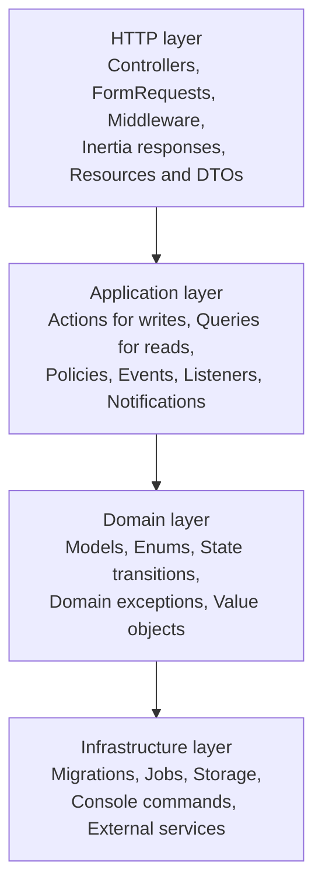

**The dependency rule** is that each layer may depend only on the layers below it. A Model never references a Controller. An Action never returns an Inertia response — it returns the model it created or changed, and the controller decides how that becomes a page. Controllers are correspondingly thin: authorise, validate through a FormRequest, call one Action or one Query, return a response. A controller method longer than about fifteen lines is a design smell and usually means logic has leaked upward out of the Application layer.

Feature-first organisation means the code is grouped by domain area rather than by technical kind. `app/Domain` contains five modules, each holding its own models, actions, queries, enums, policies, events and exceptions.

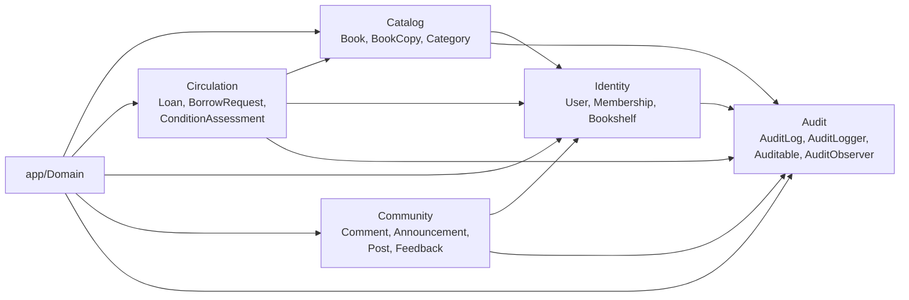

Circulation is the module that binds the others together: a loan joins a copy from Catalog to a user from Identity. Every module writes to Audit; Audit depends on none of them, reaching them only polymorphically through `auditable_type` and `auditable_id`.

Outside `app/Domain` sit `app/Http` (controllers grouped by audience — Public, Auth, Reader, Manager, Admin — plus requests, resources and middleware), `app/Support` (`TextNormalizer`, `HtmlSanitizer`, `DateHelper`), `app/Jobs`, `app/Notifications`, `app/Console/Commands` and `app/Providers`.

### Why Inertia rather than a separate SPA plus REST API

Inertia was chosen for reasons specific to this project's constraints, not as a general preference. It produces **one deployable**: a single Laravel application on cPanel, with no CORS configuration, no token storage, no separate frontend hosting and no API versioning burden. It uses **session authentication**, which is simpler and safer in a browser than tokens and needs no client-side refresh logic. Its **assets are built in CI and uploaded as static files**, which satisfies the hard requirement that no Node process runs in production. Its **server-rendered navigation** gives the public catalogue better first paint and better SEO than a client-rendered SPA would.

Nothing valuable is lost. React, TypeScript, Vite, Tailwind, shadcn/ui and React Hook Form all remain. What is dropped is React Router and TanStack Query, both of which Inertia replaces — strictly less code to maintain.

The one genuine cost is that there is no standalone REST API in v1. That cost is bounded because all business logic lives in Action classes: adding a versioned `/api/v1` later means writing thin controllers over the same Actions, with no refactor of anything that matters.

### Why Actions rather than Services

A `LoanService` reliably becomes a nine-hundred-line class with twenty loosely related methods, shared private helpers and a constructor injecting eight dependencies. Every change touches the same file and every merge conflicts.

Single-purpose Action classes — `LendBookDirectlyAction`, `ReceiveReturnAction`, `ApproveMembershipAction` — each expose one `execute()` method, have one reason to change, and inject only what they use. This is the highest-leverage decision for AI-assisted development, which is an explicit goal of this project: an agent asked to change how lending works opens exactly one file and sees the whole operation — validation, state transition, audit write, event dispatch — with no god object to hunt through and no risk of breaking an unrelated operation that happened to share a private helper.

Every Action has the same shape, which is what makes it predictable for humans and agents alike: accept a typed data object or explicit scalars and never a raw `Request`; open a transaction; re-check invariants *inside* the transaction with row locking where a race is possible; mutate models; write the audit entry through `AuditLogger`; commit; dispatch events after commit; return the created or modified model. Failure is signalled by throwing a domain exception such as `CopyNotAvailableException` or `LoanLimitReachedException`, never by returning `false` or `null`; a handler maps those exceptions to friendly Vietnamese messages.

### Why no repository pattern

Eloquent is already the data-access abstraction. A repository wrapping it adds a layer with no second implementation behind it — there is no plan to swap MySQL for anything else, and if there were, Eloquent already abstracts that. Repositories would also actively harm this codebase: they obscure eager loading, which is the main defence against N+1 queries, and they push developers toward `findAll()`-style methods that fetch far too much.

Tests run against a real MySQL database rather than mocked repositories. Complex read paths live in dedicated **Query** classes — `OverdueLoansQuery`, `RequestQueueQuery`, `ShelfStatisticsQuery`, `ManagerActivityQuery` — which deliver the readability that repositories are supposed to provide, without the indirection.

### Why no permissions package

`spatie/laravel-permission` is excellent for systems with dynamic, database-defined permissions. OLibra has three per-shelf roles and one global flag, all known at compile time. A PHP `Permission` enum mapped to roles in a single `RolePermissions` class, consulted by Laravel Policies, is clearer, faster (no queries and no cache invalidation), fully type-checked, and has zero dependencies.

Roles are hierarchical within a shelf — `admin` implies `manager` implies `reader` — and a user holds at most one membership per bookshelf. Super admin is a boolean flag on `users` that short-circuits every policy to allow. Should per-user exceptions ever be needed, the path is a nullable `permissions` JSON column on `memberships` that the policy consults as an override: additive, still no package, and no existing call site changes.

Every controller action calls `authorize()`. Every Inertia page also receives a `can` object so the interface can hide what the user may not do — but **the interface hiding an action is never the security control**; the policy is.

---

## 2. Data flow

A request travels down through the layers and returns as an Inertia page. The path is the same for every authenticated shelf-scoped request.

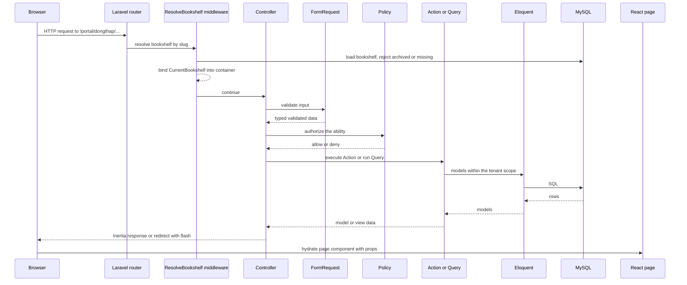

Route model binding resolves `{bookshelf:slug}` before the middleware runs, so `ResolveBookshelf` receives a real model, aborts with 404 for a missing or archived shelf, and binds a `CurrentBookshelf` singleton into the container. `ShareInertiaData` adds the shared props every page needs: the authenticated user, the current bookshelf, flash messages, the unread notification count, the pending-item badge counts and the active translations.

### The read path and the write path are different

**Reads go through Query classes.** A GET request hands off to a Query — `CatalogQuery`, `BookDetailQuery`, `OverdueLoansQuery`, `AuditTrailQuery` — which builds one well-shaped Eloquent query with explicit eager loading, applies the derived-state scopes described in §10, paginates (24 items for grids, 50 for tables) and returns data the controller shapes into Inertia props through a Resource. Queries never mutate. Filtering, sorting and search live in query strings with Vietnamese parameter names matching the UI, such as `?trang_thai=`, `?sap_xep=` and `?tim=`, and those parameters are preserved across pagination.

**Writes go through Action classes.** A POST, PUT or DELETE validates through a FormRequest, authorises through a Policy, then calls exactly one Action. The Action owns the transaction, the invariant re-checks, the mutation, the audit write and the post-commit event dispatch. Write endpoints do not return JSON; they redirect back with a flash message, and Inertia turns that into a fresh page plus a toast.

That asymmetry is deliberate. Reads need to be shaped for a screen and are allowed to be denormalised and cached; writes need to be atomic, audited and invariant-preserving, and are allowed to be slow. Keeping them in separate class families stops read convenience from eroding write correctness.

On the client there is no state library at all. Server state arrives as page props and there is nothing to invalidate, because a successful mutation triggers a partial reload and the server sends fresh data. Local UI state — dialogs, expanded rows, filter drafts — is `useState` by definition. Dashboard statistics arrive through Inertia 2 deferred props, so the manager dashboard paints immediately and fills in its charts a moment later.

---

## 3. Multi-tenancy

Tenant isolation is the highest-consequence security property in the system, and the architecture is built so that **isolation is structural rather than disciplinary**. It must not depend on any developer remembering to write `where('bookshelf_id', ...)`, because sooner or later one of them will not.

Three mechanisms combine, and each covers a different failure mode.

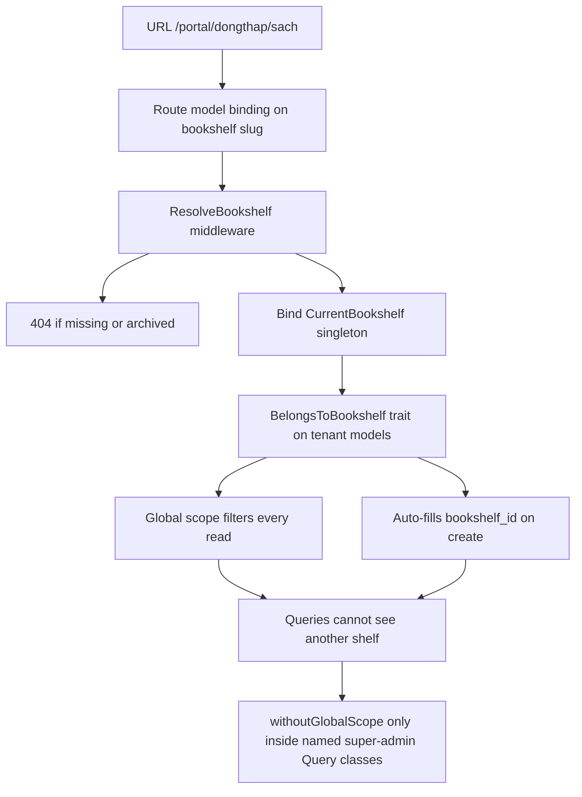

**Route model binding** on `{bookshelf:slug}` resolves the tenant from the URL, so the tenant is never taken from a request body, a session value or a header where a user could tamper with it.

**The `ResolveBookshelf` middleware** binds a `CurrentBookshelf` singleton into the container and aborts with 404 for a shelf that is missing or archived. A 404 rather than a 403 is intentional: it does not confirm that a shelf exists to someone probing slugs.

**The `BelongsToBookshelf` trait** is applied to every tenant-scoped model. It adds an Eloquent global scope filtering by the current bookshelf, *and* it auto-fills `bookshelf_id` on create. The write half matters as much as the read half — a row created without a tenant id is a row that either leaks or becomes invisible, and both are bugs.

With all three in place, a cross-tenant read requires deliberately calling `withoutGlobalScope`. Nothing else can produce one by accident. This is enforced at the schema level too: every tenant-scoped table carries `bookshelf_id` with a foreign key, and the composite indexes all lead with it. Invariant INV-10 states the rule directly — every query is scoped to a single bookshelf, except explicit super-admin cross-shelf views. Tenancy tests assert that a manager of one shelf receives 404 for another shelf's resources.

### The escape hatch

Super-admin oversight genuinely needs to read across shelves: the admin dashboard's one-row-per-bookshelf summary, cross-shelf statistics, the audit log browser and the per-manager activity view. Those calls use `withoutGlobalScope` — and that is the **single documented escape hatch**.

Its use is constrained rather than merely discouraged. It appears only inside named Query classes such as `CrossShelfStatisticsQuery` and `ManagerActivityQuery`, never in a controller, never in an Action, and never in a model method. This keeps every cross-tenant read enumerable: to audit the isolation boundary you grep for `withoutGlobalScope` and read a short, finite list of classes whose names announce that they cross shelves. Reaching one of those Query classes still requires passing an `EnsureSuperAdmin` middleware and the corresponding `statistics.view_all_shelves` or `audit.view_all_shelves` permission, so the escape hatch is protected by authorisation as well as by convention.

---

## 4. Authentication flow

Authentication is **session-based, through Inertia** — there are no tokens, no client-side refresh logic and no bearer credentials in browser storage. Sessions use the database driver, because there is no Redis on shared hosting. Login lives at `/dang-nhap`, logout at `/dang-xuat` and the forced password change at `/doi-mat-khau`.

Identity is global and membership is per shelf. A `User` row is one person, valid everywhere; a `Membership` row is that person's relationship to one bookshelf, carrying the role, the status and the parish details. Authentication answers "who is this"; the membership answers "what may they do here".

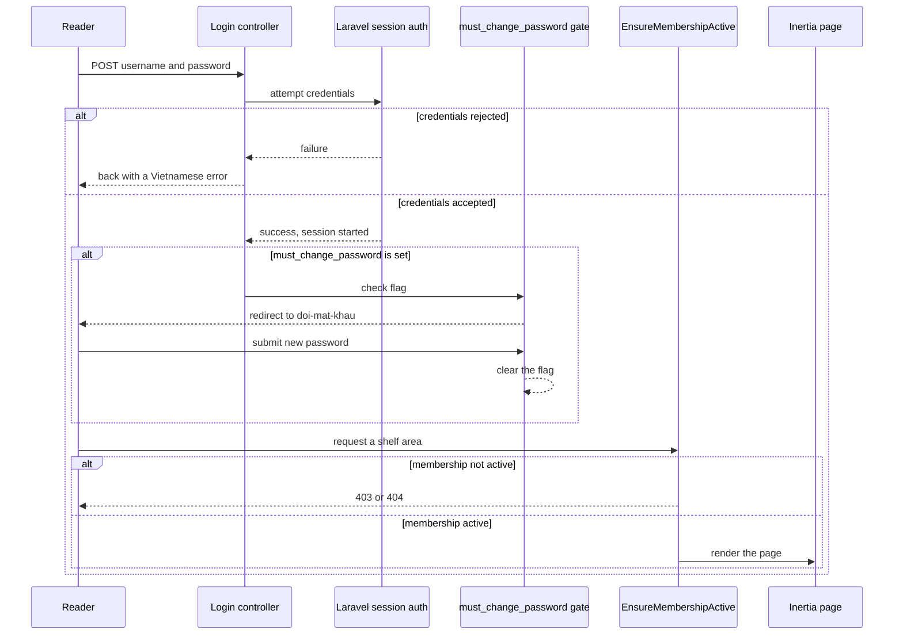

Three gates sit between a correct password and a usable session.

**The `must_change_password` gate.** A manager can issue a password reset for a reader who has forgotten theirs; `IssuePasswordResetAction` sets a new password and raises the `must_change_password` flag on the user. Until the reader changes it, every request redirects to `/doi-mat-khau`. This closes the window in which a manager knows a reader's working password.

**The membership status check.** `EnsureMembershipActive` enforces INV-4: only a member whose status is `active` may act within a shelf. A membership that is `pending` has not yet been approved; `rejected`, `suspended` and `left` are all terminal or paused states for the purpose of new activity. Crucially, this blocks *new* actions only — a reader suspended while still holding a book keeps that loan, and the loan can still be returned normally. Suspension is not confiscation.

**The permission check.** Beyond being active, the membership's role determines what the reader, manager or admin may do, through the Policy layer described in §1. `is_super_admin` on the user short-circuits to allow, regardless of membership.

### There is no email in v1

The production host may not provide SMTP, so the design assumes no outbound email at all. The consequence for authentication is direct and must not be forgotten: **manager-issued password reset is the only account recovery path.** There is no "forgot password" link, no reset email and no self-service recovery. A reader who loses their password finds a volunteer at the shelf, who verifies them in person — the same in-person trust model under which the account was approved in the first place — and issues a reset.

The schema keeps a nullable, unique `email` column on `users` and retains the `password_reset_tokens` table, so email-based reset can be switched on later without a migration.

---

## 5. Borrow workflow

There are two ways a book leaves the shelf, and their relative importance is the single most useful thing to understand about this system.

**Quick lend is the dominant real-world flow.** The characteristic interaction is a child standing at the shelf holding a book, with a volunteer holding a phone. `LendBookDirectlyAction` takes the copy straight from `available` to `on_loan` with no prior request, no hold and no queue, in three taps: find the book, pick the reader, confirm. If the quick-lend flow is slow, volunteers stop using the system and revert to paper, at which point every other feature becomes worthless. Any change that adds a step to it needs an explicit justification.

**The request-and-hold flow exists for the book that is not in your hand** — a reader browsing the catalogue at home, a guest who saw the shelf mentioned somewhere, or anyone wanting a title whose copies are all out. It is the more elaborate path, and it is the minority path.

### Copy states

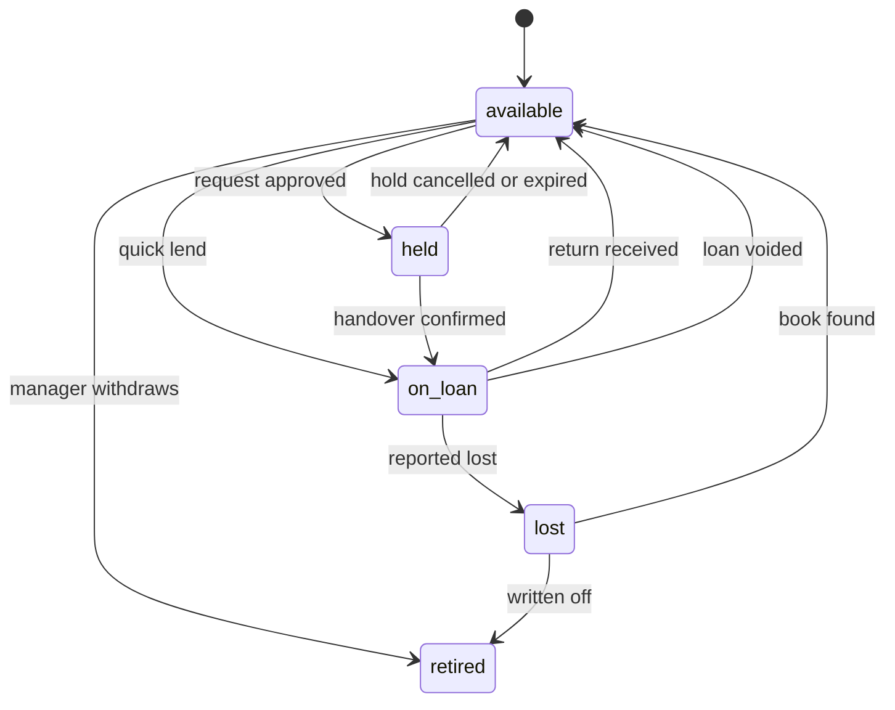

A copy that is `on_loan` cannot be retired directly; it must first be returned or reported lost. A copy in `lost` or `retired` can be neither lent nor held, per INV-7.

### Requests, holds and handover

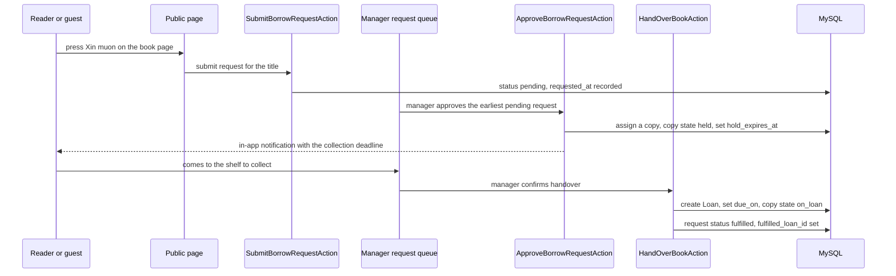

A **request is for a title, not a copy**. `book_copy_id` is null until approval, because which physical copy the reader gets is a decision the manager makes at the moment a copy is free.

**Approval creates the hold.** `ApproveBorrowRequestAction` assigns an available copy, moves it to `held`, and sets `hold_expires_at` from the shelf's `hold_days` setting. The reader is notified in-app with the collection deadline. Holding is not lending: no `Loan` row exists yet and no due date has been calculated.

**Handover creates the loan.** `HandOverBookAction` moves the copy from `held` to `on_loan`, creates the `Loan` with `due_on` computed from the shelf's `loan_days` setting, and marks the request `fulfilled` with `fulfilled_loan_id` pointing at it. `due_on` is a **date, not a timestamp**: a book is due at the end of a day, not at 14:23 on that day.

### The queue

There is no reservation entity. **The queue is simply the set of `pending` requests for a book, ordered by `requested_at`** — which is why `INDEX(book_id, status, requested_at)` exists. When every copy of a title is out, an incoming request stays `pending` and the reader is shown an honest label on the book page: not "Xin mượn" but "Đăng ký chờ mượn". A manager approves the earliest pending request when a copy frees up.

A queued request has one further effect: INV-6 blocks renewal of a loan for a title with a non-empty queue. Someone is waiting, so the current borrower does not get to keep the book longer.

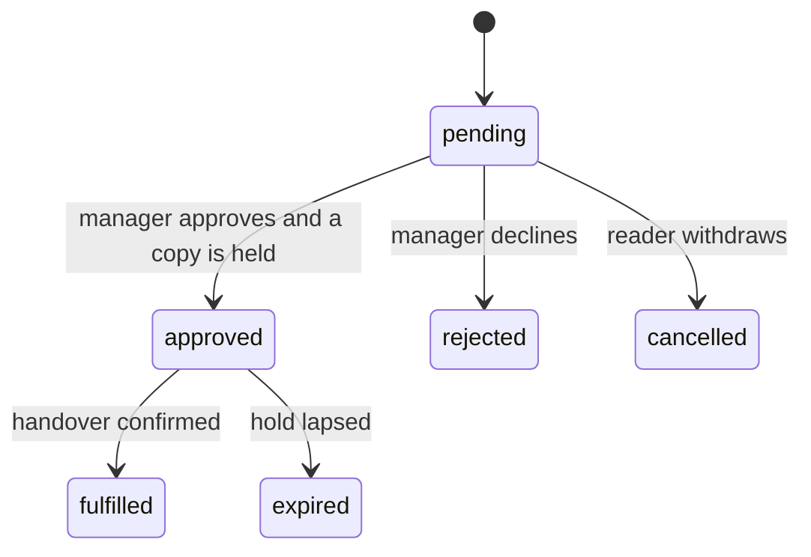

**Hold expiry** happens when the reader never comes to collect. A hold is expired when `status = 'approved' AND hold_expires_at < now()`, and — as §10 explains — that is evaluated at query time, so the moment the deadline passes the hold is treated as expired everywhere in the application, whether or not any job has run. `ExpireHoldAction` and the hourly `olibra:expire-holds` command exist to tidy the data and return the copy to `available`, not to make the system correct.

**Skipping to the next in queue** is the manual counterpart. A reader is approved, does not turn up, and three others are waiting. `SkipQueueEntryAction` releases that request, returns the copy to `available` and lets the manager approve the next `pending` request in `requested_at` order. This is a domain event with an actor and an explicit audit entry, not a silent expiry, because a volunteer chose to move on.

### Concurrency

Two managers can lend the same copy within the same second, at the same shelf, from two phones. Application-level checking cannot prevent that, so INV-1 is enforced **physically** by a generated stored column on `loans`:

`active_copy_key` is `book_copy_id` when the loan is `active` and `NULL` otherwise, with a unique index over it. MySQL treats `NULL` as distinct in unique indexes, so any number of returned loans on one copy coexist happily, while two simultaneous active loans on one copy are impossible. `LendBookDirectlyAction` catches the resulting constraint violation and rethrows it as `CopyNotAvailableException`, so the database race and the ordinary application check produce the same friendly Vietnamese message — "sách này vừa được cho mượn rồi" — rather than a stack trace or, far worse, a silently corrupted record.

### Guests

Guest requests carry `guest_name`, `guest_phone` and a hashed IP for rate limiting, with `user_id` null; a check constraint requires one or the other. **A guest request creates a lead, not an account.** A manager reviews it and converts a legitimate one into a real reader through `CreateReaderByManagerAction`. Because an anonymous form on the public internet is a spam vector, guest requests are rate limited and carry a honeypot field, and the whole facility can be switched off per shelf via the `allow_guest_requests` setting.

---

## 6. Return workflow

Returns get the same treatment as quick lend, for the same reason. The condition selector defaults to *Nguyên vẹn*, so the overwhelmingly common case — an undamaged book coming back — is two taps: find the loan, confirm.

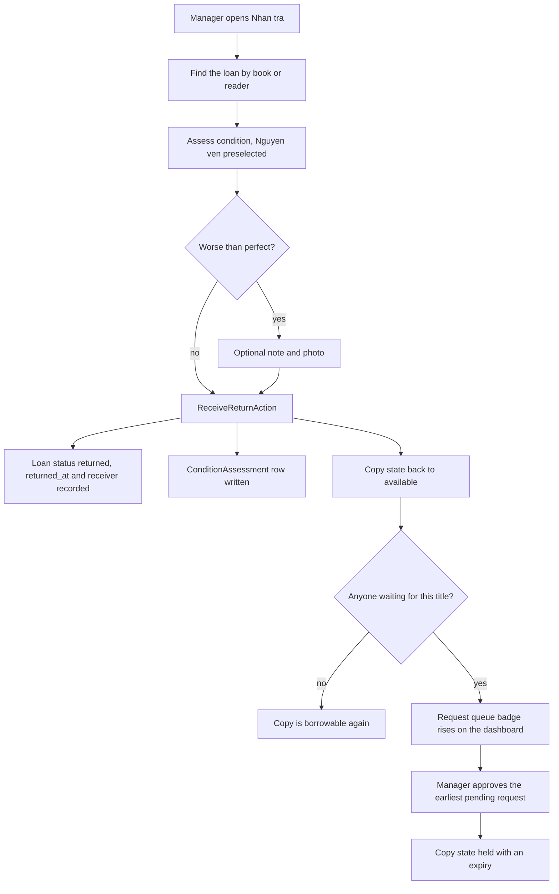

`ReceiveReturnAction` does four things in one transaction: it sets the loan to `returned` with `returned_at`, `received_by_user_id` and the return condition; it writes a `ConditionAssessment` row linked to both the copy and the loan; it moves the copy back to `available`; and it writes the audit entry. The copy's own `condition` column reflects the latest assessment, while the assessment rows preserve the history — which is how you can tell that a book came back worse than it went out, and who was holding it when that happened.

Condition is a single choice from a flat list — `perfect`, `slightly_worn`, `worn`, `torn`, `missing_pages`, `written_on` — plus an optional note and photograph. Reality is often "torn *and* written on", and the rigorous model would be a grade plus multi-select damage flags. That was considered and rejected for v1: a single row of large buttons is dramatically easier for a child to use, and the photograph captures whatever the enum cannot. Moving to grade-plus-flags later is an additive migration.

**When someone is waiting**, the returned copy becomes `available` as normal and the manager's dashboard request-queue badge reflects the pending request. Nothing auto-assigns: a manager approves the earliest `pending` request for that title, which moves the copy to `held` with a fresh expiry, and the borrow workflow resumes from there. Assignment stays manual because the physical book is in a volunteer's hands and only they know whether the next reader is standing right there.

### Lost and found

`lost` is a copy *state*, not a condition grade, because losing a book removes it from circulation whereas a torn book keeps circulating.

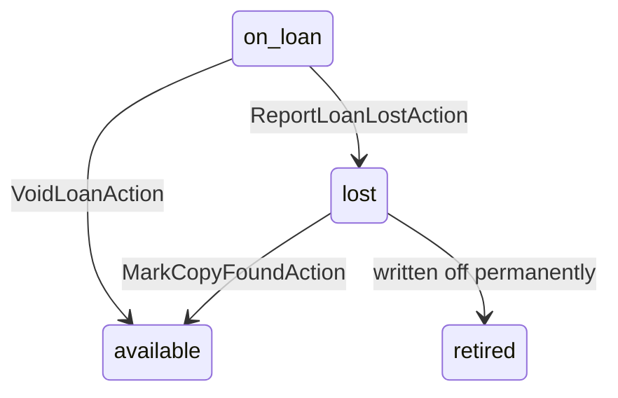

`ReportLoanLostAction` sets the loan to `lost` with `lost_reported_at` and the reporting manager, and moves the copy to `lost` with `lost_at`. `MarkCopyFoundAction` handles the book that turns up months later, returning the copy to `available` — this path exists precisely because that happens. A copy that is never going to reappear is written off from `lost` to `retired`.

Two distinctions matter here and are easy to conflate. **Retirement is not deletion**: retiring records that a book was destroyed, given away or withdrawn, which is a real-world event, while soft deletion exists to undo a fat-fingered mistake. Conflating them corrupts historical statistics. And **a loan is never deleted**: a loan recorded in error becomes `voided` with a reason, an actor and a timestamp through `VoidLoanAction`, which also returns the copy to `available`. That is INV-11, and it is why `loans` is one of the few tables with no soft deletes at all.

---

## 7. Approval workflow

Two things in OLibra require a human decision before they take effect: a person joining a bookshelf, and a comment appearing in public.

### Registration approval

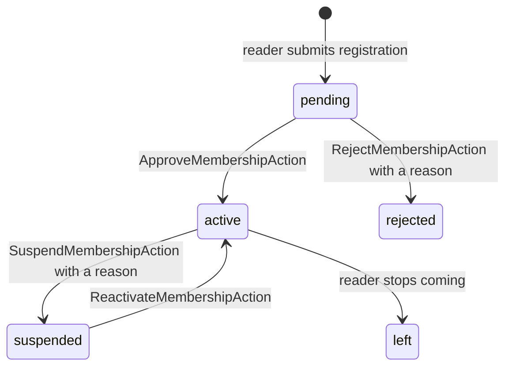

Registration and role assignment are the same record. A `Membership` row holds the parish details captured at registration — tổ and giáo họ — alongside the role, the status and the approval decision, while the person's identity facts live on `User` and are reused if the family later registers at a different shelf.

A registration arrives as `pending`. It appears on the manager dashboard as a badge count and in the pending-registrations list as a review card laying out exactly the fields the manager must verify in person, with a similar-name warning when an existing member closely matches — children register twice more often than you would expect. Approval records `approved_by_user_id` and `approved_at`; rejection requires a reason, and a rejected record is retained for audit purposes so the person may re-apply without erasing the history of the earlier decision.

**A manager approving a registration is the consent needed to hold a minor's data.** The manager personally knows the family; that is the trust model the product is built on, and it is also why in-person password reset is acceptable as the sole recovery path.

`suspended` and `left` handle the rest of the lifecycle — children move away, grow up or simply stop coming. Suspension blocks new loans and nothing else. A reader who has ever borrowed a book is never hard-deleted, because that would destroy the audit history.

### Comment moderation

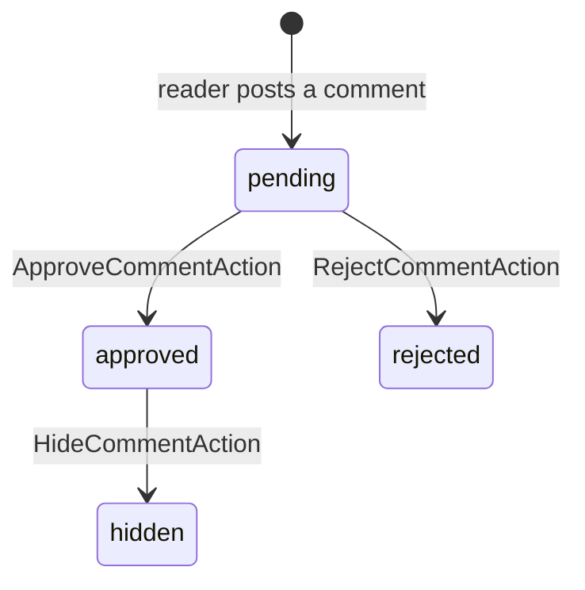

Comments come from logged-in readers only — there are no guest comments — and are stored as plain text rather than HTML, rendered escaped. That removes the entire XSS surface from user-generated content rather than trying to sanitise it.

INV-9 states that a comment is publicly visible only when its status is `approved`. Pending comments raise a dashboard badge and appear in the moderation list with the book, the reader and the text. `hidden` exists for the comment that was fine when approved and stopped being fine later; it is reachable from `approved` without pretending the original approval never happened. Whether comments require approval at all is a per-shelf setting, `comments_require_approval`, as is whether comments are enabled.

---

## 8. Audit workflow

Every state change in OLibra is recorded. The super admin's ability to see what each manager has done is a headline requirement, not a nice-to-have, and the audit design follows from taking that literally.

Two complementary mechanisms write to `audit_logs`, and the split between them is the important part.

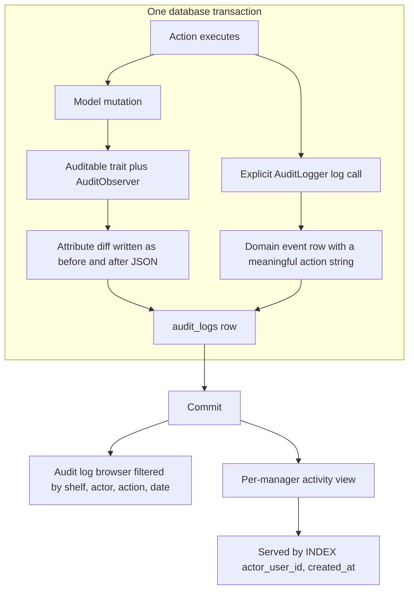

**The `Auditable` trait plus `AuditObserver`** captures attribute-level changes on create, update and delete for every tracked model, producing the "previous value / new value" record the product requires, automatically and without anyone having to remember. Sensitive attributes such as `password` and `remember_token` are excluded by an allowlist.

**Explicit `AuditLogger::log()` calls inside Actions** record domain events that are not simple attribute diffs. "A manager approved this registration" and "a manager skipped this reader in the queue" are meaningful facts that no column diff expresses well. These carry a deliberate `action` string — `loan.returned`, `membership.approved` — that the audit browser can filter on and render as a readable Vietnamese sentence.

You need both. The observer gives completeness; the explicit calls give meaning. A log that only diffed columns would be unreadable, and a log that only recorded hand-written events would have holes wherever someone forgot.

### Why synchronous and inside the transaction

Auditing runs synchronously, in the same database transaction as the change it describes. It is deliberately **not** event-driven and **not** queued.

The reason is that on this host the queue may not drain for thirty minutes, and a job can fail outright. An audit trail that can be lost to a failed queue job is not an audit trail — it is a best-effort log, and best-effort is not what oversight of volunteers handling other people's donated books requires. Writing inside the transaction means the audit row and its subject commit together or not at all: they can never diverge, and there is no window in which a change exists without its record.

Events *are* used, for genuinely cross-cutting reactions — `BookLent`, `BookReturned`, `MembershipApproved`, `BorrowRequestApproved`, `CommentPosted` — dispatched after commit, with listeners sending in-app notifications and invalidating statistics caches. Those are things it is acceptable to lose. Audit rows are not.

### Append-only

INV-12 states that audit rows are never updated or deleted. The `audit_logs` table has no `updated_at`, no soft delete and no model events that could rewrite it. Nothing in the application exposes an edit or delete path for an audit row. `bookshelf_id` is nullable for global actions and `actor_user_id` is nullable for system-originated ones, so there is never a reason to go back and patch a row. This is also why foreign keys restrict deleting a user who has any audit trail: revoking a manager changes a role, it never removes the person, because their trail must survive them.

### Serving the per-manager view

The per-manager activity screen — everything one manager has done, grouped by books added, loans made, returns received, conditions assessed and registrations approved — is served by `ManagerActivityQuery`, one of the named cross-shelf Query classes from §3.

It is made fast by **`INDEX(actor_user_id, created_at)`** on `audit_logs`. That index is not optional: without it, the screen degenerates into a full scan of the largest and fastest-growing table in the database. Three sibling indexes serve the audit browser's other filters — `(bookshelf_id, created_at)` for per-shelf browsing, `(auditable_type, auditable_id)` for the trail of one record, and `(action, created_at)` for filtering by event type.

The browser renders each entry as a readable Vietnamese sentence by default, with the raw before/after JSON available on expansion. Readable-by-default is the requirement; the JSON is for when something is genuinely being investigated.

---

## 9. Notification flow

Notifications are **in-app only**, via Laravel's `database` channel, surfaced as a bell icon with an unread count carried in the Inertia shared props. **There is no mail channel configured in v1**, consistent with the assumption that the host may not provide SMTP.

**Readers receive notifications** for things that happened to them and that they would otherwise have no way to learn: `RegistrationApproved`, `RegistrationRejected`, `BorrowRequestApproved` — carrying the collection deadline, which is the notification that matters most — `BorrowRequestRejected`, `BookReadyForCollection`, `LoanDueSoon`, `LoanOverdue` and `CommentApproved`. A reader is not at the shelf and cannot see the dashboard, so a pushed signal is the only channel available.

**Managers receive no pushed notifications at all.** They work from dashboard badge counts: *Quá hạn*, *Chờ duyệt tài khoản*, *Yêu cầu mượn* and *Bình luận chờ duyệt*, each a large tappable card that navigates to its filtered list.

This is a deliberate product decision with two justifications. It avoids notification fatigue for volunteers — a teenager who opens the app twice a week does not want forty unread items — and it removes any dependency on timely cron. A badge count is computed when the dashboard loads, so it is correct at the instant the manager looks at it, whereas a pushed notification queued behind a cron that runs every half hour would arrive late and be trusted less each time.

Notifications are dispatched by listeners on the domain events described in §8, after the Action's transaction commits. Old notification rows are pruned by the daily `model:prune` command.

---

## 10. Derived state

**Overdue status, hold expiry and book availability are computed at query time from stored data and the current clock. They are never written by a scheduled job.** This is a load-bearing decision and the reason for it is entirely about the deployment target.

The production host may only run cron every ten to thirty minutes. Any status that a job has to *write* would therefore be stale, and stale here means wrong in ways users see immediately. A reader would find a book listed as available that was lent twenty minutes ago and walk to the shelf for nothing. A manager's overdue list would omit every book that became overdue at midnight until the job caught up. A hold would appear live for half an hour after it lapsed, and the next reader in the queue would be blocked by it.

Computing these at query time makes the system correct even if cron is broken entirely — which, on shared hosting, is a scenario to design for rather than an unlikely accident.

Concretely, three derivations:

- A loan is **overdue** when `status = 'active'` and `due_on` is before today in the application timezone.
- A hold is **expired** when `status = 'approved'` and `hold_expires_at` is in the past.
- A copy is **borrowable** when `state = 'available'` and no unexpired hold references it.

All three depend on "now", and "now" is always `Asia/Ho_Chi_Minh` regardless of how the server is configured. `due_on` is a date rather than a timestamp precisely so that "overdue" flips at a day boundary and not mid-afternoon — a shelf that is only accessible after Sunday mass cannot meaningfully have a book fall due at 14:23.

**Query scopes encapsulate each derivation so the logic exists in exactly one place.** A scope for overdue loans, one for unexpired holds, one for borrowable copies; the Query classes compose them, and no controller or React component ever re-implements the comparison. If the definition of overdue ever changes — a grace period, say — it changes in one scope and every screen follows. Supporting indexes such as `INDEX(bookshelf_id, status, due_on)` on `loans` keep these predicates cheap at query time.

Scheduled work is left with only genuinely deferrable jobs: draining the queue, resizing cover images, warming statistics caches, generating CSV exports, backing up the database, pruning old records, and cleaning up expired holds. Every one of them is written to be correct when run at irregular intervals and harmless when skipped entirely. The hourly `olibra:expire-holds` command is the clearest illustration: it exists as a tidiness measure so the stored data eventually matches what queries already report, not as a correctness measure. Nothing a user waits on ever goes through the queue.

---

## 11. Deployment

Production is cPanel shared hosting. The whole pipeline is arranged around one constraint: **no Node runtime exists on the server**, so nothing may need building there.

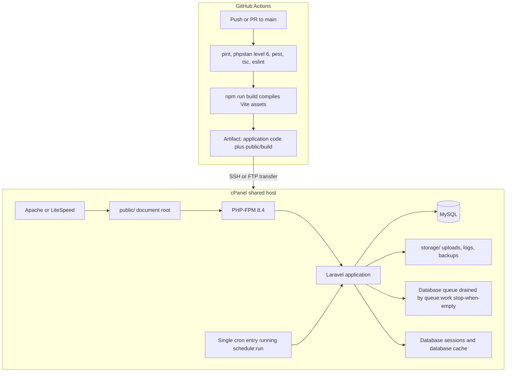

**CI builds, the server deploys.** GitHub Actions runs on every push and pull request: PHP 8.4 setup and `composer install`, `pint --test` for style, `phpstan analyse` at Larastan level 6, `pest --coverage` with a minimum of 80% on `app/Domain`, then `npm ci`, `tsc --noEmit`, `eslint` and finally `npm run build`. The build must succeed because production ships compiled assets. Tests run against MySQL rather than SQLite, because the design depends on MySQL-specific behaviour — the generated column and NULL handling in unique indexes.

The resulting artifact contains the application plus `public/build`, and is transferred over SSH or FTP. On the server the sequence is `artisan down`, `composer install --no-dev --optimize-autoloader`, `artisan migrate --force`, the config, route and view caches, `artisan storage:link`, then `artisan up`.

**The host topology.** The domain's document root points at `/home/{user}/olibra/public`, keeping application code outside `public_html` — everything above `public/` is unreachable over HTTP. Apache or LiteSpeed serves the compiled assets directly and hands PHP requests to PHP-FPM 8.4, which runs Laravel. Laravel talks to MySQL for data, sessions, cache and the queue, since there is no Redis on shared hosting. `storage/` holds uploaded covers and condition photos, logs and database backups. PHP 8.4 with GD or Imagick is required for cover image processing.

**One cron entry** runs `artisan schedule:run`. The schedule drains the database queue with `queue:work --stop-when-empty --max-time=280`, tidies expired holds hourly, warms statistics hourly, backs up the database daily via mysqldump with a seven-day retention, prunes old notifications and soft-deleted records daily, and clears stale reset tokens daily. Because of §10, none of these carry correctness responsibility.

### Why no Node in production

Running Node on cPanel shared hosting is at best awkward and at worst unavailable: there is no process supervisor a developer can rely on, memory limits are tight, and a long-running Node process is exactly the sort of thing a shared host kills. Building assets on the server would also mean shipping `node_modules` and the entire toolchain to production, lengthening deploys and adding a failure mode that only appears after the site is already in maintenance mode.

Compiling in CI removes all of it. Production receives static, fingerprinted files in `public/build` that the web server sends without PHP touching them. This is a direct consequence of choosing Inertia: because React is compiled into the Laravel application rather than hosted as a separate frontend, a static asset bundle is all the server ever needs. It is also why the repository is a single Laravel project rather than the `/apps/backend` plus `/apps/frontend` monorepo originally proposed — splitting them would mean two package managers, two dependency trees and a build seam between them, all to produce one deployable artifact.

---

## Invariants to keep in mind

The twelve invariants in §2.4 of the specification are the definition of correctness, each covered by a named test in `tests/Feature/Invariants/`. Four properties in particular are architectural rather than incidental, and changing any of them is a design change rather than an implementation detail:

- **Tenant scoping stays structural**, not a matter of developer discipline.
- **Derived state stays derived**, never written by cron.
- **Business logic stays in Actions**, so an API can be added later without duplication.
- **The audit log stays append-only and synchronous**, so no state change can outlive its record.
