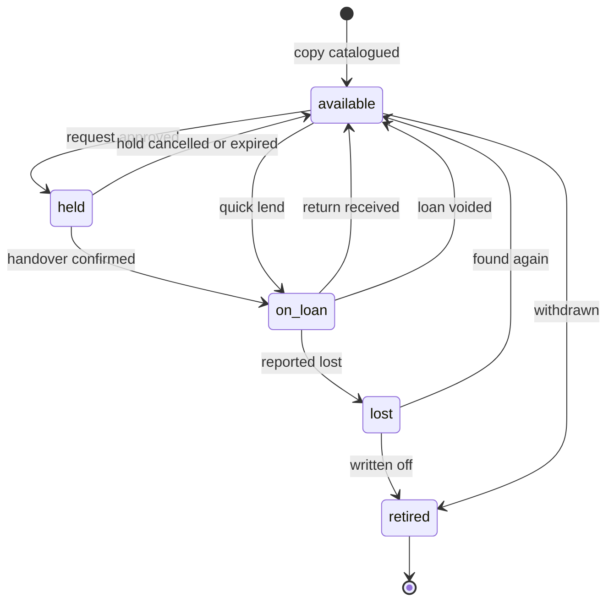

# OLibra — Business Requirements

**Status:** Approved. Implementation-independent.
**Date:** 2026-08-06
**Scope:** *What* the system must do and *why*. Nothing about how it is built.

This document is the single authority on the product. It names no framework, no database engine, no library, and no hosting arrangement. Those decisions live in the technical design and may change without touching a line here — as they did when the project moved off its first stack.

---

## 1. What OLibra Is

OLibra is a management system for small community bookshelves — the kind kept in a church hall, run by a few volunteers, often children, holding on the order of one hundred to a few hundred books.

**It is explicitly not a public library system.** That distinction drives nearly every decision below. A library system optimises for catalogue scale, patron self-service, fines, and interoperability with other libraries. OLibra optimises for a volunteer standing next to a physical shelf with a phone in one hand and a book in the other. Where the two goals conflict, the volunteer wins.

### 1.1 Audiences

| Audience | What they need |
|---|---|
| **Readers** (mostly children) | What is on the shelf, and what they can take home today |
| **Managers** (volunteers, often teenagers) | Record lending and returning, approve new readers, keep the shelf honest |
| **Super administrator** | Oversee several bookshelves, delegate them to local managers, review everything each manager has done |

### 1.2 Surfaces

One product, four distinct surfaces:

| Surface | Purpose |
|---|---|
| Front door | Landing page and contact. What OLibra is, and a way in. Public. |
| Portal | Searchable directory of bookshelves — name and address only. Public, because someone who has no account yet must be able to find their parish's shelf in order to register for it. |
| A bookshelf | Everything functional: catalogue, borrowing, announcements, management. **Requires a signed-in membership of that shelf.** |
| Administration | Super-admin oversight across all bookshelves. |

**Only the first two surfaces are public**, and the portal is public for exactly
one reason: to let a stranger find the shelf they want to join. Everything about
a shelf's books, readers and announcements sits behind a membership of that
shelf.

The example deployment carries shelves such as `dongthap` and `cantho`. The production domain is not yet decided and nothing here depends on it.

### 1.3 The insight that drives the interface

The dominant real-world interaction is a child standing at the shelf holding a book, with a volunteer holding a phone. Requests, queues, and statistics are all secondary to that moment.

Therefore the manager's primary screen is a **quick-lend flow that takes three taps**: find the book, pick the reader, confirm. Returns get the same treatment, with the condition selector defaulting to *Nguyên vẹn* so the overwhelmingly common case is a single tap.

If that flow is slow, volunteers stop using the system and revert to paper, and every other requirement in this document becomes worthless. **Any change that adds a step to quick-lend or quick-return needs an explicit justification.**

**A reader never has to sign in to borrow or return a book.** The manager does all of it: finds the book, picks the reader from a list, confirms. The child touches nothing. Signing in exists for one purpose only — a reader who wants to check from home what they are holding, when it is due, or what is on the shelf. Treat every requirement about accounts and sessions as serving that secondary case, never the moment at the shelf.

### 1.4 Delivery phases

Multi-tenancy is present from the first day of data, so later phases add features rather than rewriting foundations.

**Phase 1 — the core loop.** Books and copies, readers and registration approval, lending and returning with condition assessment, the audit log, the manager dashboard, the public catalogue and search, plus two refinements that complete circulation rather than extend it: reporting a book lost as a second entry point out of receiving a return, and the lost-copies view that gives `lost → available` (§7.1) a screen to actually happen on. A single bookshelf, but stored as one tenant among many. Donor provenance on a copy — the member link alongside the existing free-text name (§5.4) — lands in this phase too, even though the reader-facing screen for offering a donation does not: the schema is written once, so provenance is recorded from the first row of data rather than reconstructed afterwards.

**Phase 2 — community.** Borrow requests, holds, the waiting queue, comments and moderation, announcements, feedback, statistics, and the reader-facing **Tặng sách** screen with its manager-side donation queue (§7.7 BookDonation).

**Phase 3 — the network.** The portal directory, multiple bookshelves, super-admin tooling, cross-shelf statistics, per-manager audit views.

Phase 1 is a genuinely useful product on its own. If the project stalls after Phase 1, the volunteers still have something better than paper.

---

## 2. Requirements the Original Brief Did Not State

These were identified during design and are all in scope.

**Retirement is distinct from deletion.** Books get too damaged to circulate, get given away, or are removed when the shelf shrinks. That is a real-world event and deserves a *retired* state. Soft deletion, by contrast, exists to undo *mistakes*. Conflating the two produces a system where you cannot tell "this book was destroyed" from "someone fat-fingered the delete button", and it corrupts historical statistics.

**Lost is a state, not a condition grade.** Losing a book removes it from circulation, whereas a torn book keeps circulating. Loss belongs on the availability axis, and needs a path back for when a book turns up again.

**An account does not have to be able to sign in.** Most readers are children who will never use the site themselves; a manager registers them, lends to them and receives their returns. Forcing a username and password for every one of them would mean a volunteer inventing credentials at the shelf that nobody will ever type — work that serves the database and not the parish. So credentials are optional: a person may exist purely as a record, and a username and password are set only if and when someone actually wants to sign in. Either both are present or neither is.

**A manager sets and changes those credentials.** There is no email, so there is no self-service reset (§4); a child who forgets their password asks the volunteer, who sets a new one. The same action creates credentials for an account that had none.

This hands a manager real power — whoever can set a password can sign in as that reader. That is inherent in the trust model, which already assumes the manager personally knows the family (§4). The mitigation is not to restrict the power but to make every use of it **visible**: setting or changing someone's credentials writes an audit record naming the manager, the reader and the time, and the super administrator can see every one of them across every bookshelf (§13.2, §14). A power that is always watched is different from a power that is quiet.

**The audit records the act, never the secret.** No password, no hash, and no session token is ever written to the audit log — only that a named manager set credentials for a named reader at a given time. §14 states this as a rule for automatic change capture; it applies with equal force here, where the temptation to log "what it was changed to" is strongest.

**Changing your own details is a request, not an edit.** A reader may propose a change to their profile; it takes effect only when a manager approves it. Until then the existing values stand — including the phone number, so a manager never loses the means of contacting a family mid-change. This exists because the manager personally knows each family and their approval is what makes the record trustworthy; letting a child silently rewrite their own name or date of birth would undo that.

**A manager corrects a reader's details directly.** Most readers are children who never sign in (§2, above), so a proposal a reader cannot make is not a route to a corrected phone number — and the phone number is how books come back (§16.3). A manager edits the record, and the edit writes an audit entry naming the manager, the reader, the time and the values before and after. This is the same trade the previous two paragraphs make about credentials: the mitigation for a power a manager needs is visibility, not withholding.

**Added 2026-08-12** (`docs/superpowers/specs/2026-08-12-po-feedback-design.md`, §8, §9). **Saint name is mandatory** — a parish register with no saint name is not a parish register — required in the form and `not null` in the column, on every write path: self-registration, a manager registering or editing a reader, and a reader's own proposal. **A phone is required by the interface, not by the column**: some readers are children with no phone of their own, so `users.phone` stays nullable and a genuinely absent phone instead requires a typed reason, recorded and cleared automatically once a phone is supplied (§16.1 spells out the confirmation this triggers). **Who decides a proposed change is derived from whose change it is, not from who happens to be looking at the queue:** a reader's proposal is decided by a manager or shelf admin of that reader's own shelf, as it always has been; a manager's or shelf admin's proposal is decided by a super administrator only, at a new cross-shelf queue — a colleague of equal rank deciding it would be the same person signing both halves in a parish with two volunteers, which is most of them. At every rank, **nobody decides their own proposal** — a super administrator proposing a change to their own record is refused the same way anyone else would be. Both rules are evaluated from the subject's membership role at the moment of decision; neither needed a schema change.

**Readers have a lifecycle.** Children move away, grow up, or simply stop coming. Membership needs *suspended* and *left* states. A reader who has ever borrowed a book must never be erased, because that would destroy the audit history the brief explicitly requires.

**Managers can be offboarded.** Revocation changes a role; it never deletes a person, because their audit trail must survive them.

**Guest borrow requests were removed.** An earlier draft let anyone ask to borrow from a public form, which needed rate limiting, a honeypot and a manager action to convert a lead into an account. Since a shelf is now visible only to its members, there is no anonymous caller to serve and none of that machinery is needed. Someone who wants to borrow registers first.

**Rejected registrations need a resolution.** They are retained with a reason for audit purposes, and the person may re-apply.

**Concurrency is a real risk.** Two managers can lend the same copy within the same second, at the same physical shelf, from two phones. One of them must fail cleanly and see a plain message, never a silently corrupted record.

**The shelf itself has properties.** Where it physically is, when it is accessible, and who holds the key — with a tappable contact phone number.

**Data export is insurance.** Volunteers plus modest infrastructure is a meaningful data-loss risk. CSV export of books, readers, and loans ships in Phase 1.

---

## 3. Edge Cases the System Must Handle

- A hold expires because the reader never came to collect the book.
- Three readers are queued for one book and the first does not show up; the manager skips to the next.
- A renewal is requested while somebody is waiting in the queue. This is blocked.
- The same child registers twice. The manager sees a similar-name warning.
- A reader is suspended while still holding a book. The loan survives; the suspension only blocks *new* loans.
- A book is returned in worse condition than it left in.
- A book reported lost is found months later.
- A manager records a loan by mistake and needs to undo it.
- A copy is retired while other copies of the same title remain in circulation.
- Background maintenance does not run for several hours. Nothing a user can observe may become wrong as a result.

---

## 4. Assumptions

These were ambiguous in the brief and are resolved as follows. Changing any of them is a change to the product, not an implementation detail.

1. **Timezone is `Asia/Ho_Chi_Minh`** everywhere. Dates are interpreted in that zone regardless of where the system runs.
2. **There is no outbound email in v1.** Manager-issued password reset is the only account recovery path. An email address is collected but optional, so email-based reset can be switched on later without disturbing existing accounts.
3. **A manager approving a registration constitutes the consent needed to hold a minor's data.** The manager personally knows the family; that is the trust model the brief describes.
4. **"Most borrowed" counts completed handovers at the title level**, not requests and not copies. A title with three copies is not thereby three times more popular.
5. **Pages within a shelf display readers' full names**, as the product owner decided. Date of birth, parents' names, phone number, and parish-unit placement (§5.6) remain visible only to managers and administrators. Name display is governed by a per-bookshelf setting so it can be tightened later without a code change.
6. **Vietnamese is the only shipped locale.** No user-facing string is ever hard-coded; adding a locale is a translation task, not a rewrite.
7. **A person has at most one role per bookshelf.** Roles are hierarchical: admin implies manager implies reader.

---

## 5. Domain Model

### 5.1 Entities

| Entity | Description |
|---|---|
| **Bookshelf** | The tenant. Owns everything below it except User and Post. |
| **BookshelfContact** | *Added 2026-08-12 (`docs/superpowers/specs/2026-08-12-po-feedback-design.md`, §1).* Up to three people to contact about a shelf — one mandatory, two optional — replacing the single `keeper_name`/`keeper_phone` pair a shelf used to carry directly. |
| **User** | A global identity. One account works across every bookshelf. |
| **Membership** | A user's relationship to one bookshelf: role, status, parish details. **This is also the registration record.** |
| **Book** | Title-level information: title, author, description, cover, page count. |
| **BookCopy** | A physical object on a shelf. This is what gets lent. |
| **BorrowRequest** | A member's expression of intent to borrow, and its lifecycle through hold to handover. |
| **Loan** | A copy in someone's hands, with a due date. |
| **ConditionAssessment** | A manager's judgement of a copy's physical state at a point in time. |
| **ProfileChangeRequest** | A reader's proposed change to their own details, and its approval. |
| **Comment** | A reader's comment on a book, subject to moderation. |
| **Announcement** | Shelf-scoped news, written by managers. |
| **Feedback** | A message to the administrator, from anyone. |
| **BookDonation** | A reader's offer to give books to the shelf, and the manager's decision on it. |
| **AuditLog** | An append-only record of every state change. |

### 5.2 Ownership

- **Book** owns its copies. A copy has no meaning without its title.
- **Loan** owns the condition assessments taken during it.
- **Membership** owns the registration data and its approval decision.
- **BorrowRequest** owns its own lifecycle, including the hold.
- **Bookshelf** owns its contacts, up to three (§16.1; added 2026-08-12).
- **Bookshelf** scopes all of the above.

### 5.3 Where personal information lives

This distinction matters and is easy to get wrong.

**On the person** — facts true everywhere: **username and password (both optional, and either both set or neither)**, saint name (tên thánh), full name, date of birth, **father's name and mother's name (both required)**, phone, optional email, display name, locale, avatar.

Parents' names are required rather than optional because they are how a manager tells apart two children with the same name, which §3 lists as a real edge case. A photograph is collected at registration for the same reason — a volunteer who meets forty children on a Sunday recognises a face faster than a name.

**On the membership** — facts about that person's relationship to *that specific parish*: up to two levels of parish-unit reference (§5.6), role, status, who approved them and when, rejection or suspension reason, manager's private notes.

**Changed 2026-08-12** (`docs/superpowers/specs/2026-08-12-po-feedback-design.md`, §13): this list carried a trailing "leaderboard visibility" fact. The column is dropped and appears nowhere in `src/` — see §5.4 and §16.2 for what that reverses and why.

**The parish-unit fields are references to units the shelf itself defines, not free text typed at registration.** An earlier draft stored them as two plain text columns, and free text fails in three ways that matter here. It cannot be grouped: one volunteer writes "Tổ 1", the next "tổ 1", a third "T1", and the reader list's unit filter (§16.3) can never make sense of three spellings of the same group — a filter is the whole reason to record the value at all. Renaming is expensive: a parish reorganising *Giáo họ Mân Côi* into *Giáo họ Đức Mẹ* would mean editing every membership row by hand rather than one row. And a fixed two-level shape, always called tổ and giáo họ, was never something this document actually specified — it was assumed from how one parish happens to be organised, and real parishes vary in how many levels they use, what they call them, and whether the smaller nests inside the bigger (§5.6).

If a family moves and registers at a different bookshelf, their identity is reused and only the parish details are re-entered.

### 5.4 What is recorded about each thing

Field lists, not storage layouts. Every record carries when it was created and last changed.

**Bookshelf** — slug (URL segment, fixed after creation), name, description, physical location, address, cover image, timezone, locale, status (active or archived), settings (§5.5), establishment date, who created it.

**Changed 2026-08-12** (`docs/superpowers/specs/2026-08-12-po-feedback-design.md`, §1 and §3): this list used to carry `keeper_name`, `keeper_phone` (both shown publicly) and `opening_hours` as free text directly on the shelf. All three are gone. Contact information moved to **BookshelfContact** (below) so a shelf can name up to three people instead of one; opening hours were removed outright, not moved, because a single free-text field written once could not honestly describe a shelf whose hours vary, and nothing replaced it (§3 of the design). This also updates BR:179, which listed `opening_hours` as a shelf field.

**BookshelfContact** — bookshelf, position (1, 2 or 3, unique per shelf), name, role label (free text, e.g. *Người giữ chìa khoá*, *Quản lý tủ sách* — a parish names its own volunteers' jobs), phone (optional). Position 1 is the mandatory contact, but that mandatoriness is enforced in the domain, not by a database constraint: a shelf onboarded before this table existed may have no contacts at all, and is flagged incomplete on `/quan-tri/tu-sach` rather than assigned an invented volunteer. **No caller without a membership on the shelf may read this table** — it carries no grant to the public-read role, which is the same disclosure boundary §16.1 already draws for a keeper's contact details, now enforced as a privilege rather than only by a query's own care.

**Membership** — bookshelf, person, role, status, a reference to that shelf's level-1 parish unit and a reference to its level-2 unit (§5.6) — both nullable, permanently, per §16.1's registration change, not merely until someone gets around to filling them in — who approved the membership and when, rejection reason, suspension reason, manager's private notes.

**Changed 2026-08-12** (`docs/superpowers/specs/2026-08-12-po-feedback-design.md`, §13): this list carried a `leaderboard opt-in` field. The column and the toggle behind it are gone — see §16.2, below, for what that reverses and why.

**Book** — bookshelf, category, title, slug, author, publisher, published year, ISBN, page count, description, cover image, language, published flag (hides drafts from the public), who added it.

**BookCopy** — bookshelf, book, human-readable code unique within the shelf (e.g. `DT-0142`, intended to become a QR label), state, condition, condition note, when it was acquired and from whom — a member chosen from a search, or a typed name for someone with no account, so a donor who never registers is still recordable — retirement time and reason, time reported lost.

**BorrowRequest** — bookshelf, book (a *title*, not a copy), assigned copy once approved, requester (always a member), status, request time (the queue ordering key), decision maker, decision time and note, hold expiry, the loan that fulfilled it, cancellation time.

**Loan** — bookshelf, copy, title (recorded independently so statistics survive the copy being retired), borrower, originating request if any, the manager who handed it over, lending time, **due date** (a date, not a time), status, return time, the manager who received it, return condition, note and photo, renewals used, lost-report time and reporter, void time, voider and reason, notes.

`due_on` is a **date**, not a timestamp. A book is due at the end of a day, not at 14:23 on that day. A timestamp would make a book overdue mid-afternoon, which is confusing for children and wrong for a shelf only accessible after Sunday mass.

**ProfileChangeRequest** — the person, the bookshelf whose manager will decide, the proposed values, the values at the time of proposing, status, when proposed, decision maker, decision time, rejection reason. Storing the previous values alongside the proposed ones means a manager reviewing a week-old request sees what it would actually change, not what it was expected to change.

**ConditionAssessment** — bookshelf, copy, loan if part of a return, assessor, condition, note, photo, time. Separate from the loan because a manager may assess a copy at any time, not only at return.

**Comment** — bookshelf, book, member author (no guest comments), plain-text body, status, moderator, moderation time and note. Comments are plain text and rendered escaped: no rich text, no HTML.

**Announcement** — bookshelf, title, slug, rich body, plain-text derivation for excerpts and search, pinned flag, publication time (absent means draft), expiry, author.

**Feedback** — bookshelf (absent for site-wide), member or guest name and contact, subject, body, status (new, read, resolved), handler and handling time. Rate-limited by hashed identifier.

**BookDonation** — bookshelf, donor membership (always a member — submitting requires signing in, so there is no guest path here the way Feedback has one), description (free text, required), photo (optional), estimated count (optional), status (`pending` · `received` · `declined`), decided by, decided at, decision note (reason required on decline, matching every other rejection flow in this document). The donation record is *not* the provenance record: it is an offer with a lifecycle, while provenance lives on BookCopy, above, survives the donation being tidied away, and is the thing a manager reads years later.

**AuditLog** — bookshelf (absent for global actions), actor (absent for system actions), action name, the record affected, the values before and after, context (address, device, screen), time.

### 5.5 Per-bookshelf settings

Each shelf configures its own lending policy. Defaults:

| Setting | Default | Meaning |
|---|---|---|
| `loan_days` | 14 | Length of a loan |
| `max_concurrent_loans` | 3 | Books one reader may hold at once |
| `max_renewals` | 1 | Renewals allowed per loan |
| `renewal_days` | 7 | Days a renewal adds |
| `hold_days` | 3 | How long an approved request is held for collection |
| `due_soon_days` | 3 | When a loan starts showing as due soon |
| `allow_comments` | true | Whether readers may comment |
| `comments_require_approval` | true | Whether comments are moderated before publication |
| `public_name_display` | `full_name` | `full_name`, `display_name`, or `hidden` |
| `public_show_current_borrower` | true | Whether the public sees who holds a book |
| `leaderboard_enabled` | true | Whether rankings are shown |
| `leaderboard_size` | 10 | How many entries a ranking shows |
| `parish_taxonomy` | one level, labelled `Tổ`, not nested | How this shelf subdivides its people — level count, labels, nesting (§5.6) |

Adding a setting must never be a disruptive change. `parish_taxonomy` is the one setting above that is not a single scalar — it is an object, because level count, nesting and two labels are one configuration decision, not four independent ones.

### 5.6 Parish taxonomy

How a parish subdivides its people is configurable per bookshelf, not assumed. A shelf may use one level or two; each level's name is chosen by whoever administers that shelf, not fixed by the product; and where there are two levels, the smaller may nest inside the bigger or stand alongside it. All three of those vary by parish in practice, and none of them was something this document had grounds to fix in advance.

What does not vary: at least one level, and at most two. A third level is a real thing some parishes have, but a bookshelf serving a few hundred books needs enough structure to identify a family, not a full ecclesiastical hierarchy — a third level is additive later if one is ever genuinely wanted.

**The system's own name for a level is `bậc 1` and `bậc 2`, and it ships no built-in list of *units* to choose from.** There is no "Tổ 1" through "Tổ 4" baked into a dropdown, because a specific parish's units belong to that parish: a list of units built into the product would be exactly right for whichever parish it happened to be copied from and wrong for every other one. A super administrator names each level when configuring a shelf's taxonomy (§5.5, §16.4), and units within each level (§16.4), and it is that name — never the words "Tổ" or "Giáo họ" written into a screen — that every page uses when it shows a reader's parish unit (§16.3).

The two *label words* are a narrower case than a list of units, and are treated differently. "Tổ" and "Giáo họ" are the only two words this document has ever seen a parish actually use for a level (§2's table), so the level-name field's own hint text names them as examples of what to type — a super administrator still types the word their own parish uses, the hint just saves a blank box from being intimidating. That is also why `Tổ` is what a brand-new shelf's level-1 label defaults to before anyone edits it (§5.5's settings table, above): a plausible starting guess, not an assumption the shelf is stuck with.

Both levels stay optional on a membership, permanently, not merely until a shelf finishes configuring its units (§16.1). A shelf with no units yet must still accept registrations, and a family may genuinely not belong to a group — newcomers, a family between parishes, a child registered by a volunteer who does not know. A guessed value there is worse than a blank one, because a wrong tổ looks like knowledge a blank one honestly admits to not having, and the reason this field existed at all — telling two similarly named children apart — is already served by parents' names, required for exactly that purpose (§5.3).

---

## 6. Business Rules

Each of these gets a named, dedicated test. They are the specification of correctness.

| # | Rule |
|---|---|
| **INV-1** | A book copy has at most one active loan at any time. This must be guaranteed by the datastore, not by application checks, because two managers can lend the same copy in the same second. |
| **INV-2** | A copy cannot be simultaneously held and on loan. |
| **INV-3** | Only an *available* copy can be lent, or a *held* copy being collected by the reader who holds it. |
| **INV-4** | A reader whose membership is not *active* cannot start a new loan. Existing loans are unaffected. |
| **INV-5** | A reader may hold at most `max_concurrent_loans` active loans per bookshelf. |
| **INV-6** | A loan may be renewed only if renewals remain **and** no borrow request is queued for that title. A renewal extends the due date by `renewal_days` **from the current due date**, not from the day the renewal was requested. |
| **INV-7** | A copy that is *lost* or *retired* cannot be lent or held. |
| **INV-8** | Every state transition writes an audit record naming actor, time, before, and after. |
| **INV-9** | A comment is publicly visible only when *approved*. |
| **INV-10** | Every query is scoped to a single bookshelf, except explicit super-admin cross-shelf views. |
| **INV-11** | A loan is never deleted. Mistakes are recorded as *voided* with a reason. |
| **INV-12** | Audit records are never changed or removed. |
| **INV-13** | At most one ProfileChangeRequest per person is pending at a time. A person's verified details never change silently: every change is either an approved ProfileChangeRequest or a manager's direct correction, and both write an audit record naming the actor, the time, and the values before and after. A **reader** changes their own verified details only by proposal. *Added 2026-08-12 (§2, above; `docs/superpowers/specs/2026-08-12-po-feedback-design.md`, §9):* who may decide a pending proposal is derived from the **subject's** membership role at decision time — a manager or shelf admin of the subject's own shelf for a reader subject, a super administrator only for a manager or admin subject — and nobody may decide a proposal about themselves, at any rank. |
| **INV-14** | A person has either both a username and a password, or neither. An account with no credentials cannot sign in, and that is a valid state. |

Tenant isolation (INV-10) is the highest-consequence property in the system. It must be structural — impossible to forget — not a matter of anyone remembering to filter.

---

## 7. State Machines

### 7.1 Book copy



| From | To | Trigger |
|---|---|---|
| available | held | Borrow request approved |
| available | on_loan | Direct lend (quick-lend, no prior request) |
| available | retired | Manager withdraws the copy |
| held | available | Hold cancelled, or hold expired |
| held | on_loan | Handover confirmed |
| on_loan | available | Return received |
| on_loan | lost | Reported lost |
| on_loan | available | Loan voided (recorded in error) |
| lost | available | Book found again |
| lost | retired | Written off permanently |

A copy that is *on_loan* cannot be retired directly; it must first be returned or reported lost. *Voided* is a loan status, not a copy state — voiding a loan returns its copy to *available*.

### 7.2 Borrow request

```
pending ──► approved ──► fulfilled
   │            │
   │            └──► expired        (hold lapsed, reader never collected)
   ├──► rejected                    (manager declined)
   └──► cancelled                   (reader withdrew)
```

Requests for a title whose copies are all out simply remain *pending*. The queue is the set of pending requests for that title, ordered by request time. There is no separate reservation concept.

### 7.3 Loan

```
active ──► returned
   ├────► lost
   └────► voided
```

### 7.4 Profile change request

```
pending ──► approved      (values written to the person)
   ├──► rejected          (manager declined, with a reason)
   └──► cancelled         (reader withdrew before a decision)
```

Only one request may be pending per person at a time. Proposing a new change
while one is outstanding replaces it, so a manager never faces two competing
versions of the same fact.

### 7.5 Membership

```
pending ──► active ⇄ suspended
   │           │
   │           └──► left
   └──► rejected
```

### 7.6 Comment

`pending` → `approved` | `rejected`; `approved` → `hidden`.

### 7.7 BookDonation

```
pending ──► received      (manager approves; a BookCopy is later catalogued with this donor as provenance)
   └──► declined          (manager declines, with a reason)
```

The donation's own lifecycle ends at *received* or *declined*. Provenance itself lives on BookCopy (§5.4), which is why approving a donation does not write a book or a copy by itself — it only records that the offer was accepted, leaving the manager to catalogue what was actually handed over.

---

## 8. Derived State — a load-bearing rule

**Overdue status, hold expiry, and book availability are computed on read, from stored data and the current clock. They are never written by a scheduled job.**

Any status a background job must *write* is stale, and therefore wrong, for as long as the job takes to run again. A reader would see a book as available that was lent twenty minutes ago; a manager's overdue list would omit books that became overdue at midnight. Computing on read keeps the system correct even if background work is broken entirely.

Concretely:

- A loan is overdue when it is active and its due date is before today, in the application timezone.
- A hold is expired when the request is approved and its hold expiry has passed.
- A copy is borrowable when it is available and no unexpired hold references it.

Background work exists only for genuinely deferrable tasks: image processing, cache warming, backups, and tidying up expired holds as housekeeping rather than as correctness.

---

## 9. Condition Model

Condition is a single choice from a flat list, plus an optional free-text note and an optional photograph:

`perfect` · `slightly_worn` · `worn` · `torn` · `missing_pages` · `written_on`

Reality is often "torn *and* written on", and the rigorous model would be a grade plus multi-select damage flags. That was considered and rejected for v1: a single row of large buttons is dramatically easier for a child to use, and the optional photograph captures whatever the list cannot. Moving to multi-select later is purely additive.

`lost` is deliberately absent, because it is a copy *state* (§7.1).

---

## 10. Book Lifecycle

```
Acquired (donated or bought)
   → Catalogued          Book record created; one or more copies created
   → Circulating         Copies move between available / held / on_loan
   → Retired or Lost     Removed from circulation, history retained
```

A book whose copies are all retired stays in the catalogue for historical statistics but is hidden from the public listing unless the reader explicitly asks to include withdrawn titles.

---

## 11. Deletion Policy

| May be soft-deleted (undoing a mistake) | Never deleted |
|---|---|
| Users, memberships, books, copies, categories, comments, announcements, borrow requests, bookshelves | **Loans** (use *voided*), **audit records** (append-only), **condition assessments** (historical fact), **feedback** |

Soft deletion exists to undo mistakes. It is not a substitute for domain states like *retired*, *left*, or *voided*, which represent things that actually happened.

A copy with loan history cannot be removed. A person with any audit trail cannot be removed. Only a book's copies follow it when the book itself goes.

---

## 12. Search

A child typing "tim kiem kho bau" on a phone without diacritics must find "Tìm Kiếm Kho Báu". Diacritic-insensitive, case-insensitive substring matching over title and author is the requirement; at a few hundred books per shelf, nothing more elaborate is warranted.

Whatever normalisation is applied when storing a title must be the identical normalisation applied to the search term, so the two can never drift.

---

## 13. Permissions

### 13.1 Roles

| Role | Scope | Description |
|---|---|---|
| `guest` | — | Not authenticated. Sees only the landing page, the portal directory, and the sign-in and registration forms. |
| `reader` | Per bookshelf | An approved member. |
| `manager` | Per bookshelf | Runs day-to-day operations for that shelf. |
| `admin` | Per bookshelf | A manager who can also administer that shelf. |
| `super_admin` | Global | Can do anything, anywhere. |

Roles are hierarchical within a shelf: `admin` ⊃ `manager` ⊃ `reader`. A person holds at most one membership per bookshelf, and may hold memberships in several bookshelves with different roles in each.

### 13.2 Permission set

**Catalogue** — view any book, view a book, create, update, delete; create copy, update copy, retire copy, report copy lost, mark copy found, assess condition.

**Circulation** — view any loan, view own loans, create loan, receive return, renew own loan, void loan; create request, view any request, view own requests, approve, reject, hand over, cancel own.

**Members** — view any, view one, approve, reject, suspend, create, register on behalf, set or change credentials, approve or reject a profile change.

**Community** — create comment, moderate comments, manage announcements, view feedback, resolve feedback, offer donation, view own donations, view donation queue, receive donation, decline donation.

**Oversight** — view statistics, view statistics across all shelves, view audit log, view audit log across all shelves, run export.

**Administration** — create bookshelf, update bookshelf, archive bookshelf, assign manager, revoke manager, promote super admin.

### 13.3 Enforcement

Every screen hides what the user cannot do. **The interface hiding an action is never the security control** — the server-side check is. Both must exist.

If per-user exceptions are ever needed — granting one trusted reader the ability to moderate comments, say — the path is a per-membership override consulted on top of the role map. Additive, and it changes no existing rule.

---

## 14. Auditing

Two complementary sources feed the audit record:

**Automatic change capture** on create, update, and delete gives the previous-value / new-value record the brief requires, for every tracked record. Passwords and session tokens are never captured.

**Explicit domain events** record things that are not simple field changes — "manager approved this registration", "manager skipped this reader in the queue", "manager set credentials for this reader" — with a meaningful action name the audit browser can filter and label.

Credential changes deserve a specific note. They are not a field change to be captured automatically, because the field that changed must never be recorded. They are an event: *this manager set or changed the sign-in details of this reader, at this time*. That is what the log holds, and it is enough for a super administrator to answer the only question worth asking of it — who has been touching whose account.

Both are written in the same transaction as the change they describe, so an audit record and its subject can never diverge. **Auditing is never deferred to a background job**, because an audit trail that can be lost to a failed job is not an audit trail.

The audit browser renders each entry as a readable Vietnamese sentence — "Quản lý Maria Lan đã cho Giuse Minh mượn *Dế Mèn Phiêu Lưu Ký* lúc 14:32 ngày 03/08" — with the raw before/after values available on expansion. Readable-by-default is the requirement; the raw values are for when something is genuinely being investigated.

Answering "what has manager A been doing" is a headline requirement and must be fast.

---

## 15. Notifications

In-app only in v1, surfaced as a bell with an unread count. There is no email.

**To readers:** registration approved, registration rejected, borrow request approved (with collection deadline), borrow request rejected, book ready for collection, loan due soon, loan overdue, comment approved, **profile change approved**, **profile change rejected (carrying the manager's reason)**.

The last two exist because a proposed change is invisible until decided: without them a reader would have to keep revisiting the page to find out whether their new phone number took effect.

**To managers:** nothing is pushed. Managers work from dashboard badge counts. This avoids notification fatigue for volunteers and removes any dependency on timely background work.

---

## 16. User Experience

### 16.1 Public pages

**Landing.** Logo, what OLibra is in a sentence or two, and the two ways in: **đăng nhập** and **đăng ký**. Nothing else. There is no blog and no separate about page — this page is the whole of the front door.

**Contact.** The administration's name, phone and contact hours, plus a short form. Public, and deliberately so: a parish with no bookshelf yet has no membership anywhere, so this is its only route to a human. The three details are configuration, edited by the super administrator (§16.4) — never written into the page, or changing who runs OLibra means a deploy.

**Portal.** One row per bookshelf: **name and address, nothing else.** A search box, because finding your own parish is the only job this page has. Selecting a shelf leads to signing in, or to registering for that shelf. Book counts, reader counts and shelf contacts are not shown, because a person with no membership has no business knowing them.

**Shelf home.** The most important page for a member, and the first thing seen after signing in. Not public. As built, in order down the page:
1. **Changed 2026-08-12** (`docs/superpowers/specs/2026-08-12-po-feedback-design.md`, §2): **the shelf's contacts**, not the shelf's identity. This list used to open with name, location, address and opening hours; all four are gone from this card — the topbar above it already carries the shelf's name, a member of the parish already knows where their own parish hall is, and opening hours were removed from the product entirely (§3 of the design; BR:179). What replaced them is up to three contacts (§1 of the design; see the entity note in §5.4) in an accordion: the mandatory first contact always shown, up to two more behind a "Xem thêm" disclosure control — genuinely new information, rather than a repeat of what the topbar already said.
2. The pinned announcement, or the most recent published one — exactly what §12, below, describes — shown as a single card, absent entirely when the shelf has published none.
3. **Changed 2026-08-12**, same source, §2: one link into the catalogue, carrying the "available today" and "total titles" counts, replacing the two large buttons this line used to describe — both pointed at the catalogue and differed only by a query parameter. This is the page's one primary action. Below it, two secondary cards, **Tặng sách** and **Góp ý** — the quiet link to feedback this list used to carry lower down now lives here instead, beside the donation offer, both real pages reading the database.
4. The *Mới thêm* cover row of recently added titles. Not part of the product owner's feedback and not changed by it.

This entry previously also described a most-borrowed ranking, a most-active-readers section and latest approved comments on this page. None of the three render here; that predates this round of feedback and is corrected here because it was found stale while this section was being brought back into line, not because §2 of the design asked for it.

**Catalogue.** A cover-forward responsive grid — two columns on phones, up to six on desktop. Each card shows cover, title, author, and an availability badge. A filter bar offers availability, category, and sort. The available/all toggle is a segmented control, not a dropdown, because it is the single most-used control on the page.

**Book detail.** Cover and title at the top. Below it, an availability panel that changes with state:
- *Available*: green badge, copy count if more than one, and a large **"Xin mượn"** button.
- *On loan*: amber badge showing who has it and for how many days, how many people are already queued, and a button with an honest label — **"Đăng ký chờ mượn"**.

**Narrowed 2026-08-12** (`docs/superpowers/specs/2026-08-12-po-feedback-design.md`, §11): the panel closes with a contact line built from the shelf record, **shown to readers only** — this line is hidden when the viewer's role is `manager` or above, because a manager reading this page is the person being named, or one of their colleagues, and no one is disclosed anything they could not already see. Where it appears, it reads **"Liên hệ {tên} · {số} để nhận sách,"** naming the shelf's first contact (§1 of the design; §5.4) rather than a single keeper — an earlier version of this requirement said the line appears in every state and named a `{keeper}`; both are updated by this entry. The phone number is tappable, as every reader-facing phone number in this document is (§16.3, Overdue). This is not a wording choice. An earlier version of this line hard-coded one shelf's Sunday-after-mass opening hours directly into the page — but every shelf renders the same book detail page, and the second fixture shelf opens at a different time on a different day, so a sentence written for one shelf was already wrong for the other. Opening hours are gone from the product entirely as of the same date (§3 of the design; BR:179), not merely moved to the shelf home as this paragraph used to say.

Then metadata (author, page count, category, publisher), the description, and approved comments with a comment box for logged-in readers. Managers additionally see per-copy state, condition history, and the full loan history for the title.

Pressing "Xin mượn" submits immediately with a confirmation dialog. There is no guest path — only a member of this shelf can see this page at all.

**A manager sees more on this page than a reader does.** Because the manager is often standing at the shelf with the book in hand, book detail carries the two actions they would otherwise navigate away for: **Cho mượn** when a copy is available, and **Nhận trả** when one is out. Both open the existing flows with the book already chosen, so the three-step lend becomes two steps from here. This is the same reasoning as §1.3 — the dominant real-world interaction is a volunteer holding a phone next to a book, and every step removed from that path is worth more than a feature elsewhere.

**Search.** Live results as the reader types, matching title and author, diacritic-insensitive. The empty state suggests popular books rather than showing nothing.

**Registration.** A single page, not a wizard — the field count is manageable and volunteers guide children through it in person. The reader chooses which bookshelf they are joining, arriving from the portal with it already selected. Fields grouped as *Đăng nhập* (username, password — **optional**, with a note saying to leave them blank if the reader does not need to check the shelf from home, and that a manager can add them later), *Bản thân* (photograph, saint name, full name, date of birth), *Gia đình* (father, mother, phone), *Giáo xứ* (zero, one or two pickers depending on what the shelf has configured, each labelled with that shelf's own name for the level — §5.6 — **both optional, permanently**, not just at first: a guessed value looks like knowledge and is worse than a blank one, and telling two similarly named children apart is already parents' names' job, required in this same form for that exact reason). Every field states why it is needed. Saint name, father's name and mother's name are required.

**Changed 2026-08-12** (`docs/superpowers/specs/2026-08-12-po-feedback-design.md`, §8): saint name became mandatory here, in the column (`users.saint_name not null`) and in every write path — self-registration, a manager registering or editing a reader, and a reader's own change proposal — because a parish register with no saint name is not a parish register. Phone is required by the interface but the column stays nullable: some readers are children with no phone of their own, and a placeholder number is a tap that dials a stranger. Submitting with an empty phone raises a danger-styled confirmation that requires a typed reason before it will proceed; the reason is stored (`users.phone_missing_reason`) and cleared automatically the moment a phone is filled in, so the next volunteer to open the record reads why rather than assuming an oversight. With JavaScript unavailable the dialog cannot appear, so the form still submits and the server refuses in the same way, rendering the same warning and reason field as an ordinary page — nothing is reachable only through the dialog. On submit, a clear confirmation that a manager must approve the account and roughly what happens next.

A manager can also complete this form **on behalf of** a child standing in front of them, which is the common case for the youngest readers. Registering on behalf still creates a pending application rather than an active member, so the approval step and its audit record are never skipped.

### 16.2 Reader pages

**My dashboard.** Books currently held, each with days remaining as a coloured badge, and a renew button where permitted. Pending requests with their queue position. Recent history.

**Borrowing history.** Reverse-chronological, with the return condition shown, so a reader can see their own record.

**Profile.** View personal details and propose changes to them. **A proposed change does not take effect until a manager approves it** (§2); until then the page shows the current value with the pending one beside it, and says plainly that it is waiting. Changing the password takes effect immediately — it is not a fact about the person that a manager verified.

**Reversed 2026-08-12** (`docs/superpowers/specs/2026-08-12-po-feedback-design.md`, §13): this page used to also carry a leaderboard-visibility toggle, taking effect immediately for the same reason a password change does. It is gone, along with `memberships.leaderboard_opt_in` and the `UpdateOwnProfile` command that wrote nothing else (`docs/OPERATIONS.md`'s retired entry). §5.4 made the leaderboard opt-in per membership and this paragraph explained the toggle as a privacy control; that decision is withdrawn, not merely superseded — it existed because a child could ask not to appear in *Bạn đọc chăm nhất* on the manager's statistics screen, and `get-statistics.ts` carried the argument in full: *"The child was told their name would not appear in this list. It does not."* The product owner's later instruction was that the list should show the top readers with no acknowledgement step, so it now counts every borrower. The mitigation for what this withdraws is that the screen **stays manager-facing** (§13.1, §16.3) — a manager can already see every loan a reader has made through the lending screens and the audit log, so nothing is disclosed to anyone who could not already reach it by another route. Were this list ever to become reader-facing, this decision would need to be taken again; it is not settled for that case.

**Tặng sách.** A single form for a signed-in member offering books they no longer want: a free-text description ("Em có 5 cuốn truyện tranh và 2 cuốn Dế Mèn"), an optional photograph, and a rough number of books. **Nothing else.** A child does not know the publisher, the page count, or the ISBN, and may not remember a title correctly — book data is only worth recording once a volunteer has the book in hand, which is exactly when the manager fills the catalogue form (§16.3, Books). Submitting creates a BookDonation (§5.1, §5.4) with status `pending`, and the reader can see where it stands — pending, received, or declined — the same way they already track any other request on this page. This screen exists because today the only place this need is served is the feedback inbox, where a message titled "Muốn tặng sách cũ" sits waiting for a human to notice it; the donation queue (§16.3) replaces that workaround with a real lifecycle.

### 16.3 Manager pages

**Dashboard.** Four large tappable stat cards across the top: *Quá hạn*, *Chờ duyệt tài khoản*, *Yêu cầu mượn*, *Bình luận chờ duyệt*. Each navigates to its filtered list. Below them, two very large primary buttons — **"Cho mượn"** and **"Nhận trả"** — sized for a thumb. Then shelf totals and recent activity.

**Quick lend.** The most important screen in the application.
1. Find the book — search box focused on load, results as cover-and-title rows.
2. Pick the reader — searchable list of active members, with a "register a new reader" escape hatch.
3. Confirm — shows book, reader, and the calculated due date; one button.

If the title has several copies, a copy selector appears between steps one and two. If it has one copy, that step does not exist.

Blocking conditions (reader at loan limit, copy already lent, membership not active) surface as a clear message *before* the confirm step, never as an error afterwards.

**Receive return.**
1. Find the loan — search the currently-borrowed list by book or reader.
2. Assess condition — a row of large buttons with icons, *Nguyên vẹn* preselected. An optional note and photo appear only if a worse condition is chosen. Beneath the condition buttons, a distinct secondary route — **"Bạn đọc báo làm mất"** — switches to the report-lost path instead of the return path: the loan closes as *lost*, not *returned*, and the copy moves `on_loan → lost` (§7.1). The condition list itself stays at six (§9), and stays a single row of buttons rather than growing a seventh: condition is how damaged a book is, loss is a state that removes it from circulation entirely, and putting "Làm mất" beside "Rách" would mix two different kinds of thing into one row. A separate route is the shape that distinction demands, not a bigger row.
3. Confirm.

The common case — an undamaged book — is two taps. If anyone is queued for that title, the confirmation says so immediately and offers to approve the first person in the queue. Nothing happens automatically: the manager decides, because the next reader may not be standing there.

**Books.** A responsive list with search and filters; a table on desktop, stacked cards on mobile. The create and edit form is single-column with the cover uploader first, since a photograph is the strongest recognition cue.

**Copies.** Managed within a book's detail page. Each copy shows its code, state, condition, and actions: assess, report lost, mark found, retire. **Adding copies to an already-catalogued title is a distinct action on this page**, because a title's copy count grows over time — a second donated copy of a popular book arrives months after the first, and editing the title is not where a volunteer would look for that.

**Lost copies.** The same set filtered to state *lost*, reachable from the Sách list as a status filter, with **Đánh dấu tìm thấy** and **Ngừng dùng** per copy — the same two exits §7.1 draws out of `lost`. This view is worth stating plainly why it exists: **"Báo mất" appears in three places in the built interface, and marking a copy found appears in none of them** — a copy reported lost has been a one-way door in practice, even though §7.1 draws `lost → available` and §3 lists "a book reported lost is found months later" as a case the system must handle. Finding the one lost copy inside a shelf of a few hundred books, from within each book's own copy list, is not realistic; a shelf-wide filtered view is what makes the way back actually usable.

**Readers.** Searchable list with status and parish-unit filters (§5.6) — the filter free text could never support (§5.3), and the reason the unit reference exists at all. Detail view shows the full profile — including the manager-only fields — current loans, complete history, and administrative actions.

**Every screen that names a reader's parish** — this list, the pending-registrations review card below, the lend confirmation (§16.3, Quick lend), comment moderation, the request queue — shows it the same way: the shelf's own label for the level and the unit's own name, never the words "Tổ" or "Giáo họ" written into the screen itself. A shelf that calls its divisions something else is correct everywhere at once, not screen by screen.

**Pending profile changes.** One card per proposed change **whose subject is a reader** of this shelf — **added 2026-08-12** (§9, above): a manager's or shelf admin's own proposed change no longer sits in this queue, where nobody present may decide it, and appears instead in the super administrator's own queue (§16.4) — showing the current value and the proposed one side by side so the manager can see exactly what would change. Approve and Reject, with a required reason on rejection. Until a decision is made the existing values remain in force, so a phone number waiting for approval is still the number the manager can ring.

**Pending registrations.** A review card per application, laying out exactly the fields the manager must verify in person, with prominent Approve and Reject buttons and a required reason on rejection. A similar-name warning appears when an existing member closely matches, to catch duplicate registrations.

**Request queue.** Grouped by book, ordered by request time. Each entry offers Approve (creating a hold with a visible expiry), Reject, and — once approved — Handover, plus Skip for when a reader does not come.

**Donation queue (Tặng sách).** Reachable from the sidebar nav with a count badge, beside *Đổi thông tin* (pending profile changes) and *Yêu cầu mượn* (request queue) — deliberately **not** a fifth dashboard stat card. The dashboard above specifies four large tappable cards, and the fourth was already chosen for a reason; a fifth card would be a change to that decision, not an addition to it. Each pending donation shows the donor, their free-text description, estimated count and photo if supplied. **Duyệt** opens the add-book form with **Người tặng** pre-filled with that member and moves the donation to `received` (§7.7); **Từ chối** closes it with a required reason, matching every other rejection flow in this document.

**Overdue.** Sorted by how overdue, showing borrower and contact phone. That phone number is the actual mechanism by which books come back, so it must be tappable.

**Comment moderation.** Pending comments with the book, the reader, and the text, with Approve and Reject.

**Statistics.** Period selector (week, month, year, since the shelf began), showing loans, distinct borrowers, books added, and books lost, with charts over time and ranked lists of top books and top readers.

### 16.4 Administration pages

**Admin dashboard.** One row per bookshelf: name, books, active readers, current loans, overdue count, pending items. Anything needing attention is flagged.

**System settings.** Defaults applied to newly created bookshelves, locale and timezone, backup, and — first on the page, because it is the only setting a member of the public can see — **the administration's own contact details: name, phone and contact hours.** These render on the public contact page (§16.1), which is the only route a parish with no bookshelf yet has to reach anybody. A change of administrator must therefore not require a deploy.

**Bookshelves.** Create and edit shelves, including the slug that becomes the URL, the lending policy settings, up to three contacts (**Changed 2026-08-12**, `docs/superpowers/specs/2026-08-12-po-feedback-design.md`, §1 — this used to be a single keeper's name and phone; the first contact block is marked required, the other two are saved only when a name is given), and the parish-taxonomy editor (§5.6): level count, each level's label, nesting, and the unit lists themselves — with a level-2 unit edited under its parent when nesting is on. The slug is fixed after creation, since it appears in shared links.

**Change queue for managers and shelf admins.** *Added 2026-08-12* (§9, above; `docs/superpowers/specs/2026-08-12-po-feedback-design.md`, §9). A cross-shelf queue, separate from the per-shelf one in §16.3, listing every pending profile-change proposal whose subject is a manager or shelf admin anywhere in the system, the shelf named on each card. Approve and reject-with-reason, the same pattern the shelf-level queue already uses. This is where a manager's or admin's own proposed change is decided, because nobody at their own shelf may decide it.

**Managers.** Every manager across every shelf, with the ability to assign, revoke, and promote to super admin. Revocation requires confirmation and states plainly that history is retained.

**Audit log browser.** Filterable by shelf, actor, action type, and date range. See §14.

**Per-manager activity.** Everything one manager has done, grouped by type — books added, loans made, returns received, conditions assessed, registrations approved.

**Feedback inbox.** Messages from readers and guests, markable read and resolved.

---

## 17. Interface Design

### 17.1 Principles

The interface serves children who may have been reading fluently for only a few years, and adult volunteers who may not use smartphones confidently. Both are served by the same things: large targets, plain words, high contrast, and obvious next actions.

1. **One primary action per screen**, visually dominant. If two things look equally important, neither is.
2. **Status is never carried by colour alone.** Every state has an icon, a word, and a colour, so it survives colour blindness, glare, and cheap screens.
3. **Plain Vietnamese, no jargon.** "Cho mượn", never "Giao dịch lưu thông".

### 17.2 Colour

A warm, calm palette that reads as a community bookshelf rather than enterprise software.

| Role | Light | Purpose |
|---|---|---|
| Background | Warm off-white | Page |
| Foreground | Near-black warm grey | Body text |
| Primary | Deep amber / terracotta | Primary actions |
| Secondary | Warm stone | Secondary surfaces |
| Muted | Light warm grey | Meta text, borders |
| Accent | Soft teal | Highlights, links |
| Destructive | Clear red | Destructive actions |

Semantic status, each always paired with an icon and a label:

| State | Colour | Icon | Label |
|---|---|---|---|
| Available | Green | book-open | Còn sách |
| On loan | Amber | book-marked | Đang mượn |
| Held | Blue | bookmark | Đang giữ chỗ |
| Overdue | Red | alert-triangle | Quá hạn |
| Lost | Dark red | help-circle | Đã mất |
| Retired | Grey | archive | Ngừng dùng |

All text meets WCAG AA contrast; primary actions and status badges target AAA where achievable.

### 17.3 Typography and spacing

Base 16px on public pages, 17px in the manager interface where volunteers work fastest. Line height 1.6 for body copy. A single sans-serif family with good Vietnamese diacritic support, self-hosted — never loaded from a third-party CDN.

Spacing follows a restricted 4px scale so the rhythm stays consistent. Cards use 16px padding on mobile and 24px on desktop.

Touch targets are minimum 44×44px, with primary action buttons at 56px tall. Interactive elements never sit closer than 8px apart. On a pointer device, everything clickable shows a pointer cursor — volunteers who use a laptop hesitantly rely on the cursor to tell them what is actionable at all.

### 17.4 Components

**Cards** carry a subtle border rather than a heavy shadow. Book cards are cover-dominant with a 2:3 aspect ratio, title clamped to two lines, author to one, and an availability badge pinned to the cover's corner. Missing covers get a generated placeholder using the title's initial over a colour derived from the title, so the grid never looks broken.

**Tables** become stacked cards below 768px — not horizontally scrolling tables, which are unusable on a phone. Each card leads with the identifying field and shows the two or three most relevant others. Sorting is a select on mobile and column headers on desktop.

**Forms** are single-column always. Labels sit above inputs, never beside them. Required fields are marked with a word, not only an asterisk. Errors appear beneath the field in red with an icon, and the first error receives focus on submit. Inputs are 48px tall.

**The condition picker** is a row of large icon buttons rather than a dropdown, because it is used constantly and speed matters. Selection is shown by a filled background and a check, not by colour alone.

**Charts** are limited to bar and line — no pie charts, which are hard to read and worse when printed or screenshotted. Every chart has a text summary above it, so the information is available without interpreting the graphic.

**Icons** are 20px inline and 24px standalone, and never appear without a text label in navigation or actions.

### 17.5 Navigation and mobile layout

Public navigation is a top bar: shelf name, catalogue, announcements, search, and login. It collapses to a hamburger below 768px.

The manager interface uses a sidebar on desktop and a **five-item bottom tab bar on mobile** — *Trang chính*, *Sách*, *Cho mượn*, *Người đọc*, *Thêm*. Five is the ceiling; anything else lives behind *Thêm*.

**The manager's mobile layout is the primary manager experience, not a degraded fallback.** Volunteers work standing at a shelf with a phone in one hand. Every manager screen is designed at 375px first and expanded from there, and the two most frequent actions — lend and return — are reachable in one tap from anywhere.

### 17.6 Dark mode

Follows the system preference by default, can be overridden with a toggle, and persists per device and per account. Both themes meet AA contrast; dark mode uses a warm near-black rather than pure black, which is easier to read at length.

### 17.7 Errors and loading

Error pages for 403, 404, expired session, rate limiting, and server failure carry plain-language Vietnamese explanations and a route back to safety. Field validation renders inline beneath inputs. Business-rule violations surface as a friendly message naming what to do instead. A component crash degrades one region rather than blanking the page.

Every button that triggers a change disables itself and shows a spinner while in flight, which also prevents the double-submit that would otherwise create duplicate loans.

---

## 18. Language

Vietnamese is the shipped language. URLs are in Vietnamese too, which suits the audience and reads well in search results.

No user-facing string is ever hard-coded. The active language comes from the reader's preference, falling back to the bookshelf's, falling back to Vietnamese. Dates and numbers are formatted for the active locale, never with hand-written format strings.

---

## 19. Roadmap

Ordered by value to this specific project rather than by novelty.

**Near term**

- **QR labels per copy.** Print a label per copy carrying its code; a manager scans with the phone camera to lend or return. This is the single largest UX improvement available, and the copies model already supports it.
- **CSV and Excel import.** Cataloguing a hundred existing books by hand is the biggest barrier to adoption. Export ships in Phase 1; import should follow close behind.
- **Printable borrow slips and shelf labels.** Paper still matters where phones do not reach.

**Medium term**

- **Offline-capable install.** Church halls have poor connectivity. Catalogue readable offline, lending actions queued for sync.
- **Zalo notifications.** The right channel for Vietnam — far more likely to reach a family than email or SMS, and cheaper than both.
- **Reading achievements for children.** Badges for books finished, streaks, genre variety. A genuine motivator, but it must never become a public ranking that shames slower readers.
- **Reservation calendar.** Letting readers see when a book is expected back.

**Longer term**

- Book recommendations based on borrowing history within a shelf.
- Transfers between bookshelves in the network.
- A reading log where children record what they thought of a book, beyond a public comment.
- Multi-locale content, if a shelf ever serves a non-Vietnamese-speaking community.

**Deliberately not planned:** fines and payments, barcode scanning of commercial ISBNs (unreliable for donated and second-hand Vietnamese books, where QR labels are strictly better), integration with any external library system, and public reader profiles beyond the leaderboard.

---

## 20. Open Questions

None blocking. Two worth revisiting after the first bookshelf has run for a month:

1. Whether the single-choice condition model (§9) proves too coarse in practice. Moving to grade-plus-flags is additive if so.
2. Whether the public display of full reader names (§4, assumption 6) still feels right once real children's names are on a public leaderboard. The `public_name_display` setting makes this a configuration change.

---

## 21. Definition of Done

This document is the authority on *what* to build and *why*. Implementation may deviate where reality demands, provided:

- The fourteen rules in §6 hold, each covered by a named test.
- Tenant scoping (INV-10) stays structural, not a matter of developer discipline.
- Derived state (§8) stays derived.
- Business logic stays separable from the delivery mechanism, so a public API can be added later without duplicating a single rule.

Any deviation from those four properties is a change to this document, not a note in a commit message.
