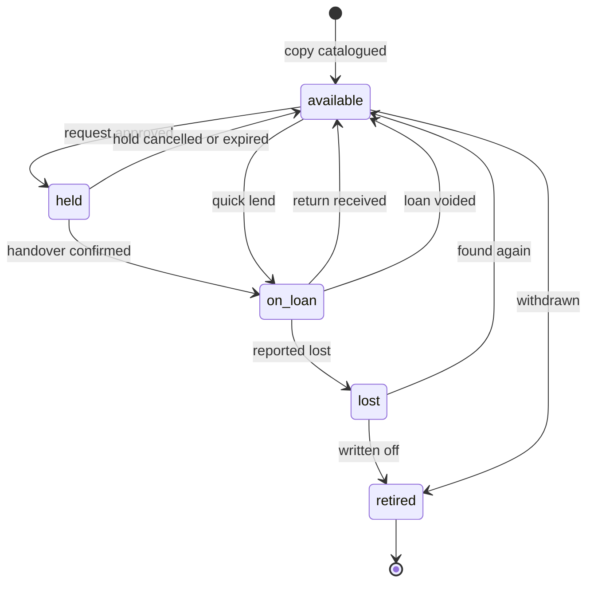

# OLibra — Business Requirements

**Status:** Approved. Implementation-independent.
**Date:** 2026-08-06
**Scope:** *What* the system must do and *why*. Nothing about how it is built.

This document is the single authority on the product. It names no framework, no database engine, no library, and no hosting arrangement. Those decisions live in the technical design and may change without touching a line here — as they did when the project moved off its first stack.

---

## 1. What OLibra Is

OLibra is a management system for small community bookshelves — the kind kept in a church hall, run by a few volunteers, often children, holding on the order of one hundred to a few hundred books.

**It is explicitly not a public library system.** That distinction drives nearly every decision below. A library system optimises for catalogue scale, patron self-service, fines, and interoperability with other libraries. OLibra optimises for a volunteer standing next to a physical shelf with a phone in one hand and a book in the other. Where the two goals conflict, the volunteer wins.

### 1.1 Audiences

| Audience | What they need |
|---|---|
| **Readers** (mostly children) | What is on the shelf, and what they can take home today |
| **Managers** (volunteers, often teenagers) | Record lending and returning, approve new readers, keep the shelf honest |
| **Super administrator** | Oversee several bookshelves, delegate them to local managers, review everything each manager has done |

### 1.2 Surfaces

One product, four distinct surfaces:

| Surface | Purpose |
|---|---|
| Marketing site | Landing page, about, blog, contact. Public and SEO-relevant. |
| Portal | Directory of all bookshelves. The front door for anyone without a direct link. |
| A bookshelf | Everything functional: catalogue, borrowing, management. Reached by the shelf's own slug. |
| Administration | Super-admin oversight across all bookshelves. |

The example deployment carries shelves such as `dongthap` and `cantho`. The production domain is not yet decided and nothing here depends on it.

### 1.3 The insight that drives the interface

The dominant real-world interaction is a child standing at the shelf holding a book, with a volunteer holding a phone. Requests, queues, and statistics are all secondary to that moment.

Therefore the manager's primary screen is a **quick-lend flow that takes three taps**: find the book, pick the reader, confirm. Returns get the same treatment, with the condition selector defaulting to *Nguyên vẹn* so the overwhelmingly common case is a single tap.

If that flow is slow, volunteers stop using the system and revert to paper, and every other requirement in this document becomes worthless. **Any change that adds a step to quick-lend or quick-return needs an explicit justification.**

### 1.4 Delivery phases

Multi-tenancy is present from the first day of data, so later phases add features rather than rewriting foundations.

**Phase 1 — the core loop.** Books and copies, readers and registration approval, lending and returning with condition assessment, the audit log, the manager dashboard, the public catalogue and search. A single bookshelf, but stored as one tenant among many.

**Phase 2 — community.** Borrow requests, holds, the waiting queue, comments and moderation, announcements, feedback, statistics.

**Phase 3 — the network.** The portal directory, multiple bookshelves, super-admin tooling, cross-shelf statistics, the marketing landing page and blog, per-manager audit views.

Phase 1 is a genuinely useful product on its own. If the project stalls after Phase 1, the volunteers still have something better than paper.

---

## 2. Requirements the Original Brief Did Not State

These were identified during design and are all in scope.

**Retirement is distinct from deletion.** Books get too damaged to circulate, get given away, or are removed when the shelf shrinks. That is a real-world event and deserves a *retired* state. Soft deletion, by contrast, exists to undo *mistakes*. Conflating the two produces a system where you cannot tell "this book was destroyed" from "someone fat-fingered the delete button", and it corrupts historical statistics.

**Lost is a state, not a condition grade.** Losing a book removes it from circulation, whereas a torn book keeps circulating. Loss belongs on the availability axis, and needs a path back for when a book turns up again.

**Readers have a lifecycle.** Children move away, grow up, or simply stop coming. Membership needs *suspended* and *left* states. A reader who has ever borrowed a book must never be erased, because that would destroy the audit history the brief explicitly requires.

**Managers can be offboarded.** Revocation changes a role; it never deletes a person, because their audit trail must survive them.

**Guest borrow requests are a spam vector.** An anonymous form collecting a name and phone number is an open door on the public internet. It needs rate limiting, a honeypot field, and a manager action to convert a legitimate request into a real account.

**Rejected registrations need a resolution.** They are retained with a reason for audit purposes, and the person may re-apply.

**Concurrency is a real risk.** Two managers can lend the same copy within the same second, at the same physical shelf, from two phones. One of them must fail cleanly and see a plain message, never a silently corrupted record.

**The shelf itself has properties.** Where it physically is, when it is accessible, and who holds the key — with a tappable contact phone number.

**Data export is insurance.** Volunteers plus modest infrastructure is a meaningful data-loss risk. CSV export of books, readers, and loans ships in Phase 1.

---

## 3. Edge Cases the System Must Handle

- A hold expires because the reader never came to collect the book.
- Three readers are queued for one book and the first does not show up; the manager skips to the next.
- A renewal is requested while somebody is waiting in the queue. This is blocked.
- The same child registers twice. The manager sees a similar-name warning.
- A reader is suspended while still holding a book. The loan survives; the suspension only blocks *new* loans.
- A book is returned in worse condition than it left in.
- A book reported lost is found months later.
- A manager records a loan by mistake and needs to undo it.
- A copy is retired while other copies of the same title remain in circulation.
- Background maintenance does not run for several hours. Nothing a user can observe may become wrong as a result.

---

## 4. Assumptions

These were ambiguous in the brief and are resolved as follows. Changing any of them is a change to the product, not an implementation detail.

1. **Timezone is `Asia/Ho_Chi_Minh`** everywhere. Dates are interpreted in that zone regardless of where the system runs.
2. **There is no outbound email in v1.** Manager-issued password reset is the only account recovery path. An email address is collected but optional, so email-based reset can be switched on later without disturbing existing accounts.
3. **A manager approving a registration constitutes the consent needed to hold a minor's data.** The manager personally knows the family; that is the trust model the brief describes.
4. **"Most borrowed" counts completed handovers at the title level**, not requests and not copies. A title with three copies is not thereby three times more popular.
5. **Guest borrow requests create a lead, not an account.** A manager reviews and converts them.
6. **Public pages display readers' full names**, as the product owner decided. Date of birth, parents' names, phone number, tổ, and giáo họ remain visible only to managers and administrators. Name display is governed by a per-bookshelf setting so it can be tightened later without a code change.
7. **Vietnamese is the only shipped locale.** No user-facing string is ever hard-coded; adding a locale is a translation task, not a rewrite.
8. **A person has at most one role per bookshelf.** Roles are hierarchical: admin implies manager implies reader.

---

## 5. Domain Model

### 5.1 Entities

| Entity | Description |
|---|---|
| **Bookshelf** | The tenant. Owns everything below it except User and Post. |
| **User** | A global identity. One account works across every bookshelf. |
| **Membership** | A user's relationship to one bookshelf: role, status, parish details. **This is also the registration record.** |
| **Book** | Title-level information: title, author, description, cover, page count. |
| **BookCopy** | A physical object on a shelf. This is what gets lent. |
| **BorrowRequest** | A reader's or guest's expression of intent, and its lifecycle through hold to handover. |
| **Loan** | A copy in someone's hands, with a due date. |
| **ConditionAssessment** | A manager's judgement of a copy's physical state at a point in time. |
| **Comment** | A reader's comment on a book, subject to moderation. |
| **Announcement** | Shelf-scoped news, written by managers. |
| **Post** | Global blog article, written by the super admin. |
| **Feedback** | A message to the administrator, from anyone. |
| **AuditLog** | An append-only record of every state change. |

### 5.2 Ownership

- **Book** owns its copies. A copy has no meaning without its title.
- **Loan** owns the condition assessments taken during it.
- **Membership** owns the registration data and its approval decision.
- **BorrowRequest** owns its own lifecycle, including the hold.
- **Bookshelf** scopes all of the above.

### 5.3 Where personal information lives

This distinction matters and is easy to get wrong.

**On the person** — facts true everywhere: username, password, saint name (tên thánh), full name, date of birth, father's name, mother's name, phone, optional email, display name, locale, avatar.

**On the membership** — facts about that person's relationship to *that specific parish*: tổ (parish group), giáo họ (parish sub-community), role, status, who approved them and when, rejection or suspension reason, manager's private notes, leaderboard visibility.

If a family moves and registers at a different bookshelf, their identity is reused and only the parish details are re-entered.

### 5.4 What is recorded about each thing

Field lists, not storage layouts. Every record carries when it was created and last changed.

**Bookshelf** — slug (URL segment, fixed after creation), name, description, physical location, address, keeper's name and phone (both shown publicly), opening hours as free text, cover image, timezone, locale, status (active or archived), settings (§5.5), establishment date, who created it.

**Book** — bookshelf, category, title, slug, author, publisher, published year, ISBN, page count, description, cover image, language, published flag (hides drafts from the public), who added it.

**BookCopy** — bookshelf, book, human-readable code unique within the shelf (e.g. `DT-0142`, intended to become a QR label), state, condition, condition note, when and from whom it was acquired, retirement time and reason, time reported lost.

**BorrowRequest** — bookshelf, book (a *title*, not a copy), assigned copy once approved, requester (a member or a guest name, phone and note), status, request time (the queue ordering key), decision maker, decision time and note, hold expiry, the loan that fulfilled it, cancellation time. Guest requests are rate-limited by a hashed identifier. A request must have either a member or a guest name.

**Loan** — bookshelf, copy, title (recorded independently so statistics survive the copy being retired), borrower, originating request if any, the manager who handed it over, lending time, **due date** (a date, not a time), status, return time, the manager who received it, return condition, note and photo, renewals used, lost-report time and reporter, void time, voider and reason, notes.

`due_on` is a **date**, not a timestamp. A book is due at the end of a day, not at 14:23 on that day. A timestamp would make a book overdue mid-afternoon, which is confusing for children and wrong for a shelf only accessible after Sunday mass.

**ConditionAssessment** — bookshelf, copy, loan if part of a return, assessor, condition, note, photo, time. Separate from the loan because a manager may assess a copy at any time, not only at return.

**Comment** — bookshelf, book, member author (no guest comments), plain-text body, status, moderator, moderation time and note. Comments are plain text and rendered escaped: no rich text, no HTML.

**Announcement** — bookshelf, title, slug, rich body, plain-text derivation for excerpts and search, pinned flag, publication time (absent means draft), expiry, author.

**Post** — title, slug, excerpt, rich body, plain-text derivation, cover, publication time, author. Global, not shelf-scoped.

**Feedback** — bookshelf (absent for site-wide), member or guest name and contact, subject, body, status (new, read, resolved), handler and handling time. Rate-limited by hashed identifier.

**AuditLog** — bookshelf (absent for global actions), actor (absent for system actions), action name, the record affected, the values before and after, context (address, device, screen), time.

### 5.5 Per-bookshelf settings

Each shelf configures its own lending policy. Defaults:

| Setting | Default | Meaning |
|---|---|---|
| `loan_days` | 14 | Length of a loan |
| `max_concurrent_loans` | 3 | Books one reader may hold at once |
| `max_renewals` | 1 | Renewals allowed per loan |
| `renewal_days` | 7 | Days a renewal adds |
| `hold_days` | 3 | How long an approved request is held for collection |
| `due_soon_days` | 3 | When a loan starts showing as due soon |
| `allow_guest_requests` | true | Whether non-members may ask to borrow |
| `allow_comments` | true | Whether readers may comment |
| `comments_require_approval` | true | Whether comments are moderated before publication |
| `public_name_display` | `full_name` | `full_name`, `display_name`, or `hidden` |
| `public_show_current_borrower` | true | Whether the public sees who holds a book |
| `leaderboard_enabled` | true | Whether rankings are shown |
| `leaderboard_size` | 10 | How many entries a ranking shows |

Adding a setting must never be a disruptive change.

---

## 6. Business Rules

Each of these gets a named, dedicated test. They are the specification of correctness.

| # | Rule |
|---|---|
| **INV-1** | A book copy has at most one active loan at any time. This must be guaranteed by the datastore, not by application checks, because two managers can lend the same copy in the same second. |
| **INV-2** | A copy cannot be simultaneously held and on loan. |
| **INV-3** | Only an *available* copy can be lent, or a *held* copy being collected by the reader who holds it. |
| **INV-4** | A reader whose membership is not *active* cannot start a new loan. Existing loans are unaffected. |
| **INV-5** | A reader may hold at most `max_concurrent_loans` active loans per bookshelf. |
| **INV-6** | A loan may be renewed only if renewals remain **and** no borrow request is queued for that title. A renewal extends the due date by `renewal_days` **from the current due date**, not from the day the renewal was requested. |
| **INV-7** | A copy that is *lost* or *retired* cannot be lent or held. |
| **INV-8** | Every state transition writes an audit record naming actor, time, before, and after. |
| **INV-9** | A comment is publicly visible only when *approved*. |
| **INV-10** | Every query is scoped to a single bookshelf, except explicit super-admin cross-shelf views. |
| **INV-11** | A loan is never deleted. Mistakes are recorded as *voided* with a reason. |
| **INV-12** | Audit records are never changed or removed. |

Tenant isolation (INV-10) is the highest-consequence property in the system. It must be structural — impossible to forget — not a matter of anyone remembering to filter.

---

## 7. State Machines

### 7.1 Book copy



| From | To | Trigger |
|---|---|---|
| available | held | Borrow request approved |
| available | on_loan | Direct lend (quick-lend, no prior request) |
| available | retired | Manager withdraws the copy |
| held | available | Hold cancelled, or hold expired |
| held | on_loan | Handover confirmed |
| on_loan | available | Return received |
| on_loan | lost | Reported lost |
| on_loan | available | Loan voided (recorded in error) |
| lost | available | Book found again |
| lost | retired | Written off permanently |

A copy that is *on_loan* cannot be retired directly; it must first be returned or reported lost. *Voided* is a loan status, not a copy state — voiding a loan returns its copy to *available*.

### 7.2 Borrow request

```
pending ──► approved ──► fulfilled
   │            │
   │            └──► expired        (hold lapsed, reader never collected)
   ├──► rejected                    (manager declined)
   └──► cancelled                   (reader withdrew)
```

Requests for a title whose copies are all out simply remain *pending*. The queue is the set of pending requests for that title, ordered by request time. There is no separate reservation concept.

### 7.3 Loan

```
active ──► returned
   ├────► lost
   └────► voided
```

### 7.4 Membership

```
pending ──► active ⇄ suspended
   │           │
   │           └──► left
   └──► rejected
```

### 7.5 Comment

`pending` → `approved` | `rejected`; `approved` → `hidden`.

---

## 8. Derived State — a load-bearing rule

**Overdue status, hold expiry, and book availability are computed on read, from stored data and the current clock. They are never written by a scheduled job.**

Any status a background job must *write* is stale, and therefore wrong, for as long as the job takes to run again. A reader would see a book as available that was lent twenty minutes ago; a manager's overdue list would omit books that became overdue at midnight. Computing on read keeps the system correct even if background work is broken entirely.

Concretely:

- A loan is overdue when it is active and its due date is before today, in the application timezone.
- A hold is expired when the request is approved and its hold expiry has passed.
- A copy is borrowable when it is available and no unexpired hold references it.

Background work exists only for genuinely deferrable tasks: image processing, cache warming, backups, and tidying up expired holds as housekeeping rather than as correctness.

---

## 9. Condition Model

Condition is a single choice from a flat list, plus an optional free-text note and an optional photograph:

`perfect` · `slightly_worn` · `worn` · `torn` · `missing_pages` · `written_on`

Reality is often "torn *and* written on", and the rigorous model would be a grade plus multi-select damage flags. That was considered and rejected for v1: a single row of large buttons is dramatically easier for a child to use, and the optional photograph captures whatever the list cannot. Moving to multi-select later is purely additive.

`lost` is deliberately absent, because it is a copy *state* (§7.1).

---

## 10. Book Lifecycle

```
Acquired (donated or bought)
   → Catalogued          Book record created; one or more copies created
   → Circulating         Copies move between available / held / on_loan
   → Retired or Lost     Removed from circulation, history retained
```

A book whose copies are all retired stays in the catalogue for historical statistics but is hidden from the public listing unless the reader explicitly asks to include withdrawn titles.

---

## 11. Deletion Policy

| May be soft-deleted (undoing a mistake) | Never deleted |
|---|---|
| Users, memberships, books, copies, categories, comments, announcements, posts, borrow requests, bookshelves | **Loans** (use *voided*), **audit records** (append-only), **condition assessments** (historical fact), **feedback** |

Soft deletion exists to undo mistakes. It is not a substitute for domain states like *retired*, *left*, or *voided*, which represent things that actually happened.

A copy with loan history cannot be removed. A person with any audit trail cannot be removed. Only a book's copies follow it when the book itself goes.

---

## 12. Search

A child typing "tim kiem kho bau" on a phone without diacritics must find "Tìm Kiếm Kho Báu". Diacritic-insensitive, case-insensitive substring matching over title and author is the requirement; at a few hundred books per shelf, nothing more elaborate is warranted.

Whatever normalisation is applied when storing a title must be the identical normalisation applied to the search term, so the two can never drift.

---

## 13. Permissions

### 13.1 Roles

| Role | Scope | Description |
|---|---|---|
| `guest` | — | Not authenticated. Read-only public access. |
| `reader` | Per bookshelf | An approved member. |
| `manager` | Per bookshelf | Runs day-to-day operations for that shelf. |
| `admin` | Per bookshelf | A manager who can also administer that shelf. |
| `super_admin` | Global | Can do anything, anywhere. |

Roles are hierarchical within a shelf: `admin` ⊃ `manager` ⊃ `reader`. A person holds at most one membership per bookshelf, and may hold memberships in several bookshelves with different roles in each.

### 13.2 Permission set

**Catalogue** — view any book, view a book, create, update, delete; create copy, update copy, retire copy, report copy lost, assess condition.

**Circulation** — view any loan, view own loans, create loan, receive return, renew own loan, void loan; create request, view any request, view own requests, approve, reject, hand over, cancel own.

**Members** — view any, view one, approve, reject, suspend, create, reset password.

**Community** — create comment, moderate comments, manage announcements, view feedback, resolve feedback.

**Oversight** — view statistics, view statistics across all shelves, view audit log, view audit log across all shelves, run export.

**Administration** — create bookshelf, update bookshelf, archive bookshelf, assign manager, revoke manager, promote super admin, manage posts.

### 13.3 Enforcement

Every screen hides what the user cannot do. **The interface hiding an action is never the security control** — the server-side check is. Both must exist.

If per-user exceptions are ever needed — granting one trusted reader the ability to moderate comments, say — the path is a per-membership override consulted on top of the role map. Additive, and it changes no existing rule.

---

## 14. Auditing

Two complementary sources feed the audit record:

**Automatic change capture** on create, update, and delete gives the previous-value / new-value record the brief requires, for every tracked record. Passwords and session tokens are never captured.

**Explicit domain events** record things that are not simple field changes — "manager approved this registration", "manager skipped this reader in the queue" — with a meaningful action name the audit browser can filter and label.

Both are written in the same transaction as the change they describe, so an audit record and its subject can never diverge. **Auditing is never deferred to a background job**, because an audit trail that can be lost to a failed job is not an audit trail.

The audit browser renders each entry as a readable Vietnamese sentence — "Quản lý Maria Lan đã cho Giuse Minh mượn *Dế Mèn Phiêu Lưu Ký* lúc 14:32 ngày 03/08" — with the raw before/after values available on expansion. Readable-by-default is the requirement; the raw values are for when something is genuinely being investigated.

Answering "what has manager A been doing" is a headline requirement and must be fast.

---

## 15. Notifications

In-app only in v1, surfaced as a bell with an unread count. There is no email.

**To readers:** registration approved, registration rejected, borrow request approved (with collection deadline), borrow request rejected, book ready for collection, loan due soon, loan overdue, comment approved.

**To managers:** nothing is pushed. Managers work from dashboard badge counts. This avoids notification fatigue for volunteers and removes any dependency on timely background work.

---

## 16. User Experience

### 16.1 Public pages

**Landing.** What OLibra is, in one sentence, above the fold. A prominent path into the portal. Three or four recent blog posts. Deliberately light — this page explains the project to someone who has heard about it, it does not convert anyone.

**Portal.** A card per bookshelf: name, location, book count, active reader count, keeper contact. Search or filter by place if the number ever grows.

**Shelf home.** The most important public page. In order down the page:
1. Shelf identity — name, where it is, when it is open, who holds the key with a tappable phone number.
2. Announcements — pinned first, most recent next.
3. Two large buttons: **"Sách đang có"** and **"Toàn bộ tủ sách"**. These are the primary actions and must be impossible to miss.
4. Most-borrowed books, as a horizontally scrollable cover row.
5. Most-active readers.
6. Latest approved comments.
7. A quiet link to send feedback to the administrator.

**Catalogue.** A cover-forward responsive grid — two columns on phones, up to six on desktop. Each card shows cover, title, author, and an availability badge. A filter bar offers availability, category, and sort. The available/all toggle is a segmented control, not a dropdown, because it is the single most-used control on the page.

**Book detail.** Cover and title at the top. Below it, an availability panel that changes with state:
- *Available*: green badge, copy count if more than one, and a large **"Xin mượn"** button.
- *On loan*: amber badge showing who has it and for how many days, how many people are already queued, and a button with an honest label — **"Đăng ký chờ mượn"**.

Then metadata (author, page count, category, publisher), the description, and approved comments with a comment box for logged-in readers. Managers additionally see per-copy state, condition history, and the full loan history for the title.

Pressing "Xin mượn" branches: a logged-in reader submits immediately with a confirmation dialog; a guest gets a short form asking for name and phone, explaining that a manager will contact them.

**Search.** Live results as the reader types, matching title and author, diacritic-insensitive. The empty state suggests popular books rather than showing nothing.

**Registration.** A single page, not a wizard — the field count is manageable and volunteers guide children through it in person. Fields grouped as *Đăng nhập* (username, password), *Bản thân* (saint name, full name, date of birth), *Gia đình* (father, mother, phone), *Giáo xứ* (tổ, giáo họ). Every field states why it is needed. On submit, a clear confirmation that a manager must approve the account and roughly what happens next.

### 16.2 Reader pages

**My dashboard.** Books currently held, each with days remaining as a coloured badge, and a renew button where permitted. Pending requests with their queue position. Recent history.

**Borrowing history.** Reverse-chronological, with the return condition shown, so a reader can see their own record.

**Profile.** View and edit personal details, change password, toggle leaderboard visibility.

### 16.3 Manager pages

**Dashboard.** Four large tappable stat cards across the top: *Quá hạn*, *Chờ duyệt tài khoản*, *Yêu cầu mượn*, *Bình luận chờ duyệt*. Each navigates to its filtered list. Below them, two very large primary buttons — **"Cho mượn"** and **"Nhận trả"** — sized for a thumb. Then shelf totals and recent activity.

**Quick lend.** The most important screen in the application.
1. Find the book — search box focused on load, results as cover-and-title rows.
2. Pick the reader — searchable list of active members, with a "register a new reader" escape hatch.
3. Confirm — shows book, reader, and the calculated due date; one button.

If the title has several copies, a copy selector appears between steps one and two. If it has one copy, that step does not exist.

Blocking conditions (reader at loan limit, copy already lent, membership not active) surface as a clear message *before* the confirm step, never as an error afterwards.

**Receive return.**
1. Find the loan — search the currently-borrowed list by book or reader.
2. Assess condition — a row of large buttons with icons, *Nguyên vẹn* preselected. An optional note and photo appear only if a worse condition is chosen.
3. Confirm.

The common case — an undamaged book — is two taps. If anyone is queued for that title, the confirmation says so immediately and offers to approve the first person in the queue. Nothing happens automatically: the manager decides, because the next reader may not be standing there.

**Books.** A responsive list with search and filters; a table on desktop, stacked cards on mobile. The create and edit form is single-column with the cover uploader first, since a photograph is the strongest recognition cue.

**Copies.** Managed within a book's detail page. Each copy shows its code, state, condition, and actions: assess, report lost, mark found, retire.

**Readers.** Searchable list with status filters. Detail view shows the full profile — including the manager-only fields — current loans, complete history, and administrative actions.

**Pending registrations.** A review card per application, laying out exactly the fields the manager must verify in person, with prominent Approve and Reject buttons and a required reason on rejection. A similar-name warning appears when an existing member closely matches, to catch duplicate registrations.

**Request queue.** Grouped by book, ordered by request time. Each entry offers Approve (creating a hold with a visible expiry), Reject, and — once approved — Handover, plus Skip for when a reader does not come.

**Overdue.** Sorted by how overdue, showing borrower and contact phone. That phone number is the actual mechanism by which books come back, so it must be tappable.

**Comment moderation.** Pending comments with the book, the reader, and the text, with Approve and Reject.

**Statistics.** Period selector (week, month, year, since the shelf began), showing loans, distinct borrowers, books added, and books lost, with charts over time and ranked lists of top books and top readers.

### 16.4 Administration pages

**Admin dashboard.** One row per bookshelf: name, books, active readers, current loans, overdue count, pending items. Anything needing attention is flagged.

**Bookshelves.** Create and edit shelves, including the slug that becomes the URL, the lending policy settings, and keeper contact details. The slug is fixed after creation, since it appears in shared links.

**Managers.** Every manager across every shelf, with the ability to assign, revoke, and promote to super admin. Revocation requires confirmation and states plainly that history is retained.

**Audit log browser.** Filterable by shelf, actor, action type, and date range. See §14.

**Per-manager activity.** Everything one manager has done, grouped by type — books added, loans made, returns received, conditions assessed, registrations approved.

**Feedback inbox.** Messages from readers and guests, markable read and resolved.

---

## 17. Interface Design

### 17.1 Principles

The interface serves children who may have been reading fluently for only a few years, and adult volunteers who may not use smartphones confidently. Both are served by the same things: large targets, plain words, high contrast, and obvious next actions.

1. **One primary action per screen**, visually dominant. If two things look equally important, neither is.
2. **Status is never carried by colour alone.** Every state has an icon, a word, and a colour, so it survives colour blindness, glare, and cheap screens.
3. **Plain Vietnamese, no jargon.** "Cho mượn", never "Giao dịch lưu thông".

### 17.2 Colour

A warm, calm palette that reads as a community bookshelf rather than enterprise software.

| Role | Light | Purpose |
|---|---|---|
| Background | Warm off-white | Page |
| Foreground | Near-black warm grey | Body text |
| Primary | Deep amber / terracotta | Primary actions |
| Secondary | Warm stone | Secondary surfaces |
| Muted | Light warm grey | Meta text, borders |
| Accent | Soft teal | Highlights, links |
| Destructive | Clear red | Destructive actions |

Semantic status, each always paired with an icon and a label:

| State | Colour | Icon | Label |
|---|---|---|---|
| Available | Green | book-open | Còn sách |
| On loan | Amber | book-marked | Đang mượn |
| Held | Blue | bookmark | Đang giữ chỗ |
| Overdue | Red | alert-triangle | Quá hạn |
| Lost | Dark red | help-circle | Đã mất |
| Retired | Grey | archive | Ngừng dùng |

All text meets WCAG AA contrast; primary actions and status badges target AAA where achievable.

### 17.3 Typography and spacing

Base 16px on public pages, 17px in the manager interface where volunteers work fastest. Line height 1.6 for body copy. A single sans-serif family with good Vietnamese diacritic support, self-hosted — never loaded from a third-party CDN.

Spacing follows a restricted 4px scale so the rhythm stays consistent. Cards use 16px padding on mobile and 24px on desktop.

Touch targets are minimum 44×44px, with primary action buttons at 56px tall. Interactive elements never sit closer than 8px apart.

### 17.4 Components

**Cards** carry a subtle border rather than a heavy shadow. Book cards are cover-dominant with a 2:3 aspect ratio, title clamped to two lines, author to one, and an availability badge pinned to the cover's corner. Missing covers get a generated placeholder using the title's initial over a colour derived from the title, so the grid never looks broken.

**Tables** become stacked cards below 768px — not horizontally scrolling tables, which are unusable on a phone. Each card leads with the identifying field and shows the two or three most relevant others. Sorting is a select on mobile and column headers on desktop.

**Forms** are single-column always. Labels sit above inputs, never beside them. Required fields are marked with a word, not only an asterisk. Errors appear beneath the field in red with an icon, and the first error receives focus on submit. Inputs are 48px tall.

**The condition picker** is a row of large icon buttons rather than a dropdown, because it is used constantly and speed matters. Selection is shown by a filled background and a check, not by colour alone.

**Charts** are limited to bar and line — no pie charts, which are hard to read and worse when printed or screenshotted. Every chart has a text summary above it, so the information is available without interpreting the graphic.

**Icons** are 20px inline and 24px standalone, and never appear without a text label in navigation or actions.

### 17.5 Navigation and mobile layout

Public navigation is a top bar: shelf name, catalogue, announcements, search, and login. It collapses to a hamburger below 768px.

The manager interface uses a sidebar on desktop and a **five-item bottom tab bar on mobile** — *Trang chính*, *Sách*, *Cho mượn*, *Người đọc*, *Thêm*. Five is the ceiling; anything else lives behind *Thêm*.

**The manager's mobile layout is the primary manager experience, not a degraded fallback.** Volunteers work standing at a shelf with a phone in one hand. Every manager screen is designed at 375px first and expanded from there, and the two most frequent actions — lend and return — are reachable in one tap from anywhere.

### 17.6 Dark mode

Follows the system preference by default, can be overridden with a toggle, and persists per device and per account. Both themes meet AA contrast; dark mode uses a warm near-black rather than pure black, which is easier to read at length.

### 17.7 Errors and loading

Error pages for 403, 404, expired session, rate limiting, and server failure carry plain-language Vietnamese explanations and a route back to safety. Field validation renders inline beneath inputs. Business-rule violations surface as a friendly message naming what to do instead. A component crash degrades one region rather than blanking the page.

Every button that triggers a change disables itself and shows a spinner while in flight, which also prevents the double-submit that would otherwise create duplicate loans.

---

## 18. Language

Vietnamese is the shipped language. URLs are in Vietnamese too, which suits the audience and reads well in search results.

No user-facing string is ever hard-coded. The active language comes from the reader's preference, falling back to the bookshelf's, falling back to Vietnamese. Dates and numbers are formatted for the active locale, never with hand-written format strings.

---

## 19. Roadmap

Ordered by value to this specific project rather than by novelty.

**Near term**

- **QR labels per copy.** Print a label per copy carrying its code; a manager scans with the phone camera to lend or return. This is the single largest UX improvement available, and the copies model already supports it.
- **CSV and Excel import.** Cataloguing a hundred existing books by hand is the biggest barrier to adoption. Export ships in Phase 1; import should follow close behind.
- **Printable borrow slips and shelf labels.** Paper still matters where phones do not reach.

**Medium term**

- **Offline-capable install.** Church halls have poor connectivity. Catalogue readable offline, lending actions queued for sync.
- **Zalo notifications.** The right channel for Vietnam — far more likely to reach a family than email or SMS, and cheaper than both.
- **Reading achievements for children.** Badges for books finished, streaks, genre variety. A genuine motivator, but it must never become a public ranking that shames slower readers.
- **Reservation calendar.** Letting readers see when a book is expected back.

**Longer term**

- Book recommendations based on borrowing history within a shelf.
- Transfers between bookshelves in the network.
- A reading log where children record what they thought of a book, beyond a public comment.
- Multi-locale content, if a shelf ever serves a non-Vietnamese-speaking community.

**Deliberately not planned:** fines and payments, barcode scanning of commercial ISBNs (unreliable for donated and second-hand Vietnamese books, where QR labels are strictly better), integration with any external library system, and public reader profiles beyond the leaderboard.

---

## 20. Open Questions

None blocking. Two worth revisiting after the first bookshelf has run for a month:

1. Whether the single-choice condition model (§9) proves too coarse in practice. Moving to grade-plus-flags is additive if so.
2. Whether the public display of full reader names (§4, assumption 6) still feels right once real children's names are on a public leaderboard. The `public_name_display` setting makes this a configuration change.

---

## 21. Definition of Done

This document is the authority on *what* to build and *why*. Implementation may deviate where reality demands, provided:

- The twelve rules in §6 hold, each covered by a named test.
- Tenant scoping (INV-10) stays structural, not a matter of developer discipline.
- Derived state (§8) stays derived.
- Business logic stays separable from the delivery mechanism, so a public API can be added later without duplicating a single rule.

Any deviation from those four properties is a change to this document, not a note in a commit message.
