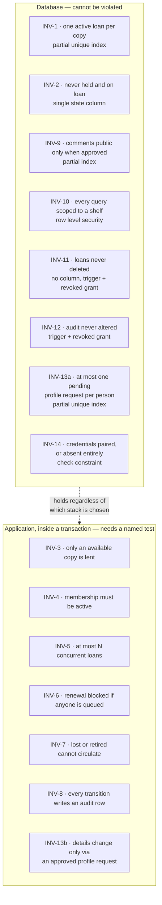

# OLibra — Database Design

**Status:** Proposed. Derived from [BUSINESS-REQUIREMENTS.md](BUSINESS-REQUIREMENTS.md), which is the authority. Where this document and that one disagree, that one wins.

**Engine:** PostgreSQL 16 or later. The engine is the likely choice but not yet formally settled; the *hosting* and the *application stack* are both open. Deployment is expected to be Docker.

Everything below is standard PostgreSQL and assumes no managed-provider feature. Where a decision would differ between a self-hosted container and a managed service, that is called out rather than assumed.

---

## At a glance

Before the column lists, the relationships. Read the crow's feet as "many".

```mermaid
erDiagram
    BOOKSHELVES  ||--o{ MEMBERSHIPS   : scopes
    BOOKSHELVES  ||--o{ BOOKS         : scopes
    BOOKSHELVES  ||--o{ ANNOUNCEMENTS : scopes
    BOOKSHELVES  ||--o{ PARISH_UNITS  : scopes
    PARISH_UNITS ||--o{ PARISH_UNITS  : "nests under"
    PARISH_UNITS ||--o{ MEMBERSHIPS   : "level-1 unit of"
    PARISH_UNITS ||--o{ MEMBERSHIPS   : "level-2 unit of"
    USERS        ||--o{ MEMBERSHIPS   : "is, here"
    USERS        ||--o{ SESSIONS      : "signs in as"
    CATEGORIES   ||--o{ BOOKS         : "groups, shared by every shelf"
    BOOKS        ||--o{ BOOK_COPIES   : "has physical"
    BOOK_COPIES  ||--o{ LOANS         : "lent as"
    USERS        ||--o{ LOANS         : borrows
    BOOKS        ||--o{ LOANS         : "recorded on"
    BOOKS        ||--o{ BORROW_REQUESTS : "queued for"
    BOOK_COPIES  ||--o| BORROW_REQUESTS : "held for"
    LOANS        ||--o{ CONDITION_ASSESSMENTS : "assessed at return"
    BOOK_COPIES  ||--o{ CONDITION_ASSESSMENTS : "assessed any time"
    BOOKS        ||--o{ COMMENTS      : "commented on"
    USERS        ||--o{ COMMENTS      : writes
    USERS        ||--o{ NOTIFICATIONS : receives
    USERS        ||--o{ AUDIT_LOG     : "acted in"
    USERS        ||--o{ PROFILE_CHANGE_REQUESTS : proposes
    BOOKSHELVES  ||--o{ PROFILE_CHANGE_REQUESTS : "manager decides"
    MEMBERSHIPS  ||--o{ BOOK_DONATIONS : offers
    BOOKSHELVES  ||--o{ BOOK_DONATIONS : scopes

    BOOKSHELVES {
        uuid id PK
        text slug UK "immutable after creation"
        jsonb settings "the thirteen per-shelf rules"
    }
    USERS {
        uuid id PK
        text username UK "unique, case-insensitive"
        text full_name
        bool is_super_admin "the only global role"
    }
    SESSIONS {
        text token_hash PK "sha256 of the token; the raw token is never stored"
        uuid user_id FK
        timestamptz expires_at
    }
    MEMBERSHIPS {
        uuid id PK
        uuid bookshelf_id FK
        uuid user_id FK
        enum role "reader, manager, admin"
        enum status "pending, active, suspended, left, rejected"
        uuid parish_unit_l1_id FK "nullable, always"
        uuid parish_unit_l2_id FK "nullable, always"
    }
    PARISH_UNITS {
        uuid id PK
        uuid bookshelf_id FK
        smallint level "1 or 2"
        uuid parent_id FK "self-ref; null unless nested level 2"
        text name "admin-named, no shipped vocabulary"
        int sort_order "explicit, never parsed from name"
    }
    BOOKS {
        uuid id PK
        text title
        text title_folded "diacritics stripped, for search"
        bool is_published "hides drafts"
    }
    BOOK_COPIES {
        uuid id PK
        text code UK "DT-0142, unique per shelf"
        enum state "available, held, on_loan, lost, retired"
        enum condition "the six grades"
        uuid acquired_from_membership_id FK "donor with an account; nullable"
    }
    LOANS {
        uuid id PK
        uuid copy_id FK
        uuid book_id FK "denormalised, survives retirement"
        date due_on "a date, never an instant"
        enum status "active, returned, lost, voided"
        int renewals_used
    }
    BORROW_REQUESTS {
        uuid id PK
        uuid book_id FK "a title, not a copy"
        timestamptz requested_at "the queue ordering key"
        enum status "pending, approved, rejected, fulfilled, expired, cancelled"
        timestamptz hold_expires_at
    }
    CONDITION_ASSESSMENTS {
        uuid id PK
        enum condition
        text photo_url "never deleted, §11"
    }
    AUDIT_LOG {
        bigint id PK
        text action "loan.lent, membership.approved…"
        jsonb before
        jsonb after
    }
    PROFILE_CHANGE_REQUESTS {
        uuid id PK
        uuid user_id FK "whose profile"
        uuid bookshelf_id FK "whose manager decides"
        jsonb proposed_values "the change on offer"
        jsonb previous_values "what it was when proposed"
        enum status "pending, approved, rejected, cancelled"
    }
    BOOK_DONATIONS {
        uuid id PK
        uuid donor_membership_id FK
        enum status "pending, received, declined"
        text description
    }
```



Six things in that diagram are decisions rather than description, and each is
explained where its table is defined:

- **`LOANS` points at both a copy and a book.** Deliberate denormalisation
  (§4.5): statistics must survive the copy being retired.
- **`BORROW_REQUESTS` points at a book, and only optionally at a copy.** A
  request is for a title; a copy is assigned on approval (§4.6).
- **`CONDITION_ASSESSMENTS` hangs off both a copy and a loan**, the loan being
  optional, because a manager may assess a copy at any time (§4.7).
- **`MEMBERSHIPS` carries the parish fields, not `USERS`.** Identity is global;
  the parish relationship is local (§4.1).
- **`PARISH_UNITS` references itself, rather than there being a separate
  table per level.** One self-referencing row shape serves a flat shelf, a
  two-level nested one, and a two-level flat one alike — nesting is data
  (whether `parent_id` is set), not a schema difference (§4.1).
- **`PROFILE_CHANGE_REQUESTS` carries the proposed values *and* the values as
  they stood when proposed.** A manager reviewing a week-old request needs to
  see what it would actually change, not what it was expected to change
  (§4.11).

### Where each guarantee lives

The same picture, drawn by who enforces what. This is the distinction §1 says
is the whole point of the document.



Eight boxes on the left, seven on the right — fourteen rules, with INV-13 appearing on both sides. It is split deliberately: a database
constraint can guarantee there is *at most one pending request*, but nothing
short of application code can guarantee that a value on `users` was only ever
written by the approval path — that is a property of the code that writes it,
not of any one row. The seven on the right are the ones that will break
first, which is why §6 of the requirements asks for a named test per rule and
why the concurrency test described in SDD.md §9 matters more than it looks.

---

## 1. What this document is for

It defines the tables, the constraints, and — more importantly — **which guarantees live in the database rather than in application code**.

That distinction is the whole point. §6 of the requirements lists fourteen business rules and says of the first one that it "must be guaranteed by the datastore, not by application checks, because two managers can lend the same copy in the same second". A rule enforced only in application code is a rule that holds until someone writes a second code path, or until two requests interleave. A rule enforced by a constraint holds always, including from a psql prompt at two in the morning.

So each of the fourteen rules below is marked with where it is enforced. Seven of them are wholly structural and one more is half structural. The rest cannot be, and this document says plainly which and why, rather than implying the database will catch everything.

---

## 2. Conventions

| Concern | Decision |
|---|---|
| Primary keys | `uuid` generated with `gen_random_uuid()` (pgcrypto, built in since PG13) |
| Timestamps | `timestamptz`, always. Never `timestamp` — a naive timestamp is a bug waiting for a deployment region change |
| Dates | `date` where the domain means a day, not an instant. See §4.5 |
| Money | None. There are no fines and no payments (§19, deliberately not planned) |
| Text | `text` throughout. `varchar(n)` buys nothing in Postgres and invites arbitrary limits |
| Enums | Postgres `enum` types, not check constraints or lookup tables. See §2.1 |
| Naming | `snake_case`, tables plural, foreign keys `<singular>_id` |
| Every table | `created_at timestamptz not null default now()`, and `updated_at` where the row is mutable, kept current by a `set_updated_at()` `before update` trigger rather than trusted to application code |
| Soft delete | `deleted_at timestamptz` on the tables §11 permits, and only those |

### 2.1 Why enums rather than lookup tables

The state machines in §7 are closed sets defined by the product, not data the users administer. A `book_copy_state` will never gain a value because a parish wants one. An enum makes an invalid state unrepresentable and costs one migration to extend, which is the right trade for a set that changes once a year at most.

The cost is that dropping a value requires a type rewrite. That is acceptable because states are only ever added.

### 2.2 Timezone

§4 fixes the application timezone at `Asia/Ho_Chi_Minh` regardless of where the system runs. Store instants as `timestamptz`; derive calendar days by converting explicitly:

```sql
(loan.due_on < (now() at time zone 'Asia/Ho_Chi_Minh')::date)
```

Never rely on the session `TimeZone` setting for correctness — a background job, a migration console and a web request may each carry a different one.

---

## 3. Tenancy

`bookshelf` is the tenant. §6 INV-10 calls tenant isolation "the highest-consequence property in the system" and requires it to be **structural — impossible to forget — not a matter of anyone remembering to filter**.

Two ways to honour that:

### Option A — Row Level Security (recommended)

Every tenant-scoped table gets:

```sql
alter table books enable row level security;
alter table books force row level security;

create policy books_tenant on books
  using (bookshelf_id = nullif(current_setting('olibra.bookshelf_id', true), '')::uuid)
  with check (bookshelf_id = nullif(current_setting('olibra.bookshelf_id', true), '')::uuid);
```

The application sets `olibra.bookshelf_id` once per transaction. A query that forgets its `where` clause returns nothing rather than another parish's readers.

**One trap worth naming, because it bites quietly and only on a connection that has been used before** — the same treatment §5 gives `unaccent`'s two traps. `current_setting(name, true)` returns `null` the first time a session touches a GUC nobody has set. But once any transaction on that connection has called `set_config('olibra.bookshelf_id', ..., true)` — the `true` meaning `LOCAL`, scoped to that one transaction — the setting does not go back to being unset when the transaction ends; it reverts to an **empty string**, not `null`. A bare `::uuid` cast against an empty string does not return zero rows, it raises `invalid input syntax for type uuid: ""` — failing loudly instead of failing closed. That is not a corner case: it is every pooled connection, and every connection reused across more than one transaction, which in production is effectively all of them. `nullif(current_setting(...), '')` turns the empty string back into `null` before the cast, so a transaction that never set a shelf sees zero rows — "returns nothing rather than another parish's readers", the promise made two paragraphs up — instead of erroring out.

**Why this is the recommendation:** it survives a change of application stack, an ORM upgrade, a raw SQL patch, and a new developer. It is the only option that makes the guarantee structural in the sense §6 demands.

**What it costs:** every connection must set the variable, which means connection poolers in transaction mode need care; `force row level security` also applies to the table owner, so migrations and admin tooling need a separate role that bypasses policies (`bypassrls`). Cross-shelf super-admin queries (§13) run as that role, deliberately and explicitly.

### Option B — a mandatory scoping layer in application code

A single data-access module that refuses to build a query without a bookshelf. Cheaper to set up, and workable — but it is exactly the "matter of developer discipline" §6 rules out, and it protects nothing reached by any other path.

**Recommendation: Option A, with Option B's scoping layer on top of it.** Belt and braces, and the belt is the one that holds.

### Global tables

`users`, `categories` and `sessions` are not shelf-scoped and carry no policy at all. Categories are shared reference data every shelf draws from (§4.3), so scoping them would defeat the point; `sessions` is identity data in the same sense `users` is — see §4.1's "Sessions" for why a person's session is not scoped to any one shelf.

**`feedback` and `audit_log` are not global tables, even though each has a nullable `bookshelf_id`.** Both carry the same `<table>_tenant` policy shape as every other table in this section (§4.8, §4.10) — a row with a non-null `bookshelf_id` is exactly as much tenant data as a row in `books`. What differs between them is only what the *null* case means, and each table's policy treats it differently, on purpose:

- `audit_log`'s null means a system-wide action (BR §13.2 makes cross-shelf audit visibility a super_admin permission), so a null row is invisible to `olibra_app` under plain equality — `null = x` is never true — and reaching it at all requires `olibra_admin`'s deliberate `bypassrls`.
- `feedback`'s null means a message sent through the contact page with no shelf selected — genuinely site-wide, not restricted — so its policy explicitly lets the null case through (`bookshelf_id = ... or bookshelf_id is null`) rather than hiding it the way `audit_log` does.

An earlier draft of this sentence read "`users`, `categories` and site-wide `feedback` are not shelf-scoped and carry no policy", which was read — reasonably, and wrongly — as covering the whole `feedback` table rather than just its null rows. 0010_rls.sql's table-name loop skipped `feedback` entirely on that reading, which meant every row with a real `bookshelf_id` (guest names, phone numbers, a shelf's own message queue) had no policy at all. See CRITICAL 1 in `.superpowers/sdd/2026-08-07-s1-schema-rls/fix-report.md` for how that was demonstrated and closed (`20260808_01_feedback_rls.sql`).

### Foreign keys stay inside one tenant

RLS answers "who can see this row", not "does this row point at something on the same shelf". A plain `parish_unit_l1_id uuid references parish_units(id)` only checks that the id exists *somewhere* — nothing stops a row on shelf A from pointing at a row on shelf B. Demonstrated live: as `olibra_app` scoped to Đồng Tháp, inserting a membership whose `parish_unit_l1_id` names a Cần Thơ unit succeeded. Reading it back, from the same session, shows a parish line that resolves to null: RLS hides the Cần Thơ row from a Đồng Tháp session, but the foreign key value is not null, so the owning shelf can neither read nor repair it.

The fix is structural, the same way tenant isolation itself is: every shelf-scoped parent table carries `unique (bookshelf_id, id)` alongside its primary key, and every foreign key between two shelf-scoped tables is a composite `(bookshelf_id, x_id) references parent (bookshelf_id, id)` rather than a plain `x_id references parent(id)`. A row can then only reference a parent on its own shelf — the foreign key enforces what RLS could only ever hide. This applies to every reference between two shelf-scoped tables (`parish_units.parent_id`, `memberships.parish_unit_l1_id`/`l2_id`, `book_copies.book_id`, `loans.copy_id`/`book_id`/`request_id`, `borrow_requests.book_id`/`copy_id`/`fulfilled_loan_id`, `condition_assessments.copy_id`/`loan_id`, `comments.book_id`, `book_donations.donor_membership_id`, and `book_copies.acquired_from_membership_id`) — not to references at a global table (`users`, `categories`), which have no second shelf-scoped column to pair with. See `20260808_04_composite_tenant_fks.sql` and CRITICAL 6 in the S1 fix report for the full list and the live reproduction above.

Nullable referencing columns keep working unchanged: Postgres's default `MATCH SIMPLE` means a composite foreign key is satisfied whenever *any* of its columns is null, so "no parent unit yet" or "no donor account" still needs nothing extra — `bookshelf_id` itself is never null on any of these tables, so the only column that can carry the null is the original one.

### The application role is not wired to a login role yet

`set local role olibra_app` (this section, and every test in `tests/invariants/`) works today only because the connection making it is a Postgres superuser — a superuser can always `set role` to anything, and a superuser also bypasses RLS unconditionally regardless of which role it then sets. There is no `pg_auth_members` row granting `olibra_app` or `olibra_admin` to any login role, because there is no application connection yet to wire it to.

This is not a gap to close now — S3 (identity and session) is where a real login role first exists — but it is a real trap waiting there: `set local role olibra_app` against a properly least-privileged, non-superuser connection pool role will either fail outright (if that role was never `GRANT`ed membership in `olibra_app`) or, if someone notices under deadline pressure and simply drops the `set local role` line to make the error go away, silently run every request as a role that bypasses no policies and enforces nothing — while this entire test suite stays green, because every test in it already runs as a superuser and would not notice the difference. S3's plan (`docs/superpowers/plans/2026-08-07-s3-identity-session.md`) names this explicitly in its task list so it has an owner rather than being rediscovered mid-implementation.

**Update (S2 domain-kernel): the application-code half of this is closed now, not deferred.** `src/domain/kernel/unit-of-work.ts`'s `runCommand` and `runQuery` (and a third function, `runGlobalCommand` — below) issue `set local role olibra_app` themselves, inside the same transaction as `set_config('olibra.bookshelf_id', ...)`, so the switch this section describes now happens on every command and every scoped query the kernel runs, not only in the ad hoc `sql.begin` blocks `tests/invariants/` wrote by hand to exercise RLS directly. This was found, not assumed: `runCommand` originally set the tenant GUC but never switched role, so under the same superuser connection this section describes, a command whose insert named the wrong shelf outright — a copy-pasted id, a mixed-up `ctx` — committed anyway, silently. `tests/domain/kernel/command-scope.test.ts`'s "an ordinary command cannot write a row belonging to another shelf" failed against the unfixed `runCommand` before the switch was added (the write resolved instead of rejecting); see the S2 domain-kernel task report for that run.

The one case `olibra_app` cannot serve is a command whose audit entry has no owning shelf: `audit_log`'s policy makes a null `bookshelf_id` unreachable to `olibra_app` in either direction (two paragraphs above), so a command that needs one must escalate, deliberately and by name — `runGlobalCommand`, which runs the same way but as `olibra_admin`, and only ever reaches for the bypass when an `AuditEntry` explicitly sets `global: true`. Every command in the catalogue today is shelf-scoped; `runGlobalCommand` is the exception, reserved for genuinely system-wide facts, not a general-purpose admin door.

**What is *not* closed by this:** the connection every one of these functions runs on is still `olibra`, the same `bypassrls` superuser this section opened by naming. `set local role olibra_app` still works today only because a superuser can switch into any role at will — that half of this section's warning stands exactly as written above. Wiring a genuine non-superuser connection-pool role, actually `GRANT`ed membership in `olibra_app` (and, for the admin path, `olibra_admin`), remains S3's job; the S3 plan bullet has been narrowed to that, since the application-code switch it used to ask for already exists.

One more consequence of the same fact worth stating here: `olibra_app` holds no `insert` grant on `bookshelves` at all. Shelf onboarding — creating a new bookshelf — must run as `olibra_admin`, deliberately; there is no "self-serve create a shelf" path for an ordinary session, for the same reason `bookshelves` needed its own bespoke policy above rather than joining the tenant-table loop: a session with no shelf set yet has nothing to scope an `insert` to.

**Correction:** an earlier draft of this sentence — and the S3 plan bullet built on it (`docs/superpowers/plans/2026-08-07-s3-identity-session.md`, Task 4) — stated this as already true. It was not. `0010_rls.sql`'s own `grant select, insert, update on all tables in schema public to olibra_app` runs against *every* table that exists at that point in the migration, `bookshelves` included — the bespoke `bookshelves_tenant` policy right above it only scopes *which rows* an `insert`/`update` may touch, not *whether* `olibra_app` may `insert` at all. Verified live: `has_table_privilege('olibra_app', 'bookshelves', 'INSERT')` returned `true`, and an `olibra_app` session scoped to an id of its own choosing successfully inserted a bookshelf row carrying that id — `bookshelves_tenant`'s `with check (id = ...)` only requires the new row's id to match the session GUC, which the caller controls completely before the row exists. `20260808_08_revoke_bookshelves_insert_from_app.sql` closes the gap with an explicit `revoke insert on bookshelves from olibra_app`, so the sentence above is now enforced rather than aspirational. `update` is deliberately left granted: a shelf legitimately edits its own row (name, opening hours, `settings`) as `olibra_app`, scoped by the same `with check` every other tenant table's self-service write already relies on — only the act of creating a new row is reserved for `olibra_admin`.

---

## 4. Schema

### 4.1 Identity and membership

§5.3 draws a distinction that is easy to get wrong and expensive to unpick later: **facts true of a person everywhere** live on the person; **facts about that person's relationship to one parish** live on the membership. If a family moves and joins another bookshelf, their identity is reused and only the parish details are entered again.

```sql
create table users (
  id              uuid primary key default gen_random_uuid(),
  username        text,                    -- optional; see the note below
  password_hash   text,
  saint_name      text,                    -- tên thánh
  full_name       text not null,
  date_of_birth   date,
  father_name     text not null,
  mother_name     text not null,
  phone           text,
  email           text,                    -- optional; §4 assumption 2, no outbound email in v1
  display_name    text,
  locale          text not null default 'vi',
  avatar_url      text,
  is_super_admin  boolean not null default false,
  created_at      timestamptz not null default now(),
  updated_at      timestamptz not null default now(),
  deleted_at      timestamptz
);

create unique index users_username_key on users (lower(username))
  where deleted_at is null and username is not null;

alter table users add constraint users_credentials_paired
  check ((username is null) = (password_hash is null));
```

Username is unique case-insensitively among live rows, ignoring the ones that have none. A deleted user does not hold their name hostage.

**Credentials are optional, and `users_credentials_paired` is INV-14.** Most
readers are children who will never use the site themselves: a manager registers
them, lends to them and receives their returns, and §1.3 is explicit that a
reader never has to sign in to borrow. Requiring a username and password for
every one of them would mean a volunteer inventing credentials at the shelf that
nobody will ever type. So a person may exist purely as a record, and the check
constraint makes the half-configured state — a username with no password, or the
reverse — impossible to store rather than merely discouraged.

Postgres treats `null` as distinct in a unique index, so any number of people
may have no username at all without colliding. The `username is not null` clause
is belt and braces, and it keeps the index small.

**A manager sets and changes these credentials** (§2, §13.2). There is no email
and so no self-service reset; a child who forgets asks the volunteer. That hands
a manager the power to sign in as any reader, which is inherent in a trust model
that already assumes the manager knows the family — and the mitigation is
visibility, not restriction. See §4.10 on what the audit log may and may not
record about it.

`email` is nullable on purpose. §4 assumption 2 states there is no outbound email in v1 and manager-issued password reset is the only recovery path; collecting the address anyway means email reset can be switched on later without touching existing accounts.

`father_name` and `mother_name` are `not null`. §5.3 is explicit that both are required, and the reason is practical rather than bureaucratic: they are how a manager tells apart two children who share a name.

`avatar_url` is populated at registration, not left for later. §16.1 lists the photograph among the fields collected on the registration form itself, under *Bản thân*, because a volunteer meeting forty children on a Sunday recognises a face faster than a name.

**How a parish subdivides its people is per-shelf configuration, not a fixed shape.** BR §5.6 covers the reasoning: a shelf may use one level or two, name each level whatever its own parish calls it, and — with two levels — either nest the smaller inside the bigger or not. One self-referencing table serves all of that; nesting is a fact about the data (whether `parent_id` is set), not a different schema for a different shelf.

```sql
create table parish_units (
  id            uuid primary key default gen_random_uuid(),
  bookshelf_id  uuid not null references bookshelves(id) on delete restrict,
  level         smallint not null check (level in (1, 2)),
  parent_id     uuid references parish_units(id),
  name          text not null,
  sort_order    int  not null default 0,
  created_at    timestamptz not null default now(),
  updated_at    timestamptz not null default now(),
  deleted_at    timestamptz,

  constraint parish_units_l1_has_no_parent
    check (level = 2 or parent_id is null),
  unique (bookshelf_id, id)
);

-- A UNIQUE *constraint* cannot carry a predicate — only an index can — so
-- uniqueness-scoped-to-live-rows has to be a partial unique index, not a
-- table constraint. See the soft-delete note below for why the predicate
-- matters.
create unique index parish_units_name_unique_in_scope
  on parish_units (bookshelf_id, level, parent_id, name)
  nulls not distinct
  where deleted_at is null;

-- parent_id references parish_units(bookshelf_id, id), not a bare
-- parish_units(id): see "Foreign keys stay inside one tenant" below.
alter table parish_units
  add constraint parish_units_parent_id_fkey
    foreign key (bookshelf_id, parent_id) references parish_units (bookshelf_id, id);
```

A level-1 unit never has a parent — that is what makes it level 1 — and `parish_units_l1_has_no_parent` is what makes that structural rather than a convention a command has to remember. **Nesting off** means every level-2 unit carries a null `parent_id`, same as a level-1 unit; **nesting on** means it carries the id of its level-1 parent. A shelf switching between the two is switching data, not running a migration.

`parish_units_name_unique_in_scope` scopes uniqueness to `(bookshelf_id, level, parent_id, name)` rather than just `(bookshelf_id, name)`, deliberately: BR §5.6's own worked example has "Tổ 1" appearing once under *Giáo họ Thánh Tâm* and again, a different unit, under *Giáo họ Mân Côi* — two different `parent_id` values, so two different rows are correct, not a collision.

It is `nulls not distinct`, not plain `unique`, and that clause is load-bearing rather than decorative. Plain PostgreSQL uniqueness treats every `null` as distinct from every other `null`, so it never actually fires for the case most units are in: every level-1 unit has `parent_id is null` by definition, and so does every level-2 unit on a shelf with nesting off. Without it, an admin typing "Tổ 1" twice on a one-level shelf would insert two rows without a peep — two identically-named units that split readers between them, which is the exact "cannot be grouped" failure BR §5.6 exists to prevent. `nulls not distinct` (PostgreSQL 15 and later; this system targets 16) makes the index compare nulls as equal to each other, so two level-1 rows named "Tổ 1" on the same shelf collide correctly, same as two nested level-2 rows sharing a real `parent_id` already did.

**One consequence worth stating, because it was shipped once as a bug and is worth naming so it does not happen again.** A version of this index without `where deleted_at is null` does not exclude soft-deleted rows, so soft-deleting *Tổ 1* on a flat shelf blocks creating a live *Tổ 1* there afterwards. That is the wrong trade: the reason units are soft-deleted rather than removed is that a membership still points at one (§11), which is a statement about history, not a reservation of the name. The predicate above is what keeps a name in circulation once the unit carrying it is retired — see `20260808_03_soft_delete_aware_uniqueness.sql`, which converted the constraint this branch originally shipped without the predicate.

**No hard delete of a unit a member references** (BR §5.6, and the general policy in §11): `deleted_at` takes a unit out of the pickers built from it while leaving every membership that already points at it exactly as it was. `sort_order` is explicit and never inferred by parsing a unit's name — "Tổ 10" sorting before "Tổ 2" because of the digits is exactly the carelessness an explicit column exists to prevent.

```sql
create type membership_role   as enum ('reader', 'manager', 'admin');
create type membership_status as enum ('pending', 'active', 'suspended', 'left', 'rejected');

create table memberships (
  id                uuid primary key default gen_random_uuid(),
  bookshelf_id      uuid not null references bookshelves(id) on delete restrict,
  user_id           uuid not null references users(id)       on delete restrict,
  role              membership_role   not null default 'reader',
  status            membership_status not null default 'pending',

  -- parish facts: true of this person *here*, not everywhere. References, not
  -- free text (BR §5.3, §5.6) — both nullable, always, not merely until the
  -- shelf finishes configuring its units.
  parish_unit_l1_id uuid references parish_units(id),
  parish_unit_l2_id uuid references parish_units(id),

  approved_by       uuid references users(id),
  approved_at       timestamptz,
  rejection_reason  text,
  suspension_reason text,
  manager_notes     text,                  -- private to managers
  leaderboard_opt_in boolean not null default true,

  created_at        timestamptz not null default now(),
  updated_at        timestamptz not null default now(),
  deleted_at        timestamptz,

  constraint memberships_rejected_has_reason
    check (status <> 'rejected' or rejection_reason is not null)
);

-- Not a table-level UNIQUE constraint: same soft-delete trap named for
-- parish_units_name_unique_in_scope and bookshelves_slug_unique above, and
-- the worst of the four the S1 re-review found still shaped that way. A
-- plain unique constraint here does not just reserve a name — it locks out
-- a *person*: without `where deleted_at is null`, a soft-deleted membership
-- permanently blocks that same person from ever rejoining that bookshelf.
-- A family that leaves the parish and later comes back could not be
-- re-registered, and nothing in the interface would explain why. See
-- 20260808_09_soft_delete_aware_uniqueness_round_2.sql.
create unique index memberships_one_per_shelf
  on memberships (bookshelf_id, user_id)
  where deleted_at is null;
```

`memberships_one_per_shelf` enforces §4 assumption 8: **a person has at most one role per bookshelf.** Roles are hierarchical (`admin` ⊃ `manager` ⊃ `reader`), so one row with the highest role is sufficient and two rows would be ambiguous.

The membership row *is* the registration record (§5.1). There is no separate application table; a pending membership is a pending application, and rejecting it sets `status = 'rejected'` with a reason retained for audit (§2).

`on delete restrict` rather than `cascade` everywhere a person is referenced: §11 says a person with any audit trail can never be removed, and the database should refuse rather than quietly comply. No explicit `on delete` is given for `parish_unit_l1_id` / `parish_unit_l2_id` either, for the same reason `book_copies.acquired_from_membership_id` needs none (§4.4): a `parish_units` row is never hard-deleted (above), so the restrict-like default never actually has to fire.

**`parish_unit_l1_id` and `parish_unit_l2_id` replace the earlier free-text `parish_group` (tổ) and `parish_community` (giáo họ) columns.** There is nothing to migrate: no shelf has run yet, and the columns they replace held only fixture strings (BR §5.3). Both stay nullable permanently, not just until a manager gets around to filling them in — a shelf with no units configured yet must still accept registrations, and a family that genuinely does not belong to a group should show as unassigned rather than carry a guess (BR §5.6).

**When a shelf's taxonomy is nested, `parish_unit_l2_id` must belong to `parish_unit_l1_id`.** This is not expressed as a constraint here — see §7's note on why, and where it is actually enforced.

**Sessions.** A signed-in reader is a row in this table, not a signed cookie — SDD.md §11 leaves the choice open, and the identity-session slice closes it here:

```sql
create table sessions (
  -- The token is stored hashed. A leaked database backup should not be a
  -- stack of usable sessions, for the same reason password_hash above is
  -- not plaintext.
  token_hash   text        primary key,
  user_id      uuid        not null references users (id) on delete cascade,
  created_at   timestamptz not null default now(),
  expires_at   timestamptz not null,
  -- BR §5.4's context fields for AuditLog ("address, device, screen"),
  -- borrowed for the same purpose here: "who signed in from where" is
  -- answerable without a second store.
  user_agent   text,
  ip_address   inet
);

create index sessions_by_user on sessions (user_id);
create index sessions_expiry  on sessions (expires_at);

grant select, insert, delete on sessions to olibra_app;
grant all on sessions to olibra_admin;
```

The token itself is hashed with SHA-256, not Argon2id: a session token is 256 bits of randomness generated by the server, not a human-chosen secret, so there is nothing weak to brute-force the way a password's limited entropy invites — and unlike a password hash, this one is computed on every request that carries a cookie, where Argon2id's deliberate slowness would be a cost paid for no benefit.

**No RLS policy, deliberately — the same treatment §3's "Global tables" gives `users` and `categories`.** A session belongs to a *person*, and identity is global while the *parish relationship* is what is shelf-scoped (this section, above): a reader signs in once and that one session is what every bookshelf's request checks, with the *membership* lookup — not the session — deciding what any given shelf lets them see (`contextFor`, `src/auth/guards.ts`, enforcing OPERATIONS.md §2's "a valid `reader` session for shelf A grants nothing on shelf B"). Scoping the `sessions` row itself by `bookshelf_id` would be scoping the wrong table for that rule; it already lives one join away, on `memberships`.

**Database-backed, not a signed stateless cookie — the reason is BR §2's manager-sets-credentials power.** A manager may set or change any reader's password, and the design leans on that power being *visible* rather than restricted (BR §2, §14: every use writes an audit entry naming the manager, the reader and the time). Visibility is not enough by itself, though: a manager who has just reset a compromised child's password must also be able to end whatever session the *old* password is still authenticating, immediately, not merely prevent a new one. A signed stateless cookie carries no server-side state to revoke — once issued, nothing short of its own expiry can invalidate it. A row that a `delete` can remove is the only shape that satisfies both halves of that requirement at once (`revokeAllSessions`, `src/auth/session.ts`), and the cost is one indexed lookup per request against a table that will hold, for a system of this size, a few hundred rows — nothing worth avoiding it for.

`sessions_expiry` exists for housekeeping only, not correctness (§8, the same "computed on read, never written by a job" rule §6 gives loan overdue status): `resolveSession` compares `expires_at` against the clock at read time, so an unswept expired row is already unusable the moment it lapses — the index only makes a periodic sweep of dead rows cheap to run, it is not what makes an expired session stop working.

### 4.2 The shelf

```sql
create type bookshelf_status as enum ('active', 'archived');

create table bookshelves (
  id            uuid primary key default gen_random_uuid(),
  slug          text not null,
  name          text not null,
  description   text,
  location      text,                      -- physical location, shown publicly
  address       text,
  keeper_name   text,
  keeper_phone  text,                      -- shown publicly, tappable
  opening_hours text,                      -- free text: "Mở sau lễ Chúa nhật · 9:00 đến 11:00"
  cover_url     text,
  timezone      text not null default 'Asia/Ho_Chi_Minh',
  locale        text not null default 'vi',
  status        bookshelf_status not null default 'active',
  settings      jsonb not null default '{}'::jsonb,
  established_on date,
  created_by    uuid references users(id),
  created_at    timestamptz not null default now(),
  updated_at    timestamptz not null default now(),
  deleted_at    timestamptz
);

-- Not a plain `unique` on slug: the same soft-delete trap
-- parish_units_name_unique_in_scope names above (§4.1) — a plain unique
-- constraint blocks ever reusing a slug once the bookshelf that held it is
-- soft-deleted, which is the wrong trade for data §11 retains as history
-- rather than reserves as a name.
create unique index bookshelves_slug_unique
  on bookshelves (slug)
  where deleted_at is null;
```

**`slug` is immutable after creation** (§16.4) because it appears in links people have already shared. Enforce with a trigger, not trusting the UI — and the trigger must actually be attached, not merely defined:

```sql
create or replace function forbid_slug_change() returns trigger as $$
begin
  if new.slug is distinct from old.slug then
    raise exception 'bookshelf slug is immutable once created';
  end if;
  return new;
end $$ language plpgsql;

create trigger bookshelves_no_slug_change
  before update on bookshelves
  for each row execute function forbid_slug_change();
```

**`settings` is `jsonb`, not thirteen columns.** §5.5 lists thirteen per-shelf settings and says "adding a setting must never be a disruptive change". Thirteen columns would mean a migration and a deploy for each new one. The trade-off is no type checking at the database level, so the application validates the shape and supplies defaults for missing keys — the defaults table in §5.5 is the source of truth, and a shelf row need only store what it overrides.

**`parish_taxonomy` is the one setting shaped as an object rather than a scalar**, because level count, each level's label, and nesting are one configuration decision, not three independent ones (BR §5.6):

```json
"parish_taxonomy": {
  "levels": 2,
  "nested": true,
  "level1_label": "Giáo họ",
  "level2_label": "Tổ"
}
```

Defaults for a shelf that has never touched this setting: one level, labelled `Tổ`, not nested. `nested` is meaningful only when `levels` is `2` and is simply ignored otherwise, rather than rejected or cleared — a shelf that drops to one level and later returns to two finds its previous label and nesting choice untouched, because nothing wrote over it while it did not apply.

**A second `select` policy, for the one read that has to happen before any shelf is known.** `bookshelves_tenant` (§3) scopes every ordinary read of this table to `id = <the session's already-set shelf GUC>` — but resolving a URL's shelf slug to that id (`contextFor`, `src/auth/guards.ts`, the first thing every request does) cannot set that GUC first, because the id is exactly what the lookup is trying to discover. Asking `bookshelves_tenant` to cover that read is circular, and a stranger with no session at all still needs it to work: OPERATIONS.md §2 lists the sign-in and registration forms, and the portal directory, among the pages a person with no account can reach at all.

```sql
create policy bookshelves_public_read on bookshelves
  for select
  using (status = 'active' and deleted_at is null);
```

**A second, additive policy, not a replacement.** PostgreSQL ORs together every permissive policy that covers the same command, so this one only ever *widens* what `select` can see — it plays no part in an `insert` or `update`, which stays governed exclusively by `bookshelves_tenant`'s `with check`, unchanged. Restricted to active, undeleted rows: an archived or soft-deleted shelf has no business being discoverable by slug. This is also a product requirement in its own right, not only a fix for how RLS composes: §1.2 specifies the Portal surface as a "searchable directory of bookshelves — name and address only. Public, because someone who has no account yet must be able to find their parish's shelf in order to register for it."

**What this policy stops protecting, and what has to protect it instead.** Row Level Security is row-level: once a policy admits a `bookshelves` row, every column on it is readable through that same query, not only `name` and `location`. §16.1 withholds book counts, reader counts and keeper contact from the portal precisely because "a person with no membership has no business knowing them" — and now that a stranger can read the row at all, that restriction is entirely the query's job, not the policy's. OPERATIONS.md §3.1 already forbids the shortcut this invites: a query built for the portal selects only the two public columns; it must not join the rest in and trim it client-side, which would put it on the wire regardless of what the page then chooses to render. A reviewer who sees `select *` against `bookshelves` from a public code path should treat it as a defect, not a style question.

### 4.3 Categories

**Categories are global reference data, not tenant data.** That is a decision
rather than something the requirements settled — see the reasoning below.

```sql
create table categories (
  id         uuid primary key default gen_random_uuid(),
  name       text not null,
  slug       text not null unique,
  sort_order integer not null default 0,
  created_at timestamptz not null default now(),
  updated_at timestamptz not null default now(),
  deleted_at timestamptz
);
```

**`categories.slug` deliberately keeps a plain `unique` constraint, not the soft-delete-aware partial index `parish_units_name_unique_in_scope`, `bookshelves_slug_unique` and (as of the S1 re-review) `memberships_one_per_shelf`, `books_bookshelf_id_slug_key`, `book_copies_code_unique` and `announcements_bookshelf_id_slug_key` all use.** §11 lists "categories" among the soft-deletable things, so the trade would in principle apply the same way — but nothing in this codebase soft-deletes a category in practice: `src/lib/fixtures.ts` carries no soft-deleted category, and there is no admin flow yet that removes one. Converting a constraint nothing exercises would add a migration with no test that could fail red first. If a category ever is soft-deleted, the same one-line `create unique index ... where deleted_at is null` conversion applies, and it should happen then, with a test that reproduces the lockout the way `memberships_one_per_shelf`'s did.

Seeded with one list every shelf draws from:

```sql
insert into categories (slug, name, sort_order) values
  ('van-hoc-thieu-nhi',    'Văn học thiếu nhi',    10),
  ('van-hoc-viet-nam',     'Văn học Việt Nam',     20),
  ('van-hoc-nuoc-ngoai',   'Văn học nước ngoài',   30),
  ('truyen-tranh',         'Truyện tranh',         40),
  ('tho',                  'Thơ',                  50),
  ('lich-su',              'Lịch sử',              60),
  ('dia-ly',               'Địa lý',               70),
  ('khoa-hoc-thuong-thuc', 'Khoa học thường thức', 80),
  ('ky-nang-song',         'Kỹ năng sống',         90),
  ('sach-dao',             'Sách đạo',            100),
  ('tu-dien-tra-cuu',      'Từ điển, tra cứu',    110),
  ('khac',                 'Khác',                999);
```

**Why global rather than one set per shelf.** The requirements do not say. §5.1
does not list Category among the entities at all; it appears only as a field on
Book (§5.4), as a catalogue filter (§16.1), and in the deletion policy (§11). So
this is ours to decide, and the reasoning is:

- **§11 lists "categories" among the soft-deletable things.** Something that can
  be soft-deleted is a row, not an enum value compiled into the application.
  That is textual evidence in the requirements, not an inference about what
  would be tidy.
- **A table rather than an enum means adding one needs no deploy.** Whoever
  administers this is not necessarily a developer, and *Sách đạo* is a category
  a parish shelf wants on its first day.
- **Shared rather than per-shelf keeps cross-shelf statistics addable**
  (Phase 3, §1.4). If every shelf carries its own *Văn học thiếu nhi* row,
  aggregating across shelves degrades into matching strings.

**What it costs, and the answer.** A shelf cannot invent a category of its own.
In exchange the catalogue filter offers only the categories that actually have
books on *that* shelf, so an unused one is invisible rather than clutter:

```sql
select distinct c.*
from categories c
join books b on b.category_id = c.id
where b.bookshelf_id = $1
  and b.is_published
  and b.deleted_at is null
  and c.deleted_at is null
order by c.sort_order;
```

If a shelf ever genuinely needs a private category, the migration is additive: a
nullable `bookshelf_id` where `null` means shared. Nothing above changes.

`sort_order` exists so the list reads sensibly rather than alphabetically —
*Khác* belongs at the bottom wherever the alphabet would put it.

### 4.4 Books and copies

```sql
create table books (
  id             uuid primary key default gen_random_uuid(),
  bookshelf_id   uuid not null references bookshelves(id) on delete restrict,
  category_id    uuid references categories(id) on delete set null,
  title          text not null,
  title_folded   text not null,             -- see §5, search
  slug           text not null,
  author         text,
  author_folded  text not null default '',
  publisher      text,
  published_year integer,
  isbn           text,
  page_count     integer,
  description    text,
  cover_url      text,
  language       text not null default 'vi',
  is_published   boolean not null default true,   -- hides drafts from the public
  added_by       uuid references users(id),
  created_at     timestamptz not null default now(),
  updated_at     timestamptz not null default now(),
  deleted_at     timestamptz
);

-- Soft-delete-aware partial index, not a table constraint — the same shape
-- as parish_units_name_unique_in_scope and bookshelves_slug_unique (§4.1,
-- §4.2). Without `where deleted_at is null`, soft-deleting a book would
-- permanently reserve its slug on that shelf even though §11's whole reason
-- for soft-deleting rather than removing is that history (loans, comments)
-- may still point at the row. See 20260808_09_soft_delete_aware_
-- uniqueness_round_2.sql.
create unique index books_bookshelf_id_slug_key
  on books (bookshelf_id, slug)
  where deleted_at is null;
```

```sql
create type copy_state     as enum ('available', 'held', 'on_loan', 'lost', 'retired');
create type copy_condition as enum
  ('perfect', 'slightly_worn', 'worn', 'torn', 'missing_pages', 'written_on');

create table book_copies (
  id              uuid primary key default gen_random_uuid(),
  bookshelf_id    uuid not null references bookshelves(id) on delete restrict,
  book_id         uuid not null references books(id)       on delete cascade,
  code            text not null,             -- 'DT-0142', intended to become a QR label
  state           copy_state not null default 'available',
  condition       copy_condition not null default 'perfect',
  condition_note  text,
  acquired_on     date,
  acquired_from   text,
  acquired_from_membership_id uuid references memberships(id),  -- donor with an account; nullable, see below
  retired_at      timestamptz,
  retired_reason  text,
  lost_reported_at timestamptz,
  created_at      timestamptz not null default now(),
  updated_at      timestamptz not null default now(),
  deleted_at      timestamptz,

  constraint book_copies_retired_has_reason
    check (state <> 'retired' or retired_reason is not null)
);

-- Same shape and same reason as books_bookshelf_id_slug_key above: a
-- soft-deleted (e.g. permanently lost, catalogued in error) copy must not
-- hold its code hostage — a new copy carrying the same physical label
-- needs to be insertable. See 20260808_09_soft_delete_aware_uniqueness_
-- round_2.sql.
create unique index book_copies_code_unique
  on book_copies (bookshelf_id, code)
  where deleted_at is null;
```

`on delete cascade` from `books` is the one cascade in the schema, and it is deliberate: §5.2 says a copy has no meaning without its title, and §11 says only a book's copies follow it when the book goes. A book with loan history cannot be deleted anyway — the loan's foreign key restricts it.

**`acquired_from_membership_id` sits beside `acquired_from`, not in place of it.** A donor with no account — a family that hands a bag of books to a volunteer after mass and never registers — must still be recordable, so the free-text name stays exactly as it was. Where the donor *is* a member, chosen from a search rather than typed, the new column makes that a real foreign key instead of a name that happens to match: a manager reading a copy's history years later sees an actual person's record, not a string that could have drifted out of sync with a since-changed name. This is the same member-or-outsider *shape* `feedback` already uses for `member_id` alongside `guest_name`/`guest_contact` (§4.8) — nullable, and for the same reason: the alternative was either forcing every donor to register before a manager could log a gift, or losing the link the one time it happens to be available. The *target* differs, though: `feedback.member_id` points at `users(id)`, a global sender, while this column points at `memberships(id)` — this shelf's relationship to the donor. See the note in §4.8 for why the two new donor columns this refinement adds deliberately point at `memberships`, not `users`. No explicit `on delete` clause is needed, unlike `category_id`'s `set null` above: a membership is never hard-deleted (§11), so the column's restrict-like default never actually has to fire.

**The copy has one `state` column, and that is what enforces INV-2.** A copy cannot be simultaneously held and on loan because it cannot hold two values. Modelling this as two booleans would make the impossible state representable, and something would eventually represent it.

`condition` is a flat single choice, not a grade plus damage flags. §9 records that the rigorous model was considered and rejected for v1: a single row of large buttons is dramatically easier for a child to use, and the optional photograph captures what the list cannot. Moving to multi-select later is purely additive — a new table, no change here.

Note that `lost` is a **state**, not a condition (§2, §9). Losing a book removes it from circulation; a torn book keeps circulating. They belong on different axes and conflating them makes "is this borrowable" unanswerable.

### 4.5 Loans

```sql
create type loan_status as enum ('active', 'returned', 'lost', 'voided');

create table loans (
  id                uuid primary key default gen_random_uuid(),
  bookshelf_id      uuid not null references bookshelves(id) on delete restrict,
  copy_id           uuid not null references book_copies(id) on delete restrict,
  book_id           uuid not null references books(id)       on delete restrict,
  borrower_id       uuid not null references users(id)       on delete restrict,
  request_id        uuid references borrow_requests(id),

  lent_by           uuid not null references users(id),
  lent_at           timestamptz not null default now(),
  due_on            date not null,

  status            loan_status not null default 'active',

  returned_at       timestamptz,
  received_by       uuid references users(id),
  return_condition  copy_condition,
  return_note       text,
  return_photo_url  text,

  renewals_used     integer not null default 0,

  lost_reported_at  timestamptz,
  lost_reported_by  uuid references users(id),

  voided_at         timestamptz,
  voided_by         uuid references users(id),
  void_reason       text,

  notes             text,
  created_at        timestamptz not null default now(),
  updated_at        timestamptz not null default now(),

  constraint loans_voided_has_reason
    check (status <> 'voided' or void_reason is not null),
  constraint loans_returned_has_condition
    check (status <> 'returned' or return_condition is not null)
);
```

**`due_on` is a `date`.** §5.4 is emphatic about this and it is worth repeating: a book is due at the end of a day, not at 14:23 on that day. A timestamp would make a book overdue mid-afternoon, which is confusing for a child and simply wrong for a shelf that only opens after Sunday mass.

**`book_id` is stored on the loan even though it is reachable through `copy_id`.** This is deliberate denormalisation, mandated by §5.4: statistics must survive the copy being retired or deleted. Without it, "most borrowed titles" breaks the first time a copy is withdrawn.

**There is no `deleted_at`.** §11 forbids it: a loan is never deleted, and a mistake is recorded as `voided` with a reason. Voiding returns the copy to `available` (§7.1) but leaves the record.

**There is no `is_overdue` column, and there must never be one.** §8 makes this a load-bearing rule: overdue status is computed on read from `due_on` and the current clock. Any status a background job must *write* is stale, and therefore wrong, for as long as the job takes to run again. See §6 below for the read-time view.

### 4.6 Requests and holds

```sql
create type request_status as enum
  ('pending', 'approved', 'rejected', 'fulfilled', 'expired', 'cancelled');

create table borrow_requests (
  id               uuid primary key default gen_random_uuid(),
  bookshelf_id     uuid not null references bookshelves(id) on delete restrict,
  book_id          uuid not null references books(id)       on delete cascade,
  copy_id          uuid references book_copies(id),          -- assigned on approval

  member_id        uuid not null references users(id),

  status           request_status not null default 'pending',
  requested_at     timestamptz not null default now(),       -- the queue ordering key

  decided_by       uuid references users(id),
  decided_at       timestamptz,
  decision_note    text,
  hold_expires_at  timestamptz,

  fulfilled_loan_id uuid references loans(id),
  cancelled_at     timestamptz,

  created_at       timestamptz not null default now(),
  updated_at       timestamptz not null default now(),
  deleted_at       timestamptz
);
```

The request targets a **title**, not a copy (§5.4). A copy is assigned only on approval. **The queue is simply the set of pending requests for a title ordered by `requested_at`** — there is no separate reservation table, and §7.2 says so explicitly.

`member_id` is `not null`. §2 records that guest borrow requests were removed: a bookshelf is now visible only to its members, so there is no anonymous caller to serve — someone who wants to borrow registers first. Earlier drafts of this table carried `guest_name`, `guest_phone`, `guest_note` and `guest_hash` alongside a check constraint requiring one or the other; all of that machinery — the rate limiting, the honeypot, the manager step that converted a lead into an account — is gone with the requester it existed to serve. `feedback` keeps its guest fields (§4.8): unlike borrowing, writing in through the contact page is still open to someone with no account.

### 4.7 Condition assessments

```sql
create table condition_assessments (
  id           uuid primary key default gen_random_uuid(),
  bookshelf_id uuid not null references bookshelves(id) on delete restrict,
  copy_id      uuid not null references book_copies(id) on delete restrict,
  loan_id      uuid references loans(id),                  -- null if assessed outside a return
  assessed_by  uuid not null references users(id),
  condition    copy_condition not null,
  note         text,
  photo_url    text,
  assessed_at  timestamptz not null default now()
);
```

A separate table rather than columns on the loan, because §5.4 notes a manager may assess a copy at any time, not only at return. No `deleted_at`: §11 lists condition assessments among the things never deleted, since each is a historical fact about an object.

### 4.8 Community

```sql
create type comment_status as enum ('pending', 'approved', 'rejected', 'hidden');

create table comments (
  id            uuid primary key default gen_random_uuid(),
  bookshelf_id  uuid not null references bookshelves(id) on delete restrict,
  book_id       uuid not null references books(id)       on delete cascade,
  author_id     uuid not null references users(id)       on delete restrict,
  body          text not null,                -- plain text; rendered escaped
  status        comment_status not null default 'pending',
  moderated_by  uuid references users(id),
  moderated_at  timestamptz,
  moderation_note text,
  created_at    timestamptz not null default now(),
  updated_at    timestamptz not null default now(),
  deleted_at    timestamptz
);

create index comments_public on comments (book_id, created_at desc)
  where status = 'approved' and deleted_at is null;
```

`author_id` is `not null`: §5.4 says no guest comments. The body is plain text and rendered escaped — no rich text, no HTML, which removes an entire class of injection problem from a system whose authors are children.

The partial index matches the only query the public ever runs, and encodes INV-9 in the access path: a comment is publicly visible only when approved.

```sql
create table announcements (
  id            uuid primary key default gen_random_uuid(),
  bookshelf_id  uuid not null references bookshelves(id) on delete restrict,
  title         text not null,
  slug          text not null,
  body          text not null,               -- rich
  body_text     text not null,               -- plain derivation, for excerpts and search
  is_pinned     boolean not null default false,
  published_at  timestamptz,                 -- null means draft
  expires_at    timestamptz,
  author_id     uuid references users(id),
  created_at    timestamptz not null default now(),
  updated_at    timestamptz not null default now(),
  deleted_at    timestamptz
);

-- Same shape and same reason as books_bookshelf_id_slug_key (§4.4): a
-- soft-deleted announcement must not permanently reserve its slug on that
-- shelf. See 20260808_09_soft_delete_aware_uniqueness_round_2.sql.
create unique index announcements_bookshelf_id_slug_key
  on announcements (bookshelf_id, slug)
  where deleted_at is null;

create type feedback_status as enum ('new', 'read', 'resolved');

create table feedback (
  id            uuid primary key default gen_random_uuid(),
  bookshelf_id  uuid references bookshelves(id),   -- null for site-wide
  member_id     uuid references users(id),
  guest_name    text,
  guest_contact text,
  guest_hash    text,                              -- rate limiting
  subject       text not null,
  body          text not null,
  status        feedback_status not null default 'new',
  handled_by    uuid references users(id),
  handled_at    timestamptz,
  created_at    timestamptz not null default now()
);
```

`feedback` has no `deleted_at` — §11 lists it among the never-deleted.

**`feedback` carries RLS like every other shelf-scoped table, with its null `bookshelf_id` treated as visible rather than hidden** — see §3's "Global tables" for the full reasoning and why an earlier draft of this document was read as saying otherwise. BR §13 makes "view feedback / resolve feedback" a per-shelf manager permission; a shelf's guest messages (names, phone numbers) are tenant data the moment `bookshelf_id` is set.

**The write side needed a narrower rule than the read side.** `feedback_tenant`'s `using`/`with check` let a null `bookshelf_id` through symmetrically — correct for reading, but on the write side it meant any shelf session could also run either of these, both reproduced live before this was closed:

```sql
update feedback set bookshelf_id = '<own shelf>' where bookshelf_id is null;  -- re-assign a site-wide row onto this shelf
update feedback set bookshelf_id = null           where bookshelf_id = '<own shelf>';  -- push this shelf's own row to site-wide
```

The first pulls a site-wide message onto one shelf, removing it from every other shelf's view — one-way and unlogged, nothing records that it happened or undoes it. The second does the opposite: it exposes a guest's name and phone number, previously visible only to the shelf they wrote to, to every shelf in the system. Reassignment to a *third* shelf's id was never possible — the existing `with check` already required the new `bookshelf_id` to be the session's own shelf or null — only the null ↔ shelf transitions were open.

**The call made: a site-wide message is addressed to whoever administers the site, not to any one shelf, so a shelf reading it — and resolving it — stays allowed, but changing who it is addressed to does not.** Reading a site-wide row is already the design (above); marking it read or resolved is kept too, since feedback made visible to every shelf is already a shared inbox in every sense but this one, and BR §13's "resolve feedback" permission naturally extends to whatever a manager can see. What is not a triage action is deciding a message belongs to a *different* audience than the one it was written to — that is a routing decision, and a single shelf making it unilaterally, invisibly, and irreversibly is the actual bug.

So `bookshelf_id` is now immutable after a `feedback` row is created, for every role — the same shape `forbid_slug_change()` already gives `bookshelves.slug` (§4.2) — rather than a narrower RLS `with check`, because a trigger fires regardless of role: `olibra_admin`'s `bypassrls` skips row-level security policies but never triggers, so the guarantee holds even on the deliberate cross-shelf admin path. Every other column — `status`, `handled_by`, `handled_at` — is untouched and stays freely updatable under the existing policy. See `20260808_10_feedback_bookshelf_immutable.sql`.

**BookDonation records a reader's offer to give books to the shelf, and a manager's decision on it — it is not the provenance of any physical object.** Two very different moments meet here: a family handing a bag of books to a volunteer after mass has its provenance recorded, once catalogued, directly on the copies via `book_copies.acquired_from` / `acquired_from_membership_id` (§4.4); a reader deciding at home to give books away has nothing catalogued yet, and this table is where that offer lives until a manager turns it into copies on the shelf.

```sql
create type donation_status as enum ('pending', 'received', 'declined');

create table book_donations (
  id                   uuid primary key default gen_random_uuid(),
  bookshelf_id         uuid not null references bookshelves(id) on delete restrict,
  donor_membership_id  uuid not null references memberships(id) on delete restrict,

  description     text not null,             -- free text; a child does not know an ISBN
  photo_url       text,
  estimated_count integer,

  status          donation_status not null default 'pending',

  decided_by      uuid references users(id),
  decided_at      timestamptz,
  decision_note   text,

  created_at      timestamptz not null default now(),
  updated_at      timestamptz not null default now(),

  constraint book_donations_declined_has_reason
    check (status <> 'declined' or decision_note is not null)
);

create index book_donations_queue on book_donations (bookshelf_id, created_at)
  where status = 'pending';
```

`donor_membership_id` is `not null`: offering a donation requires signing in, so there is no `guest_name`/`guest_contact` pair the way `feedback` carries for an anonymous sender. It points at `memberships(id)`, not `users(id)` — the same target as `book_copies.acquired_from_membership_id` (§4.4), and named to match: both record a person's relationship to *this* shelf, not a global identity. See the note below for why that is a deliberate departure from the person-columns already in this schema.

**Both of this refinement's new person-columns point at `memberships(id)`, and that is a deliberate difference from the columns already in this schema.** `feedback.member_id`, `comments.author_id`, `borrow_requests.member_id` and `audit_log.actor_id` all reference `users(id)`, because what each of them needs is a global identity — a comment's author, an audit event's actor, a feedback sender are the same fact regardless of which shelf is asking. `book_copies.acquired_from_membership_id` and `book_donations.donor_membership_id` record something narrower: a person's relationship to *this specific* shelf, which is exactly the fact `memberships` exists to hold (§5.3 of the requirements). So they point there instead. This does not touch any of the older columns — they keep referencing `users(id)`, unchanged.

`book_donations_declined_has_reason` mirrors `memberships_rejected_has_reason` (§4.1) and `profile_change_requests_rejected_has_reason` (§4.11): a decline without a reason leaves the donor with no idea why.

`book_donations_queue` is the manager's donation queue, ordered oldest-first, like every other pending list in this schema (`requests_queue`, §8).

There is no `deleted_at`. Like `profile_change_requests` (§4.11), a decided donation is a historical record of what was offered and what a manager did about it rather than a row a mistake needs undoing. §11 predates this table and does not mention it either way, so — consistent with how §11 leans throughout — it is treated as retained rather than soft-deletable until that is settled explicitly.

Row Level Security applies exactly as it does to every other table in this section (§3): a donation is tenant data from the moment it is offered.

### 4.9 Notifications

§15 specifies in-app notifications to readers, surfaced as a bell with an unread count, and explicitly **nothing pushed to managers** — they work from dashboard badge counts, which avoids notification fatigue for volunteers and removes any dependency on timely background work.

```sql
create table notifications (
  id           uuid primary key default gen_random_uuid(),
  bookshelf_id uuid not null references bookshelves(id) on delete restrict,
  user_id      uuid not null references users(id)       on delete restrict,
  kind         text not null,                 -- 'loan_due_soon', 'request_approved', …
  payload      jsonb not null default '{}'::jsonb,
  read_at      timestamptz,
  created_at   timestamptz not null default now()
);

create index notifications_unread on notifications (user_id, created_at desc)
  where read_at is null;
```

The message text is **not** stored. `kind` plus `payload` is rendered through the translation layer at read time, so §18's rule that no user-facing string is ever hard-coded still holds, and a wording fix does not require rewriting history.

### 4.10 Audit log

```sql
create table audit_log (
  id           bigint generated always as identity primary key,
  bookshelf_id uuid references bookshelves(id),   -- null for global actions
  actor_id     uuid references users(id),         -- null for system actions
  action       text not null,                     -- 'loan.lent', 'membership.approved', …
  entity_type  text not null,
  entity_id    uuid,
  before       jsonb,
  after        jsonb,
  context      jsonb not null default '{}'::jsonb, -- address, device, screen
  occurred_at  timestamptz not null default now()
);

create index audit_log_actor  on audit_log (actor_id, occurred_at desc);
create index audit_log_shelf  on audit_log (bookshelf_id, occurred_at desc);
create index audit_log_entity on audit_log (entity_type, entity_id, occurred_at desc);
```

`audit_log_actor` exists because §14 names "what has manager A been doing" a headline requirement that must be fast. It is also how a super administrator answers the question §2 raises about credentials — who has been setting whose password — across every bookshelf.

**Never write a password, a hash or a session token into `before` or `after`.**
§14 states this for automatic change capture, and it matters most precisely here,
where the automatic capture would otherwise do exactly the wrong thing: a
manager setting a reader's password is an `update` to `users.password_hash`, and
a generic change-capture trigger would faithfully record the old and new hash.

Credential changes are therefore recorded as an **explicit domain event**, not a
field diff — `credentials.set` naming the manager, the reader and the time, with
`before` and `after` left null. If change capture is implemented as a trigger,
`users.password_hash` and `users.username` must be on its exclusion list, and
that exclusion needs a test, because the failure is silent and permanent.

`bigint identity` rather than uuid: this is the highest-volume table, it is only ever appended and read in time order, and a monotonic key keeps the index dense.

**Append-only is enforced by a trigger, not by permission alone — `revoke` is defence in depth for the application role, not the guarantee itself.** INV-12 says audit records are never changed or removed, and unlike a `GRANT`, that has to hold for every role, not only the one the application connects as:

```sql
revoke update, delete on audit_log from olibra_app, olibra_admin;
```

`olibra_app` can `insert` and `select` on `audit_log`, nothing else — an application query that attempts `update` or `delete` fails at the permission check before it ever reaches a row. But `GRANT`/`REVOKE` privileges do not apply to a table's owner or to a superuser; both bypass them entirely, by design, no matter what has been revoked from anyone else — and the migrations in this project, along with any admin tooling that connects the same way, run as exactly such a role. So the actual guarantee is `forbid_row_mutation()`, a `before update` / `before delete` trigger (§7.3) that raises for every role attempting the write, ownership and superuser status included; the revoke above is what stops a careless application-level `update` or `delete` from ever reaching a row to begin with, which is real value — just not the whole of INV-12. Worth stating because it reads the opposite way on a skim: the revoke above also strips `olibra_admin`, the role built to bypass Row Level Security, so even that role cannot mutate an audit row. INV-11 and INV-12 are the two rules in this schema with no admin exception (§7.3).

§14 also requires that audit records are written **in the same transaction** as the change they describe, so an audit record and its subject can never diverge, and that auditing is never deferred to a background job — an audit trail that can be lost to a failed job is not an audit trail.

### 4.11 Profile change requests

§2 and §7.4 of the requirements: **changing your own details is a request, not an edit.** A reader proposes a change to their own profile; it takes effect only when a manager approves it, and until then the existing values stand — including the phone number, so a manager never loses the means of contacting a family mid-change.

```sql
create type profile_change_status as enum ('pending', 'approved', 'rejected', 'cancelled');

create table profile_change_requests (
  id                uuid primary key default gen_random_uuid(),
  user_id           uuid not null references users(id)       on delete restrict,
  bookshelf_id      uuid not null references bookshelves(id) on delete restrict,  -- whose manager decides

  proposed_values   jsonb not null,          -- the fields being changed, and their proposed values
  previous_values   jsonb not null,          -- the same fields, as they stood when this was proposed

  status            profile_change_status not null default 'pending',
  requested_at      timestamptz not null default now(),

  decided_by        uuid references users(id),
  decided_at        timestamptz,
  rejection_reason  text,

  created_at        timestamptz not null default now(),
  updated_at        timestamptz not null default now(),

  constraint profile_change_requests_rejected_has_reason
    check (status <> 'rejected' or rejection_reason is not null)
);

create unique index profile_change_requests_one_pending
  on profile_change_requests (user_id)
  where status = 'pending';
```

**Every field requires approval — there is no split between "verified" and "self-service" columns.** That was the product owner's explicit decision, not a technical default: the whole reason this table exists is that a manager personally knows each family, and letting a reader silently rewrite even one field would undo the trust that makes the record reliable (§2). Password and leaderboard visibility are the only things a reader changes directly, and §16.2 explains why: neither is a fact about the person that a manager ever verified, so they write straight to `users` and `memberships` and never pass through this table.

**`proposed_values` and `previous_values` are `jsonb`, not a pair of nullable columns per field on `users`.** The alternative — `proposed_full_name`, `previous_full_name`, `proposed_phone`, `previous_phone`, and so on for every column a reader may propose changing — was considered and rejected, for the same reason §4.2 gives for `bookshelves.settings`: a new field on `users` would otherwise mean two new columns here plus a migration, for a table whose only job is to shadow another table's shape. The trade-off is real and worth naming rather than hiding:

- **What is lost.** No type checking at the database level — a proposed `date_of_birth` could be stored as a string and nothing would object until the application read it back. And "what did this request actually change" becomes a query over JSON keys rather than `where proposed_full_name is not null`, which is harder to index and harder to write ad hoc.
- **What is gained.** Adding a proposable field is additive on the application side only — no migration here, and no risk of this table's column list drifting out of step with `users` the way two parallel sets of typed columns inevitably would. Because **every** field on the person can be proposed, the columned alternative is not a handful of extra columns but a near-duplicate of the whole of `users`, kept in step by hand, twice.

A column-per-field design would have suited a small, fixed set of proposable fields. It does not suit "every field", which is what was decided here, so `jsonb` is the closer fit to the actual rule rather than merely the cheaper option.

`profile_change_requests_one_pending` is INV-13's database half: a partial unique index makes "at most one pending request per person" structural, in the same spirit as `loans_one_active_per_copy` (§7.1). It cannot enforce the other half of INV-13 — that a value on `users` is only ever written by an approved request — because that is a property of which code path is allowed to write to `users`, not of any single row here. §7 marks that half as application discipline for exactly this reason.

`profile_change_requests_rejected_has_reason` mirrors `memberships_rejected_has_reason` (§4.1): a rejection without a reason leaves the reader with no idea what to fix.

There is no `deleted_at`. A decided or cancelled request is a historical record of what was asked and what a manager did about it, closer in kind to `condition_assessments` (§4.7) than to a row a mistake needs undoing. §11 predates this table and does not mention it either way; until that is settled explicitly, treating it as retained rather than soft-deletable is the safer default given how much of §11 is built around never losing the trail behind a decision.

---

## 5. Search

§12: a child typing `tim kiem kho bau` on a phone without diacritics must find *Tìm Kiếm Kho Báu*. Diacritic-insensitive, case-insensitive substring matching over title and author. At a few hundred books per shelf, nothing more elaborate is warranted — no full-text search, no trigram index, no external engine.

The requirement that matters most is the last sentence of §12: **whatever normalisation is applied when storing a title must be the identical normalisation applied to the search term, so the two can never drift.**

The UI already implements this in `src/lib/search.ts`: strip combining marks, map `đ` to `d`, lowercase, fold punctuation to spaces. The database must fold identically.

```sql
create extension if not exists unaccent;

create or replace function olibra_fold(value text)
returns text
language sql
immutable
parallel safe
as $$
  select trim(regexp_replace(
    lower(translate(unaccent(value), 'đĐ', 'dD')),
    '[^a-z0-9]+', ' ', 'g'
  ))
$$;
```

Then a generated column and an index over it:

```sql
alter table books
  add column title_folded text
    generated always as (olibra_fold(title)) stored;
```

**Two traps worth naming, because both bite quietly:**

1. **`unaccent` is not marked `IMMUTABLE`** in a default installation — it is `STABLE`, because it depends on a dictionary that could in principle change. A `STABLE` function cannot be used in a generated column or a functional index. The wrapper above declares `IMMUTABLE`, which is a promise the author is making; it holds as long as nobody edits the unaccent rules file. If that promise is uncomfortable, the alternative is a plain column maintained by a trigger, which is uglier but makes no claim it cannot keep.

2. **`unaccent` does not reliably fold `đ` to `d`.** Vietnamese `đ` is a distinct letter, not a `d` with a diacritic, and depending on the rules file version it may pass through untouched. The explicit `translate()` above handles it and must not be removed. This is the single most likely cause of "why does searching *dat rung* not find *Đất Rừng Phương Nam*".

**Verification step for whoever implements this:** the folding must be tested against the application's implementation with the same inputs, and the two kept in sync by a test, not by hope. Suggested cases: `Dế Mèn Phiêu Lưu Ký`, `Đất Rừng Phương Nam`, `Totto-chan Bên Cửa Sổ` (the hyphen), `Kính Vạn Hoa tập 4` (the digit).

---

## 6. Derived state

§8 is a load-bearing rule and the most likely thing to be quietly violated under delivery pressure: **overdue status, hold expiry and availability are computed on read, from stored data and the current clock. They are never written by a scheduled job.**

The reasoning is worth restating because it is not obvious: any status a background job must *write* is stale, and therefore wrong, for as long as the job takes to run again. A reader would see a book as available that was lent twenty minutes ago; a manager's overdue list would omit books that became overdue at midnight. Computing on read keeps the system correct even if background work is broken entirely.

Express these as views, so no caller can forget the rule:

```sql
create view loans_current
  with (security_invoker = true)
as
select
  l.*,
  (l.status = 'active'
   and l.due_on < (now() at time zone 'Asia/Ho_Chi_Minh')::date) as is_overdue,
  (l.due_on - (now() at time zone 'Asia/Ho_Chi_Minh')::date)     as days_remaining
from loans l;

create view copies_borrowable
  with (security_invoker = true)
as
select c.*
from book_copies c
where c.state = 'available'
  and c.deleted_at is null
  and not exists (
    select 1 from borrow_requests r
    where r.copy_id = c.id
      and r.status = 'approved'
      and r.hold_expires_at > now()
      and r.deleted_at is null
  );

grant select on loans_current, copies_borrowable to olibra_app, olibra_admin;
```

**`security_invoker = true` is load-bearing here, not boilerplate, and dropping it reopens INV-10 through the back door.** PostgreSQL's default is the opposite of what §3's row-level-security policies assume: without this clause a view evaluates row security as the view's *owner*, not as the role running the query — the same mechanism a `SECURITY DEFINER` function uses. Migrations in this project run as a `bypassrls` superuser (§3), so a view created the ordinary way carries that superuser's bypass with it: `olibra_app`, scoped to one shelf, queries the view and gets every shelf's rows back, because the policy is being evaluated as the owner, not as `olibra_app`. This was verified directly rather than assumed — the same view created without `security_invoker` and queried by a shelf-scoped `olibra_app` connection returned rows from every shelf; adding the clause cut that to exactly the querying shelf's rows. `security_invoker = true` makes each view apply the *invoking* role's policies instead of the owner's, which is what lets `olibra_app` see only its own shelf through these views (INV-10) while `olibra_admin` still bypasses deliberately, via `bypassrls`, as designed (§3). Skip the clause and these two convenience views become the one place in the schema where the tenant boundary silently does not hold.

This was, for one branch, verified only by hand and never by a test: `tests/db/derived-state.test.ts` queried both views as the migrating superuser, so it asserted the arithmetic and nothing about tenancy, and `tests/invariants/inv-10-tenant-isolation.test.ts` never touched the views at all — `alter view loans_current reset (security_invoker)` left the entire suite green while `olibra_app` scoped to one shelf saw every shelf's loans. Two tests in `tests/db/derived-state.test.ts` now query each view as `olibra_app` with two shelves seeded and assert only one shelf's rows come back; see CRITICAL 2 in the S1 fix report for the before/after run that proves they catch the regression.

`copies_borrowable` is the direct expression of §8's "a copy is borrowable when it is available and no unexpired hold references it". The `r.deleted_at is null` line matches the treatment `book_copies` already gets one line above it: a soft-deleted `borrow_requests` row must not go on blocking a copy just because nobody remembered to also filter deleted holds — that row is otherwise invisible everywhere else `deleted_at` is filtered, so a copy stuck behind one had no explanation visible anywhere in the UI. Fixed in `20260808_05_copies_borrowable_deleted_at.sql`.

**What background work is still for:** image processing, cache warming, backups, and tidying up expired holds as housekeeping rather than as correctness. If the tidy-up never runs, `copies_borrowable` is still right, because the hold expiry is compared against `now()` rather than trusted from a column somebody was meant to update.

---

## 7. Where each business rule is enforced

This is the table to read before writing any application code.

| # | Rule | Enforced by | How |
|---|---|---|---|
| **INV-1** | A copy has at most one active loan | **Database** | Partial unique index, §7.1 |
| **INV-2** | A copy cannot be both held and on loan | **Database** | Single `state` enum column — the state is unrepresentable |
| **INV-3** | Only an available copy can be lent, or a held copy collected by its holder | Application, in a transaction | Requires reading the hold's owner; not expressible as a constraint |
| **INV-4** | A reader whose membership is not active cannot start a new loan | Application | Cross-table condition |
| **INV-5** | At most `max_concurrent_loans` active loans per reader per shelf | Application, in a transaction | Requires an aggregate; see §7.2 |
| **INV-6** | Renewal only if renewals remain **and** no request is queued for that title | Application | Cross-table condition |
| **INV-7** | A lost or retired copy cannot be lent or held | Application + partial index | The index in §7.1 also excludes these states |
| **INV-8** | Every state transition writes an audit record | Application, same transaction | See §4.10 |
| **INV-9** | A comment is publicly visible only when approved | **Database** (access path) | Partial index, §4.8 |
| **INV-10** | Every query scoped to one bookshelf | **Database** | Row Level Security, §3 |
| **INV-11** | A loan is never deleted | **Database** | No `deleted_at` column exists; a `before delete` trigger raises for every role, §7.3 |
| **INV-12** | Audit records never change or disappear | **Database** | A `before update` / `before delete` trigger raises for every role, §7.3 |
| **INV-14** | Either both username and password, or neither | **Database** | `users_credentials_paired` check, §4.1 |
| **INV-13** | At most one pending profile change request per person; a person's details change only through an approved one | **Database** (the first half) + **Application** (the second) | Partial unique index for "at most one pending", §4.11; "only through an approved request" is which code path is allowed to write `users`, which no constraint can express |

Seven of the fourteen are wholly structural, INV-13 is split across the line, and six need application discipline **inside a transaction**. Each of the fourteen needs the named test §6 requires — including the structural ones, because a constraint that was never exercised is a constraint nobody has checked is there.

**BookDonation earns no fifteenth row here.** Nothing in BR §6 names a business rule for it, and this document does not invent one to match the new table: its `pending → received | declined` lifecycle (BR §7.7) is application-level bookkeeping in the same way `comments`' and `announcements`' moderation states already are, with `book_donations_declined_has_reason` (§4.8) doing the one piece of structural work it actually needs — the same way `memberships_rejected_has_reason` backs a rule that never made it into the numbered list either. If a future refinement adds a genuine invariant — at-most-one-pending-donation-per-member, say, echoing INV-13's shape — it earns its row then, not now.

**The nested parish-unit rule earns no row here either, and for a reason worth stating plainly rather than leaving implicit.** §4.1 above already says it: when a shelf's taxonomy is nested, a membership's `parish_unit_l2_id` must reference a unit whose `parent_id` equals its `parish_unit_l1_id`. This cannot be a plain check constraint, for the same structural reason INV-13's second half cannot be one: it needs a lookup into another row of `parish_units`, and whether it applies at all depends on `bookshelves.settings.parish_taxonomy.nested` (§4.2), which lives on a third table entirely. It is the same category as INV-5's loan limit (§7.2) — enforced by application code inside the transaction that writes the membership, with its own named test, not by a constraint the database can be asked to hold regardless of who is writing. It is not given an INV number here: BR §6 owns that numbered list, and adding a fifteenth entry to a set BR §6 itself calls "the specification of correctness" is a product decision for that document to make, not one this document should make on its behalf. Recording the enforcement honestly is what matters — a rule described as structural but implemented in application code is worse than one correctly labelled, because the label is what a future reader trusts.

### 7.1 INV-1, the one that must be a constraint

§6 says this must be guaranteed by the datastore because two managers can lend the same copy in the same second, at the same physical shelf, from two phones — and §2 lists exactly that scenario as a real risk.

```sql
create unique index loans_one_active_per_copy
  on loans (copy_id)
  where status = 'active';
```

A partial unique index is the whole mechanism. The second transaction to commit fails with a unique violation, which the application translates into a plain Vietnamese message — §2 requires that one of them "must fail cleanly and see a plain message, never a silently corrupted record".

An application-level `select … then insert` cannot achieve this at any isolation level below `serializable`, and even then it converts the problem into a serialisation failure that must be retried. The index is simpler and always correct.

### 7.2 INV-5, and why it is not a constraint

The limit is per reader per shelf, configurable per shelf, and requires counting rows. Postgres has no multi-row check constraint.

Three options, in descending order of preference:

1. **Application check inside the same transaction as the insert, at `repeatable read` or above.** Simple, testable, and the failure window is narrow — the same reader would have to be lent two books simultaneously by two managers, which is far less likely than two managers touching the same *copy*.
2. **A `before insert` trigger** that counts and raises. Moves the rule into the database, at the cost of hiding it from application developers and making it hard to test.
3. **A counter column on `memberships` with a check constraint**, maintained by trigger. Denormalisation, drift risk, and it contradicts §8's spirit.

**Recommendation: option 1**, with the named test §6 requires and an honest note that a determined race could exceed the limit by one. That is a much cheaper failure than a corrupted loan record, and a manager can void the extra loan.

### 7.3 INV-11 and INV-12, and why `revoke` alone is not the guarantee

Crediting `revoke delete on loans` and `revoke update, delete on audit_log` as *the* mechanism for INV-11 and INV-12 would be true for `olibra_app` and false for anyone else. A table's owner and a Postgres superuser bypass `GRANT`/`REVOKE` checks entirely, regardless of what has been revoked from any other role — and that is exactly the role every migration in this project, and any admin tooling that connects the same way, runs as. A `revoke` that only the application role ever has to obey is not nothing, but it is not INV-11 or INV-12 either.

The actual guarantee is a trigger, which has no equivalent of `bypassrls`:

```sql
create function forbid_row_mutation() returns trigger as $$
begin
  raise exception 'rows in % cannot be %d directly', tg_table_name, lower(tg_op)
    using errcode = '42501';
end;
$$ language plpgsql;

create trigger loans_no_delete
  before delete on loans
  for each row execute function forbid_row_mutation();

create trigger audit_log_no_update
  before update on audit_log
  for each row execute function forbid_row_mutation();

create trigger audit_log_no_delete
  before delete on audit_log
  for each row execute function forbid_row_mutation();
```

A `before` trigger fires for every role that reaches the row, ownership and superuser status included. That is what makes it the guarantee rather than the `revoke` statements described here and in §4.10: those still matter as defence in depth, turning a bug in `olibra_app`'s own code into a permission error before the query ever reaches a row, but they were never going to stop a hurried `delete` typed by hand against a role that owns the table.

**The revoke strips `olibra_admin` too, and that is deliberate, not an oversight to loosen.** `olibra_admin` is the role built to bypass Row Level Security for legitimate cross-shelf work (§3); it is not built to bypass INV-11 or INV-12, which — unlike tenant isolation — carry no admin exception anywhere in §6 of the requirements. So the same `revoke` applies to it as to `olibra_app`, and the trigger backs both regardless: even the role that can see every shelf cannot delete a loan or mutate an audit row.

---

## 8. Indexes

Beyond the primary keys, unique constraints and partial indexes already shown:

```sql
-- the manager's most frequent screens
create index loans_active_by_shelf on loans (bookshelf_id, due_on)
  where status = 'active';
create index loans_by_borrower     on loans (borrower_id, lent_at desc);
create index copies_by_book        on book_copies (book_id) where deleted_at is null;
create index copies_by_state       on book_copies (bookshelf_id, state)
  where deleted_at is null;

-- the queue, ordered by request time (§7.2)
create index requests_queue on borrow_requests (book_id, requested_at)
  where status = 'pending';
create index requests_holds on borrow_requests (hold_expires_at)
  where status = 'approved';

-- search (§5)
create index books_title_folded  on books using gin (title_folded gin_trgm_ops);
create index books_author_folded on books using gin (author_folded gin_trgm_ops);

-- the public catalogue
create index books_public on books (bookshelf_id, title)
  where is_published and deleted_at is null;
```

The two `gin_trgm_ops` indexes need `pg_trgm` and support the `%` and `LIKE '%…%'` patterns that substring search requires. At a few hundred books per shelf a sequential scan would honestly be fine; the indexes are cheap insurance for the shelf that grows to a few thousand.

Every index above is partial where the query is partial. An index that includes soft-deleted rows makes the planner's job harder and the index larger for no benefit.

---

## 9. Migrations and seed

**Migrations are forward-only and each is reversible in principle but never rolled back in production.** The actual safety net is testing every migration against a restored copy of production data before it runs for real — trivial with Docker, since a throwaway container seeded from a dump costs nothing:

```bash
docker run --rm -e POSTGRES_PASSWORD=x -v "$PWD/dump.sql:/dump.sql" postgres:16
```

If a managed provider is chosen later and it offers database branching, that is a faster route to the same check, not a different one.

Rules:

- One migration per change, named `YYYYMMDD_NN_verb_description.sql` — a date, a two-digit same-day sequence number, and a verb: `20260808_01_feedback_rls.sql`, `20260808_02_bookshelf_slug_immutable.sql`. `NN` exists because `migrate()` (`src/db/migrate.ts`) applies migrations in filename order, and a bare date alone cannot order two migrations written on the same day relative to each other.
- Never edit a migration that has run anywhere but a local machine.
- Data migrations are separate from schema migrations, so a slow backfill does not hold a table lock.
- Adding a column: always nullable or with a default, never `not null` without a default on a populated table.
- Renaming a column is two deploys: add, backfill, switch reads, drop. There is no shortcut that does not break the running application.

**Seed data** should create one bookshelf matching the design fixtures — Tủ sách Đồng Tháp, the books and readers already used in `src/lib/fixtures.ts` — so the UI can be pointed at a real database with no visible change. That equivalence is worth preserving deliberately: it makes the transition from fixtures to database a configuration change rather than a rewrite.

**On migration naming: this section has mandated a timestamp since before any migration shipped, and `src/db/migrations/0001_…` through `0012_…` did not follow it.** Bare sequence numbers are the risk this rule already exists to avoid: two branches — S1's own review found this true of the very next slices, S2 and S3, both landing migrations in the same week — each add a `0013_…`, and neither git nor the migration runner catches the collision, since two differently-named files with the same numeric prefix do not conflict as files; they just make "which one actually ran first" depend on which branch happened to merge first, silently, with no error. A timestamp-based name makes that question unambiguous by construction, which is exactly why it was the rule from the start.

The fix here is not to renumber `0001`–`0012`: every one of them has already run against this project's databases, and DATABASE.md §9's "never edit a migration that has run" reasonably extends to renaming — the filename is the row's identity in `schema_migrations`, and changing it would make `migrate()` try to re-apply an already-applied migration under its new name. So the two schemes now coexist deliberately: `0001`–`0012` stay exactly as they are, a frozen legacy block from before this rule was enforced, and every migration from `20260808_01_feedback_rls.sql` onward follows the timestamp rule this section always specified. Filename sort order — what `migrate()` actually relies on — still holds across the boundary without any extra work: every timestamp-named file starts with `2`, which sorts after every `0`-prefixed legacy file.

**A second hazard, distinct from the cross-branch collision above, and the reason there is now a test guarding the naming convention rather than only this prose.** `migrate()` sorts every filename and then drops the ones already recorded in `schema_migrations` — it orders the *pending* set, not the whole directory. A stray `0013_x.sql` sorts, alphabetically, between `0012_…` and `20260808_01_…`. On a fresh database every file is pending, so it runs interleaved, right after `0012`. On a database that already has `0001`–`0012` and every `20260808_*` migration applied, `0013_x.sql` is the *only* pending file, so it runs last — after every `20260808_*` migration, not before them. Same file, two different positions in the actual sequence of DDL that ran, depending only on how old the database happened to be when the file was added. With twelve `00NN_` files already sitting in the directory, adding a thirteenth is the natural instinct, and only this paragraph was stopping it before now — `tests/db/migrate.test.ts` asserts every filename is either one of the frozen `0001`–`0012` files or matches the `YYYYMMDD_NN_` shape, so a new `00NN_` file fails the suite instead of shipping.

---

## 10. Export and backup

§2 names data export as insurance and puts CSV export of books, readers and loans in Phase 1: "volunteers plus modest infrastructure is a meaningful data-loss risk".

This is a read-only concern and needs no schema. Three queries, each scoped to one shelf, each streamed rather than buffered. The manager settings screen already carries the three buttons.

**Backups depend on where this ends up running, and the choice must be made deliberately rather than discovered after an incident.**

| Hosting | Mechanism | What it needs |
|---|---|---|
| Self-hosted Docker | Continuous archiving with `pgBackRest` or `WAL-G` to object storage, plus a nightly `pg_dump` as a belt-and-braces logical copy | A named volume for `PGDATA` that is not inside the container, an archive target off the host, and a restore rehearsed at least once |
| Managed service | The provider's point-in-time restore | Confirming the retention window is longer than the time it takes anyone to notice a problem |

A `docker compose` setup with the data directory in an anonymous volume is a data-loss incident waiting for its first `docker compose down -v`. Name the volume, and put the archive somewhere the host cannot take with it.

Worth stating explicitly what backups do not cover either way: an application bug that deletes rows within the retention window is recoverable; one that quietly writes wrong values for a month is not. The audit log is the mitigation, which is another reason INV-12 matters.

---

## 11. Running it in Docker

`compose.yaml` at the repository root is the running version of this section; what follows is why it is written the way it is.

Three extensions are used: `pgcrypto` (for `gen_random_uuid`), `unaccent` and `pg_trgm` (both for search, §5). All three ship in `postgresql-contrib`, which the official `postgres` image already includes — so `create extension` works out of the box and no custom image is needed.

Three things that are easy to get wrong and painful later:

- **Locale.** Initialise the cluster with a UTF-8 locale — `POSTGRES_INITDB_ARGS="--locale=C.UTF-8 --encoding=UTF8"`. Text sorting for Vietnamese is not something to leave to whatever the base image happened to pick, and changing it afterwards means a dump and reload.
- **Version pinning.** Pin the minor tag (`postgres:16.10`, not `postgres:16`). A silent major upgrade on `docker compose pull` will refuse to start against an existing data directory, which is the good outcome; the bad one is discovering that at deploy time.
- **Where the data directory lives.** It is bind-mounted to `./data/postgres` on the host rather than kept in a named volume, because `docker compose down -v` removes named volumes and a parish's entire history is not something to leave one flag away from deletion. Backing up that directory backs up the database.

## 12. What this document does not decide

- **The application stack.** It is settled — Next.js, in Docker (SDD.md §3.4, §8) — but nothing in this document depends on that, and the properties it relies on are stack-agnostic: multiple statements in one transaction, a session variable set per transaction (for RLS), and a unique-violation error surfaced distinguishably so INV-1 can be translated into a friendly message. Those are requirements on whatever data layer is chosen, not on the framework.
- **Whether Postgres is final.** Settled as far as this project is concerned. Recorded here anyway because the answer matters if it is ever revisited: the schema is ordinary SQL and would port, but four things would need replacing — the partial unique index that enforces INV-1 (§7.1), Row Level Security (§3), `jsonb` settings (§4.2), and the folding function (§5). Those four are where the design leans on Postgres specifically, and INV-1 is the one with no comfortable substitute.
- **The ORM, or whether to use one.** If one is used it must not fight RLS, and it must not silently issue `update` on `audit_log`.
- **Connection pooling.** Relevant to RLS: a pooler in *transaction* mode is compatible with `set local`, a pooler in *session* mode is not. Choose before writing the data layer, not after.
- **Whether `settings` should later become columns.** If the shape stabilises, promoting hot keys to columns is a straightforward migration.

## 13. Open questions

1. **Full name display.** §4 assumption 6 makes public name display a per-shelf setting so it can be tightened later. The schema supports it; whether the default should be `full_name` deserves revisiting once real children's names are on a public leaderboard (§20).
2. **Retention.** Nothing in the requirements says how long audit records are kept. Append-only plus unbounded growth is fine for years at this volume, but the question should be answered before it becomes urgent.
3. **`guest_hash` salt rotation.** Rate limiting by hashed identifier is specified; how the salt is managed is not. Rotating it resets everyone's limit, which may be acceptable.
