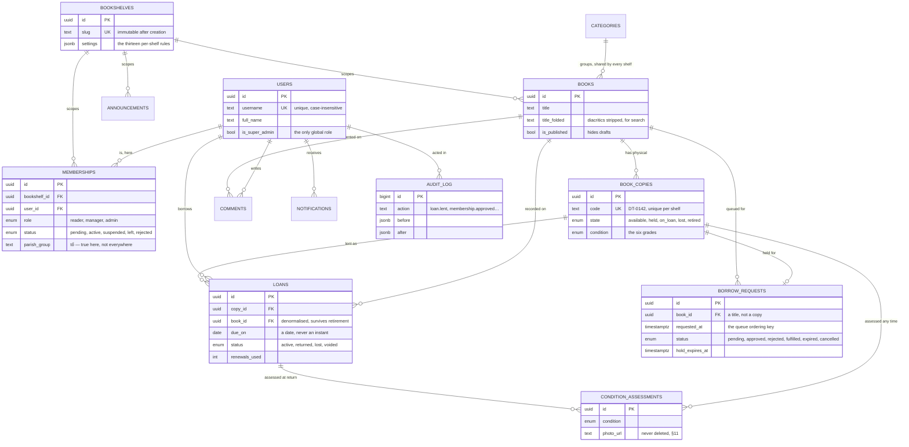
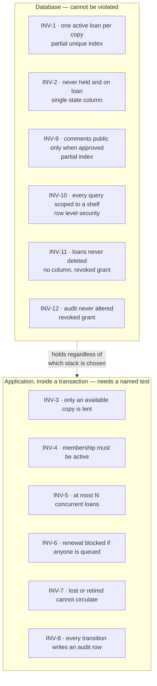

# OLibra — Database Design

**Status:** Proposed. Derived from [BUSINESS-REQUIREMENTS.md](BUSINESS-REQUIREMENTS.md), which is the authority. Where this document and that one disagree, that one wins.

**Engine:** PostgreSQL 16 or later. The engine is the likely choice but not yet formally settled; the *hosting* and the *application stack* are both open. Deployment is expected to be Docker.

Everything below is standard PostgreSQL and assumes no managed-provider feature. Where a decision would differ between a self-hosted container and a managed service, that is called out rather than assumed.

---

## At a glance

Before the column lists, the relationships. Read the crow's feet as "many".



Four things in that diagram are decisions rather than description, and each is
explained where its table is defined:

- **`LOANS` points at both a copy and a book.** Deliberate denormalisation
  (§4.5): statistics must survive the copy being retired.
- **`BORROW_REQUESTS` points at a book, and only optionally at a copy.** A
  request is for a title; a copy is assigned on approval (§4.6).
- **`CONDITION_ASSESSMENTS` hangs off both a copy and a loan**, the loan being
  optional, because a manager may assess a copy at any time (§4.7).
- **`MEMBERSHIPS` carries the parish fields, not `USERS`.** Identity is global;
  the parish relationship is local (§4.1).

### Where each guarantee lives

The same picture, drawn by who enforces what. This is the distinction §1 says
is the whole point of the document.



Six and six. The six on the right are the ones that will break first, which is
why §6 of the requirements asks for a named test per rule and why the
concurrency test described in SDD.md §9 matters more than it looks.

---

## 1. What this document is for

It defines the tables, the constraints, and — more importantly — **which guarantees live in the database rather than in application code**.

That distinction is the whole point. §6 of the requirements lists twelve business rules and says of the first one that it "must be guaranteed by the datastore, not by application checks, because two managers can lend the same copy in the same second". A rule enforced only in application code is a rule that holds until someone writes a second code path, or until two requests interleave. A rule enforced by a constraint holds always, including from a psql prompt at two in the morning.

So each of the twelve rules below is marked with where it is enforced. Six of them can be made structural. The rest cannot, and this document says plainly which and why, rather than implying the database will catch everything.

---

## 2. Conventions

| Concern | Decision |
|---|---|
| Primary keys | `uuid` generated with `gen_random_uuid()` (pgcrypto, built in since PG13) |
| Timestamps | `timestamptz`, always. Never `timestamp` — a naive timestamp is a bug waiting for a deployment region change |
| Dates | `date` where the domain means a day, not an instant. See §4.5 |
| Money | None. There are no fines and no payments (§19, deliberately not planned) |
| Text | `text` throughout. `varchar(n)` buys nothing in Postgres and invites arbitrary limits |
| Enums | Postgres `enum` types, not check constraints or lookup tables. See §2.1 |
| Naming | `snake_case`, tables plural, foreign keys `<singular>_id` |
| Every table | `created_at timestamptz not null default now()`, and `updated_at` where the row is mutable |
| Soft delete | `deleted_at timestamptz` on the tables §11 permits, and only those |

### 2.1 Why enums rather than lookup tables

The state machines in §7 are closed sets defined by the product, not data the users administer. A `book_copy_state` will never gain a value because a parish wants one. An enum makes an invalid state unrepresentable and costs one migration to extend, which is the right trade for a set that changes once a year at most.

The cost is that dropping a value requires a type rewrite. That is acceptable because states are only ever added.

### 2.2 Timezone

§4 fixes the application timezone at `Asia/Ho_Chi_Minh` regardless of where the system runs. Store instants as `timestamptz`; derive calendar days by converting explicitly:

```sql
(loan.due_on < (now() at time zone 'Asia/Ho_Chi_Minh')::date)
```

Never rely on the session `TimeZone` setting for correctness — a background job, a migration console and a web request may each carry a different one.

---

## 3. Tenancy

`bookshelf` is the tenant. §6 INV-10 calls tenant isolation "the highest-consequence property in the system" and requires it to be **structural — impossible to forget — not a matter of anyone remembering to filter**.

Two ways to honour that:

### Option A — Row Level Security (recommended)

Every tenant-scoped table gets:

```sql
alter table books enable row level security;
alter table books force row level security;

create policy books_tenant on books
  using (bookshelf_id = current_setting('olibra.bookshelf_id', true)::uuid);
```

The application sets `olibra.bookshelf_id` once per transaction. A query that forgets its `where` clause returns nothing rather than another parish's readers.

**Why this is the recommendation:** it survives a change of application stack, an ORM upgrade, a raw SQL patch, and a new developer. It is the only option that makes the guarantee structural in the sense §6 demands.

**What it costs:** every connection must set the variable, which means connection poolers in transaction mode need care; `force row level security` also applies to the table owner, so migrations and admin tooling need a separate role that bypasses policies (`bypassrls`). Cross-shelf super-admin queries (§13) run as that role, deliberately and explicitly.

### Option B — a mandatory scoping layer in application code

A single data-access module that refuses to build a query without a bookshelf. Cheaper to set up, and workable — but it is exactly the "matter of developer discipline" §6 rules out, and it protects nothing reached by any other path.

**Recommendation: Option A, with Option B's scoping layer on top of it.** Belt and braces, and the belt is the one that holds.

### Global tables

`users`, `categories`, `posts` and site-wide `feedback` are not shelf-scoped and carry no policy. Categories are shared reference data every shelf draws from (§4.3), so scoping them would defeat the point. `audit_log` is scoped but with a nullable `bookshelf_id` for system-wide actions.

---

## 4. Schema

### 4.1 Identity and membership

§5.3 draws a distinction that is easy to get wrong and expensive to unpick later: **facts true of a person everywhere** live on the person; **facts about that person's relationship to one parish** live on the membership. If a family moves and joins another bookshelf, their identity is reused and only the parish details are entered again.

```sql
create table users (
  id              uuid primary key default gen_random_uuid(),
  username        text not null,
  password_hash   text not null,
  saint_name      text,                    -- tên thánh
  full_name       text not null,
  date_of_birth   date,
  father_name     text,
  mother_name     text,
  phone           text,
  email           text,                    -- optional; §4 assumption 2, no outbound email in v1
  display_name    text,
  locale          text not null default 'vi',
  avatar_url      text,
  is_super_admin  boolean not null default false,
  created_at      timestamptz not null default now(),
  updated_at      timestamptz not null default now(),
  deleted_at      timestamptz
);

create unique index users_username_key on users (lower(username)) where deleted_at is null;
```

Username is unique case-insensitively among live rows. A deleted user does not hold their name hostage.

`email` is nullable on purpose. §4 assumption 2 states there is no outbound email in v1 and manager-issued password reset is the only recovery path; collecting the address anyway means email reset can be switched on later without touching existing accounts.

```sql
create type membership_role   as enum ('reader', 'manager', 'admin');
create type membership_status as enum ('pending', 'active', 'suspended', 'left', 'rejected');

create table memberships (
  id                uuid primary key default gen_random_uuid(),
  bookshelf_id      uuid not null references bookshelves(id) on delete restrict,
  user_id           uuid not null references users(id)       on delete restrict,
  role              membership_role   not null default 'reader',
  status            membership_status not null default 'pending',

  -- parish facts: true of this person *here*, not everywhere
  parish_group      text,                  -- tổ
  parish_community  text,                  -- giáo họ

  approved_by       uuid references users(id),
  approved_at       timestamptz,
  rejection_reason  text,
  suspension_reason text,
  manager_notes     text,                  -- private to managers
  leaderboard_opt_in boolean not null default true,

  created_at        timestamptz not null default now(),
  updated_at        timestamptz not null default now(),
  deleted_at        timestamptz,

  constraint memberships_one_per_shelf unique (bookshelf_id, user_id),
  constraint memberships_rejected_has_reason
    check (status <> 'rejected' or rejection_reason is not null)
);
```

`memberships_one_per_shelf` enforces §4 assumption 8: **a person has at most one role per bookshelf.** Roles are hierarchical (`admin` ⊃ `manager` ⊃ `reader`), so one row with the highest role is sufficient and two rows would be ambiguous.

The membership row *is* the registration record (§5.1). There is no separate application table; a pending membership is a pending application, and rejecting it sets `status = 'rejected'` with a reason retained for audit (§2).

`on delete restrict` rather than `cascade` everywhere a person is referenced: §11 says a person with any audit trail can never be removed, and the database should refuse rather than quietly comply.

### 4.2 The shelf

```sql
create type bookshelf_status as enum ('active', 'archived');

create table bookshelves (
  id            uuid primary key default gen_random_uuid(),
  slug          text not null unique,
  name          text not null,
  description   text,
  location      text,                      -- physical location, shown publicly
  address       text,
  keeper_name   text,
  keeper_phone  text,                      -- shown publicly, tappable
  opening_hours text,                      -- free text: "Mở sau lễ Chúa nhật · 9:00 đến 11:00"
  cover_url     text,
  timezone      text not null default 'Asia/Ho_Chi_Minh',
  locale        text not null default 'vi',
  status        bookshelf_status not null default 'active',
  settings      jsonb not null default '{}'::jsonb,
  established_on date,
  created_by    uuid references users(id),
  created_at    timestamptz not null default now(),
  updated_at    timestamptz not null default now(),
  deleted_at    timestamptz
);
```

**`slug` is immutable after creation** (§16.4) because it appears in links people have already shared. Enforce with a trigger rather than trusting the UI:

```sql
create or replace function forbid_slug_change() returns trigger as $$
begin
  if new.slug is distinct from old.slug then
    raise exception 'bookshelf slug is immutable once created';
  end if;
  return new;
end $$ language plpgsql;
```

**`settings` is `jsonb`, not thirteen columns.** §5.5 lists thirteen per-shelf settings and says "adding a setting must never be a disruptive change". Thirteen columns would mean a migration and a deploy for each new one. The trade-off is no type checking at the database level, so the application validates the shape and supplies defaults for missing keys — the defaults table in §5.5 is the source of truth, and a shelf row need only store what it overrides.

### 4.3 Categories

**Categories are global reference data, not tenant data.** That is a decision
rather than something the requirements settled — see the reasoning below.

```sql
create table categories (
  id         uuid primary key default gen_random_uuid(),
  name       text not null,
  slug       text not null unique,
  sort_order integer not null default 0,
  created_at timestamptz not null default now(),
  updated_at timestamptz not null default now(),
  deleted_at timestamptz
);
```

Seeded with one list every shelf draws from:

```sql
insert into categories (slug, name, sort_order) values
  ('van-hoc-thieu-nhi',    'Văn học thiếu nhi',    10),
  ('van-hoc-viet-nam',     'Văn học Việt Nam',     20),
  ('van-hoc-nuoc-ngoai',   'Văn học nước ngoài',   30),
  ('truyen-tranh',         'Truyện tranh',         40),
  ('tho',                  'Thơ',                  50),
  ('lich-su',              'Lịch sử',              60),
  ('dia-ly',               'Địa lý',               70),
  ('khoa-hoc-thuong-thuc', 'Khoa học thường thức', 80),
  ('ky-nang-song',         'Kỹ năng sống',         90),
  ('sach-dao',             'Sách đạo',            100),
  ('tu-dien-tra-cuu',      'Từ điển, tra cứu',    110),
  ('khac',                 'Khác',                999);
```

**Why global rather than one set per shelf.** The requirements do not say. §5.1
does not list Category among the entities at all; it appears only as a field on
Book (§5.4), as a catalogue filter (§16.1), and in the deletion policy (§11). So
this is ours to decide, and the reasoning is:

- **§11 lists "categories" among the soft-deletable things.** Something that can
  be soft-deleted is a row, not an enum value compiled into the application.
  That is textual evidence in the requirements, not an inference about what
  would be tidy.
- **A table rather than an enum means adding one needs no deploy.** Whoever
  administers this is not necessarily a developer, and *Sách đạo* is a category
  a parish shelf wants on its first day.
- **Shared rather than per-shelf keeps cross-shelf statistics addable**
  (Phase 3, §1.4). If every shelf carries its own *Văn học thiếu nhi* row,
  aggregating across shelves degrades into matching strings.

**What it costs, and the answer.** A shelf cannot invent a category of its own.
In exchange the catalogue filter offers only the categories that actually have
books on *that* shelf, so an unused one is invisible rather than clutter:

```sql
select distinct c.*
from categories c
join books b on b.category_id = c.id
where b.bookshelf_id = $1
  and b.is_published
  and b.deleted_at is null
  and c.deleted_at is null
order by c.sort_order;
```

If a shelf ever genuinely needs a private category, the migration is additive: a
nullable `bookshelf_id` where `null` means shared. Nothing above changes.

`sort_order` exists so the list reads sensibly rather than alphabetically —
*Khác* belongs at the bottom wherever the alphabet would put it.

### 4.4 Books and copies

```sql
create table books (
  id             uuid primary key default gen_random_uuid(),
  bookshelf_id   uuid not null references bookshelves(id) on delete restrict,
  category_id    uuid references categories(id) on delete set null,
  title          text not null,
  title_folded   text not null,             -- see §5, search
  slug           text not null,
  author         text,
  author_folded  text not null default '',
  publisher      text,
  published_year integer,
  isbn           text,
  page_count     integer,
  description    text,
  cover_url      text,
  language       text not null default 'vi',
  is_published   boolean not null default true,   -- hides drafts from the public
  added_by       uuid references users(id),
  created_at     timestamptz not null default now(),
  updated_at     timestamptz not null default now(),
  deleted_at     timestamptz,
  unique (bookshelf_id, slug)
);
```

```sql
create type copy_state     as enum ('available', 'held', 'on_loan', 'lost', 'retired');
create type copy_condition as enum
  ('perfect', 'slightly_worn', 'worn', 'torn', 'missing_pages', 'written_on');

create table book_copies (
  id              uuid primary key default gen_random_uuid(),
  bookshelf_id    uuid not null references bookshelves(id) on delete restrict,
  book_id         uuid not null references books(id)       on delete cascade,
  code            text not null,             -- 'DT-0142', intended to become a QR label
  state           copy_state not null default 'available',
  condition       copy_condition not null default 'perfect',
  condition_note  text,
  acquired_on     date,
  acquired_from   text,
  retired_at      timestamptz,
  retired_reason  text,
  lost_reported_at timestamptz,
  created_at      timestamptz not null default now(),
  updated_at      timestamptz not null default now(),
  deleted_at      timestamptz,

  constraint book_copies_code_unique unique (bookshelf_id, code),
  constraint book_copies_retired_has_reason
    check (state <> 'retired' or retired_reason is not null)
);
```

`on delete cascade` from `books` is the one cascade in the schema, and it is deliberate: §5.2 says a copy has no meaning without its title, and §11 says only a book's copies follow it when the book goes. A book with loan history cannot be deleted anyway — the loan's foreign key restricts it.

**The copy has one `state` column, and that is what enforces INV-2.** A copy cannot be simultaneously held and on loan because it cannot hold two values. Modelling this as two booleans would make the impossible state representable, and something would eventually represent it.

`condition` is a flat single choice, not a grade plus damage flags. §9 records that the rigorous model was considered and rejected for v1: a single row of large buttons is dramatically easier for a child to use, and the optional photograph captures what the list cannot. Moving to multi-select later is purely additive — a new table, no change here.

Note that `lost` is a **state**, not a condition (§2, §9). Losing a book removes it from circulation; a torn book keeps circulating. They belong on different axes and conflating them makes "is this borrowable" unanswerable.

### 4.5 Loans

```sql
create type loan_status as enum ('active', 'returned', 'lost', 'voided');

create table loans (
  id                uuid primary key default gen_random_uuid(),
  bookshelf_id      uuid not null references bookshelves(id) on delete restrict,
  copy_id           uuid not null references book_copies(id) on delete restrict,
  book_id           uuid not null references books(id)       on delete restrict,
  borrower_id       uuid not null references users(id)       on delete restrict,
  request_id        uuid references borrow_requests(id),

  lent_by           uuid not null references users(id),
  lent_at           timestamptz not null default now(),
  due_on            date not null,

  status            loan_status not null default 'active',

  returned_at       timestamptz,
  received_by       uuid references users(id),
  return_condition  copy_condition,
  return_note       text,
  return_photo_url  text,

  renewals_used     integer not null default 0,

  lost_reported_at  timestamptz,
  lost_reported_by  uuid references users(id),

  voided_at         timestamptz,
  voided_by         uuid references users(id),
  void_reason       text,

  notes             text,
  created_at        timestamptz not null default now(),
  updated_at        timestamptz not null default now(),

  constraint loans_voided_has_reason
    check (status <> 'voided' or void_reason is not null),
  constraint loans_returned_has_condition
    check (status <> 'returned' or return_condition is not null)
);
```

**`due_on` is a `date`.** §5.4 is emphatic about this and it is worth repeating: a book is due at the end of a day, not at 14:23 on that day. A timestamp would make a book overdue mid-afternoon, which is confusing for a child and simply wrong for a shelf that only opens after Sunday mass.

**`book_id` is stored on the loan even though it is reachable through `copy_id`.** This is deliberate denormalisation, mandated by §5.4: statistics must survive the copy being retired or deleted. Without it, "most borrowed titles" breaks the first time a copy is withdrawn.

**There is no `deleted_at`.** §11 forbids it: a loan is never deleted, and a mistake is recorded as `voided` with a reason. Voiding returns the copy to `available` (§7.1) but leaves the record.

**There is no `is_overdue` column, and there must never be one.** §8 makes this a load-bearing rule: overdue status is computed on read from `due_on` and the current clock. Any status a background job must *write* is stale, and therefore wrong, for as long as the job takes to run again. See §6 below for the read-time view.

### 4.6 Requests and holds

```sql
create type request_status as enum
  ('pending', 'approved', 'rejected', 'fulfilled', 'expired', 'cancelled');

create table borrow_requests (
  id               uuid primary key default gen_random_uuid(),
  bookshelf_id     uuid not null references bookshelves(id) on delete restrict,
  book_id          uuid not null references books(id)       on delete cascade,
  copy_id          uuid references book_copies(id),          -- assigned on approval

  member_id        uuid references users(id),                -- a member…
  guest_name       text,                                     -- …or a guest
  guest_phone      text,
  guest_note       text,
  guest_hash       text,                                     -- rate limiting, §2

  status           request_status not null default 'pending',
  requested_at     timestamptz not null default now(),       -- the queue ordering key

  decided_by       uuid references users(id),
  decided_at       timestamptz,
  decision_note    text,
  hold_expires_at  timestamptz,

  fulfilled_loan_id uuid references loans(id),
  cancelled_at     timestamptz,

  created_at       timestamptz not null default now(),
  updated_at       timestamptz not null default now(),
  deleted_at       timestamptz,

  constraint borrow_requests_has_requester
    check (member_id is not null or guest_name is not null)
);
```

`borrow_requests_has_requester` enforces §5.4's "a request must have either a member or a guest name" at the database, because a request belonging to nobody is unactionable.

The request targets a **title**, not a copy (§5.4). A copy is assigned only on approval. **The queue is simply the set of pending requests for a title ordered by `requested_at`** — there is no separate reservation table, and §7.2 says so explicitly.

Guest requests create a lead, not an account (§4 assumption 5). A manager reviews and converts them. `guest_hash` holds a hashed identifier for rate limiting, because §2 correctly identifies an anonymous form on the public internet as a spam vector.

### 4.7 Condition assessments

```sql
create table condition_assessments (
  id           uuid primary key default gen_random_uuid(),
  bookshelf_id uuid not null references bookshelves(id) on delete restrict,
  copy_id      uuid not null references book_copies(id) on delete restrict,
  loan_id      uuid references loans(id),                  -- null if assessed outside a return
  assessed_by  uuid not null references users(id),
  condition    copy_condition not null,
  note         text,
  photo_url    text,
  assessed_at  timestamptz not null default now()
);
```

A separate table rather than columns on the loan, because §5.4 notes a manager may assess a copy at any time, not only at return. No `deleted_at`: §11 lists condition assessments among the things never deleted, since each is a historical fact about an object.

### 4.8 Community

```sql
create type comment_status as enum ('pending', 'approved', 'rejected', 'hidden');

create table comments (
  id            uuid primary key default gen_random_uuid(),
  bookshelf_id  uuid not null references bookshelves(id) on delete restrict,
  book_id       uuid not null references books(id)       on delete cascade,
  author_id     uuid not null references users(id)       on delete restrict,
  body          text not null,                -- plain text; rendered escaped
  status        comment_status not null default 'pending',
  moderated_by  uuid references users(id),
  moderated_at  timestamptz,
  moderation_note text,
  created_at    timestamptz not null default now(),
  updated_at    timestamptz not null default now(),
  deleted_at    timestamptz
);

create index comments_public on comments (book_id, created_at desc)
  where status = 'approved' and deleted_at is null;
```

`author_id` is `not null`: §5.4 says no guest comments. The body is plain text and rendered escaped — no rich text, no HTML, which removes an entire class of injection problem from a system whose authors are children.

The partial index matches the only query the public ever runs, and encodes INV-9 in the access path: a comment is publicly visible only when approved.

```sql
create table announcements (
  id            uuid primary key default gen_random_uuid(),
  bookshelf_id  uuid not null references bookshelves(id) on delete restrict,
  title         text not null,
  slug          text not null,
  body          text not null,               -- rich
  body_text     text not null,               -- plain derivation, for excerpts and search
  is_pinned     boolean not null default false,
  published_at  timestamptz,                 -- null means draft
  expires_at    timestamptz,
  author_id     uuid references users(id),
  created_at    timestamptz not null default now(),
  updated_at    timestamptz not null default now(),
  deleted_at    timestamptz,
  unique (bookshelf_id, slug)
);

create table posts (                          -- global blog, not shelf-scoped
  id           uuid primary key default gen_random_uuid(),
  title        text not null,
  slug         text not null unique,
  excerpt      text,
  body         text not null,
  body_text    text not null,
  cover_url    text,
  published_at timestamptz,
  author_id    uuid references users(id),
  created_at   timestamptz not null default now(),
  updated_at   timestamptz not null default now(),
  deleted_at   timestamptz
);

create type feedback_status as enum ('new', 'read', 'resolved');

create table feedback (
  id            uuid primary key default gen_random_uuid(),
  bookshelf_id  uuid references bookshelves(id),   -- null for site-wide
  member_id     uuid references users(id),
  guest_name    text,
  guest_contact text,
  guest_hash    text,                              -- rate limiting
  subject       text not null,
  body          text not null,
  status        feedback_status not null default 'new',
  handled_by    uuid references users(id),
  handled_at    timestamptz,
  created_at    timestamptz not null default now()
);
```

`feedback` has no `deleted_at` — §11 lists it among the never-deleted.

### 4.9 Notifications

§15 specifies in-app notifications to readers, surfaced as a bell with an unread count, and explicitly **nothing pushed to managers** — they work from dashboard badge counts, which avoids notification fatigue for volunteers and removes any dependency on timely background work.

```sql
create table notifications (
  id           uuid primary key default gen_random_uuid(),
  bookshelf_id uuid not null references bookshelves(id) on delete restrict,
  user_id      uuid not null references users(id)       on delete restrict,
  kind         text not null,                 -- 'loan_due_soon', 'request_approved', …
  payload      jsonb not null default '{}'::jsonb,
  read_at      timestamptz,
  created_at   timestamptz not null default now()
);

create index notifications_unread on notifications (user_id, created_at desc)
  where read_at is null;
```

The message text is **not** stored. `kind` plus `payload` is rendered through the translation layer at read time, so §18's rule that no user-facing string is ever hard-coded still holds, and a wording fix does not require rewriting history.

### 4.10 Audit log

```sql
create table audit_log (
  id           bigint generated always as identity primary key,
  bookshelf_id uuid references bookshelves(id),   -- null for global actions
  actor_id     uuid references users(id),         -- null for system actions
  action       text not null,                     -- 'loan.lent', 'membership.approved', …
  entity_type  text not null,
  entity_id    uuid,
  before       jsonb,
  after        jsonb,
  context      jsonb not null default '{}'::jsonb, -- address, device, screen
  occurred_at  timestamptz not null default now()
);

create index audit_log_actor  on audit_log (actor_id, occurred_at desc);
create index audit_log_shelf  on audit_log (bookshelf_id, occurred_at desc);
create index audit_log_entity on audit_log (entity_type, entity_id, occurred_at desc);
```

`audit_log_actor` exists because §14 names "what has manager A been doing" a headline requirement that must be fast.

`bigint identity` rather than uuid: this is the highest-volume table, it is only ever appended and read in time order, and a monotonic key keeps the index dense.

**Append-only is enforced by permission, not convention** — INV-12 says audit records are never changed or removed:

```sql
revoke update, delete, truncate on audit_log from application_role;
```

The application role can `insert` and `select`, nothing else. A rule enforced by a `GRANT` cannot be bypassed by a careless migration or an ORM's `save()`.

§14 also requires that audit records are written **in the same transaction** as the change they describe, so an audit record and its subject can never diverge, and that auditing is never deferred to a background job — an audit trail that can be lost to a failed job is not an audit trail.

---

## 5. Search

§12: a child typing `tim kiem kho bau` on a phone without diacritics must find *Tìm Kiếm Kho Báu*. Diacritic-insensitive, case-insensitive substring matching over title and author. At a few hundred books per shelf, nothing more elaborate is warranted — no full-text search, no trigram index, no external engine.

The requirement that matters most is the last sentence of §12: **whatever normalisation is applied when storing a title must be the identical normalisation applied to the search term, so the two can never drift.**

The UI already implements this in `src/lib/search.ts`: strip combining marks, map `đ` to `d`, lowercase, fold punctuation to spaces. The database must fold identically.

```sql
create extension if not exists unaccent;

create or replace function olibra_fold(value text)
returns text
language sql
immutable
parallel safe
as $$
  select trim(regexp_replace(
    lower(translate(unaccent(value), 'đĐ', 'dD')),
    '[^a-z0-9]+', ' ', 'g'
  ))
$$;
```

Then a generated column and an index over it:

```sql
alter table books
  add column title_folded text
    generated always as (olibra_fold(title)) stored;
```

**Two traps worth naming, because both bite quietly:**

1. **`unaccent` is not marked `IMMUTABLE`** in a default installation — it is `STABLE`, because it depends on a dictionary that could in principle change. A `STABLE` function cannot be used in a generated column or a functional index. The wrapper above declares `IMMUTABLE`, which is a promise the author is making; it holds as long as nobody edits the unaccent rules file. If that promise is uncomfortable, the alternative is a plain column maintained by a trigger, which is uglier but makes no claim it cannot keep.

2. **`unaccent` does not reliably fold `đ` to `d`.** Vietnamese `đ` is a distinct letter, not a `d` with a diacritic, and depending on the rules file version it may pass through untouched. The explicit `translate()` above handles it and must not be removed. This is the single most likely cause of "why does searching *dat rung* not find *Đất Rừng Phương Nam*".

**Verification step for whoever implements this:** the folding must be tested against the application's implementation with the same inputs, and the two kept in sync by a test, not by hope. Suggested cases: `Dế Mèn Phiêu Lưu Ký`, `Đất Rừng Phương Nam`, `Totto-chan Bên Cửa Sổ` (the hyphen), `Kính Vạn Hoa tập 4` (the digit).

---

## 6. Derived state

§8 is a load-bearing rule and the most likely thing to be quietly violated under delivery pressure: **overdue status, hold expiry and availability are computed on read, from stored data and the current clock. They are never written by a scheduled job.**

The reasoning is worth restating because it is not obvious: any status a background job must *write* is stale, and therefore wrong, for as long as the job takes to run again. A reader would see a book as available that was lent twenty minutes ago; a manager's overdue list would omit books that became overdue at midnight. Computing on read keeps the system correct even if background work is broken entirely.

Express these as views, so no caller can forget the rule:

```sql
create view loans_current as
select
  l.*,
  (l.status = 'active'
   and l.due_on < (now() at time zone 'Asia/Ho_Chi_Minh')::date) as is_overdue,
  (l.due_on - (now() at time zone 'Asia/Ho_Chi_Minh')::date)     as days_remaining
from loans l;

create view copies_borrowable as
select c.*
from book_copies c
where c.state = 'available'
  and c.deleted_at is null
  and not exists (
    select 1 from borrow_requests r
    where r.copy_id = c.id
      and r.status = 'approved'
      and r.hold_expires_at > now()
  );
```

`copies_borrowable` is the direct expression of §8's "a copy is borrowable when it is available and no unexpired hold references it".

**What background work is still for:** image processing, cache warming, backups, and tidying up expired holds as housekeeping rather than as correctness. If the tidy-up never runs, `copies_borrowable` is still right, because the hold expiry is compared against `now()` rather than trusted from a column somebody was meant to update.

---

## 7. Where each business rule is enforced

This is the table to read before writing any application code.

| # | Rule | Enforced by | How |
|---|---|---|---|
| **INV-1** | A copy has at most one active loan | **Database** | Partial unique index, §7.1 |
| **INV-2** | A copy cannot be both held and on loan | **Database** | Single `state` enum column — the state is unrepresentable |
| **INV-3** | Only an available copy can be lent, or a held copy collected by its holder | Application, in a transaction | Requires reading the hold's owner; not expressible as a constraint |
| **INV-4** | A reader whose membership is not active cannot start a new loan | Application | Cross-table condition |
| **INV-5** | At most `max_concurrent_loans` active loans per reader per shelf | Application, in a transaction | Requires an aggregate; see §7.2 |
| **INV-6** | Renewal only if renewals remain **and** no request is queued for that title | Application | Cross-table condition |
| **INV-7** | A lost or retired copy cannot be lent or held | Application + partial index | The index in §7.1 also excludes these states |
| **INV-8** | Every state transition writes an audit record | Application, same transaction | See §4.10 |
| **INV-9** | A comment is publicly visible only when approved | **Database** (access path) | Partial index, §4.8 |
| **INV-10** | Every query scoped to one bookshelf | **Database** | Row Level Security, §3 |
| **INV-11** | A loan is never deleted | **Database** | No `deleted_at` column exists; `revoke delete` |
| **INV-12** | Audit records never change or disappear | **Database** | `revoke update, delete`, §4.10 |

Six of twelve are structural. The other six need application discipline **inside a transaction**, and each needs the named test §6 requires.

### 7.1 INV-1, the one that must be a constraint

§6 says this must be guaranteed by the datastore because two managers can lend the same copy in the same second, at the same physical shelf, from two phones — and §2 lists exactly that scenario as a real risk.

```sql
create unique index loans_one_active_per_copy
  on loans (copy_id)
  where status = 'active';
```

A partial unique index is the whole mechanism. The second transaction to commit fails with a unique violation, which the application translates into a plain Vietnamese message — §2 requires that one of them "must fail cleanly and see a plain message, never a silently corrupted record".

An application-level `select … then insert` cannot achieve this at any isolation level below `serializable`, and even then it converts the problem into a serialisation failure that must be retried. The index is simpler and always correct.

### 7.2 INV-5, and why it is not a constraint

The limit is per reader per shelf, configurable per shelf, and requires counting rows. Postgres has no multi-row check constraint.

Three options, in descending order of preference:

1. **Application check inside the same transaction as the insert, at `repeatable read` or above.** Simple, testable, and the failure window is narrow — the same reader would have to be lent two books simultaneously by two managers, which is far less likely than two managers touching the same *copy*.
2. **A `before insert` trigger** that counts and raises. Moves the rule into the database, at the cost of hiding it from application developers and making it hard to test.
3. **A counter column on `memberships` with a check constraint**, maintained by trigger. Denormalisation, drift risk, and it contradicts §8's spirit.

**Recommendation: option 1**, with the named test §6 requires and an honest note that a determined race could exceed the limit by one. That is a much cheaper failure than a corrupted loan record, and a manager can void the extra loan.

---

## 8. Indexes

Beyond the primary keys, unique constraints and partial indexes already shown:

```sql
-- the manager's most frequent screens
create index loans_active_by_shelf on loans (bookshelf_id, due_on)
  where status = 'active';
create index loans_by_borrower     on loans (borrower_id, lent_at desc);
create index copies_by_book        on book_copies (book_id) where deleted_at is null;
create index copies_by_state       on book_copies (bookshelf_id, state)
  where deleted_at is null;

-- the queue, ordered by request time (§7.2)
create index requests_queue on borrow_requests (book_id, requested_at)
  where status = 'pending';
create index requests_holds on borrow_requests (hold_expires_at)
  where status = 'approved';

-- search (§5)
create index books_title_folded  on books using gin (title_folded gin_trgm_ops);
create index books_author_folded on books using gin (author_folded gin_trgm_ops);

-- the public catalogue
create index books_public on books (bookshelf_id, title)
  where is_published and deleted_at is null;
```

The two `gin_trgm_ops` indexes need `pg_trgm` and support the `%` and `LIKE '%…%'` patterns that substring search requires. At a few hundred books per shelf a sequential scan would honestly be fine; the indexes are cheap insurance for the shelf that grows to a few thousand.

Every index above is partial where the query is partial. An index that includes soft-deleted rows makes the planner's job harder and the index larger for no benefit.

---

## 9. Migrations and seed

**Migrations are forward-only and each is reversible in principle but never rolled back in production.** The actual safety net is testing every migration against a restored copy of production data before it runs for real — trivial with Docker, since a throwaway container seeded from a dump costs nothing:

```bash
docker run --rm -e POSTGRES_PASSWORD=x -v "$PWD/dump.sql:/dump.sql" postgres:16
```

If a managed provider is chosen later and it offers database branching, that is a faster route to the same check, not a different one.

Rules:

- One migration per change, named with a timestamp and a verb: `20260810_add_notifications_table`.
- Never edit a migration that has run anywhere but a local machine.
- Data migrations are separate from schema migrations, so a slow backfill does not hold a table lock.
- Adding a column: always nullable or with a default, never `not null` without a default on a populated table.
- Renaming a column is two deploys: add, backfill, switch reads, drop. There is no shortcut that does not break the running application.

**Seed data** should create one bookshelf matching the design fixtures — Tủ sách Đồng Tháp, the books and readers already used in `src/lib/fixtures.ts` — so the UI can be pointed at a real database with no visible change. That equivalence is worth preserving deliberately: it makes the transition from fixtures to database a configuration change rather than a rewrite.

---

## 10. Export and backup

§2 names data export as insurance and puts CSV export of books, readers and loans in Phase 1: "volunteers plus modest infrastructure is a meaningful data-loss risk".

This is a read-only concern and needs no schema. Three queries, each scoped to one shelf, each streamed rather than buffered. The manager settings screen already carries the three buttons.

**Backups depend on where this ends up running, and the choice must be made deliberately rather than discovered after an incident.**

| Hosting | Mechanism | What it needs |
|---|---|---|
| Self-hosted Docker | Continuous archiving with `pgBackRest` or `WAL-G` to object storage, plus a nightly `pg_dump` as a belt-and-braces logical copy | A named volume for `PGDATA` that is not inside the container, an archive target off the host, and a restore rehearsed at least once |
| Managed service | The provider's point-in-time restore | Confirming the retention window is longer than the time it takes anyone to notice a problem |

A `docker compose` setup with the data directory in an anonymous volume is a data-loss incident waiting for its first `docker compose down -v`. Name the volume, and put the archive somewhere the host cannot take with it.

Worth stating explicitly what backups do not cover either way: an application bug that deletes rows within the retention window is recoverable; one that quietly writes wrong values for a month is not. The audit log is the mitigation, which is another reason INV-12 matters.

---

## 11. Running it in Docker

Three extensions are used: `pgcrypto` (for `gen_random_uuid`), `unaccent` and `pg_trgm` (both for search, §5). All three ship in `postgresql-contrib`, which the official `postgres` image already includes — so `create extension` works out of the box and no custom image is needed.

Two things that are easy to get wrong and painful later:

- **Locale.** Initialise the cluster with a UTF-8 locale. `POSTGRES_INITDB_ARGS="--locale=C.UTF-8 --encoding=UTF8"` is a safe default. Text sorting for Vietnamese is not something to leave to whatever the base image happened to pick, and changing it afterwards means a dump and reload.
- **Version pinning.** Pin the minor tag (`postgres:16.4`, not `postgres:16`). A silent major upgrade on `docker compose pull` will refuse to start against an existing data directory, which is the good outcome; the bad one is discovering that at deploy time.

## 12. What this document does not decide

- **The application stack.** Nothing here depends on it. Any candidate must be able to run multiple statements in one transaction, set a session variable per transaction (for RLS), and surface a unique-violation error distinguishably so INV-1 can be translated into a friendly message.
- **Whether Postgres is final.** If it is not: the schema is ordinary SQL and would port, but four things would need replacing — the partial unique index that enforces INV-1 (§7.1), Row Level Security (§3), `jsonb` settings (§4.2), and the folding function (§5). Those four are where the design leans on Postgres specifically, and INV-1 is the one with no comfortable substitute.
- **The ORM, or whether to use one.** If one is used it must not fight RLS, and it must not silently issue `update` on `audit_log`.
- **Connection pooling.** Relevant to RLS: a pooler in *transaction* mode is compatible with `set local`, a pooler in *session* mode is not. Choose before writing the data layer, not after.
- **Whether `settings` should later become columns.** If the shape stabilises, promoting hot keys to columns is a straightforward migration.

## 13. Open questions

1. **Full name display.** §4 assumption 6 makes public name display a per-shelf setting so it can be tightened later. The schema supports it; whether the default should be `full_name` deserves revisiting once real children's names are on a public leaderboard (§20).
2. **Retention.** Nothing in the requirements says how long audit records are kept. Append-only plus unbounded growth is fine for years at this volume, but the question should be answered before it becomes urgent.
3. **`guest_hash` salt rotation.** Rate limiting by hashed identifier is specified; how the salt is managed is not. Rotating it resets everyone's limit, which may be acceptable.
