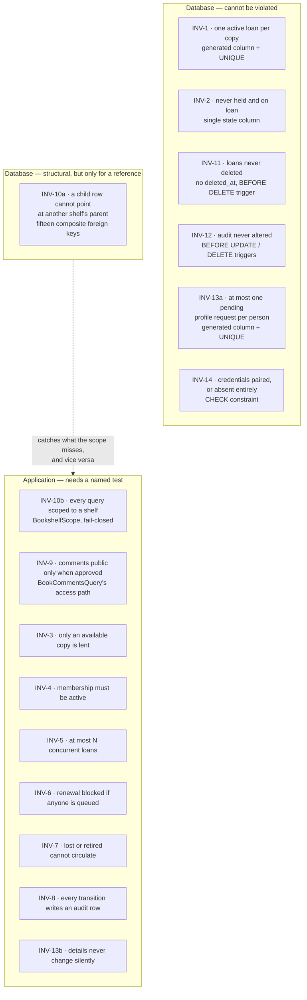

# OLibra — Database Design

**Status:** Current as of 2026-09-01. Describes the schema that ships. Derived from [BUSINESS-REQUIREMENTS.md](BUSINESS-REQUIREMENTS.md), which remains the authority on what the business needs; where this document and that one disagree about a *rule*, that one wins.

**Engine:** MariaDB 10.11, shipped. The schema below is what `database/migrations/` creates; where this document and a migration disagree, **the migration wins**. Verified against `10.11.19-MariaDB-ubu2204` (`SELECT VERSION()`).

**Access layer:** Laravel 13 + Eloquent. There is no ORM-agnostic data layer: the tenant boundary, the soft-delete filter and the invariant translations all live in Eloquent models, scopes and Actions under `app/`.

## How to read this document, and how it was checked

Every count and every identifier below was produced by a query against a fully migrated database in this session, not recalled. The two databases on `laravel-mariadb-1` are `olibra` (development) and `olibra_testing` (the suite's); the figures here come from `olibra_testing`, which has all **30** migrations applied — `olibra` was one behind at the time of writing, missing only `2026_09_01_000001_add_feedback_rate_limit_index`.

The shape of the check, for anyone repeating it:

```bash
docker exec laravel-mariadb-1 mysql -uroot -psecret olibra_testing -N -e \
  "SELECT COUNT(*) FROM information_schema.COLUMNS
   WHERE TABLE_SCHEMA='olibra_testing' AND EXTRA LIKE '%GENERATED%';"
```

**This document is history-bearing in one respect and it should be read that way.** The system was originally built on Next.js + PostgreSQL 16 with Drizzle, and was ported to Laravel + MariaDB across phases 0–3 of 2026-08/09. Several structures below exist in the shape they do *because* of what PostgreSQL could express and MariaDB cannot — partial indexes above all. Those Postgres constructs are named where naming them explains the port; nothing described as current is PostgreSQL.

---

## At a glance

Before the column lists, the relationships. Read the crow's feet as "many".

```mermaid
erDiagram
    BOOKSHELVES  ||--o{ MEMBERSHIPS   : scopes
    BOOKSHELVES  ||--o{ BOOKS         : scopes
    BOOKSHELVES  ||--o{ ANNOUNCEMENTS : scopes
    BOOKSHELVES  ||--o{ PARISH_UNITS  : scopes
    BOOKSHELVES  ||--o{ BOOKSHELF_CONTACTS : "is contacted through"
    PARISH_UNITS ||--o{ PARISH_UNITS  : "nests under"
    PARISH_UNITS ||--o{ MEMBERSHIPS   : "level-1 unit of"
    PARISH_UNITS ||--o{ MEMBERSHIPS   : "level-2 unit of"
    USERS        ||--o{ MEMBERSHIPS   : "is, here"
    USERS        ||--o{ SESSIONS      : "signs in as"
    CATEGORIES   ||--o{ BOOKS         : "groups, shared by every shelf"
    BOOKS        ||--o{ BOOK_COPIES   : "has physical"
    BOOK_COPIES  ||--o{ LOANS         : "lent as"
    USERS        ||--o{ LOANS         : borrows
    BOOKS        ||--o{ LOANS         : "recorded on"
    BOOKS        ||--o{ BORROW_REQUESTS : "queued for"
    BOOK_COPIES  ||--o| BORROW_REQUESTS : "held for"
    LOANS        ||--o{ CONDITION_ASSESSMENTS : "assessed at return"
    BOOK_COPIES  ||--o{ CONDITION_ASSESSMENTS : "assessed any time"
    BOOKS        ||--o{ COMMENTS      : "commented on"
    USERS        ||--o{ COMMENTS      : writes
    USERS        ||--o{ NOTIFICATIONS : receives
    USERS        ||--o{ AUDIT_LOG     : "acted in"
    USERS        ||--o{ PROFILE_CHANGE_REQUESTS : proposes
    BOOKSHELVES  ||--o{ PROFILE_CHANGE_REQUESTS : "manager decides"
    MEMBERSHIPS  ||--o{ BOOK_DONATIONS : offers
    BOOKSHELVES  ||--o{ BOOK_DONATIONS : scopes

    BOOKSHELVES {
        varchar id PK "36, ascii_bin — a uuid as text"
        varchar slug "utf8mb4_bin"
        varchar slug_active "GENERATED, backs bookshelves_slug_unique"
        longtext settings "JSON — the per-shelf rules"
    }
    USERS {
        varchar id PK "36, ascii_bin"
        varchar username "utf8mb4_bin, nullable"
        varchar username_active "GENERATED, backs users_username_key"
        varchar full_name
        tinyint is_super_admin "the only global role"
    }
    SESSIONS {
        varchar id PK "sha256 of the cookie's id; the raw id is never stored"
        varchar user_id FK "nullable — a guest has a session too"
        int last_activity
    }
    MEMBERSHIPS {
        varchar id PK
        varchar bookshelf_id FK
        varchar user_id FK
        varchar role "reader, manager, admin — CHECK, not an enum type"
        varchar status "pending, active, suspended, left, rejected"
        varchar parish_unit_l1_id FK "nullable, always"
        varchar parish_unit_l2_id FK "nullable, always"
        binary member_key "GENERATED, backs memberships_one_per_shelf"
    }
    PARISH_UNITS {
        varchar id PK
        varchar bookshelf_id FK
        tinyint level "1 or 2"
        varchar parent_id FK "self-ref; null unless nested level 2"
        varchar name "admin-named, no shipped vocabulary"
        int sort_order "explicit, never parsed from name"
    }
    BOOKS {
        varchar id PK
        text title
        text title_folded "GENERATED — diacritics folded, for search"
        tinyint is_published "hides drafts"
    }
    BOOK_COPIES {
        varchar id PK
        varchar code "DT-0142, unique per shelf via code_key"
        varchar state "available, held, on_loan, lost, retired"
        varchar condition "the six grades"
        varchar acquired_from_membership_id FK "donor with an account; nullable"
    }
    LOANS {
        varchar id PK
        varchar copy_id FK
        varchar book_id FK "denormalised, survives retirement"
        date due_on "a date, never an instant"
        varchar status "active, returned, lost, voided"
        varchar active_copy_id "GENERATED, backs loans_one_active_per_copy"
        int renewals_used
    }
    BORROW_REQUESTS {
        varchar id PK
        varchar book_id FK "a title, not a copy"
        datetime requested_at "the queue ordering key"
        varchar status "pending, approved, rejected, fulfilled, expired, cancelled"
        varchar live_request_key "GENERATED, one live place per reader per title"
        datetime hold_expires_at
    }
    CONDITION_ASSESSMENTS {
        varchar id PK
        varchar condition
        text photo_url "never deleted"
    }
    AUDIT_LOG {
        bigint id PK "auto_increment — the one non-uuid key"
        varchar action "loan.lent, membership.approved…"
        longtext before "JSON"
        longtext after "JSON"
    }
    PROFILE_CHANGE_REQUESTS {
        varchar id PK
        varchar user_id FK "whose profile"
        varchar bookshelf_id FK "whose manager decides"
        longtext proposed_values "JSON — the change on offer"
        longtext previous_values "JSON — what it was when proposed"
        varchar pending_user_id "GENERATED, at most one pending per person"
    }
    BOOK_DONATIONS {
        varchar id PK
        varchar donor_membership_id FK
        varchar status "pending, received, declined"
        text description
    }
```



Six things in that diagram are decisions rather than description, and each is
explained where its table is defined. None of the six changed in the port:

- **`LOANS` points at both a copy and a book.** Deliberate denormalisation
  (§5.5): statistics must survive the copy being retired.
- **`BORROW_REQUESTS` points at a book, and only optionally at a copy.** A
  request is for a title; a copy is assigned on approval (§5.6).
- **`CONDITION_ASSESSMENTS` hangs off both a copy and a loan**, the loan being
  optional, because a manager may assess a copy at any time (§5.7).
- **`MEMBERSHIPS` carries the parish fields, not `USERS`.** Identity is global;
  the parish relationship is local (§5.1).
- **`PARISH_UNITS` references itself**, rather than there being a table per
  level. One self-referencing row shape serves a flat shelf, a two-level nested
  one, and a two-level flat one alike — nesting is data (whether `parent_id` is
  set), not a schema difference (§5.1).
- **`PROFILE_CHANGE_REQUESTS` carries the proposed values *and* the values as
  they stood when proposed.** A manager reviewing a week-old request needs to
  see what it would actually change, not what it was expected to change (§5.11).

### Where each guarantee lives

The same picture, drawn by who enforces what. This is the distinction §1 says
is the whole point of the document — **and it is the diagram the port changed
most**, because two of the guarantees that used to be structural are not any
more.



**Two rules moved leftward-to-rightward in the port, and pretending otherwise
would be the most expensive sentence in this document.**

- **INV-9** was a partial index (`where status = 'approved' and deleted_at is
  null`) whose very existence as an access path made the rule hard to bypass.
  MariaDB has no partial index, so `comments_public` is now a plain
  `(book_id, created_at)` index and the `status = 'approved'` filter is an
  ordinary `WHERE` clause in `App\Queries\BookCommentsQuery`. The rule holds
  because one query owns the read and every caller goes through it — that is
  discipline with a test behind it, not a constraint.
- **INV-10** was PostgreSQL Row Level Security, which held for any connection
  including a `psql` prompt. It is now `App\Models\Scopes\BookshelfScope`, a
  global Eloquent scope. It holds for Eloquent and for nothing else. What
  survives structurally is the *reference* half — the fifteen composite foreign
  keys of §4.2 — which no application bug can bypass.

§1's original claim was "seven of the fourteen are wholly structural". Counted
against the schema that ships, **six** are wholly structural (INV-1, INV-2,
INV-11, INV-12, INV-14, and INV-13's first half), plus INV-10's reference half.
The rest need application discipline and the named test §6 of the requirements
asks for.

---

## 1. What this document is for

It defines the tables, the constraints, and — more importantly — **which guarantees live in the database rather than in application code**.

That distinction is the whole point. §6 of the requirements lists fourteen business rules and says of the first one that it "must be guaranteed by the datastore, not by application checks, because two managers can lend the same copy in the same second". A rule enforced only in application code is a rule that holds until someone writes a second code path, or until two requests interleave. A rule enforced by a constraint holds always, including from a `mysql` prompt at two in the morning.

So each of the fourteen rules is marked in §7 with where it is enforced, honestly, including the two the port demoted.

---

## 2. Conventions

| Concern | Decision |
|---|---|
| Primary keys | `varchar(36) CHARACTER SET ascii COLLATE ascii_bin`, holding a UUID as text, generated by the application (`Str::uuid7()`). MariaDB has no `gen_random_uuid()` default and no native `uuid` type in 10.11's Laravel mapping; `ascii_bin` is what makes comparison byte equality — see §4.3 |
| The one exception | `audit_log.id` is `bigint unsigned auto_increment`, and `system_settings.id` is `tinyint unsigned` pinned to 1 |
| Timestamps | `datetime(6)`, storing UTC. **Not `timestamp`** — MariaDB's `TIMESTAMP` is a 2038-bounded epoch type with implicit timezone conversion, which is the naive-timestamp bug the original document warned about, wearing a different hat. Microsecond precision so two rows written in the same transaction order deterministically |
| Dates | `date` where the domain means a day, not an instant. See §5.5 |
| Money | None. There are no fines and no payments (§19, deliberately not planned) |
| Text | `varchar(n)` for bounded identifiers and names, `text` for prose. Unlike Postgres, MariaDB indexes a `varchar` directly and needs a prefix length for a `text` — that difference, not taste, is why the type varies |
| Enums | **Neither a MariaDB `ENUM` nor a lookup table: a `varchar(20) ascii_bin` column plus a `CHECK`.** See §2.1 |
| JSON | `json()`, which MariaDB stores as `longtext utf8mb4_bin` with an automatic `json_valid()` `CHECK`. Seven of the schema's 31 check constraints are these, added by the engine rather than by a migration |
| Naming | `snake_case`, tables plural, foreign keys `<singular>_id` |
| Every table | `created_at datetime(6) DEFAULT current_timestamp(6)`, and `updated_at ... ON UPDATE current_timestamp(6)` where the row is mutable — the engine's own clause, replacing the `set_updated_at()` trigger the Postgres schema needed |
| Soft delete | `deleted_at datetime(6)` on the tables §11 of the requirements permits, and only those |

### 2.1 Why a `CHECK` rather than a `ENUM` type

The state machines in §7 are closed sets defined by the product, not data users administer. A copy's state will never gain a value because a parish wants one.

Postgres expressed that with a real `enum` type. MariaDB's `ENUM` looks like the equivalent and is not: it is ordinal-backed, so the *order* of the value list is part of the column's meaning, `ORDER BY state` sorts by declaration position rather than alphabetically, and inserting an unknown value under a non-strict `sql_mode` yields the empty string rather than an error. A `varchar(20) ascii_bin` with an explicit `CHECK (status IN (...))` has none of those surprises, refuses the unknown value under every `sql_mode`, and costs one migration to extend — the same trade the enum type was chosen for.

The application-side half of the closed set is `app/Enums/` — twelve PHP backed enums (`CopyState`, `LoanStatus`, `MembershipRole`, …), cast on the model, so an invalid state is unrepresentable in PHP before it ever reaches the `CHECK`.

### 2.2 Timezone

Storage is UTC: `APP_TIMEZONE=UTC`, and every `datetime(6)` holds a UTC instant. The parish's civil timezone is `Asia/Ho_Chi_Minh` and is named **once**, as `App\Support\Clock::ZONE`, which is where every civil-day boundary is taken — "today" for `acquired_on` and `due_on` is the parish's day, not the server's: at 01:30 in Hồ Chí Minh the server's UTC date is still yesterday.

`bookshelves.timezone` exists as a column and is deliberately not read yet. There is one parish today; a network of shelves is what would make the column mean anything.

**The injectable SQL clock is gone, and that is the intended trade.** The Postgres schema carried an `olibra_now()` function reading a per-transaction setting, so a test could move the database's clock. Laravel has no equivalent and needs none: `Clock` goes through `CarbonImmutable::now()`, which honours `Carbon::setTestNow()`, so a test moves *the application's* clock and every derived value moves with it. What was lost is the ability to move the clock a `DEFAULT current_timestamp(6)` reads — which is exactly why §6's rule stands: **a timestamp the domain means is written explicitly from the `Clock`, never left to a column default.** The defaults remain as a backstop for rows written outside the application (a migration, a seeder, a hand-applied fix).

---

## 3. Tenancy

`bookshelf` is the tenant. §6 INV-10 of the requirements calls tenant isolation "the highest-consequence property in the system" and requires it to be **structural — impossible to forget — not a matter of anyone remembering to filter**.

The schema honours that in two layers, and only the second one is genuinely structural.

### 3.1 The routine layer — `BookshelfScope`, and it fails closed

Fifteen columns in this schema are named `bookshelf_id`. Every Eloquent model over a table carrying one uses `App\Models\Concerns\BelongsToBookshelf`, which adds `App\Models\Scopes\BookshelfScope` as a global scope and stamps `bookshelf_id` on create from the bound `TenantContext`.

**The scope throws rather than returning everything when no shelf is bound.** That inversion is the single most important line in the file:

> Under RLS, forgetting the tenant returned nothing; a no-op scope would return everything.

A route group that ships without the `tenant` middleware, or a queued job that touches a scoped model without opting in, now raises a `RuntimeException` naming the model. Deliberately system-wide reads say so by name — `TenantContext::actSystemWide()` — which is a capability the Postgres design had no counterpart for, since its `TenantContext` could only ever narrow to a named shelf.

The trait also validates an *explicitly named* `bookshelf_id` on create and on update against the bound shelf, so `Book::create(['bookshelf_id' => $someOtherShelf->id, …])` from a manager of a different shelf throws instead of writing.

**What this layer does not cover, stated because a scope reads as though it covers everything.** Eloquent model events do not fire for query-builder writes, so `Announcement::query()->update(['bookshelf_id' => $other->id])` under a bound shelf still moves the row — the global scope constrains the query's `WHERE`, not the values in its `SET` — and `Model::insert()` bypasses the creating hook entirely. Nothing in the codebase currently writes through either bypass; the gap is recorded in `docs/known-gaps.md` rather than only here.

### 3.2 The two models exempt from the trait, and why

`tests/Feature/Architecture/TenancyArchitectureTest.php` fails the build if a model whose table carries `bookshelf_id` lacks the trait. It carries exactly two exemptions, each for a recorded reason: **`App\Models\Feedback` and `App\Models\AuditLog`.**

Both are exempt for the same structural fact: **theirs are the only two nullable `bookshelf_id` columns in the schema.** Of the fifteen, thirteen are `NOT NULL`; `feedback.bookshelf_id` and `audit_log.bookshelf_id` are `NULL`-able, and a global scope comparing `bookshelf_id = ?` would make every null row invisible — which is right for one of them and wrong for the other.

- **`feedback.bookshelf_id` is null for a message sent through the contact page with no shelf selected** — genuinely site-wide, addressed to whoever administers the installation rather than to any one parish. A shelf's manager should still see it, so hiding it behind an equality predicate would be wrong.
- **`audit_log.bookshelf_id` is null for a system-wide action** — one belonging to no shelf. BR §13.2 makes cross-shelf audit visibility a super-admin permission, so those rows must *not* fall into an ordinary shelf's view.

Both are therefore scoped **by hand**, and the same test carries a second guard: an allow-list of the **four** files permitted to write a `bookshelf_id` predicate anywhere outside `BookshelfScope`. Everything else in the codebase is grepped, and a stray hand-written filter fails the build.

| File | Why it may filter by hand |
|---|---|
| `app/Models/Scopes/BookshelfScope.php` | It *is* the scope |
| `app/Http/Middleware/ResolveTenant.php` | The population step — it resolves the shelf the scope then reads |
| `app/Queries/AuditLogQuery.php` | `AuditLog` is exempt from the trait, so no scope narrows it and the manager's one-shelf log must write the `WHERE` itself |
| `app/Queries/Admin/AuditBrowserQuery.php` | The cross-shelf browser answers three questions, and two of them must name the column: one parish, and *the installation's own rows* — which are precisely the rows recording no parish, so there is no relation to constrain instead |
| `app/Console/Commands/SweepReminders.php` | The reminder sweep is the one non-seeder caller of `actSystemWide()`, so the scope adds nothing; its "has this reader already been told" probe must draw the shelf boundary itself, or a reader with the same title due the same day on two shelves is told once |

*(Five rows, four allow-list entries plus the scope itself — `BookshelfScope.php` is on the list because the grep is indiscriminate, not because it is an exemption.)*

**An allow-list entry is whole-file, not per-clause, and that cost is written down rather than glossed.** `AuditBrowserQuery.php` and `SweepReminders.php` each hold exactly one hand-written filter today; a *second* one a later edit adds is now silent, correct or mis-scoped alike, where before it would have failed the build. What stands behind them instead is proof by identity on two-shelf-plus-global fixtures — `tests/Feature/Oversight/AuditLogQueryTest.php` and `tests/Feature/Admin/AdminAuditBrowserTest.php` — rather than proof by convention.

The shared `App\Queries\Concerns\ReadsAuditLog` trait carries everything the two audit readers have in common **except** the starting builder, and it names no tenant column at all — which is the property that keeps it off the allow-list. Adding a shelf predicate there would quietly move the exemption into shared code.

An earlier draft of this section's Postgres ancestor said "`users`, `categories` and site-wide `feedback` are not shelf-scoped", which was read — reasonably, and wrongly — as covering the whole `feedback` table rather than just its null rows, and left every row with a real `bookshelf_id` (guest names, phone numbers, a shelf's own message queue) unprotected. The sentence is written the long way above for that reason.

### 3.3 Global tables

`users`, `categories`, `sessions` and `system_settings` carry no `bookshelf_id` at all and are not shelf-scoped. Identity is global; a person's session belongs to that person, not to a shelf, and the *membership* lookup — not the session — decides what any given shelf lets them see (`App\Http\Middleware\ResolveTenant`). Categories are shared reference data every shelf draws from (§5.3). `system_settings` belongs to the installation (§5.12).

### 3.4 What went away with Postgres, and what is not coming back

Row Level Security, the `olibra_app` / `olibra_admin` / `olibra_public` roles, `set local role`, `bypassrls`, and the column-level grants that kept a public portal query away from a shelf's contact details — none of these have a MariaDB equivalent that is worth building. MariaDB's privilege system is per-user and per-column but has no row-level predicate at all, and the deployment target is shared cPanel hosting where the application gets one database user and no `CREATE ROLE`.

The consequences are honest ones and belong here rather than in a footnote:

- **A `mysql` prompt sees everything.** The Postgres design could say a rule held "including from a `psql` prompt at two in the morning". For tenant isolation, that is no longer true. For INV-1, INV-11, INV-12, INV-13a and INV-14 it still is, because those are constraints and triggers rather than policies.
- **What replaced the column-level grant is a query's own discipline.** BR §16.1 withholds book counts and reader counts from the public portal; nothing in the database now stops a public code path from selecting them. A reviewer who sees `select *` against `bookshelves` from a public path should treat it as a defect, not a style question.

---

## 4. The three mechanisms the port turns on

Three techniques appear over and over below. They are explained once, here, rather than at every table that uses one.

### 4.1 Generated columns, because MariaDB has no partial index

PostgreSQL can write `create unique index … where deleted_at is null`. MariaDB cannot: a unique index covers every row of the table, always. That single missing feature is what most of this schema's unusual shape is for.

The replacement is a **`STORED GENERATED` column whose expression yields `NULL` exactly when the Postgres predicate was false**, plus an ordinary unique index over it. MariaDB, like Postgres, treats `NULL`s as distinct in a unique index, so every row the predicate excluded stops colliding with everything else:

```sql
ALTER TABLE bookshelves ADD COLUMN slug_active VARCHAR(255)
    CHARACTER SET utf8mb4 COLLATE utf8mb4_bin
    GENERATED ALWAYS AS (IF(deleted_at IS NULL, slug, NULL)) STORED;
ALTER TABLE bookshelves ADD CONSTRAINT bookshelves_slug_unique UNIQUE (slug_active);
```

Where the Postgres index was over more than one column, the generated column collapses them into a single `BINARY(32)` SHA-256 key, because a unique constraint over several generated columns would not go null as a unit:

```sql
ALTER TABLE books ADD COLUMN slug_key BINARY(32)
    GENERATED ALWAYS AS (
        IF(deleted_at IS NULL,
           UNHEX(SHA2(CONCAT_WS(0x1f, bookshelf_id, CHAR_LENGTH(slug), slug), 256)),
           NULL)
    ) STORED;
```

Three details in that expression are load-bearing:

- **`CHAR_LENGTH(slug)` prefixes the one variable-length operand** so a literal `0x1f` byte inside a slug cannot be mistaken for the separator and collide with a different pair of values.
- **`SHA2` hashes bytes, so collation never enters into it.** `Tổ 1` and `To 1` hash apart regardless of the source column's collation — which matters, because most name columns are `utf8mb4_unicode_ci` and that collation is accent-insensitive on this build.
- **`IFNULL(parent_id, '')`, in `parish_units`, recovers Postgres's `NULLS NOT DISTINCT`.** Every level-1 unit has a null parent; without the `IFNULL`, a null parent behaves as a wildcard and duplicate level-1 names slip through.

**The live schema has 18 generated columns; 11 of them back a unique index.**

The eleven, and what each forbids:

| Constraint | Generated column | Forbids |
|---|---|---|
| `users_username_key` | `users.username_active` = `IF(deleted_at IS NULL AND username IS NOT NULL, LOWER(username), NULL)` | Two live accounts with the same username, case-insensitively. A soft-deleted user does not hold their name hostage, and the many readers with no username at all never collide |
| `bookshelves_slug_unique` | `bookshelves.slug_active` | Two live shelves on one slug. A soft-deleted shelf frees its slug — §11 retains it as history, not as a name reservation |
| `parish_units_name_unique_in_scope` | `parish_units.name_scope_key` over `(bookshelf_id, level, parent_id, name)` | Two live units with the same name in the same scope. BR §5.6's own example has "Tổ 1" under two different *giáo họ*, which is two legitimate rows — hence `parent_id` in the key |
| `memberships_one_per_shelf` | `memberships.member_key` over `(bookshelf_id, user_id)` | A person holding two roles on one shelf (§4 assumption 8). The soft-delete predicate is what lets a family who left and came back be re-registered |
| `books_bookshelf_id_slug_key` | `books.slug_key` over `(bookshelf_id, slug)` | Two live books sharing a slug on one shelf |
| `book_copies_code_unique` | `book_copies.code_key` over `(bookshelf_id, code)` | Two live copies carrying the same physical label. A copy catalogued in error and soft-deleted frees its code for a replacement sticker |
| `loans_one_active_per_copy` | `loans.active_copy_id` = `IF(status = 'active', copy_id, NULL)` | **INV-1.** A copy lent twice at once. Returned, lost and voided loans go null and stop colliding |
| `borrow_requests_one_live_per_title_member` | `borrow_requests.live_request_key` = `IF(deleted_at IS NULL AND status IN ('pending','approved'), CONCAT(book_id, ':', member_id), NULL)` | One reader holding two live places in one title's queue. Every terminal status and a soft delete free the slot |
| `announcements_bookshelf_id_slug_key` | `announcements.slug_key` over `(bookshelf_id, slug)` | Two live announcements sharing a slug on one shelf |
| `bookshelf_contacts_position` | `bookshelf_contacts.position_key` over `(bookshelf_id, position)` | Two live contacts in the same slot. A retired contact must not block the position it used to hold |
| `profile_change_requests_one_pending` | `profile_change_requests.pending_user_id` = `IF(status = 'pending', user_id, NULL)` | **INV-13's first half.** A second pending request while one is open. The predicate is the positive case, so *approved*, *rejected* and *cancelled* all free the slot |

The other seven generated columns are search and identity-matching helpers, not constraints: `books.title_folded`, `books.author_folded`, `bookshelves.name_folded`, `bookshelves.location_folded`, `bookshelves.address_folded`, `users.full_name_folded` (all §6's fold) and `users.full_name_ci` (§5.1).

**What a caller sees when one of these fires** is errno 1062, a duplicate-key error naming the constraint. `App\Support\UniqueViolation::translate()` matches **by constraint name** — so an unrelated collision is never dressed up as the wrong refusal — and rethrows it as a `RuleViolated` with the code the caller names: `loans_one_active_per_copy` → `copy_not_available` in `LendCopy`, `memberships_one_per_shelf` → `already_registered_here` and `users_username_key` → `username_taken` in `Registration`, and so on. BR §2 asks that one of two racing managers "must fail cleanly and see a plain message, never a silently corrupted record"; the constraint is the structural half and this is the sentence half.

### 4.2 The fifteen composite tenant foreign keys

`BookshelfScope` answers "which rows may this request see". It does not answer "does this row point at something on the same shelf". A plain `parish_unit_l1_id VARCHAR(36) REFERENCES parish_units(id)` only checks that the id exists *somewhere* — nothing stops a row on shelf A from pointing at a row on shelf B, and a scoped read then shows a parish line that resolves to nothing, unreadable and unrepairable by the shelf that owns the row.

`2026_08_26_000019_add_composite_tenant_fks.php` closes that structurally. Six shelf-scoped parent tables gain `UNIQUE (bookshelf_id, id)` alongside their primary key — trivially unique, since `id` alone is the key, but a composite foreign key needs a composite index to point at:

`parish_units`, `books`, `book_copies`, `memberships`, `loans`, `borrow_requests`, each as `<table>_bookshelf_id_id_key`.

Then **fifteen** foreign keys — counted in the live schema as the FK constraints spanning two columns — pair the child's own `bookshelf_id` with its reference:

| Constraint | On | References | On delete |
|---|---|---|---|
| `parish_units_parent_fk` | `parish_units (bookshelf_id, parent_id)` | `parish_units` | RESTRICT |
| `memberships_parish_unit_l1_fk` | `memberships (bookshelf_id, parish_unit_l1_id)` | `parish_units` | RESTRICT |
| `memberships_parish_unit_l2_fk` | `memberships (bookshelf_id, parish_unit_l2_id)` | `parish_units` | RESTRICT |
| `book_copies_book_fk` | `book_copies (bookshelf_id, book_id)` | `books` | CASCADE |
| `book_copies_acquired_from_membership_fk` | `book_copies (bookshelf_id, acquired_from_membership_id)` | `memberships` | RESTRICT |
| `loans_copy_fk` | `loans (bookshelf_id, copy_id)` | `book_copies` | RESTRICT |
| `loans_book_fk` | `loans (bookshelf_id, book_id)` | `books` | RESTRICT |
| `loans_request_fk` | `loans (bookshelf_id, request_id)` | `borrow_requests` | RESTRICT |
| `borrow_requests_book_fk` | `borrow_requests (bookshelf_id, book_id)` | `books` | CASCADE |
| `borrow_requests_copy_fk` | `borrow_requests (bookshelf_id, copy_id)` | `book_copies` | RESTRICT |
| `borrow_requests_fulfilled_loan_fk` | `borrow_requests (bookshelf_id, fulfilled_loan_id)` | `loans` | RESTRICT |
| `condition_assessments_copy_fk` | `condition_assessments (bookshelf_id, copy_id)` | `book_copies` | RESTRICT |
| `condition_assessments_loan_fk` | `condition_assessments (bookshelf_id, loan_id)` | `loans` | RESTRICT |
| `comments_book_fk` | `comments (bookshelf_id, book_id)` | `books` | CASCADE |
| `book_donations_donor_membership_fk` | `book_donations (bookshelf_id, donor_membership_id)` | `memberships` | RESTRICT |

**What the shape buys: a child row cannot point at a parent belonging to a different shelf.** That is the guarantee `BookshelfScope` alone cannot make, and — since §3.4 gave up Row Level Security — it is the only part of INV-10 that still holds regardless of which code, or which `mysql` session, does the writing. A bug in the scope, a query-builder update that bypasses the model events, a hand-typed `INSERT`: all of them still hit this.

Nullable referencing columns keep working unchanged. MariaDB's default `MATCH SIMPLE` semantics satisfy a composite foreign key whenever *any* of its columns is null, so "no parent unit yet", "no donor account", "not yet fulfilled" need nothing extra — and since `bookshelf_id` is `NOT NULL` on all fifteen of these tables, the only column that can carry the null is the reference itself.

Three of the fifteen are CASCADE and all three point at `books`, for one reason: §5.2 of the requirements says a copy, a comment and a queued request have no meaning without their title. Everything else is RESTRICT, because §11 says a person or a copy with history is never removed and the database should refuse rather than quietly comply.

There are **55** foreign key constraints in the schema in total; these fifteen are the composite ones. The other forty are ordinary single-column references — to `users`, to `categories`, to `bookshelves` — where there is no second shelf-scoped column to pair with.

### 4.3 Collation: `ascii_bin`, and the `COLLATE` guards in the audit joins

The tables are `utf8mb4_unicode_ci` by default, which is right for prose: it is case-insensitive and, on this build, accent-insensitive too, so a name sorts and compares the way a person expects.

It is exactly wrong for an identifier. `ascii_bin` appears **93 times** across `database/migrations/` (`grep -o "ascii_bin" database/migrations/*.php | wc -l`), on three kinds of column:

- **Every id and every foreign key.** A UUID is 36 bytes of hex and hyphen; comparison must be byte equality, and joining two columns of different collations is an error rather than a slow path — see below.
- **Every state column.** `role`, `status`, `state`, `condition`, `return_condition` are `varchar(20) ascii_bin`: the value `'active'` is a token, not a word, and `'ACTIVE'` is not it.
- **`sessions.id`.** The session id is a token; under a case-insensitive collation an uppercased copy of one token would collide with another. Verified on 10.11.19 before the choice was made.

Two more collations are used deliberately:

- **`utf8mb4_bin` on `users.username`, on every `slug`, on `book_copies.code`, and on every folded column.** These are user-visible strings that must nonetheless compare byte-exactly: `đăng` and `dang` are different usernames. Case-insensitivity, where it is wanted, comes from the generated `LOWER()` key — never from a `_ci` collation, which would *also*, wrongly, make the comparison accent-insensitive.
- **`utf8mb4_bin` on the folded columns**, so the engine adds no folding of its own on top of what the fold expression already did.

**The `COLLATE` guards in the audit joins, and the failure they exist for.** `App\Queries\Concerns\ReadsAuditLog` resolves an audit row's subject through four `leftJoin`s. Two of them join a `users.id` — `ascii_bin` — against a UUID pulled out of the row's JSON payload:

```php
->leftJoin('users as payload_user', function ($join) {
    $join->on('payload_user.id', '=', DB::raw(
        "CONVERT(JSON_UNQUOTE(JSON_EXTRACT(audit_log.after, '$.borrower_id')) USING ascii) COLLATE ascii_bin"
    ));
})
```

`JSON_UNQUOTE` yields `utf8mb4`. Comparing that to an `ascii_bin` column raises **errno 1267, "Illegal mix of collations"** — a 500, at query time, on a page that renders fine until an audit row of the wrong shape appears. This repository has paid for that six times. `CONVERT(… USING ascii)` degrades any non-ASCII byte to `?`, which matches nothing — so a mangled payload yields no subject rather than an error — and the explicit `COLLATE ascii_bin` pins the comparison to the column's own collation. The second guard is on the same join against `$.userId`, which `request.*` and `membership.registered` entries write.

The lesson generalises past the audit log: **any comparison between a stored identifier and a value extracted from JSON needs both halves of that guard.** The `CONVERT` alone still leaves two ASCII strings under different collations.

---

## 5. Schema

Column types below are the live ones. Every constraint and index named in this section was checked against `SHOW CREATE TABLE` and `information_schema` in the session that wrote it.

### 5.1 Identity and membership

§5.3 of the requirements draws a distinction that is easy to get wrong and expensive to unpick later: **facts true of a person everywhere** live on the person; **facts about that person's relationship to one parish** live on the membership. If a family moves and joins another bookshelf, their identity is reused and only the parish details are entered again.

`users` — `id`, `username`, `password_hash`, `saint_name`, `full_name`, `date_of_birth`, `father_name`, `mother_name`, `phone`, `phone_missing_reason`, `email`, `display_name`, `locale`, `avatar_object`, `is_super_admin`, timestamps, `deleted_at`, plus three generated columns.

```sql
ALTER TABLE users ADD CONSTRAINT users_credentials_paired
    CHECK ((username IS NULL) = (password_hash IS NULL));
```

**Credentials are optional, and `users_credentials_paired` is INV-14.** Most readers are children who will never use the site themselves: a manager registers them, lends to them and receives their returns, and §1.3 is explicit that a reader never has to sign in to borrow. Requiring a username and password for every one of them would mean a volunteer inventing credentials at the shelf that nobody will ever type. So a person may exist purely as a record, and the check constraint makes the half-configured state — a username with no password, or the reverse — impossible to store rather than merely discouraged.

Uniqueness of the username is `users_username_key` over `username_active` (§4.1): unique case-insensitively among live rows, ignoring the ones that have none.

**A manager sets and changes these credentials** (§2, §13.2). There is no outbound email and so no self-service reset; a child who forgets asks the volunteer. That hands a manager the power to sign in as any reader, which is inherent in a trust model that already assumes the manager knows the family — and the mitigation is visibility, not restriction. See §5.10 on what the audit log may and may not record about it.

`email` is nullable on purpose: there is no outbound email in v1 and manager-issued reset is the only recovery path, but collecting the address anyway means email reset can be switched on later without touching existing accounts.

`father_name` and `mother_name` are `NOT NULL`. §5.3 is explicit that both are required, and the reason is practical rather than bureaucratic: they are how a manager tells apart two children who share a name.

`saint_name` is `NOT NULL` — the product owner's explicit, one-time decision, taken while the development database was still being dropped and reseeded and no parish had real data.

**`phone` stays nullable; `phone_missing_reason` exists because of it.** The column cannot honestly be `NOT NULL` — some readers are children with no phone of their own, and a placeholder number is a tap that dials a stranger. Submitting a form with an empty phone raises a confirmation requiring a typed reason, stored here and cleared the moment a phone is filled in. The requirement lives in the domain, not the schema, so it cannot be satisfied by one write path and skipped by another.

**`avatar_object` is a storage key, and it is the only fact a row keeps about a photograph.** It was once a full public URL. Two reasons for the key:

- **A URL cannot be deleted.** The object store's delete takes a key, so a row holding only an address did not know what to remove — and a family asking the parish to take their child's photograph down had no answer.
- **A stored URL bakes the public base address into every row**, so moving provider or putting a CDN in front would strand every avatar already written.

Every address a browser fetches is derived from the key at read time, by the surface, never by a query.

**`full_name_ci` is a generated column, and it is not the same thing as `full_name_folded`.** Registration's no-username identity match ("is this the same child?") compared `LOWER(full_name)` under `full_name`'s own `utf8mb4_unicode_ci` collation — which is **accent-insensitive** on this build (`SELECT LOWER('Nguyễn Thị Lan') = LOWER('Nguyen Thi Lan')` returns 1). Two children whose names differed only by a diacritic, sharing a date of birth and the family's phone, folded onto the *same* `users` row, and the second child's registration then hit a false "already registered here".

`full_name_folded` is **not** the fix: it deliberately strips accents, for fuzzy dedup surfacing (BR §5.3's similar-name warning). Using it here would keep the same bug, one column over. `full_name_ci` is `LOWER(full_name)` under an explicit `utf8mb4_bin` collation — case-insensitive because of the `LOWER()`, accent-*sensitive* because of the `_bin` — and `users_full_name_ci_dob_phone_index` over `(full_name_ci, date_of_birth, phone)` turns what was a full scan of `users` on every guest registration into an index lookup.

**Parish units.** How a parish subdivides its people is per-shelf configuration, not a fixed shape (BR §5.6): a shelf may use one level or two, name each level whatever its parish calls it, and — with two levels — either nest the smaller inside the bigger or not. One self-referencing table serves all of that.

```sql
ALTER TABLE parish_units ADD CONSTRAINT parish_units_level_check CHECK (level IN (1, 2));
ALTER TABLE parish_units ADD CONSTRAINT parish_units_l1_has_no_parent
    CHECK (level = 2 OR parent_id IS NULL);
```

A level-1 unit never has a parent — that is what makes it level 1 — and `parish_units_l1_has_no_parent` makes that structural rather than a convention a command has to remember. **Nesting off** means every level-2 unit carries a null `parent_id`, same as a level-1 unit; **nesting on** means it carries the id of its level-1 parent. A shelf switching between the two is switching data, not running a migration.

`parish_units_name_unique_in_scope` (§4.1) scopes uniqueness to `(bookshelf_id, level, parent_id, name)` rather than just `(bookshelf_id, name)`, deliberately: BR §5.6's own worked example has "Tổ 1" appearing once under *Giáo họ Thánh Tâm* and again, a different unit, under *Giáo họ Mân Côi* — two different parents, so two correct rows, not a collision. The soft-delete half keeps a name in circulation once the unit carrying it is retired: units are soft-deleted rather than removed because a membership still points at one, which is a statement about history, not a reservation of the name.

`sort_order` is explicit and never inferred by parsing a unit's name — "Tổ 10" sorting before "Tổ 2" because of the digits is exactly the carelessness an explicit column exists to prevent.

`parish_units_parent_fk` is the self-referencing composite foreign key of §4.2: a unit cannot nest under another shelf's unit.

**Memberships.**

```sql
ALTER TABLE memberships ADD CONSTRAINT memberships_role_check
    CHECK (role IN ('reader', 'manager', 'admin'));
ALTER TABLE memberships ADD CONSTRAINT memberships_status_check
    CHECK (status IN ('pending', 'active', 'suspended', 'left', 'rejected'));
ALTER TABLE memberships ADD CONSTRAINT memberships_rejected_has_reason
    CHECK (status <> 'rejected' OR rejection_reason IS NOT NULL);
```

`memberships_one_per_shelf` enforces §4 assumption 8: **a person has at most one role per bookshelf.** Roles are hierarchical (`admin` ⊃ `manager` ⊃ `reader`), so one row with the highest role is sufficient and two rows would be ambiguous. Its soft-delete predicate is the most consequential of the eleven: a plain unique here would not just reserve a name, it would lock out a *person* — a family that leaves the parish and later comes back could not be re-registered, and nothing in the interface would explain why.

The membership row *is* the registration record (§5.1). There is no separate application table; a pending membership is a pending application, and rejecting it sets `status = 'rejected'` with a reason retained for audit.

`memberships_user_id_bookshelf_id_index` over `(user_id, bookshelf_id)` exists because the uniqueness guarantee lives on the opaque `member_key`, which leaves "is this user a member of this shelf" — asked by `ResolveTenant` on every request — with nothing but two single-column foreign key indexes. This is the composite index for that lookup.

`parish_unit_l1_id` and `parish_unit_l2_id` are both nullable **permanently**, not just until a manager gets around to filling them in: a shelf with no units configured yet must still accept registrations, and a family that genuinely does not belong to a group should show as unassigned rather than carry a guess.

**When a shelf's taxonomy is nested, `parish_unit_l2_id` must belong to `parish_unit_l1_id`.** That is not expressed as a constraint — see §7's note on why, and where it is actually enforced.

**Sessions.** A signed-in reader is a row in `sessions`, Laravel's own table shape, driven by `App\Support\HashedDatabaseSessionHandler`: the table is keyed on `sha256(session id)`, never the raw id. A database dump — or a dump plus `.env`, which on shared cPanel hosting live in the same home directory — must not be a stack of usable sessions; the raw id exists only in the browser's cookie.

`user_id` is nullable, because a visitor with no account has a session too.

**Database-backed, not a signed stateless cookie — the reason is BR §2's manager-sets-credentials power.** A manager who has just reset a compromised child's password must be able to end whatever session the *old* password is still authenticating, immediately, not merely prevent a new one. A signed stateless cookie carries no server-side state to revoke. A row a `DELETE` can remove is the only shape that satisfies both halves at once, and the cost is one indexed lookup per request against a table that will hold, for a system of this size, a few hundred rows.

### 5.2 The shelf

`bookshelves` — `id`, `slug`, `name`, `description`, `location`, `address`, `cover_url`, `timezone`, `locale`, `status`, `settings`, `established_on`, `created_by`, timestamps, `deleted_at`, plus `slug_active` and the three folded columns.

```sql
ALTER TABLE bookshelves ADD CONSTRAINT bookshelves_status_check
    CHECK (status IN ('active', 'archived'));
```

**`slug` is immutable after creation**, because it appears in links people have already shared and on printed QR labels. Enforced by a trigger, not by trusting the interface:

```sql
CREATE TRIGGER bookshelves_slug_immutable BEFORE UPDATE ON bookshelves FOR EACH ROW
    IF NEW.slug <> OLD.slug THEN
        SIGNAL SQLSTATE '45000'
        SET MESSAGE_TEXT = 'bookshelves.slug is immutable after creation';
    END IF;
```

**`settings` is JSON, not thirteen columns.** §5.5 of the requirements lists thirteen per-shelf settings and says "adding a setting must never be a disruptive change". Thirteen columns would mean a migration and a deploy for each. The trade-off is no type checking at the database level, so the application validates the shape and supplies defaults for missing keys; a shelf row need only store what it overrides. MariaDB stores this as `longtext utf8mb4_bin` with an automatic `json_valid()` check.

**`parish_taxonomy` is the one setting shaped as an object rather than a scalar**, because level count, each level's label, and nesting are one configuration decision, not three independent ones (BR §5.6):

```json
"parish_taxonomy": {
  "levels": 2,
  "nested": true,
  "level1_label": "Giáo họ",
  "level2_label": "Tổ"
}
```

Defaults for a shelf that has never touched this setting: one level, labelled `Tổ`, not nested. `nested` is meaningful only when `levels` is `2` and is simply ignored otherwise, rather than rejected or cleared — a shelf that drops to one level and later returns to two finds its previous label and nesting choice untouched.

**`bookshelf_contacts`** — a shelf's contact used to be two nullable columns on `bookshelves` itself, `keeper_name` and `keeper_phone`. A parish that runs its shelf with three volunteers had no way to say so, and the one name it could record was labelled *Người giữ chìa khoá* whether or not that was what the person did.

```sql
ALTER TABLE bookshelf_contacts ADD CONSTRAINT bookshelf_contacts_position_check
    CHECK (position BETWEEN 1 AND 3);
```

`position` carries the ordering rather than a free `sort_order`: the product decision is one mandatory contact and two optional ones, and a column constrained to 1–3 says that in the schema. **Position 1's mandatoriness is a domain rule, not a database constraint** — enforced where a shelf's contacts are written — because a shelf onboarded before this table existed may have no contacts at all, and inventing a volunteer for it is worse than an incomplete row. `role_label` is free text: a parish names its own volunteers' jobs, and an enum here would be a guess this project has no basis for.

`bookshelf_contacts_position` (§4.1) is soft-delete-aware so a retired contact does not block the slot it used to hold. `bookshelf_contacts_by_shelf` on `bookshelf_id` is the plain covering index for the list read; the Postgres original was partial on `deleted_at is null` and that predicate is now an ordinary `WHERE` clause.

### 5.3 Categories

**Categories are global reference data, not tenant data**, and that is a decision rather than something the requirements settled.

`categories.slug` carries a **plain** unique index — `categories_slug_unique`, the one unique constraint in the schema not backed by a generated column. §11 lists categories among the soft-deletable things, so the soft-delete-aware trade would in principle apply, but nothing in this codebase soft-deletes a category in practice and converting a constraint nothing exercises would add a migration with no test that could fail red first. `CategorySeeder` compensates on its own side: it checks `Category::withTrashed()->where('slug', …)` before inserting, because a `firstOrCreate()` would look only among live rows and then collide with a soft-deleted one.

The seeder ships **six** categories — *Truyện thiếu nhi*, *Giáo lý*, *Kỹ năng sống*, *Sách tham khảo*, *Lịch sử*, *Khác* — one list every shelf draws from.

**Why global rather than one set per shelf.** The requirements do not say; §5.1 does not list Category among the entities at all. So the reasoning is ours:

- **§11 lists "categories" among the soft-deletable things.** Something that can be soft-deleted is a row, not an enum value compiled into the application. That is textual evidence, not an inference about what would be tidy.
- **A table rather than an enum means adding one needs no deploy.** Whoever administers this is not necessarily a developer.
- **Shared rather than per-shelf keeps cross-shelf statistics addable.** If every shelf carries its own *Lịch sử* row, aggregating across shelves degrades into matching strings.

**What it costs, and the answer.** A shelf cannot invent a category of its own. In exchange the catalogue filter offers only the categories that actually have books on *that* shelf, so an unused one is invisible rather than clutter. If a shelf ever genuinely needs a private one, the migration is additive: a nullable `bookshelf_id` where null means shared.

`sort_order` exists so the list reads sensibly rather than alphabetically — *Khác* belongs at the bottom wherever the alphabet would put it.

### 5.4 Books and copies

`books` — `id`, `bookshelf_id`, `category_id`, `title`, `slug`, `author`, `publisher`, `published_year`, `isbn`, `page_count`, `description`, `cover_url`, `language`, `is_published`, `added_by`, timestamps, `deleted_at`, plus `title_folded`, `author_folded` and `slug_key`.

**`title` is `text` under `utf8mb4_unicode_ci`, deliberately not a binary type.** The fold expression runs `LOWER()` over it, and `LOWER()` is a no-op on a true binary column — the folded twin would silently stop lowercasing.

`books_public` is `(bookshelf_id, title(191))`. The Postgres index was partial on `is_published and deleted_at is null`; the predicate drops and the access path stays. `title` is `text`, so the index needs a prefix length — 191 characters, the convention every prefixed index in this schema follows.

`book_copies`:

```sql
ALTER TABLE book_copies ADD CONSTRAINT book_copies_state_check
    CHECK (state IN ('available', 'held', 'on_loan', 'lost', 'retired'));
ALTER TABLE book_copies ADD CONSTRAINT book_copies_condition_check
    CHECK (`condition` IN ('perfect', 'slightly_worn', 'worn', 'torn', 'missing_pages', 'written_on'));
ALTER TABLE book_copies ADD CONSTRAINT book_copies_retired_has_reason
    CHECK (state <> 'retired' OR retired_reason IS NOT NULL);
```

`book_copies_book_fk` is CASCADE — one of the three in the schema — and it is deliberate: §5.2 says a copy has no meaning without its title, and §11 says only a book's copies follow it when the book goes. A book with loan history cannot be deleted anyway, because `loans_book_fk` restricts it.

**`acquired_from_membership_id` sits beside `acquired_from`, not in place of it.** A donor with no account — a family that hands a bag of books to a volunteer after mass and never registers — must still be recordable, so the free-text name stays exactly as it was. Where the donor *is* a member, chosen from a search rather than typed, the column makes that a real foreign key instead of a name that happens to match: a manager reading a copy's history years later sees an actual person's record, not a string that could have drifted out of sync with a since-changed name. It points at `memberships`, not `users` — see §5.8's note on why the two donor columns differ from every other person-column in this schema.

**The copy has one `state` column, and that is what keeps INV-2 out of *this* table.** A copy's own row cannot say both `held` and `on_loan`, because the column cannot hold two values. Modelling this as two booleans would make that contradiction representable, and something would eventually represent it.

That is a claim about one column, and it is narrower than INV-2. A hold also lives in a `borrow_requests` row with `status = 'approved'` and a `hold_expires_at` still in the future. Nothing in the schema stops that row from naming a copy whose state is `on_loan`, so "held and on loan at the same time" *is* representable across the two tables, and the guarantee against it is the Actions': `LendCopy` moves the request to `fulfilled` in the same transaction that lends a held copy to its holder, and the return path writes the hold in the same transaction that closes the loan.

`condition` is a flat single choice, not a grade plus damage flags. §9 records that the rigorous model was considered and rejected for v1: a single row of large buttons is dramatically easier for a child to use, and the optional photograph captures what the list cannot. Moving to multi-select later is purely additive.

Note that `lost` is a **state**, not a condition. Losing a book removes it from circulation; a torn book keeps circulating. They belong on different axes, and conflating them makes "is this borrowable" unanswerable.

`qr_printed_at` and `qr_print_count` both exist and are not redundant with each other: the *Chưa in nhãn* filter has to tell a copy that has never been labelled from one whose sticker fell off and was reprinted, and a boolean conflates them.

`copies_by_book` on `book_id` and `copies_by_state` on `(bookshelf_id, state)` are the plain forms of what were partial indexes.

### 5.5 Loans

```sql
ALTER TABLE loans ADD CONSTRAINT loans_status_check
    CHECK (status IN ('active', 'returned', 'lost', 'voided'));
ALTER TABLE loans ADD CONSTRAINT loans_return_condition_check
    CHECK (return_condition IS NULL OR return_condition IN
        ('perfect', 'slightly_worn', 'worn', 'torn', 'missing_pages', 'written_on'));
ALTER TABLE loans ADD CONSTRAINT loans_voided_has_reason
    CHECK (status <> 'voided' OR void_reason IS NOT NULL);
ALTER TABLE loans ADD CONSTRAINT loans_returned_has_condition
    CHECK (status <> 'returned' OR return_condition IS NOT NULL);
```

**`due_on` is a `date`.** §5.4 is emphatic about this and it is worth repeating: a book is due at the end of a day, not at 14:23 on that day. A timestamp would make a book overdue mid-afternoon, which is confusing for a child and simply wrong for a shelf that only opens after Sunday mass.

**`book_id` is stored on the loan even though it is reachable through `copy_id`.** Deliberate denormalisation, mandated by §5.4: statistics must survive the copy being retired or deleted. Without it, "most borrowed titles" breaks the first time a copy is withdrawn.

**There is no `deleted_at`, and there is a trigger.** §11 forbids deletion: a loan is voided, with a reason, never removed.

```sql
CREATE TRIGGER loans_no_delete BEFORE DELETE ON loans FOR EACH ROW
    SIGNAL SQLSTATE '45000'
    SET MESSAGE_TEXT = 'rows in loans cannot be deleted; void the loan instead';
```

**There is no `is_overdue` column, and there must never be one.** §8 makes this load-bearing: overdue status is computed on read from `due_on` and the current clock. Any status a background job must *write* is stale, and therefore wrong, for as long as the job takes to run again. See §7.

`loans_one_active_per_copy` is INV-1 (§4.1, §7.1). `loans_active_by_shelf` on `(bookshelf_id, due_on)` and `loans_by_borrower` on `(borrower_id, lent_at)` are the two manager screens' access paths, with their Postgres predicates dropped.

### 5.6 Requests and holds

```sql
ALTER TABLE borrow_requests ADD CONSTRAINT borrow_requests_status_check
    CHECK (status IN ('pending', 'approved', 'rejected', 'fulfilled', 'expired', 'cancelled'));
```

The request targets a **title**, not a copy. A copy is assigned only on approval. **The queue is simply the set of pending requests for a title ordered by `requested_at`** — there is no separate reservation table.

`member_id` is `NOT NULL`. Guest borrow requests were removed: a bookshelf is visible only to its members, so there is no anonymous caller to serve — someone who wants to borrow registers first. Earlier drafts carried `guest_name`, `guest_phone`, `guest_note` and `guest_hash`; all of that machinery went with the requester it existed for. `feedback` keeps its guest fields (§5.8): unlike borrowing, writing in through the contact page is still open to someone with no account.

**`borrow_requests_one_live_per_title_member` is a constraint standing in for a lock, and the substitution was made to break a deadlock.** "One live place in this title's queue per reader" was going to be a `SELECT … FOR UPDATE` on the book row. That closes a real AB-BA cycle against `UpdateBook`, which takes an exclusive lock on the `bookshelves` row and then writes the book, while every insert here wants a shared lock on that same `bookshelves` row through its RESTRICT foreign keys. Making the rule a unique constraint removes the need to take the lock at all.

`requests_queue` on `(book_id, requested_at)` and `requests_holds` on `hold_expires_at` are the queue and the hold sweep, both formerly partial.

### 5.7 Condition assessments

```sql
ALTER TABLE condition_assessments ADD CONSTRAINT condition_assessments_condition_check
    CHECK (`condition` IN ('perfect', 'slightly_worn', 'worn', 'torn', 'missing_pages', 'written_on'));
```

A separate table rather than columns on the loan, because §5.4 notes a manager may assess a copy at any time, not only at return — hence `loan_id` is nullable while `copy_id` is not. No `deleted_at`: §11 lists condition assessments among the things never deleted, since each is a historical fact about an object.

### 5.8 Community

**Comments.**

```sql
ALTER TABLE comments ADD CONSTRAINT comments_status_check
    CHECK (status IN ('pending', 'approved', 'rejected', 'hidden'));
```

`author_id` is `NOT NULL`: no guest comments. The body is plain text and rendered escaped — no rich text, no HTML, which removes an entire class of injection problem from a system whose authors are children.

**INV-9 lives in `App\Queries\BookCommentsQuery`, not in the index.** The Postgres schema's `comments_public` was partial on `status = 'approved' and deleted_at is null`, so the access path itself encoded the rule. MariaDB's `comments_public` is the plain `(book_id, created_at)` index and the filter is an ordinary `WHERE`. One query owns the public read; `App\Actions\Community\ApproveComment` and the moderation controller both say in their own comments that they must *not* re-implement the gate, because a rule spelled out in two places is a rule that will be spelled differently in one of them.

**Announcements.** `announcements_bookshelf_id_slug_key` is the soft-delete-aware slug uniqueness (§4.1). `body` and `body_text` sit side by side: the rich body, and a plain derivation for excerpts and search.

**Feedback.**

```sql
ALTER TABLE feedback ADD CONSTRAINT feedback_status_check
    CHECK (status IN ('new', 'read', 'resolved'));
```

`feedback` has no `deleted_at` and no `updated_at` — §11 lists it among the never-deleted.

**`bookshelf_id` is nullable here, one of only two such columns in the schema** (§3.2), and null means a message sent through the front door with no shelf chosen. A shelf's own message queue — guest names, phone numbers — is tenant data the moment `bookshelf_id` is set; a site-wide message is addressed to whoever administers the installation.

**`bookshelf_id` is immutable after the row is created, for every writer:**

```sql
CREATE TRIGGER feedback_bookshelf_immutable BEFORE UPDATE ON feedback FOR EACH ROW
    IF NOT (NEW.bookshelf_id <=> OLD.bookshelf_id) THEN
        SIGNAL SQLSTATE '45000'
        SET MESSAGE_TEXT = 'feedback.bookshelf_id is immutable after creation';
    END IF;
```

The two writes this forbids were both reproduced live before it was added: claiming a site-wide message for one shelf, which removes it from every other shelf's view; and pushing a shelf's own message out to site-wide, which exposes a guest's name and phone number to every shelf in the system. Both are one-way and neither leaves a record. **Marking a message read or resolved stays freely allowed** — that is triage, and a shelf that can see a message can act on it. Deciding a message belongs to a *different* audience than the one it was written to is a routing decision, and a single shelf making it unilaterally and irreversibly is the actual bug. `<=>` is the null-safe comparison, which this column needs and the `bookshelves.slug` trigger does not.

`feedback_rate_limit` on `(guest_hash, created_at)` serves the rate limit's count, which runs on **every** submission before anything is written. This is the one table whose rows are written by unauthenticated callers, so it is the one whose volume an outsider chooses; without the index, that count was a full scan of every message ever sent to the whole installation. The equality leads and the range on `created_at` rides the same index, and the count reads no other column, so it is covering.

**Book donations record a reader's offer to give books to the shelf, and a manager's decision on it — not the provenance of any physical object.** Two very different moments meet here. A family handing a bag of books to a volunteer after mass has its provenance recorded, once catalogued, directly on the copies via `book_copies.acquired_from` / `acquired_from_membership_id` (§5.4). A reader deciding at home to give books away has nothing catalogued yet, and this table is where that offer lives until a manager turns it into copies on the shelf. Merging the two would force a create-book call to either invent a donation row for a purchased book with no offer behind it, or leave the column nullable and no better off.

```sql
ALTER TABLE book_donations ADD CONSTRAINT book_donations_status_check
    CHECK (status IN ('pending', 'received', 'declined'));
ALTER TABLE book_donations ADD CONSTRAINT book_donations_declined_has_reason
    CHECK (status <> 'declined' OR decision_note IS NOT NULL);
```

`donor_membership_id` is `NOT NULL`: offering a donation requires signing in, so there is no guest pair the way `feedback` carries one.

**Both donor columns point at `memberships(id)`, and that is a deliberate difference from every other person-column in this schema.** `feedback.member_id`, `comments.author_id`, `borrow_requests.member_id` and `audit_log.actor_id` all reference `users(id)`, because what each needs is a global identity — a comment's author, an audit event's actor, a feedback sender are the same fact regardless of which shelf is asking. `book_copies.acquired_from_membership_id` and `book_donations.donor_membership_id` record something narrower: a person's relationship to *this specific* shelf, which is exactly the fact `memberships` exists to hold.

`book_donations_declined_has_reason` mirrors `memberships_rejected_has_reason` (§5.1) and `profile_change_requests_rejected_has_reason` (§5.11): a decline without a reason leaves the donor with no idea why. `book_donations_queue` on `(bookshelf_id, created_at)` is the manager's queue, oldest first, like every other pending list here.

There is no `deleted_at`. A decided donation is a historical record of what was offered and what a manager did about it, rather than a row a mistake needs undoing.

### 5.9 Notifications

§15 specifies in-app notifications to readers, surfaced as a bell with an unread count, and explicitly **nothing pushed to managers** — they work from dashboard badge counts, which avoids notification fatigue for volunteers and removes any dependency on timely background work.

The message text is **not** stored. `kind` plus `payload` is rendered through the translation layer at read time, so no user-facing string is baked into history and a wording fix does not require rewriting it.

**Two indexes, deliberately, and neither replaces the other.**

- `notifications_unread` on `(user_id, created_at)` is what the *list* rides to get its ordering without a filesort.
- `notifications_unread_by_user` on `(user_id, read_at)` is what the *count* rides. The shared bell-count prop runs `count(*) where user_id = ? and read_at is null and bookshelf_id = ?` on every Inertia page render, and measured over 400 rows across two shelves that planned as a full table scan — both existing indexes listed as candidates and both rejected, because `read_at` appeared in neither. `BookshelfScope` adds an ordinary `WHERE` clause, not a scan boundary, so the shelf filter applied *after* every physical row had already been read: on a multi-tenant install, every shelf's readers paying for every other shelf's notification volume, on every page render.

The column order is `(user_id, read_at)` rather than `(bookshelf_id, user_id, read_at)` on purpose: one user's unread rows is a tighter bound than one shelf's rows, and a notification is addressed to a person.

### 5.10 Audit log

`audit_log` is `bigint unsigned auto_increment` rather than a UUID — the one non-UUID key in the schema. It is the highest-volume table, it is only ever appended and read in time order, and a monotonic key keeps the index dense.

`bookshelf_id` and `actor_id` are both nullable: a cross-shelf act belongs to no shelf, and a system action has no actor.

`audit_log_actor` on `(actor_id, occurred_at)` exists because §14 names "what has manager A been doing" a headline requirement that must be fast. It is also how a super administrator answers the question §2 raises about credentials — who has been setting whose password — across every bookshelf. `audit_log_shelf` and `audit_log_entity` serve the shelf log and the per-entity history.

**Never write a password, a hash or a session token into `before` or `after`.** §14 states this for automatic change capture, and it matters most precisely here, where automatic capture would do exactly the wrong thing: a manager setting a reader's password is an update to `users.password_hash`, and a generic change-capture would faithfully record the old and new hash. Credential changes are therefore recorded as an **explicit domain event** naming the manager, the reader and the time, with `before` and `after` left null.

**Append-only is enforced by triggers, and by nothing else:**

```sql
CREATE TRIGGER audit_log_no_update BEFORE UPDATE ON audit_log FOR EACH ROW
    SIGNAL SQLSTATE '45000' SET MESSAGE_TEXT = 'rows in audit_log cannot be updated';
CREATE TRIGGER audit_log_no_delete BEFORE DELETE ON audit_log FOR EACH ROW
    SIGNAL SQLSTATE '45000' SET MESSAGE_TEXT = 'rows in audit_log cannot be deleted';
```

The Postgres design paired triggers with a `REVOKE` on the application role, and argued at length that the revoke was defence in depth rather than the guarantee, because a table owner and a superuser bypass privileges entirely. That argument survives the port intact and the conclusion is now the whole story: **on shared hosting the application connects as the only database user there is, so there is no second role to revoke from.** The triggers are the guarantee. A `BEFORE` trigger fires for every connection that reaches the row, including the one running migrations.

INV-11 and INV-12 are the two rules in this schema with no administrative exception of any kind.

§14 also requires that audit records are written **in the same transaction** as the change they describe, so a record and its subject can never diverge, and that auditing is never deferred to a background job — an audit trail that can be lost to a failed job is not an audit trail. `App\Support\AuditRecorder` is the single writer.

Reading the log is `App\Queries\Concerns\ReadsAuditLog`, whose `COLLATE` guards are §4.3.

### 5.11 Profile change requests

**Changing your own details is a request, not an edit.** A reader proposes a change to their own profile; it takes effect only when a manager approves it, and until then the existing values stand — including the phone number, so a manager never loses the means of contacting a family mid-change.

```sql
ALTER TABLE profile_change_requests ADD CONSTRAINT profile_change_requests_status_check
    CHECK (status IN ('pending', 'approved', 'rejected', 'cancelled'));
ALTER TABLE profile_change_requests ADD CONSTRAINT profile_change_requests_rejected_has_reason
    CHECK (status <> 'rejected' OR rejection_reason IS NOT NULL);
```

**Every field requires approval — there is no split between "verified" and "self-service" columns.** That was the product owner's explicit decision, not a technical default: the whole reason this table exists is that a manager personally knows each family, and letting a reader silently rewrite even one field would undo the trust that makes the record reliable. **Password is the only thing a reader changes directly**, and it bypasses this table because it is not a fact about the person that a manager ever verified.

**`proposed_values` and `previous_values` are JSON, not a pair of nullable columns per field on `users`.** The alternative — `proposed_full_name`, `previous_full_name`, `proposed_phone`, `previous_phone`, and so on — was considered and rejected, for the same reason `bookshelves.settings` is a bag:

- **What is lost.** No type checking at the database level, and "what did this request actually change" becomes a query over JSON keys rather than a null check on a typed column.
- **What is gained.** Adding a proposable field is additive on the application side only. Because **every** field on the person can be proposed, the columned alternative is not a handful of extra columns but a near-duplicate of the whole of `users`, kept in step by hand, twice.

A column-per-field design would have suited a small, fixed set of proposable fields. It does not suit "every field", which is what was decided.

**The photograph rides in `proposed_values` as `avatar_object`** — an ordinary profile field, copied to `users.avatar_object` on approval like any other. It is written by the avatar action rather than the general proposal action, because it is the one proposable field that is a **file** and its size and content-type policy belongs to the surface that received the bytes.

`profile_change_requests_one_pending` is INV-13's database half. It cannot enforce the other half — that a value on `users` is never written silently — because that is a property of which code paths may write to `users`, not of any single row here.

**The second half sanctions two write paths, not one, and the count is the part that matters.** BR §6's INV-13 was restated after the product owner decided that a manager corrects a reader's details directly, with a full audit record and no approval step. An approved request and a manager's direct correction are both legitimate, and both write an audit entry naming the actor, the time, and the before and after values — which is what INV-13's second half was always protecting. It was never the approval step as such: a manager who wanted to change a child's phone number quietly could already do it by setting that child's credentials and proposing as them, and the audit trail would have named the *reader*. The direct edit is the more truthful record.

Nothing structural changes with that restatement — no column, index or constraint moves. What changes is the discipline's shape: "exactly one code path writes `users`" was never true even before it (a password change writes `password_hash`), so the application-side check must **enumerate** the permitted writers with a reason each rather than count them.

There is no `deleted_at`. A decided or cancelled request is a historical record of what was asked and what a manager did about it.

### 5.12 System settings

One row, holding the facts that belong to the **installation** rather than to any shelf: the administration's own contact block (what `/lien-he` shows a stranger) and the lending policy a newly created shelf starts with.

There was nowhere else to put these. Every other setting in this schema lives in `bookshelves.settings`, which is per-shelf by construction.

**One row, enforced by the key and a check.** Postgres expressed this as `id boolean primary key default true check (id)`. MariaDB has no boolean-primary-key idiom, so it is `tinyint unsigned` defaulting to 1 with `system_settings_single_row CHECK (id = 1)`: a second row under `id = 1` is a clean duplicate-key error, and a row under any other id is refused by the check. A key/value table was the alternative and turns every read into a pivot while moving the column types into the application. The row is inserted by the migration, so every read is a plain `SELECT` — and there is exactly one row in the shipped schema.

**The defaults are for creation, not a fallback at read time.** Creating a bookshelf copies all six of `default_loan_days` (14), `default_max_concurrent_loans` (3), `default_hold_days` (3), `default_max_renewals` (1), `default_renewal_days` (7) and `default_due_soon_days` (3) into the new shelf's own `settings` bag. A shelf that referenced this row instead would change its lending policy for every parish at once, the day an administrator edited a number, weeks after anybody made a decision about it — and nobody would be told.

**`changed_by` / `changed_at`, deliberately not `updated_by` / `updated_at`.** Every other `updated_at` in this schema is written by MariaDB's own `ON UPDATE current_timestamp(6)` clause, from the database host's clock. This timestamp is one the domain means: the screen states when an administrator last changed these settings, and a test with a frozen clock must be able to move it. Keeping the conventional name would have required either the engine clause — which would overwrite the injected value — or an exception in a rule that deliberately has none.

---

## 6. Search

§12 of the requirements: a child typing `tim kiem kho bau` on a phone without diacritics must find *Tìm Kiếm Kho Báu*. Diacritic-insensitive, case-insensitive substring matching over title and author. At a few hundred books per shelf, nothing more elaborate is warranted — no full-text search, no external engine.

The requirement that matters most is the last sentence of §12: **whatever normalisation is applied when storing a title must be the identical normalisation applied to the search term, so the two can never drift.**

### 6.1 One table, two renderings

`App\Support\Fold::fold()` is the PHP half: `mb_strtolower` → `strtr(MAP)` → non-`[a-z0-9]` runs to one space → trim. `App\Support\FoldExpression::sql()` renders the **same** pipeline as SQL: `LOWER` → one `REPLACE` per map entry → `REGEXP_REPLACE` → `TRIM`. One table, two renderings, and `tests/Feature/FoldParityTest.php` proves they agree over every map entry, a U+00C0–U+024F sweep, and the real corpus.

The SQL rendering is what the six folded generated columns hold. The migrations freeze the rendered expression as DDL at migrate time rather than calling a function at query time.

Three decisions in `Fold` are load-bearing and must not be quietly reverted:

1. **No Unicode normalisation step.** MariaDB cannot NFD-decompose, so a decomposition step in PHP would make the two halves different functions for every accented letter outside the map — *Kästner* folding to `kastner` in PHP and `k stner` in the database, a permanently unfindable author. Anything not in the map (CJK, marks, symbols) degrades to a space on **both** halves identically, which keeps store-equals-search even where the fold is lossy.
2. **`đ` needs its own map entry and must not be removed.** It is a distinct Vietnamese letter, not a `d` carrying a diacritic. This is the single most likely cause of "why does searching *dat rung* not find *Đất Rừng Phương Nam*".
3. **`ẞ` (U+1E9E, capital sharp S) needs its own entry too, and finding out why cost a shipped bug.** PHP's `mb_strtolower('ẞ')` is `'ß'`, which then reaches the map's `ß => ss`. MariaDB's `LOWER('ẞ')` on this build returns `'ẞ'` **unchanged** — so the SQL side never produced a `ß` to replace and fell through to the space bucket instead. `ẞigmund Groß` folded to `ssigmund gross` in PHP and `igmund gross` in the database: the leading letter of the name silently vanished from the search column, permanently hiding that row. `2026_08_28_000002_fix_fold_expression_capital_sharp_s.php` added the entry and rebuilt all three columns then existing.

That migration also establishes the general hazard: **only a `LOWER()` disagreement on a character that is *also* a map key can turn into a real mismatch.** A full-BMP sweep found roughly 480 other case mappings MariaDB's `LOWER()` is missing, none of them map targets, so both halves fall through identically. The hazard is live only when the map itself changes — and when it does, every generated column built from it must be rebuilt in the same migration. `ALTER TABLE … MODIFY COLUMN` on a `STORED` generated column forces a full rebuild that recomputes the expression for every existing row; no separate `UPDATE` pass is needed.

### 6.2 What the fold is actually for, and what it is not

**The bare claim "a naive `LIKE` finds nothing" is false on this schema, and was measured false rather than argued.** `bookshelves.name` / `location` / `address` and `books.title` / `author` are `utf8mb4_unicode_ci`, and that collation is **itself accent-insensitive for vowel diacritics**: `SELECT 'Giáo xứ Hòa Bình' LIKE '%hoa binh%' COLLATE utf8mb4_unicode_ci` returns `1` with no folded column involved at all.

What the collation does **not** fold is `đ`/`Đ`: `SELECT 'Đồng Tháp' LIKE '%dong thap%' COLLATE utf8mb4_unicode_ci` returns `0`. **That** is why the folded columns exist — for `đ`, and for whatever else the map expands (`ß`, `æ`, `œ`, `ij`, …) that a general-purpose Unicode collation does not cover. Not for Vietnamese accents in general.

The columns are `text`, not `varchar(255)`: the map expands `ß→ss`, `æ→ae`, `œ→oe`, `ij→ij`, so a fold can exceed its source's length and a `varchar(255)` fold of a 255-character name raises errno 1406 on insert. None is `NOT NULL`, because MariaDB's generated-column grammar accepts only `STORED`/`VIRTUAL`/`UNIQUE`/`COMMENT` after the expression and `STORED NOT NULL` is a syntax error — nothing is lost, since the expression never yields null for a `NOT NULL` source or a `COALESCE`d nullable one.

The three prefixed indexes — `users_full_name_folded_index`, `bookshelves_name_folded_index`, `bookshelves_location_folded_index`, `bookshelves_address_folded_index` — are all `(column(191))`. The two Postgres trigram indexes on `books.title_folded` / `author_folded` have **no MariaDB equivalent and were deliberately not replaced**: `LIKE '%needle%'` cannot use a b-tree anyway, and a sequential scan at a few hundred books per shelf is honestly fine.

---

## 7. Derived state, and where each business rule is enforced

§8 of the requirements is load-bearing and the most likely thing to be quietly violated under delivery pressure: **overdue status, hold expiry and availability are computed on read, from stored data and the current clock. They are never written by a scheduled job.**

The reasoning is worth restating because it is not obvious: any status a background job must *write* is stale, and therefore wrong, for as long as the job takes to run again. A reader would see a book as available that was lent twenty minutes ago; a manager's overdue list would omit books that became overdue at midnight. Computing on read keeps the system correct even if background work is broken entirely.

**The two Postgres views that expressed this — `loans_current` and `copies_borrowable` — are gone, and were not replaced. The schema has zero views.** What replaced them is `app/Queries/`: `OverdueLoansQuery`, `ManagerDashboardQuery`, `MyDashboardQuery`, `BookDetailQuery` and their siblings each compute the derived value in the read, against `App\Support\Clock`. The trade is deliberate and worth naming: a view could not be forgotten by a caller, whereas a query can be written that omits the rule. What is gained is that the clock is now genuinely movable in a test — `Carbon::setTestNow()` moves every one of these at once — where the Postgres design needed a bespoke SQL function and a per-transaction setting to achieve the same thing, and the two clocks it created (application host and database host) had to be kept from drifting apart.

**What background work is still for:** image processing, reminders, and tidying up expired holds as housekeeping rather than as correctness. If the tidy-up never runs, availability is still right, because the hold expiry is compared against the clock on every read rather than trusted from a column somebody was meant to update.

### The table to read before writing any application code

| # | Rule | Enforced by | How |
|---|---|---|---|
| **INV-1** | A copy has at most one active loan | **Database** | `loans_one_active_per_copy` over the generated `active_copy_id`, §7.1 |
| **INV-2** | A copy cannot be both held and on loan | **Database**, for the copy's own row; **application, in a transaction**, for the hold | The single `state` column makes `held`-and-`on_loan` unrepresentable *in `book_copies`*. A hold is also a live `approved` `borrow_requests` row, which no constraint stops from naming an `on_loan` copy — the Actions that create and close holds keep the two in step within one transaction. See §5.4 |
| **INV-3** | Only an available copy can be lent, or a held copy collected by its holder | Application, in a transaction | Requires reading the hold's owner; not expressible as a constraint |
| **INV-4** | A reader whose membership is not active cannot start a new loan | Application | Cross-table condition |
| **INV-5** | At most `max_concurrent_loans` active loans per reader per shelf | Application, in a transaction | Requires an aggregate; see §7.2 |
| **INV-6** | Renewal only if renewals remain **and** no request is queued for that title | Application | Cross-table condition |
| **INV-7** | A lost or retired copy cannot be lent or held | Application | The generated `active_copy_id` also excludes these, but the refusal itself is the Action's |
| **INV-8** | Every state transition writes an audit record | Application, same transaction | `AuditRecorder`, §5.10 |
| **INV-9** | A comment is publicly visible only when approved | **Application (access path)** | `BookCommentsQuery`. **This was a partial index under Postgres and is not structural any more** — §5.8 |
| **INV-10** | Every query scoped to one bookshelf | **Application** for the query; **database** for the reference | `BookshelfScope`, fail-closed (§3.1), plus the fifteen composite foreign keys (§4.2). **Row Level Security is gone** — §3.4 |
| **INV-11** | A loan is never deleted | **Database** | No `deleted_at` column exists; `loans_no_delete` raises for every connection, §5.5 |
| **INV-12** | Audit records never change or disappear | **Database** | `audit_log_no_update` / `audit_log_no_delete`, §5.10 |
| **INV-13** | At most one pending profile change request per person; a person's details never change silently — every change is an approved request or a manager's audited direct correction | **Database** (the first half) + **Application** (the second) | `profile_change_requests_one_pending`, §5.11; the second half is which code paths may write `users`, which no constraint can express. Two are sanctioned, not one |
| **INV-14** | Either both username and password, or neither | **Database** | `users_credentials_paired`, §5.1 |

Six of the fourteen are wholly structural, INV-10 and INV-13 are each split across the line, and the rest need application discipline **inside a transaction**. Each of the fourteen needs the named test §6 of the requirements asks for — including the structural ones, because a constraint that was never exercised is a constraint nobody has checked is there. `tests/Feature/DbGuarantees/DbGuaranteesTest.php` is where the structural ones are exercised against the real engine, by provoking the error rather than by reading the catalogue.

**Book donations earn no fifteenth row here.** Nothing in BR §6 names a business rule for them, and this document does not invent one to match the table: the `pending → received | declined` lifecycle is application-level bookkeeping in the same way comment and announcement moderation already is, with `book_donations_declined_has_reason` doing the one piece of structural work it needs.

**The nested parish-unit rule earns no row either, and for a reason worth stating plainly rather than leaving implicit.** §5.1 says it: when a shelf's taxonomy is nested, a membership's `parish_unit_l2_id` must reference a unit whose `parent_id` equals its `parish_unit_l1_id`. That cannot be a check constraint, for the same structural reason INV-13's second half cannot: it needs a lookup into another row of `parish_units`, and whether it applies at all depends on `bookshelves.settings.parish_taxonomy.nested`, which lives on a third table. It is enforced by application code inside the transaction that writes the membership, with its own named test. It is not given an INV number here: BR §6 owns that numbered list, and adding to a set BR §6 itself calls "the specification of correctness" is a product decision for that document. Recording the enforcement honestly is what matters — a rule described as structural but implemented in application code is worse than one correctly labelled, because the label is what a future reader trusts.

### 7.1 INV-1, the one that must be a constraint

§6 says this must be guaranteed by the datastore because two managers can lend the same copy in the same second, at the same physical shelf, from two phones — and §2 lists exactly that scenario as a real risk.

```sql
ALTER TABLE loans ADD COLUMN active_copy_id VARCHAR(36)
    CHARACTER SET ascii COLLATE ascii_bin
    GENERATED ALWAYS AS (IF(status = 'active', copy_id, NULL)) STORED;
ALTER TABLE loans ADD CONSTRAINT loans_one_active_per_copy UNIQUE (active_copy_id);
```

The `ascii_bin` matches `copy_id` exactly; a differing collation on either side would compare, and index, wrongly.

The second transaction to commit fails with errno 1062, which `LendCopy` translates by constraint name into the `copy_not_available` refusal and a plain Vietnamese sentence — §2 requires that one of them "must fail cleanly and see a plain message, never a silently corrupted record".

An application-level select-then-insert cannot achieve this at any isolation level below serialisable, and even then it converts the problem into a serialisation failure that must be retried. The constraint is simpler and always correct.

### 7.2 INV-5, and why it is not a constraint

The limit is per reader per shelf, configurable per shelf, and requires counting rows. MariaDB, like Postgres, has no multi-row check constraint.

Three options, in descending order of preference:

1. **Application check inside the same transaction as the insert.** Simple, testable, and the failure window is narrow — the same reader would have to be lent two books simultaneously by two managers, which is far less likely than two managers touching the same *copy*.
2. **A `BEFORE INSERT` trigger** that counts and raises. Moves the rule into the database, at the cost of hiding it from application developers and making it hard to test.
3. **A counter column on `memberships` with a check constraint**, maintained by trigger. Denormalisation, drift risk, and it contradicts §8's spirit.

**Option 1 is what ships**, with the named test §6 requires and an honest note that a determined race could exceed the limit by one. That is a much cheaper failure than a corrupted loan record, and a manager can void the extra loan.

### 7.3 Locking, deadlocks and retries

Two facts about MariaDB that the Postgres design did not have to carry:

- **RESTRICT foreign keys take shared locks on the parent row.** Every insert into a shelf-scoped table therefore takes a shared lock on that shelf's `bookshelves` row. An Action that takes an exclusive lock on the same row and then writes a child is an AB-BA cycle waiting for a concurrent insert. `borrow_requests_one_live_per_title_member` exists partly because it removed the need for one such lock (§5.6).
- **A deadlock is a normal outcome, not an error to log and forget.** `App\Support\DeadlockDetector` and `App\Support\ConcurrencyRetry` are where that is handled: the loser of a deadlock retries rather than surfacing errno 1213 to a volunteer.

---

## 8. Indexes

Beyond the primary keys, the eleven generated-column uniques (§4.1), the six `(bookshelf_id, id)` parent keys and the fifteen composite foreign keys (§4.2), the schema carries these named access paths:

| Index | On | For |
|---|---|---|
| `books_public` | `books (bookshelf_id, title(191))` | The public catalogue listing |
| `copies_by_book` | `book_copies (book_id)` | A title's copies |
| `copies_by_state` | `book_copies (bookshelf_id, state)` | The manager's state filters |
| `loans_active_by_shelf` | `loans (bookshelf_id, due_on)` | The overdue and due-soon screens |
| `loans_by_borrower` | `loans (borrower_id, lent_at)` | A reader's loan history |
| `requests_queue` | `borrow_requests (book_id, requested_at)` | The queue, in order |
| `requests_holds` | `borrow_requests (hold_expires_at)` | The expired-hold sweep |
| `comments_public` | `comments (book_id, created_at)` | A book's comment list (INV-9's filter is a `WHERE`) |
| `book_donations_queue` | `book_donations (bookshelf_id, created_at)` | The donation queue, oldest first |
| `notifications_unread` | `notifications (user_id, created_at)` | The bell's list, without a filesort |
| `notifications_unread_by_user` | `notifications (user_id, read_at)` | The bell's count — §5.9 |
| `audit_log_actor` | `audit_log (actor_id, occurred_at)` | "What has manager A been doing" |
| `audit_log_shelf` | `audit_log (bookshelf_id, occurred_at)` | One shelf's log |
| `audit_log_entity` | `audit_log (entity_type, entity_id, occurred_at)` | One row's history |
| `feedback_rate_limit` | `feedback (guest_hash, created_at)` | The contact form's rate limit — §5.8 |
| `memberships_user_id_bookshelf_id_index` | `memberships (user_id, bookshelf_id)` | `ResolveTenant`, on every request |
| `users_full_name_ci_dob_phone_index` | `users (full_name_ci, date_of_birth, phone)` | Registration's identity match — §5.1 |
| `users_full_name_folded_index` | `users (full_name_folded(191))` | The reader roster's fuzzy search |
| `bookshelves_name_folded_index` | `bookshelves (name_folded(191))` | The portal search |
| `bookshelves_location_folded_index` | `bookshelves (location_folded(191))` | The portal search |
| `bookshelves_address_folded_index` | `bookshelves (address_folded(191))` | The portal search |

**Every index that was partial under Postgres is plain here**, with the predicate moved into the query's `WHERE` clause: `books_public`, `copies_by_book`, `copies_by_state`, `loans_active_by_shelf`, `requests_queue`, `requests_holds`, `comments_public`, `book_donations_queue`, `notifications_unread`, and `bookshelf_contacts_by_shelf` (§5.2, not listed above). The indexes are correspondingly larger and cover soft-deleted rows; at this data volume that is not worth working around, and the alternative — a generated column per predicate — is reserved for the cases where the predicate carries a *guarantee* rather than a performance hint.

Laravel also creates a single-column index behind every `foreign()` it declares; those carry the framework's `<table>_<column>_foreign` names and are not listed above.

---

## 9. Migrations and seed

**Migrations are Laravel's, forward-only, and applied with `php artisan migrate` inside the app container.** There are 30 files in `database/migrations/`, and 30 rows in `migrations` on a fully migrated database. Filenames follow Laravel's own `YYYY_MM_DD_NNNNNN_verb_description.php` convention, which sorts unambiguously and gives two migrations written on the same day a defined order.

Rules:

- **Never run `php` or `artisan` on the host** — the host PHP aborts before running anything. Everything goes through `docker exec laravel-app-1`.
- One migration per change.
- Never edit a migration that has run anywhere but a local machine.
- Data migrations are separate from schema migrations, so a slow backfill does not hold a table lock.
- Adding a column: always nullable or with a default, never `NOT NULL` without a default on a populated table.
- Renaming a column is two deploys: add, backfill, switch reads, drop. There is no shortcut that does not break the running application.

**MariaDB does not roll back DDL, and one migration in this repository already has to work around it.** `2026_08_29_000001_add_borrow_requests_live_request_key.php` runs two statements: add the generated column, then add the unique constraint. On a table already holding two live rows for one `(book_id, member_id)` pair, the column lands and the constraint raises 1062 — leaving a migration that can never be retried, because the retry's first statement is then 1060, "duplicate column name". Both were reproduced live on a clone of the shipped table. The migration therefore catches the failure, drops the column by hand so the table is left exactly as it was found, and rethrows — the operator still has to go and resolve the duplicate rows the 1062 is telling them about.

**Any migration adding a generated column plus a unique constraint needs the same treatment.** A migration adding a single non-unique index does not: one statement either lands or does not, and it cannot fail on existing data.

**Seed data.** `DatabaseSeeder` runs `CategorySeeder` (the six shared categories, §5.3) and `DemoShelfSeeder`, which creates one bookshelf matching the design fixtures — Tủ sách Đồng Tháp — so the interface can be pointed at a real database with no visible change. Factories under `database/factories/` cover the seven entities the suite builds most.

Seeded readers get a real Argon2id hash, not a placeholder that merely looks like one: a malformed hash is not only unusable but a timing oracle, since a hasher rejects a malformed hash at parse time in microseconds while a genuine one takes Argon2id's deliberate milliseconds — so the response time alone would tell an unauthenticated caller which usernames exist in a seeded database. Seed credentials are for a development or test database only; they have no meaning once a real manager sets a real reader's credentials.

---

## 10. Export and backup

§2 names data export as insurance: "volunteers plus modest infrastructure is a meaningful data-loss risk". CSV export of books, readers and loans is a read-only concern and needs no schema — three queries, each scoped to one shelf, each streamed rather than buffered. `app/Support/Exports/` is where they live, and the manager settings screen carries the buttons.

**Backups depend on where this ends up running, and the choice must be made deliberately rather than discovered after an incident.**

| Hosting | Mechanism | What it needs |
|---|---|---|
| Shared cPanel (the stated target) | The host's own scheduled backup, plus a `mysqldump --single-transaction` to a location off the account | Confirming the host's retention window is longer than the time it takes anyone to notice a problem, and that a restore has been rehearsed at least once |
| Self-hosted Docker | Binary logs archived off the host for point-in-time recovery, plus a nightly `mysqldump` as a logical copy | A data directory that `docker compose down -v` cannot take with it — `docker-compose.laravel.yml` uses a named volume, `mariadbdata`, which it can — an archive target off the host, and a rehearsed restore |

`--single-transaction` is not optional on InnoDB: without it a dump of a live database is not a consistent snapshot.

Worth stating explicitly what backups do not cover either way: an application bug that deletes rows within the retention window is recoverable; one that quietly writes wrong values for a month is not. The audit log is the mitigation, which is another reason INV-12 matters.

**The deployment side of this is not written yet, deliberately.** See `docs/DEPLOYMENT.md`'s status header and `docs/known-gaps.md`.

---

## 11. Running it locally

`docker-compose.laravel.yml` at the repository root is the running version of this section. The `mariadb` service runs the `mariadb:10.11` image as container `laravel-mariadb-1`, and holds two databases: `olibra`, created by the image from `MARIADB_DATABASE`, and `olibra_testing`, created by `docker/mariadb/init/01-testing.sql` on first boot as `CHARACTER SET utf8mb4 COLLATE utf8mb4_unicode_ci`.

Three things that are easy to get wrong and painful later:

- **Character set and collation.** The server must be `utf8mb4`; the tables are `utf8mb4_unicode_ci` by default, with the deliberate exceptions of §4.3. A database created under `latin1` or under `utf8` (MySQL's three-byte impostor) will silently mangle Vietnamese, and changing it afterwards means a dump and reload. The init script names both explicitly for `olibra_testing` rather than inheriting whatever the image defaults to, and a database created by hand should do the same.
- **Version pinning.** The compose file pins `mariadb:10.11`, the major-minor tag, not a patch. Everything measured in this document was measured on `10.11.19-MariaDB-ubu2204`; several of the claims in §4.1 and §6.1 are explicitly build-specific (`LOWER('ẞ')`, the accent-insensitivity of `utf8mb4_unicode_ci`, the implicit prefix length on an unlengthed `TEXT` index), so a patch bump is a reason to re-run the measurements, not a no-op.
- **The data directory is a named Docker volume, `mariadbdata`.** That means `docker compose down -v` removes it. For a development database that is the intended, cheap outcome — the database is dropped and reseeded routinely, and several decisions in this schema (notably `saint_name NOT NULL` with no backfill) were taken *because* that was true. It is emphatically not a shape to carry to a host holding a parish's real history; see §10.
- **`sql_mode`.** The `CHECK` constraints of §2.1 hold under every mode, which is why they were chosen over `ENUM` — but a non-strict mode still changes how truncation and invalid dates behave. Do not rely on the container's default matching a host's.

**The test database is separate and `phpunit.xml` pins it.** The compose file also deliberately gives the `app` service **no `env_file`**: Laravel reads `.env` from the mounted volume, and injecting the same values as real container environment variables would make them impossible for `phpunit.xml` to override — the exact interaction that once ran another project's suite against its development database. The rules protecting the development database from a test run live in `docs/known-gaps.md`; read them before changing anything about how the suite connects.

---

## 12. What this document does not decide

- **Per-shelf timezones.** `bookshelves.timezone` exists and is not read. One parish today; a network of shelves is what would make the column mean anything.
- **Whether `settings` should later become columns.** If the shape stabilises, promoting hot keys to columns is a straightforward migration.
- **Retention.** Nothing in the requirements says how long audit records are kept. Append-only plus unbounded growth is fine for years at this volume, but the question should be answered before it becomes urgent.
- **Whether MariaDB is final.** It is what ships. Recorded here anyway because the answer matters if it is ever revisited: the schema is ordinary SQL and would port back, and moving to a database *with* partial indexes would let eleven generated columns and eleven constraints collapse into eleven partial unique indexes — a simplification, not a rewrite.

## 13. Open questions

1. **Full name display.** §4 assumption 6 makes public name display a per-shelf setting so it can be tightened later. The schema supports it; whether the default should be `full_name` deserves revisiting if the manager-facing leaderboard is ever made reader-facing.
2. **`guest_hash` salt rotation.** Rate limiting by hashed identifier is specified; how the salt is managed is not. Rotating it resets everyone's limit, which may be acceptable.
3. **`categories.slug`'s plain unique.** §5.3 records why it was left alone. If a category is ever genuinely soft-deleted, the one-line conversion to a generated-column unique applies, and it should happen then, with a test that reproduces the lockout first.
