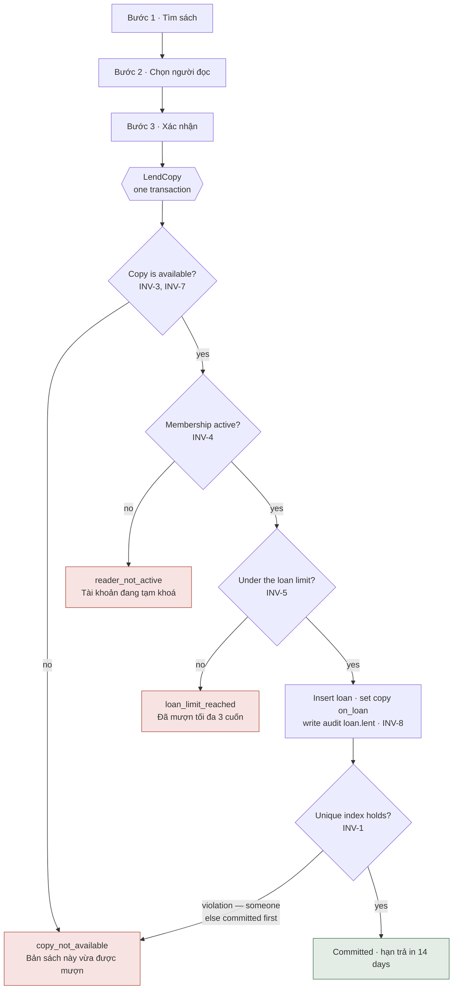
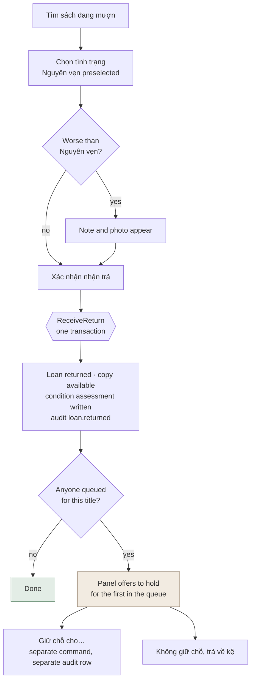
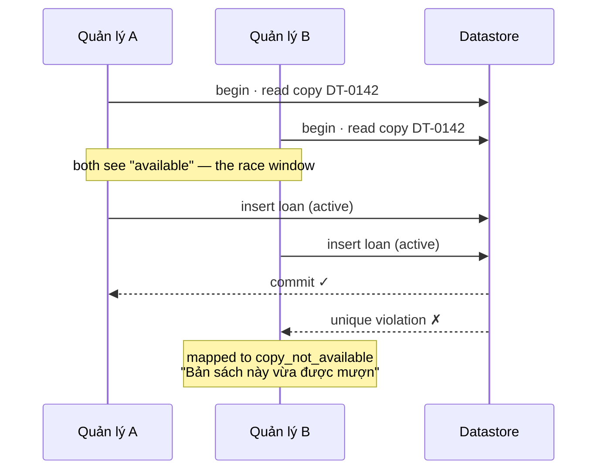

# OLibra — Operations Catalogue

**Status:** Draft for backend implementation. Transport-neutral by design.
**Date:** 2026-08-07
**Scope:** Every operation the system can perform — the contract between the built UI (`src/app/`, 47 route files) and the settled stack. This catalogue defines **48 queries** (§3) and **66 commands** (§4), enforcing the fourteen business rules of §6. (Query count updated 2026-08-12 for `GetPendingManagerChanges`, added below; `UpdateOwnProfile`'s retirement the same date leaves the command count as it already was, since it was not being counted as one of the 66 to begin with.)

This document does not restate [BUSINESS-REQUIREMENTS.md](BUSINESS-REQUIREMENTS.md); it references it by section and adds what that document does not already say: names, inputs, callers, invariant enforcement, audit actions, and named failure modes for every command and query the UI needs. [DESIGN.md](DESIGN.md) is referenced only for the UI behaviour that shapes an operation's contract (e.g. why blocking conditions must be visible before a confirm step).

---

## 1. How to read this

Every operation is either a **query** or a **command**. Nothing is a third thing.

- **Queries never change state.** They may be arbitrarily expensive to compute (a statistics page, a cross-shelf audit search) but they never write a row, and they never need a request to be idempotent because nothing happens twice.
- **Commands change exactly one business fact**, and **always write an audit record in the same transaction as the change**. "One business fact" is a business-level unit, not a row count — creating a book together with its initial batch of copies is one cataloguing event (§5.4 of the requirements), not several commands stitched together, because a book with zero copies is not yet meaningfully catalogued. Where a single user action genuinely triggers two independent facts (see §5's discussion of `ReceiveReturn` and the queued-reader decision), this document says so explicitly rather than pretending it's one thing.
- A command that fails a business rule is not a partial success. Either the whole transaction — state change and audit record — commits, or nothing does.

**The transport is deliberately unspecified.** Nothing here says REST, GraphQL, RPC, or server actions, and nothing here names a framework. An operation is a name, a set of inputs, and a contract. Whoever picks the stack maps that contract onto endpoints, resolvers, or function calls; the contract itself must not change when they do. This is what makes it possible, per the requirements' Definition of Done (§21), to add a public API later without duplicating a single rule.

---

## 2. Conventions

**Scoping.** Every operation takes a `bookshelfId` (or resolves one from the caller's session) and is scoped to that one bookshelf, per INV-10. The exceptions are named explicitly wherever they appear and are few: the portal directory, promote-to-super-admin, and the cross-shelf views under Administration. INV-10 is described in the requirements as the highest-consequence property in the system and structural, not a matter of discipline — so scoping is not a parameter an implementer can choose to skip; every query and command below either takes a shelf identifier or is flagged **Global**.

**Membership, not just authentication.** Per §1.2 of the requirements, a bookshelf's catalogue, book detail, search, and announcements are no longer reachable by an unauthenticated caller at all — only the landing page, the portal directory, and the sign-in and registration forms are public. Every operation below whose Caller is `reader` or higher additionally requires that the caller hold a membership *of the specific `bookshelfId` in the request* — a valid `reader` session for shelf A grants nothing on shelf B. This is the same structural scoping INV-10 already demands; membership-of-this-shelf is simply now also a precondition for reading, not only for writing.

**Identifiers.** `bookshelfId` — the tenant. `userId` — the global identity (§5.3): username, password, name, DOB, phone, etc. `membershipId` — a user's relationship to *one* shelf: role, status, its parish-unit references (`parishUnitL1Id`, `parishUnitL2Id` — BR §5.6), approval history. Most day-to-day reader-facing operations act on a `membershipId`, not a bare `userId`, because role and status live on the membership, not the person. `bookId` (title), `copyId` (physical object), `loanId`, `requestId` (a `BorrowRequest`), `profileChangeRequestId` (a `ProfileChangeRequest`), `commentId`, `announcementId`, `feedbackId`, `parishUnitId`.

**Callers.** Roles are hierarchical within a shelf: `admin` ⊃ `manager` ⊃ `reader` (§13.1). Where a command lists `manager` as the minimum caller, `admin` can call it too, automatically — the table never repeats the inherited role. `guest` is listed only where unauthenticated calls are genuinely allowed. `super_admin` can call anything anywhere; it is listed explicitly only for the handful of operations that are exclusively its own.

**Errors are named, not generic.** A command never fails with a bare 500 or an unstructured exception. Every failure mode below is a stable, machine-readable code (e.g. `copy_not_available`) paired with the plain Vietnamese sentence the UI shows, matching §17.7's requirement that business-rule violations "surface as a friendly message naming what to do instead." A candidate stack must be able to distinguish *not found*, *validation failure*, and *business-rule violation* as different error shapes, because the UI treats them differently (inline field error vs. a named blocking message vs. a 404 page).

**Nothing is hard-deleted except where §11 permits it.** Users, memberships, books, copies, categories, comments, announcements, borrow requests, and bookshelves may be soft-deleted to undo a mistake. Loans, audit records, condition assessments, and feedback are never deleted under any command in this catalogue — loans get `VoidLoan` instead (INV-11), and nothing below offers to delete an audit record, because none should exist.

---

## 3. Queries

### 3.1 Public (unauthenticated)

Per §1.2 of the requirements, only two things live here now: the portal directory (name and address, nothing else — §16.1) and finding a shelf within it. Everything about a shelf's books, readers, and announcements moved to §3.2, because it now requires a membership of that shelf.

| Query | Purpose | Inputs | Returns | Caller | Derived on read |
|---|---|---|---|---|---|
| `GetPortalDirectory` | List every active bookshelf for the front door. **Global.** | — | Per shelf: **name and address only** (§16.1) — no book count, no reader count, no shelf contacts | `guest` | — |
| `SearchBookshelves` | Live search over the portal directory by name, so a stranger can find their own parish's shelf (§16.1: "A search box, because finding your own parish is the only job this page has"). **Global.** | `q` | Matching shelves: name and address only, same shape as `GetPortalDirectory` | `guest` | — |
| `GetSiteContact` | The administration's contact details for the public contact page (§16.1). **Global.** | — | Name, phone, contact hours | `guest` | — |

Book counts, reader counts, and a shelf's contacts are withheld from both of the above on purpose (§16.1: "a person with no membership has no business knowing them"), not merely omitted for brevity — a candidate implementation must not join that data in and trim it client-side, since that would put it on the wire. **Since 2026-08-12** (`docs/superpowers/specs/2026-08-12-po-feedback-design.md`, §1), the withholding is also a privilege, not only a query's own care: `bookshelf_contacts` carries no grant to the role a public query runs as (DATABASE.md §4.2), so a query that tried to join it here would fail rather than merely being told not to.

### 3.2 Reader (authenticated `reader`)

Everything about a shelf's books, announcements, and search moved here from §3.1 — per §1.2, a bookshelf's catalogue, book detail, search, and announcements now require a signed-in membership *of that shelf*, not merely being signed in somewhere. Every row below therefore additionally requires the caller's `reader` membership to belong to the `bookshelfId` in the request (see §2's "Membership, not just authentication").

| Query | Purpose | Inputs | Returns | Caller | Derived on read |
|---|---|---|---|---|---|
| `GetShelfHome` | The shelf's home page, the first thing a member sees after signing in (§16.1). Not public. | `bookshelfId` | Identity, up to three contacts (**changed 2026-08-12**, `docs/superpowers/specs/2026-08-12-po-feedback-design.md` §1, §2 — this used to read "opening hours, keeper contact"; opening hours are gone entirely, BR:179), the pinned announcement or the most recent published one, a catalogue-count summary, recently added covers (**corrected 2026-08-12**: this row used to also list a most-borrowed row, most-active readers and latest approved comments; none of the three render on the built page — BR:512 records the same correction) | `reader` | Availability badges |
| `GetCatalogue` | Browse or filter the shelf's catalogue. | `bookshelfId`, `scope` (`available` \| `all`), `category?`, `sort?`, `page` | Paginated book cards: cover, title, author, availability badge | `reader` | Availability badge per book (§8) |
| `SearchCatalogue` | Live, diacritic-insensitive search over title and author (§12). | `bookshelfId`, `q` | Ranked book list; empty state suggests popular titles | `reader` | Availability badge |
| `GetBookDetail` | A book's detail page. §16.1 is explicit: "There is no guest path — only a member of this shelf can see this page at all." | `bookshelfId`, `bookSlug` | Metadata, description, availability panel, approved comments | `reader` | Availability, current holder (if `public_show_current_borrower`), queue length, days remaining on current loan |
| `GetAnnouncementsList` | Shelf announcements, pinned first. | `bookshelfId` | Published, non-expired announcements | `reader` | Expiry (an announcement whose `publication_time` or expiry has lapsed is excluded on read, not by a job) |
| `GetAnnouncementDetail` | One announcement's full body. | `bookshelfId`, `announcementSlug` | Title, body, author, date | `reader` | — |
| `GetMyDashboard` | "My page" — held books, pending requests, recent reads (§16.2). | `membershipId` | Current loans with days-remaining, pending/held requests with queue position, recently returned | `reader` | Days remaining/overdue per loan (§8), queue position |
| `GetMyLoanHistory` | Full borrowing history, reverse-chronological. | `membershipId`, `page` | Loan rows with return condition | `reader` | — |
| `GetMyProfile` | View own profile and propose changes to it (§16.2). | `membershipId` | Personal fields, parish-unit selections (read-only — `describeSelection`'s rendering of them, per shelf label), current pending change if any (see `GetMyProfileChangeRequest`) | `reader` | — |
| `GetMyProfileChangeRequest` | The reader's own pending profile-change proposal, if one exists (§16.2: "the page shows the current value with the pending one beside it, and says plainly that it is waiting"). | `membershipId` | Current values and proposed values side by side, status, when proposed — `null`/empty if nothing is pending (INV-13: at most one) | `reader` | — |
| `GetMyNotifications` | Bell dropdown / notifications page. | `membershipId` | Notification list, unread count | `reader` | Unread count |
| `GetMyDonations` | The reader's own book-donation offers and their status (§16.2's Tặng sách screen). | `membershipId` | Donation rows: description, estimated count, status, decision note if declined | `reader` | — |
| `GetParishUnits` | The shelf's parish taxonomy and unit list, for rendering zero, one or two pickers (BR §5.6; `src/domain/members/parish-taxonomy.ts`'s `unitOptions`). | `bookshelfId` | The taxonomy (`levels`, `nested`, `level1Label`, `level2Label`) and every live unit: id, level, `parentId`, name, `sortOrder` | `reader` | Soft-deleted units excluded — a unit stops appearing in the picker once deleted, but keeps describing whoever already references it |

Reader full names on these pages are governed by the shelf's `public_name_display` setting (§5.5, assumption 6 in §4) — `GetShelfHome`, `GetBookDetail`, and any leaderboard-bearing query must apply it, never returning the manager-only fields (§5.3: DOB, parents' names, phone, parish-unit placement) regardless of the setting. That setting now governs *member-facing* display, not public display — there is no public display of a shelf's readers any more.

> **Open question.** `GetParishUnits`'s caller is `reader`, not `guest` — the taxonomy design's own reasoning is that "a stranger has no business enumerating a parish's internal divisions" once registration already knows which shelf it is joining. But `RegisterMembership` (§4.3) is a `guest`-callable command, and its form renders the same picker before that guest holds any membership at all. Neither source document says how the registration screen is meant to reach a `reader`-gated query while unauthenticated — whichever surface actually renders that form must resolve the taxonomy some other way (a server-rendered page already scoped to its own `bookshelfId`, most plausibly), and this document does not invent what that way is.

### 3.3 Manager

| Query | Purpose | Inputs | Returns | Caller | Derived on read |
|---|---|---|---|---|---|
| `GetManagerDashboard` | The four stat cards, shelf totals, recent activity (§16.3). | `bookshelfId` | Counts: overdue, pending registrations, pending requests, pending comments; shelf totals; recent activity feed | `manager` | All four stat counts (§8) — never a stored counter, since a counter can drift |
| `SearchBooksForLending` | Step 1 of quick-lend: find a book, with blocking reasons inline. | `bookshelfId`, `q` | Book rows, each flagged blocked/not with a reason (e.g. "Cả 3 bản đang được mượn") | `manager` | Availability, block reason |
| `SearchReadersForLending` | Step 2 of quick-lend: pick a reader, with blocking reasons inline. | `bookshelfId`, `q` | Member rows, each flagged blocked/not (suspended, at loan limit) | `manager` | Loan-limit and membership-status block reasons (INV-4, INV-5) |
| `SearchLoansForReturn` | Find the loan to receive back, by book or reader. | `bookshelfId`, `q` | Active loan rows with borrower, due date, copy code | `manager` | Overdue flag |
| `GetBooksList` | Manager's book list, filterable. | `bookshelfId`, `q?`, `category?`, `sort?`, `page` | Title rows with copy counts and status | `manager` | Aggregate status per title |
| `GetBookDetail` (manager) | A book's management page. Per §16.1, this page also surfaces **Cho mượn** on an available copy and **Nhận trả** on one that's out, as direct entry points into `LendCopy`/`ReceiveReturn` with the book already chosen (§5). | `bookshelfId`, `bookId` | Metadata, per-copy state/condition/location, condition-assessment history, full loan history | `manager` | Per-copy state, "đang ở đâu" (on shelf / with whom) |
| `GetReadersList` | Manager's reader list, filterable by status and parish unit — the payoff a text field could never give (BR §5.3, §16.3). Also the two book forms' donor picker, unfiltered by role — see `role?` (**added 2026-08-13**, post-review fix wave item 1): `/quan-ly/nguoi-doc` is the one caller that passes `role: "reader"`, keeping a shelf's own managers and admins out of a roster built to edit a reader's details directly and without approval; the donor picker leaves it unset, since a donor is any active member regardless of role. | `bookshelfId`, `status?`, `role?`, `parishUnitId?`, `q?`, `page` | Reader rows with parish-unit names (shelf's own labels), current holding count, status | `manager` | Holding count |
| `GetReaderDetail` (manager) | A reader's full profile. | `bookshelfId`, `membershipId` | Full profile incl. manager-only fields, current loans, loan history | `manager` | Current loans, days remaining |
| `GetPendingRegistrations` | The approval queue. | `bookshelfId` | Pending applications with a similar-name warning where one exists | `manager` | Similar-name match (fuzzy name comparison against existing active members) |
| `GetPendingProfileChanges` | The profile-change approval queue (§16.3: "One card per proposed change, showing the current value and the proposed one side by side"). **Since 2026-08-12** (§9 of the design), filtered to `reader` subjects only — a manager's or admin's own pending change routes to `GetPendingManagerChanges` (§3.4) instead, since nobody at their own shelf may decide it. | `bookshelfId` | Pending `ProfileChangeRequest` rows for this shelf's `reader` members, each with current and proposed values side by side | `manager` | — |
| `GetBorrowRequestQueue` | Requests grouped by book, in request-time order. | `bookshelfId` | Per book: queue position, requester, status, hold expiry where approved | `manager` | Queue position, hold-expired flag (§8) |
| `GetDonationQueue` | Pending donation offers, oldest first — backs the sidebar's count badge (§16.3). | `bookshelfId` | Pending donation rows: donor, description, photo, estimated count, submitted time | `manager` | Queue count for the badge |
| `GetOverdueLoans` | Loans past due, sorted by lateness. | `bookshelfId`, `sort` | Borrower, phone, days late, due date | `manager` | Days late — computed from `due_on` vs. today (§8), never stored |
| `GetCommentsList` | Comments by moderation status. | `bookshelfId`, `status` | Comment rows with book and author | `manager` | — |
| `GetAnnouncementsList` (manager) | All announcements regardless of publication state. | `bookshelfId`, `status?` | Draft/showing/expired announcements | `manager` | Publication state (draft = no `publication_time`; expired = expiry passed) |
| `GetStatistics` | Period-based shelf statistics (§16.3). | `bookshelfId`, `period` (`week` \| `month` \| `year` \| `all`) | Loan count, distinct borrowers, books added, books lost, daily/category charts, top books, top readers | `manager` | Every figure is computed for the period at query time — nothing here is a materialised counter |
| `GetShelfSettings` (manager, read-only) | View this shelf's profile and lending policy. | `bookshelfId` | Profile fields, lending-policy values (§5.5) | `manager` | — |
| `GetAuditLog` (shelf-scoped) | This shelf's audit trail. | `bookshelfId`, filters | Readable Vietnamese sentences per entry, raw before/after on expansion | `manager` | — |
| `ListTitlesForLabels` | The QR-label selection accordion (§19's "QR labels per copy"). Grouped in the query, not on the page, so the "chưa in nhãn" filter can drop a title whose every copy is already printed rather than render a row that opens onto nothing. | `bookshelfId`, `onlyUnprinted` | Titles, each with its live copies and each copy's print count | `manager` | — |
| `ListCopiesForLabels` | The copies a sheet is about to be printed for. `bookIds` and `copyIds` are a **union**, so a manager may tick a whole title and individual copies of another; expansion happens here, not in the browser, where the answer would be whatever the page was rendered with. | `bookshelfId`, `bookIds?`, `copyIds?`, `onlyUnprinted?` | Copy rows: id, code, title, print count — ordered by code | `manager` | — |
| `ResolveCopyById` | A scanned QR label back to a copy. Takes the copy's **UUID**, never the printed payload — decoding lives outside the domain, so the label format can change without a query changing. Deliberately **not** manager-only: a reader scans a book on the shelf to ask for it (§16.1), and RLS is what keeps another parish's sticker unresolvable. | `bookshelfId`, `copyId` | Copy id, code, state, book id/slug/title/author — or nothing | `reader` | — |
| `ExportLabelSheetPDF` | The printable sheet itself. A4 pages laid out inside the 186 × 255.4mm that A4 and US Letter share, 21 labels per page, so one file prints correctly on either paper. Writes `MarkCopiesPrinted` (§4.1) only once the bytes exist. | `bookshelfId`, `bookIds?`, `copyIds?` | PDF | `manager` | — |
| `ExportBooksCSV` | Data-export insurance (§2). | `bookshelfId` | CSV of the book catalogue | `manager` | — |
| `ExportReadersCSV` | — | `bookshelfId` | CSV of readers | `manager` | — |
| `ExportLoansCSV` | — | `bookshelfId` | CSV of loan history | `manager` | — |

> **Open question.** Exports are queries by this document's own definition — they change nothing — yet they read every reader's manager-only personal fields (§5.3) in bulk. The requirements do not say whether pulling a CSV of children's names, DOB, and phone numbers should itself be an audited domain event. Given the sensitivity, treating `run_export` as always writing an explicit audit entry (§14) even though no *record* changes would be a reasonable, cheap safeguard — but that is an addition to what §14 currently says, not a restatement of it.

### 3.4 Administration (`super_admin`, **Global** unless noted)

| Query | Purpose | Inputs | Returns | Caller | Derived on read |
|---|---|---|---|---|---|
| `GetAdminOverview` | Cross-shelf dashboard, one row per shelf. | — | Per shelf: books, readers, loans, overdue count, pending items; an "attention" list | `super_admin` | Overdue counts, pending-item counts per shelf, all live |
| `GetBookshelvesList` | All shelves for administration. | — | Shelf rows | `super_admin` | — |
| `GetBookshelfSettings` (admin, editable view) | One shelf's full profile + lending policy for editing. | `bookshelfId` | Profile, lending policy, slug (read-only after creation) | `super_admin` | — |
| `GetManagersList` | Every manager/admin across every shelf. | `shelfFilter?`, `q?` | Person, shelf, role, last-active | `super_admin` | Last-active recency (flags e.g. "32 ngày trước" as stale) |
| `GetManagerActivity` | One manager's full activity, grouped by type (§16.4). | `membershipId` (or `userId` for the global `admin` role), `period` | Grouped sections: lends, returns, registrations approved, books added | `super_admin` | All counts read live from the audit log — "trang này đọc từ nhật ký" |
| `GetAuditLog` (cross-shelf) | Filterable by shelf, actor, action, date range. | filters | Same entry shape as the shelf-scoped version, any shelf | `super_admin` | — |
| `GetPendingManagerChanges` | *Added 2026-08-12* (`docs/superpowers/specs/2026-08-12-po-feedback-design.md`, §9). The super admin's half of the profile-change routing table at `/quan-tri/doi-thong-tin` — every pending `ProfileChangeRequest` whose subject is a `manager` or `admin`, anywhere in the system, the shelf named on each row. The complement of `GetPendingProfileChanges` (§3.3), which now filters to `reader` subjects only; together the two partition every pending request. | — | Rows: shelf, subject, current and proposed values side by side, requested time | `super_admin` | — |
| `GetFeedbackInbox` | Messages from readers and guests. | `status?` (`new` \| `read` \| `resolved`), `shelfFilter?` | Sender, subject, shelf (or site-wide), time, unread flag | `super_admin` | Unread flag/count |
| `GetFeedbackDetail` | One message. | `feedbackId` | Full body, sender contact, shelf | `super_admin` | — |
| `GetSystemSettings` | Global defaults, the public contact details, and read-only system facts. | — | **Administration contact: name, phone, contact hours**; default lending-policy values for new shelves, locale, timezone (read-only: `Asia/Ho_Chi_Minh`), last backup time | `super_admin` | — |
| `DownloadSystemBackup` | Retrieve the most recent backup artifact. | — | Backup file/link | `super_admin` | — |

---

## 4. Commands

Each command's **Caller** is the minimum role; §2's hierarchy note applies throughout. Audit actions use a `noun.verb` convention.

### 4.1 Catalogue

#### `CreateBook`
Catalogues a new title together with its initial batch of copies, in one transaction — the "Số bản sách" field on the new-book form auto-generates sequential copy codes (e.g. `DT-0215`–`DT-0217`) as part of the same save. Optionally records who gave the copies: **Người tặng** accepts either an existing member found by search (`donorMembershipId`) or a typed name for someone with no account (`donorName`), written onto every copy this call creates alongside `acquiredOn` — defaults to today, editable, because a donation is often catalogued weeks after it actually arrives. See DATABASE.md §4.4 for why the member link sits beside the free-text name rather than replacing it.

- **Inputs:** `bookshelfId`, title, author, category, publisher?, year?, pages?, ISBN?, description?, language, cover image?, `published` flag, initial copy count, `donorMembershipId?`, `donorName?`, `acquiredOn?`
- **Caller:** `manager`
- **Invariants enforced:** INV-8 (audit written); each generated copy starts `available`
- **Audit action:** `book.created`
- **Failure modes:**
  - `validation_failed` — "Vui lòng điền đầy đủ các trường bắt buộc." (missing title/author/category)
  - `duplicate_isbn` — "Mã ISBN này đã tồn tại trong tủ sách." (if ISBN provided and already used on this shelf)

#### `UpdateBook`
Edits a book's metadata, including the `published` flag that hides drafts from the shelf's catalogue (member-visible, not public — §1.2).

- **Inputs:** `bookshelfId`, `bookId`, changed fields
- **Caller:** `manager`
- **Invariants enforced:** INV-8
- **Audit action:** `book.updated`
- **Failure modes:**
  - `not_found` — "Không tìm thấy sách này."
  - `validation_failed` — "Vui lòng kiểm tra lại thông tin."

#### `DeleteBook`
Soft-deletes a book. Permitted per §13.2's permission set and §11's deletion policy; no dedicated confirmation screen exists in the current 47 built screens (`src/app/tu-sach/[shelf]/quan-ly/sach/page.tsx` offers only "Sửa" and "Xem bản").

- **Inputs:** `bookshelfId`, `bookId`
- **Caller:** `manager`
- **Invariants enforced:** INV-8; §11 (its copies are soft-deleted with it, unless a copy carries loan history — see failure mode below)
- **Audit action:** `book.deleted`
- **Failure modes:**
  - `has_active_loans` — "Không thể xoá sách đang có bản được mượn." (a copy is `on_loan` or `held`)
  - `copy_has_history` — a copy with loan history is retained rather than deleted, per §11: "A copy with loan history cannot be removed."

> **Open question.** The built UI has no visible entry point for `DeleteBook`, only for creating and editing. The permission exists in §13.2; the screen doesn't. Flagging rather than inventing a delete-confirmation flow.

#### `AddCopies`
Adds more physical copies to an existing title, auto-generating the next sequential codes — the same mechanism `CreateBook` uses for its initial batch, exposed separately for a title that later receives more donated copies. Carries the same optional donor fields as `CreateBook` — `donorMembershipId`, `donorName`, `acquiredOn` — for exactly the case this command's own description names: a second donated copy of a popular book, arriving months after the first, whose donor may not be whoever gave the original.

- **Inputs:** `bookshelfId`, `bookId`, count, `donorMembershipId?`, `donorName?`, `acquiredOn?`
- **Caller:** `manager`
- **Invariants enforced:** INV-8
- **Audit action:** `copy.added` (one entry per generated copy, or one entry naming the batch — see the AuditLog fields in §5.4 of the requirements: "the record affected" is singular per entry, so a batch of five new copies is five audit rows referencing the same action and timestamp context)
- **Failure modes:**
  - `not_found` — "Không tìm thấy sách này."
  - `validation_failed` — "Số bản phải lớn hơn 0."

**UI trigger:** the "Thêm bản" button beside the copies heading on the manager's book detail page (`src/app/tu-sach/[shelf]/quan-ly/sach/[id]/page.tsx`), per §16.3. It sits with the copies, not with "Sửa sách", because adding a physical object to the shelf is not editing the title's metadata — and a volunteer holding a newly donated second copy would not look under "edit book" for it.

#### `MarkCopiesPrinted`
Records that a QR label sheet was produced for a set of copies (§19's "QR labels per copy"). Stamps `qr_printed_at` and **increments** `qr_print_count` — the count exists precisely so a reprint, after a sticker falls off, stays distinguishable from a first print, which a single boolean or a timestamp read as one cannot do.

- **Inputs:** `bookshelfId`, `copyIds`
- **Caller:** `manager`
- **Audit action:** `copy.qr_printed` — **one entry for the batch**, deliberately unlike `AddCopies` above. §5.4's "the record affected is singular per entry" is about copies coming into existence separately; a print run is one volunteer at one printer in one moment, and four hundred rows saying so would bury the log §14 exists to keep readable. The entry names the count.
- **Failure modes:**
  - `copy_selection_empty` — "Bạn chưa chọn bản sách nào để in nhãn."

**A zero-row update is not a failure here**, and this is the one command in this document for which that is true. It is set-valued bookkeeping about a document that already exists — the route builds the PDF bytes *before* calling this — so an empty result is a fact to record, not a target that was missed. The reported count is what actually moved, not what was asked for.

**UI trigger:** submitting the selection on `/quan-ly/ma-qr`, which returns the sheet as a download.

#### `AssessCondition`
Records a manager's judgement of a copy's physical state at a point in time, independent of any loan (§5.4: "a manager may assess a copy at any time, not only at return").

- **Inputs:** `bookshelfId`, `copyId`, condition (one of the six in §9), note?, photo?
- **Caller:** `manager`
- **Invariants enforced:** INV-8
- **Audit action:** `copy.condition_assessed`
- **Failure modes:**
  - `not_found` — "Không tìm thấy bản sách này."

#### `ReportCopyLost`
Marks a copy lost, removing it from circulation (§7.1: `on_loan → lost`).

- **Inputs:** `bookshelfId`, `copyId`, note?
- **Caller:** `manager`
- **Invariants enforced:** INV-2, INV-7, INV-8; if the copy has an active loan, that loan is closed out (`loan.status = lost`, not left dangling as `active`)
- **Audit action:** `copy.lost_reported`
- **Failure modes:**
  - `already_lost` — "Bản sách này đã được báo mất."
  - `already_retired` — "Bản sách đã ngừng dùng, không thể báo mất."

> **Open question.** The state diagram in §7.1 only draws `on_loan → lost`. The built manager book-detail page (`src/app/.../sach/[id]/page.tsx`) shows a "Báo mất" action on every copy row regardless of current status, including copies currently `available`. Real-world loss ("a book goes missing off the shelf without ever being checked out") is plausible, but the requirements don't authorise `available → lost` explicitly. This document assumes the stricter reading (only an `on_loan` copy can be reported lost) and flags the UI's apparent broader affordance as something the product owner should resolve.

#### `MarkCopyFound`
A lost copy turns up again (§7.1: `lost → available`).

- **Inputs:** `bookshelfId`, `copyId`, note?
- **Caller:** `manager`
- **Invariants enforced:** INV-2, INV-8
- **Audit action:** `copy.found`
- **Failure modes:**
  - `not_lost` — "Bản sách này hiện không ở trạng thái đã mất."

**UI trigger:** the lost-copies view on the manager's Sách list (§16.3 of the requirements) — a status filter to `lost`, added specifically to close this gap — shows **Đánh dấu tìm thấy** beside **Ngừng dùng** on every row. This resolves what was previously listed here as an open question: no screen exposed this action, despite §7.1 requiring a path back from `lost` and §3's edge case naming exactly this scenario, "a book reported lost is found months later." The command itself is unchanged; only the entry point is new.

#### `RetireCopy`
Permanently withdraws a copy from circulation (§7.1: `available → retired` or `lost → retired`).

- **Inputs:** `bookshelfId`, `copyId`, reason
- **Caller:** `manager`
- **Invariants enforced:** INV-2, INV-7, INV-8
- **Audit action:** `copy.retired`
- **Failure modes:**
  - `copy_on_loan` — "Không thể ngừng dùng bản sách đang được mượn. Hãy nhận trả hoặc báo mất trước." (must return or report lost first — §7.1's explicit note)

### 4.2 Circulation

#### `LendCopy`
Direct, request-free lend — the quick-lend flow's terminal step (§16.3, walked in full in §5 below). Reachable from two entry points: the manager dashboard's quick-lend flow (three steps), or, per §16.1, a **Cho mượn** button on a book's detail page when a copy is available — the same command, with the book already chosen, so that entry point is two steps instead of three (§5).

- **Inputs:** `bookshelfId`, `copyId` (or `bookId` when the title has exactly one copy), `membershipId` (the reader)
- **Caller:** `manager`
- **Invariants enforced:** INV-1, INV-2, INV-3, INV-4, INV-5, INV-7, INV-8
- **Audit action:** `loan.created`
- **Failure modes:**
  - `copy_not_available` — "Bản sách này đang được mượn hoặc đang giữ chỗ." (INV-3)
  - `copy_lost_or_retired` — "Bản sách này đã mất hoặc ngừng dùng." (INV-7)
  - `title_has_no_copies` — "Cuốn này chưa có bản sách nào trong tủ." (the title is catalogued but no copy is recorded against it at all — a pre-flight refusal on the quick-lend flow's steps 1 and 3, per §16.3's rule that a block is stated before the confirm step, never by the command itself, which is given a `copyId`)
  - `membership_not_active` — "Tài khoản đang tạm khoá, không thể mượn thêm." (INV-4)
  - `loan_limit_reached` — "Bạn đọc đã mượn tối đa số sách cho phép." (INV-5)

#### `HandoverRequest`
Confirms handover of a copy already held for a specific reader via an approved `BorrowRequest` (§7.1: `held → on_loan`). Distinct from `LendCopy` because the precondition is "the reader who holds the hold," not "any active reader" (INV-3).

- **Inputs:** `bookshelfId`, `requestId`
- **Caller:** `manager`
- **Invariants enforced:** INV-1, INV-2, INV-3, INV-4, INV-5, INV-7, INV-8
- **Audit action:** `loan.created` (with `request.fulfilled` written in the same transaction — see the note under §4.2's `ReceiveReturn` entry for why a fulfilled request is a second fact, not folded into the first)
- **Failure modes:**
  - `hold_expired` — "Thời gian giữ chỗ đã hết. Bạn đọc cần đăng ký lại." (§8: hold expiry is computed on read; a stale hold can't be handed over)
  - `membership_not_active` — "Tài khoản đang tạm khoá, không thể mượn thêm."
  - `loan_limit_reached` — "Bạn đọc đã mượn tối đa số sách cho phép."

#### `ReceiveReturn`
Closes a loan and records the copy's condition; walked in full in §5. Reachable from the manager dashboard's "Nhận trả" flow, or, per §16.1, directly from a book's detail page via a **Nhận trả** button shown whenever a copy of that title is out — the same command, with the loan already found.

- **Inputs:** `bookshelfId`, `loanId`, condition, note?, photo?, `holdForRequestId?` (present only when the manager chooses to hold the returned copy for the next queued reader)
- **Caller:** `manager`
- **Invariants enforced:** INV-1, INV-2, INV-8, INV-11 (this closes the loan as `returned`, never deletes it)
- **Audit action:** `loan.returned` (plus `request.approved` in the same transaction when `holdForRequestId` is supplied — two facts, one user action, one transaction; see §5)
- **Failure modes:**
  - `loan_not_active` — "Lượt mượn này đã được xử lý." (double-submit guard, also INV-1/2 safety net)
  - `request_not_queued` — "Yêu cầu này không còn trong hàng chờ của sách này." (if `holdForRequestId` no longer points at a pending request for this title — e.g. the reader cancelled between page load and confirm)

**A second entry point out of this same screen, not a variant of this command.** Step 2 of the return flow (§16.3 of the requirements) adds "Bạn đọc báo làm mất" beneath the condition buttons; choosing it does not call `ReceiveReturn` at all — it switches to `ReportCopyLost` (§4.1, above) with the loan's copy already identified, and the loan closes as `lost` rather than `returned`. `ReportCopyLost`'s contract is unchanged by this: same inputs, same invariants, same failure modes. It simply gains a second entry point into the UI, exactly as `LendCopy` already has one via book detail (above).

#### `RenewLoan`
Extends a loan's due date, reader-initiated (§16.2's dashboard "Xin gia hạn").

- **Inputs:** `bookshelfId`, `loanId`
- **Caller:** `reader` (own loan only)
- **Invariants enforced:** INV-6 (renewals remaining **and** no queued request for the title; due date extended by `renewal_days` from the *current* due date, not from today), INV-8
- **Audit action:** `loan.renewed`
- **Failure modes:**
  - `no_renewals_remaining` — "Bạn đã dùng hết số lần gia hạn cho lượt mượn này."
  - `title_has_queue` — "Có bạn khác đang chờ mượn cuốn này, không thể gia hạn." (matches the reader-dashboard example: "Không gia hạn được... Có bạn khác đang chờ cuốn này.")

> **Open question.** INV-4 says a suspended reader's *existing* loans are unaffected and only *new* loans are blocked. Renewing extends an existing loan rather than starting one — this document treats renewal as **allowed** for a suspended reader on that reading, but the requirements never say so explicitly, and a stricter reading ("renewal is a new commitment, block it") is equally defensible. Worth a named test either way (§21).

#### `VoidLoan`
Undoes a loan recorded in error (§3's edge case: "A manager records a loan by mistake and needs to undo it"). Never a delete — INV-11.

- **Inputs:** `bookshelfId`, `loanId`, reason
- **Caller:** `manager`
- **Invariants enforced:** INV-2 (copy returns to `available`), INV-8, INV-11
- **Audit action:** `loan.voided`
- **Failure modes:**
  - `loan_not_active` — "Chỉ có thể huỷ lượt mượn đang diễn ra."
  - `reason_required` — "Vui lòng ghi lý do huỷ."

#### `CreateBorrowRequest`
A logged-in reader expresses intent to borrow a title that has no copy free right now, or wants to queue even when copies exist (§16.1: pressing "Xin mượn" as a logged-in reader "submits immediately with a confirmation dialog").

- **Inputs:** `bookshelfId`, `bookId`, `membershipId`
- **Caller:** `reader`
- **Invariants enforced:** INV-8
- **Audit action:** `request.created`
- **Failure modes:**
  - `membership_not_active` — "Tài khoản đang tạm khoá, không thể gửi yêu cầu mượn."
  - `duplicate_request` — "Bạn đã có một yêu cầu đang chờ cho cuốn này."

#### `ApproveBorrowRequest`
`pending → approved`, assigning a specific available copy and starting the hold clock (§16.3: "Approve (creating a hold with a visible expiry)").

- **Inputs:** `bookshelfId`, `requestId`, `copyId` (an available copy of the requested title)
- **Caller:** `manager`
- **Invariants enforced:** INV-2, INV-3, INV-7, INV-8; `hold_expiry = now + hold_days`
- **Audit action:** `request.approved`
- **Failure modes:**
  - `no_copy_available` — "Không còn bản nào để giữ chỗ."
  - `copy_lost_or_retired` — "Bản sách đã chọn đã mất hoặc ngừng dùng."
  - `request_not_pending` — "Yêu cầu này đã được xử lý."

#### `RejectBorrowRequest`
`pending → rejected`.

- **Inputs:** `bookshelfId`, `requestId`, reason?
- **Caller:** `manager`
- **Invariants enforced:** INV-8
- **Audit action:** `request.rejected`
- **Failure modes:**
  - `request_not_pending` — "Yêu cầu này đã được xử lý."

> **Open question.** Registration rejection (`RejectMembership`) and comment rejection (`RejectComment`) both explicitly require a reason in the built UI copy ("Từ chối cần ghi lý do"). The borrow-request queue screen's "Từ chối" button carries no such statement, and §15's notification list ("borrow request rejected") doesn't say whether the reason is shown to the reader. This document lists the reason as optional for `RejectBorrowRequest` on that basis, but the inconsistency with the other two rejection flows looks unintentional rather than a deliberate product decision.

#### `SkipRequest`
A manager passes over a reader in the queue — either one who hasn't reached their turn yet, or one with an active hold who never came to collect (§3: "the first does not show up; the manager skips to the next"; §14 names this as an explicit domain event, "manager skipped this reader in the queue").

- **Inputs:** `bookshelfId`, `requestId`
- **Caller:** `manager`
- **Invariants enforced:** INV-2 (if the request was `approved`/held, the copy returns to `available` or is offered to the next queued reader), INV-8
- **Audit action:** `request.skipped`
- **Failure modes:**
  - `request_not_active` — "Yêu cầu này không còn ở trạng thái có thể bỏ qua."

> **Open question.** The requirements name "skip" as its own domain event but never define how it differs from `RejectBorrowRequest` in terms of resulting state. The built queue screen (`src/app/.../yeu-cau-muon/page.tsx`) shows *both* "Bỏ qua" and "Từ chối" as separate buttons on the same still-pending request rows, which only makes sense if skip and reject leave the request in genuinely different end states — but neither the state machine (§7.2) nor the UI copy says what those states are. This document treats skip as *not* a terminal status (the request presumably stays `pending`, just deprioritised, or — for an approved/held request — reverts to `pending` with the hold released) rather than `rejected`, but this is the least well-specified command in the catalogue and deserves product clarification before implementation.

#### `CancelOwnRequest`
A reader withdraws their own pending or held request, from the dashboard §16.2 describes — built as a "Huỷ đăng ký" button, wording that is the UI's, not the requirements'.

- **Inputs:** `bookshelfId`, `requestId`
- **Caller:** `reader` (own request only)
- **Invariants enforced:** INV-2 (releases the hold if one exists), INV-8
- **Audit action:** `request.cancelled`
- **Failure modes:**
  - `not_own_request` — "Bạn không thể huỷ yêu cầu của người khác." (should be structurally unreachable via UI, but the command must still check)
  - `request_already_fulfilled` — "Yêu cầu này đã được trao sách, không thể huỷ."

#### `ReleaseExpiredHold`
*Added 2026-08-29 (Laravel migration, phase 2a — product-owner ruling 1).* A manager records a lapsed hold's end: `approved → expired` (§7.2's arrow, previously written by nothing) and the copy `held → available`, one transaction. The guard is the clock's own verdict — a live hold cannot be released here. The reference has no such command: its lapsed hold leaves the copy in `held` until the reader cancels, which the owner overrode.

- **Inputs:** `bookshelfId`, `requestId`
- **Caller:** `manager`
- **Invariants enforced:** INV-2, INV-8; §8 (expiry is decided by comparing `hold_expires_at` to now — this command records a lapse, it never creates one)
- **Audit action:** `request.expired`
- **Failure modes:**
  - `request_not_held` — "Yêu cầu này không có bản sách nào đang được giữ chỗ."
  - `hold_not_expired` — "Thời gian giữ chỗ chưa hết, không thể trả về kệ."

### 4.3 Members

#### `RegisterMembership`
Public self-registration (§16.1, `src/app/dang-ky/page.tsx`) — creates a `pending` membership. Reuses an existing global `User` identity if the phone/username already exists at another shelf (§5.3: "identity is reused" across shelves).

- **Inputs:** `bookshelfId`, username, password, saint name (required — **2026-08-12**, §8, no longer optional), full name, DOB, father's name?, mother's name?, phone, `phoneMissingReason?` (required in its place when `phone` is left empty — §8's danger confirmation, cleared automatically the moment a phone is supplied), `parishUnitL1Id?`, `parishUnitL2Id?`
- **Caller:** `guest`
- **Invariants enforced:** INV-8; the parish-taxonomy selection rule (BR §5.6) — when the shelf's taxonomy is nested, a supplied `parishUnitL2Id` must belong to the supplied `parishUnitL1Id`, checked by `validateSelection` in `src/domain/members/parish-taxonomy.ts` in the same transaction as the write, not by a constraint (DATABASE.md §7)
- **Audit action:** `membership.registered`
- **Failure modes:**
  - `username_taken` — "Tên đăng nhập đã được dùng, hãy chọn tên khác."
  - `password_too_short` — "Mật khẩu cần ít nhất 8 ký tự."
  - `passwords_dont_match` — "Mật khẩu nhập lại không khớp."
  - `validation_failed` — "Vui lòng điền đầy đủ các trường bắt buộc."
  - `thieu-so-dien-thoai` — "Bạn chưa nhập số điện thoại. Hãy nhập số, hoặc cho biết lý do chưa có." (an empty phone with no reason — §8)
  - `parish_unit_l1_not_found` — "Đơn vị bậc 1 đã chọn không tồn tại."
  - `parish_unit_l2_not_found` — "Đơn vị bậc 2 đã chọn không tồn tại."
  - `parish_unit_l2_not_in_l1` — "Đơn vị bậc 2 đã chọn không thuộc đơn vị bậc 1 đã chọn."

Both parish-unit inputs stay optional in every sense the command can enforce — nothing above requires either one to be present, matching BR §5.6's rule that both stay optional permanently, not just until the shelf finishes configuring its units.

#### `ManagerRegisterReader`
A manager registers a new reader in person, from the quick-lend flow's "Đăng ký người đọc mới" escape hatch (§16.3) or the readers list. Because this exists specifically so a manager standing at the shelf can lend to a brand-new reader in the same visit — the entire point of the three-tap quick-lend flow (§1.3) — the resulting membership must be created `active`, not `pending`, or the escape hatch would defeat its own purpose.

- **Inputs:** `bookshelfId`, the same fields as `RegisterMembership`
- **Caller:** `manager`
- **Invariants enforced:** INV-8; the same parish-taxonomy selection rule as `RegisterMembership`
- **Audit action:** `membership.registered` (recorded with the approving manager as actor, distinguishing it from a self-registration awaiting approval)
- **Failure modes:** same as `RegisterMembership`

> **Open question.** The requirements' assumption 3 (§4) says "a manager approving a registration constitutes the consent needed to hold a minor's data" — worded around *approving*, which implies a two-step pending→active flow even here. This document infers immediate-active status from the UX intent (§1.3) rather than from an explicit rule, since nothing in §7.4's state machine or §16.3's description of the escape hatch says whether it skips `pending`. Flagging the inference rather than presenting it as settled. `RegisterMemberOnBehalf` below is the contrasting case where §16.1 is explicit that `pending` is *not* skipped, which is some evidence for the stricter reading here too — but the two commands serve different moments (mid-lend vs. filling in a form) and the requirements never say they must agree.

#### `RegisterMemberOnBehalf`
A manager fills in the registration form for a child standing in front of them (§16.1: "A manager can also complete this form on behalf of a child standing in front of them, which is the common case for the youngest readers"). Same form, same fields, as `RegisterMembership` — the only difference is who is typing. Unlike `ManagerRegisterReader`, this command creates a **pending** application, exactly like self-registration, because §16.1 is explicit that registering on behalf "still creates a pending application rather than an active member, so the approval step and its audit record are never skipped." A manager filling in the form is not the same act as a manager approving it, and collapsing the two would mean a minor's data is held without the separate consent step assumption 3 (§4) describes.

- **Inputs:** `bookshelfId`, the same fields as `RegisterMembership`
- **Caller:** `manager`
- **Invariants enforced:** INV-8; the same parish-taxonomy selection rule as `RegisterMembership`
- **Audit action:** `membership.registered` (recorded with the completing manager as actor, so the audit trail shows this was manager-assisted, distinct from a self-registration — but the resulting status is `pending`, unlike `ManagerRegisterReader`)
- **Failure modes:** same as `RegisterMembership`

#### `ApproveMembership`
`pending → active` (§16.3: "A review card per application, laying out exactly the fields the manager must verify in person, with prominent Approve and Reject buttons").

- **Inputs:** `bookshelfId`, `membershipId`
- **Caller:** `manager`
- **Invariants enforced:** INV-8
- **Audit action:** `membership.approved`
- **Failure modes:**
  - `not_pending` — "Đơn đăng ký này đã được xử lý."

#### `RejectMembership`
`pending → rejected`, retained with a reason so the person may re-apply (§2).

- **Inputs:** `bookshelfId`, `membershipId`, reason (required)
- **Caller:** `manager`
- **Invariants enforced:** INV-8
- **Audit action:** `membership.rejected`
- **Failure modes:**
  - `reason_required` — "Vui lòng ghi lý do từ chối."
  - `not_pending` — "Đơn đăng ký này đã được xử lý."

#### `SuspendMembership`
`active → suspended`. The command's own invariant is narrow — blocks new loans only, existing loans explicitly unaffected (INV-4: "A reader whose membership is not active cannot start a new loan. Existing loans are unaffected.") — but the practical effect of `status = 'suspended'` is wider than that invariant: `membershipFor` (`src/auth/guards.ts`) filters `status = 'active'`, so a suspended reader's membership stops resolving at all, `contextFor` demotes them to `guest`, and every page scoped to their shelf 404s, not only borrowing. `signIn` (`src/auth/session.ts`) never consults `memberships.status`, so their password still authenticates — they get a "successful" sign-in that lands nowhere, a product decision that ships as-is. The reader-detail screen states this fuller picture in its own words — "Tạm khoá chặn dùng cả tủ sách, không chỉ mượn mới — người đọc vẫn đăng nhập được nhưng không vào được trang nào. Sách đang mượn vẫn giữ nguyên trong hệ thống." — but that sentence is the built UI's wording, not the requirements'.

- **Inputs:** `bookshelfId`, `membershipId`, reason?
- **Caller:** `manager`
- **Invariants enforced:** INV-8
- **Audit action:** `membership.suspended`
- **Failure modes:**
  - `not_active` — "Chỉ có thể tạm khoá tài khoản đang hoạt động."

#### `ReactivateMembership`
`suspended → active` (§7.4 draws this as bidirectional: `active ⇄ suspended`).

- **Inputs:** `bookshelfId`, `membershipId`
- **Caller:** `manager`
- **Invariants enforced:** INV-8
- **Audit action:** `membership.reactivated`
- **Failure modes:**
  - `not_suspended` — "Chỉ có thể kích hoạt lại tài khoản đang tạm khoá."

> **Open question.** The reader-detail management screen (`src/app/.../nguoi-doc/[id]/page.tsx`) renders the same three action buttons ("Đặt lại mật khẩu", "Tạm khoá tài khoản", "Đánh dấu đã rời") unconditionally, regardless of the reader's actual membership status in the fixture data — there is no visible "Kích hoạt lại" button anywhere in the 47 screens. The command is required by §7.4's bidirectional arrow; the UI simply hasn't been built state-aware yet.

#### `MarkMembershipLeft`
Any status `→ left`, one of the administrative actions §16.3's reader detail view names in passing ("current loans, complete history, and administrative actions") without spelling out. Built as an "Đánh dấu đã rời" button — that label is the UI's wording, not the requirements'.

- **Inputs:** `bookshelfId`, `membershipId`
- **Caller:** `manager`
- **Invariants enforced:** INV-8
- **Audit action:** `membership.left`
- **Failure modes:**
  - `has_active_loans` — a reader who currently holds books cannot simply leave with them unaccounted for; the manager must resolve the loans first (this is inferred from general soundness, not stated explicitly — see the note below)

> **Open question.** Nothing in §7.4 or §16.3 says whether a reader with active loans can be marked `left`. Blocking it (as listed above) protects the "Đang mượn" count from becoming orphaned, but the requirements never say this explicitly — a valid alternative reading is that leaving is allowed and the loans simply continue to display against a `left` membership.

#### `SetReaderCredentials`
Sets or changes a reader's sign-in details. It covers both cases deliberately, because they are the same act from the volunteer's side: giving an account the ability to sign in for the first time, and giving it back to someone who forgot. There is no outbound email and so no self-service reset (§4, assumption 2) — a child who forgets asks the volunteer standing at the shelf.

Most readers never need this at all. §1.3 is explicit that a reader never has to sign in to borrow; credentials exist only for a reader who wants to check the shelf from home, so an account may live its whole life without them (INV-14).

- **Inputs:** `bookshelfId`, `membershipId`, username, new password
- **Caller:** `manager`
- **Invariants enforced:** INV-8, INV-14 — username and password are set together or not at all, so this command cannot leave an account half-configured
- **Audit action:** `credentials.set`
- **Failure modes:**
  - `not_found` — "Không tìm thấy bạn đọc này."
  - `username_taken` — "Tên đăng nhập này đã có người dùng."
  - `password_too_short` — "Mật khẩu cần ít nhất 8 ký tự."

**Two things this command must never do.** It must not write the password, its
hash, or any session token into the audit record — §14 forbids it, and this is
the one place where an automatic change-capture implementation would do exactly
the wrong thing, since setting a password *is* an update to a column. The audit
entry is an explicit event naming the manager, the reader and the time, with no
before and no after.

And it must not be quiet. Whoever can set a password can sign in as that reader;
that power is inherent in a trust model which already assumes the manager knows
the family personally (§4, assumption 3). The mitigation is not to withhold the
power but to make every use of it visible to the super administrator across every
bookshelf (§13.2, Oversight). `credentials.set` is therefore one of the audit
actions the administration surface must be able to filter on by name.

#### `UpdateReaderProfile`
A manager corrects a reader's personal details directly, with no approval step. Named after `SetReaderCredentials` above, its closest sibling: a manager acting on a named reader's person record. (**Retired 2026-08-12**: this used to be named as one half of a pair with `UpdateOwnProfile`, "reader, own" to this command's "manager, a reader's". `UpdateOwnProfile` is gone — see its retirement note below — so this command no longer has that sibling; `ProposeProfileChange`, below, is the route a reader now has to their own record, and it is a proposal rather than a direct write, which is the whole reason the two commands were never really a symmetric pair.)

This is the product owner's answer to the hole master plan §5 Q8 named, recorded in BR §2 ("A manager corrects a reader's details directly") and in BR §6's restated INV-13. BR §2 makes credentials optional *because* most readers are children who will never sign in, so `ProposeProfileChange` below — whose caller is `reader` (self only) — is not a route to a corrected phone number for most of the shelf, and §16.3 calls the phone number the actual mechanism by which books come back.

It is not a weakening of INV-13. Whoever can set a reader's password (`SetReaderCredentials` above) can already sign in as that reader and propose anything as that reader, and the audit trail would then say a *reader* proposed it. The direct edit is the more truthful record, and it is the same trade BR §2 already makes for credentials: the mitigation for a power a manager needs is visibility, not withholding.

**Post-review fix wave, item 1 (2026-08-13) — the same subject-role routing `ApproveProfileChange` documents below now gates this command too.** This command used to check only `requireManager` and nothing about *whose* record it was, which made §9's routing decorative: a manager could open a colleague from the ordinary "Bạn đọc" list — or their own record — and rewrite it directly, no approval, no colleague in the loop, the one thing `/quan-tri/doi-thong-tin` exists to route around. The check is identical to `ApproveProfileChange`'s first rule, derived fresh from the subject's current membership role: a `manager`/`admin` subject may only be corrected by a `super_admin`. Unlike the approval lifecycle, there is no separate self-decision rule to state — a manager correcting their own record already fails the first check, since their own membership role is exactly `manager`. `getReadersList` also now filters to `role = 'reader'`, so a manager or admin's own record no longer appears in that roster at all (§9's queue makes the identical call for the identical reason); the reader-detail screen still resolves a manager-subject membership id reached by a typed URL, and renders the edit control read-only rather than a button that opens, fills in and then refuses.

- **Inputs:** `bookshelfId`, `membershipId`, new values for any subset of: saint name, full name, DOB, father's name, mother's name, phone, `phoneMissingReason` (added alongside `phone` — cleared automatically the moment a phone is supplied, same as everywhere else this pair travels together), email, avatar URL. **Never a `userId`** — `users` carries no row-level security, so a caller-supplied user id would let a manager of one parish rewrite any person in the system; the reader is reached by joining out of a `memberships` row RLS has already scoped, exactly as `SetReaderCredentials` does.
- **Caller:** `manager` — a floor, not the whole rule; see the routing paragraph above
- **Invariants enforced:** INV-8; INV-13 as restated in BR §6 — this is the second sanctioned write path to a person's verified details, and it is audited with before and after
- **Audit action:** `profile.corrected`, with `before`/`after` carrying only the fields that actually changed. Deliberately not `profile_change.approved` (a different act, by a manager who was shown a proposal) — §14 wants a name the audit browser can filter on, and the thing a super administrator must be able to filter for is exactly "a manager changed someone's details without an approval step", the same oversight need `credentials.set` serves (BR §2, §13.2). (This used to also be contrasted with `membership.updated`, which `UpdateOwnProfile` wrote for the now-retired leaderboard toggle; that command and its audit action are gone — see the retirement note below — so the contrast no longer applies.)
- **Failure modes:**
  - `membership_not_found` — "Không tìm thấy bạn đọc này."
  - `not_permitted` — "Bạn không có quyền thực hiện việc này." (also raised, since 2026-08-13, for a `manager`/`admin` subject corrected by anyone but a `super_admin` — the routing paragraph above)
  - `required_fields_missing` — "Vui lòng điền đầy đủ các trường bắt buộc." (saint name, full name, father's name and mother's name are `not null` — **saint name added 2026-08-12**, `docs/superpowers/specs/2026-08-12-po-feedback-design.md` §8; `REQUIRED_PROFILE_FIELDS` lists it first — so blanking any of the four is a named refusal rather than a constraint violation)
  - `validation_failed` — "Vui lòng kiểm tra lại thông tin."
  - `thieu-so-dien-thoai` — "Bạn chưa nhập số điện thoại. Hãy nhập số, hoặc cho biết lý do chưa có." (an empty phone with no reason on file — §8)
  - `empty_proposal` — "Vui lòng thay đổi ít nhất một trường." (an edit that changes nothing must not write an audit entry claiming it did)

> **Open question — the Vietnamese this command needs that this document does not have.** Two sentences that exist nowhere: what a manager reads above the edit form, and how the audit browser renders `profile.corrected` (§14 requires a readable Vietnamese sentence per entry). Both were written by the implementing slice rather than left blank, and both are marked in the code as newly authored rather than quoted — `PROFILE_CORRECTED_COPY` in `src/domain/members/profile-copy.ts`. They are the product owner's to approve or replace; nothing else in that slice's Vietnamese is new.

#### `UpdateOwnProfile` — retired 2026-08-12

**Retired**, not merely edited, per Task 6's removal of `memberships.leaderboard_opt_in` (`docs/superpowers/specs/2026-08-12-po-feedback-design.md`, §13). This command existed to write exactly one thing — a reader's own leaderboard-visibility toggle, "not a fact about the person that a manager verified" (BR §16.2, before that paragraph's own 2026-08-12 revision) — and nothing else: every other personal field already went through `ProposeProfileChange`, below, because §2 and §7.4 make every field on the person a proposal a manager must approve. Once the column and the toggle it wrote were gone, the command had no remaining input, and went with them, along with its server action, the reader's "Riêng tư" form block, and the `membership.updated` audit action, which existed only to name this command's write.

A membership's parish-unit fields (BR §5.6) are still read-only from the reader's own side — nothing in this retirement changes that — the profile screen still tells the reader why with a sentence built from the shelf's own labels, not a fixed one: for Tủ sách Đồng Tháp's taxonomy (*giáo họ*, *tổ*) it renders as "Muốn đổi giáo họ hoặc tổ thì nhờ quản lý tủ sách giúp." (`src/app/tu-sach/[shelf]/ho-so/page.tsx`), a UI sentence, not requirements text.

#### `ProposeProfileChange`
A reader proposes new values for their own verified details (§2: "Changing your own details is a request, not an edit"; §7.4). **Every field requires approval** — the product owner's explicit decision, including the phone number — so this command never writes to the person record; it only ever creates or replaces a `ProfileChangeRequest`. The existing values remain in force, and are what every other query and screen keeps showing, until a manager approves the proposal (§5.4: "Storing the previous values alongside the proposed ones means a manager reviewing a week-old request sees what it would actually change").

- **Inputs:** `bookshelfId` (the shelf whose manager will decide, per §5.4), `membershipId`, proposed values for any subset of: saint name, full name, DOB, father's name, mother's name, phone, `phoneMissingReason`, email
- **Caller:** `reader` (self only)
- **Invariants enforced:** INV-13 — at most one pending request per person. Proposing again while one is already pending **replaces** it rather than creating a second: this is normal, specified behavior, not a failure — the new proposal simply supersedes the old one and takes a fresh snapshot of "values at the time of proposing" (§5.4). INV-8.
- **Audit action:** `profile_change.proposed`
- **Failure modes:**
  - `validation_failed` — "Vui lòng kiểm tra lại thông tin."
  - `thieu-so-dien-thoai` — "Bạn chưa nhập số điện thoại. Hãy nhập số, hoặc cho biết lý do chưa có." (checked against the record this proposal would *produce* if approved unchanged, overlaying the merged proposal onto the current values — §8; `ApproveProfileChange` below keeps its own copy of this check as the backstop for a request written before this rule existed)
  - `empty_proposal` — "Vui lòng thay đổi ít nhất một trường." (nothing differs from the current values)

**The avatar requires approval too.** It was queried and the product owner confirmed *every* field, naming the photograph explicitly. That is consistent with why the photograph exists at all: §5.3 collects it so a manager can tell two children apart, which makes it a fact the manager verified rather than a decoration the reader owns.

This has one consequence worth stating, because it is the only proposable field that is a file. The proposed image is stored when the change is proposed, so the manager can look at it while deciding, but it does not become the person's avatar until approval — and a rejected or cancelled proposal's image is deleted rather than left orphaned in storage.

#### `ApproveProfileChange`
A manager approves a pending change; the proposed values are written to the person record in the same transaction as the audit record (§7.4's diagram: `pending ──► approved (values written to the person)`).

**Also carries `parishUnitL1Id?` and `parishUnitL2Id?`, in place of the two text fields an earlier draft of this catalogue had here.** These are not part of what was proposed — parish units are a membership fact, not one of the person-level fields `ProposeProfileChange` lets a reader put forward (§4.3, above) — they let the approving manager set or correct the reader's parish-unit placement in the same action, which is the mechanism the profile screen's own note points a reader towards when it says a unit change needs the shelf manager's help (the profile screen's own copy, since `UpdateOwnProfile` was retired above). Both stay optional here exactly as they are everywhere else (BR §5.6): supplying neither leaves the membership's existing placement untouched.

**Added 2026-08-12 — who may decide is derived from whose change it is** (`docs/superpowers/specs/2026-08-12-po-feedback-design.md`, §9). `manager` in the Caller line below is a floor, not the whole rule: the actual permission check reads the **subject's** membership role at decision time. A `reader` subject is decided by any manager or shelf admin of that reader's own shelf, exactly as before. A `manager`- or `admin`-subject change may be decided by a `super_admin` only — a colleague of equal rank could otherwise approve their own shelf's own change, which in a one-manager parish is the same person deciding for themselves — and it is reached from a new cross-shelf queue at `/quan-tri/doi-thong-tin`, not the shelf-level one. **Nobody decides their own proposal, at any rank**, including a super admin proposing a change to their own record. Both rules are evaluated fresh at approval time from the subject's current role, so a membership promoted or demoted since the proposal was made is routed correctly without anyone updating a stored value.

- **Inputs:** `bookshelfId`, `profileChangeRequestId`, `parishUnitL1Id?`, `parishUnitL2Id?`
- **Caller:** `manager` — see the routing rule immediately above; the effective decider depends on the subject's role, not only the caller's
- **Invariants enforced:** INV-13 (this is one of the two paths by which a person's verified details change — the other is `UpdateReaderProfile` above, and BR §6's restated INV-13 names both), INV-8; the parish-taxonomy selection rule (BR §5.6) when either unit id is supplied — `validateSelection` in `src/domain/members/parish-taxonomy.ts`, same as `RegisterMembership`
- **Audit action:** `profile_change.approved`
- **Failure modes:**
  - `not_pending` — "Yêu cầu này đã được xử lý."
  - `not_permitted` — a `manager`/`admin`-subject change approved by anyone but a `super_admin`, or any decider approving their own proposal (added 2026-08-12, routing rule above)
  - `thieu-so-dien-thoai` — "Bạn chưa nhập số điện thoại. Hãy nhập số, hoặc cho biết lý do chưa có." (the backstop for a proposal written before `ProposeProfileChange` carried its own copy of this check, or by a caller that bypasses that command entirely — §8)
  - `parish_unit_l1_not_found` — "Đơn vị bậc 1 đã chọn không tồn tại."
  - `parish_unit_l2_not_found` — "Đơn vị bậc 2 đã chọn không tồn tại."
  - `parish_unit_l2_not_in_l1` — "Đơn vị bậc 2 đã chọn không thuộc đơn vị bậc 1 đã chọn."

`RejectProfileChange`, below, is governed by the identical routing rule and the identical `not_permitted` failure mode — same subject-role check, same self-decision refusal — and is not restated a second time.

#### `RejectProfileChange`
A manager rejects a pending change with a reason, which the reader then sees (§16.3: mirrors `RejectMembership` and `RejectComment`'s required-reason pattern). The existing values are untouched — there was never anything to undo. **Since 2026-08-12**, governed by the identical subject-role routing rule `ApproveProfileChange` documents above — a `manager`/`admin` subject's rejection is a `super_admin`-only decision, and nobody rejects their own proposal.

- **Inputs:** `bookshelfId`, `profileChangeRequestId`, reason (required)
- **Caller:** `manager` — a floor, not the whole rule; see `ApproveProfileChange`, above
- **Invariants enforced:** INV-8
- **Audit action:** `profile_change.rejected`
- **Failure modes:**
  - `reason_required` — "Vui lòng ghi lý do từ chối."
  - `not_pending` — "Yêu cầu này đã được xử lý."
  - `not_permitted` — same routing rule as `ApproveProfileChange`, above

#### `CancelProfileChange`
The reader withdraws their own proposal before a decision is made (§7.4's diagram: `pending ──► cancelled (reader withdrew before a decision)`).

- **Inputs:** `membershipId`, `profileChangeRequestId`
- **Caller:** the subject may always cancel their own request — a withdrawal, not a decision, so it is never routed away from them, at any rank. Anyone else is governed by the identical subject-role routing `ApproveProfileChange` (§9, `docs/superpowers/specs/2026-08-12-po-feedback-design.md`) documents above: a `reader` subject's request may be cancelled by any `manager`/`admin` of the shelf, a `manager`/`admin` subject's only by a `super_admin`. **Updated 2026-08-13:** this closes the gap an earlier draft of this entry recorded as a "known gap" — `requireSelfOrManager` alone let any manager cancel a colleague's pending change, including a peer manager's own, which defeated §9's routing by a different verb before a super admin ever saw the request. The self-cancel exception is deliberate and does not extend to approving or rejecting: `ApproveProfileChange`/`RejectProfileChange` refuse self-decision at every rank because deciding your own change is signing both halves nobody else reviewed, while withdrawing your own request has no second party to it at all.
- **Invariants enforced:** INV-8
- **Audit action:** `profile_change.cancelled`
- **Failure modes:**
  - `not_own_request` — "Bạn không thể huỷ yêu cầu của người khác." (should be structurally unreachable via UI, but the command must still check)
  - `not_permitted` — a `manager`/`admin`-subject change cancelled by anyone but the subject themselves or a `super_admin` (added 2026-08-13, routing rule above)
  - `not_pending` — "Yêu cầu này đã được xử lý."

> **Open question — notification gap.** §15's list of reader-facing notifications does not mention a profile-change decision at all (it covers registration and borrowing outcomes only). This document does not invent one: `ApproveProfileChange` and `RejectProfileChange` write no row into the notification system described in §7 below, so a reader only learns the outcome by revisiting `GetMyProfileChangeRequest` (or, on rejection, by whatever surfaces the reason on the profile page). Whether that silence is intentional or a gap in §15 is for the product owner to say.

#### `ChangeOwnPassword`

- **Inputs:** `membershipId`, current password, new password. **Not a `userId`,** which is what an earlier draft of this entry said: `users` carries no row-level security (DATABASE.md §3), so a caller-supplied user id is guarded only by whatever comparison the command remembers to make, whereas a membership id is compared against the one the session resolved and the `users` row is reached only by joining out of a row RLS already scoped. The shipped command has taken a `membershipId` since B2a; this entry is corrected to match it rather than the command being changed to match this entry.
- **Caller:** `reader` (self only)
- **Invariants enforced:** INV-8; password value never captured in the audit record (§14)
- **Audit action:** `user.password_changed`
- **Failure modes:**
  - `current_password_incorrect` — "Mật khẩu hiện tại không đúng."
  - `password_too_short` — "Mật khẩu mới cần ít nhất 8 ký tự."

#### `ProposeAvatarChange`
A reader proposes a new photograph. Like every other personal field it takes effect only on approval — see `ProposeProfileChange` above, of which this is the file-carrying case rather than a separate lifecycle.

- **Inputs:** `membershipId` (**optional — omitted means the caller's own**, taken from the membership the session already resolved, so a reader's own form posts no identity at all and there is nothing in the request to rewrite; a manager setting a photograph on behalf supplies it), image file (≤5 MB, per the profile screen's own copy). **Not a `userId`,** for the reason `ChangeOwnPassword` above now records at length — `users` has no row-level security, and every command in this section reaches a person through a shelf-scoped `memberships` row instead.
- **Caller:** `reader` (self only); a `manager` may also set a photograph directly when registering on behalf, since that value is being entered under their eye in the first place
- **Invariants enforced:** INV-8, INV-13
- **Audit action:** `profile_change.proposed` (with the changed field named in the payload)
- **Failure modes:**
  - `file_too_large` — "Ảnh vượt quá 5 MB."
  - `heic_not_supported` — "Ảnh iPhone (HEIC) chưa dùng được. Bạn hãy chọn ảnh từ thư viện ảnh, hoặc lưu lại dạng JPG."
  - `invalid_image` — "Tệp này không phải là ảnh hợp lệ." (the file is not one of the four image types the store will serve: JPEG, PNG, WebP or AVIF)

> **Resolved — "square" (2026-08-13).** This paragraph recorded that "square" could not be implemented because it had no sentence, no code and no source, and that "a refusal a reader cannot be told the reason for is worse than no refusal". It is resolved by not refusing: `src/lib/avatar-image.ts` centre-crops every upload to a 512×512 square, so photographs become square without anything being rejected and no Vietnamese sentence is needed. The size limit is now stated on the profile screen too: `src/components/avatar-proposal.tsx` renders "Ảnh JPG, PNG, WEBP hoặc AVIF, tối đa 5 MB. Ảnh sẽ được cắt vuông và thu nhỏ." beneath the file picker, closing the gap this paragraph used to record.

All three failure modes are raised at the surface (`src/lib/avatar.ts`) rather than by the command, because all three are facts about bytes: the architecture forbids anything under `src/domain/` from importing the object store, so the proposed image is stored *before* the command runs and the command receives a bare storage key — `users.avatar_url` is gone (`20260813_02_avatar_object_only.sql`), and `storeProposedAvatar` returns only the key, so there is no URL to receive. The two orderings that follow are the interesting part, and are recorded in that module: the image is written before the transaction opens (§4.3 requires a manager to be able to look at it while deciding, and a rollback then leaves an object the command deletes on its way out), while a rejected or cancelled proposal's image is deleted *after* the transaction commits (a delete before a commit that then failed would destroy an image a live request still points at). The residual is one orphaned object when a commit succeeds and the delete fails — storage rather than correctness, and retryable.

### 4.4 Community

#### `CreateComment`
A reader comments on a book (§16.1). No guest comments (§5.4).

- **Inputs:** `bookshelfId`, `bookId`, `membershipId`, body (plain text)
- **Caller:** `reader`
- **Invariants enforced:** INV-8, INV-9 (starts `pending` unless `comments_require_approval` is off, in which case it starts `approved` and is immediately public)
- **Audit action:** `comment.created`
- **Failure modes:**
  - `comments_disabled` — "Tủ sách hiện không nhận bình luận."
  - `empty_body` — "Vui lòng nhập nội dung bình luận."

#### `ApproveComment`
`pending → approved` — the only status that makes a comment publicly visible (INV-9).

- **Inputs:** `bookshelfId`, `commentId`
- **Caller:** `manager`
- **Invariants enforced:** INV-8, INV-9
- **Audit action:** `comment.approved`
- **Failure modes:**
  - `not_pending` — "Bình luận này đã được xử lý."

#### `RejectComment`
`pending → rejected`, reason shown to the author — required per the general rule that every rejection flow in the requirements takes a reason (BR §5.4, BookDonation: "reason required on decline, matching every other rejection flow in this document"). The comment screen's own copy for it reads "Từ chối cần ghi lý do, bạn đọc sẽ thấy lý do này," which is the UI's wording, not the requirements'.

- **Inputs:** `bookshelfId`, `commentId`, reason (required)
- **Caller:** `manager`
- **Invariants enforced:** INV-8
- **Audit action:** `comment.rejected`
- **Failure modes:**
  - `reason_required` — "Vui lòng ghi lý do từ chối."
  - `not_pending` — "Bình luận này đã được xử lý."

#### `HideComment`
`approved → hidden` — pulls a previously public comment (§7.5).

- **Inputs:** `bookshelfId`, `commentId`, reason?
- **Caller:** `manager`
- **Invariants enforced:** INV-8, INV-9
- **Audit action:** `comment.hidden`
- **Failure modes:**
  - `not_approved` — "Chỉ có thể ẩn bình luận đang hiển thị."

#### `CreateAnnouncement` / `UpdateAnnouncement`
Shelf news, written by managers (§16.3).

- **Inputs (create):** `bookshelfId`, title, rich body, pinned?, publication time? (absent = draft), expiry?
- **Inputs (update):** `bookshelfId`, `announcementId`, changed fields
- **Caller:** `manager`
- **Invariants enforced:** INV-8
- **Audit action:** `announcement.created` / `announcement.updated`
- **Failure modes:**
  - `validation_failed` — "Vui lòng điền tiêu đề và nội dung."

#### `PublishAnnouncement`
Draft → published, or a previously expired announcement republished with a fresh expiry. §16.3 does not itself describe an announcement-management screen; this command follows the built UI (`src/app/.../quan-ly/thong-bao/page.tsx`), whose buttons read "Đăng ngay" and "Đăng lại".

- **Inputs:** `bookshelfId`, `announcementId`, publication time (default now), new expiry?
- **Caller:** `manager`
- **Invariants enforced:** INV-8
- **Audit action:** `announcement.published`
- **Failure modes:**
  - `already_published` — "Thông báo này đã được đăng."

#### `PinAnnouncement` / `UnpinAnnouncement`

- **Inputs:** `bookshelfId`, `announcementId`
- **Caller:** `manager`
- **Invariants enforced:** INV-8 (only one pinned announcement is meaningful at a time on the shelf home per §16.1's "pinned first"; pinning a second one is either exclusive-pin or additive — see open question)
- **Audit action:** `announcement.pinned` / `announcement.unpinned`
- **Failure modes:** none beyond `not_found`

> **Open question.** §16.1 says pinned announcements come first, "most recent next" — implying possibly more than one pinned item, ordered among themselves by recency. Nothing states a cap. Left as multiple-pins-allowed, ordered by pin time, unless the product owner wants a hard limit of one.

#### `HideAnnouncement`
Pulls a showing announcement from public view. As with `PublishAnnouncement` above, §16.3 does not itself describe this screen; the built UI's button for it reads "Ẩn".

- **Inputs:** `bookshelfId`, `announcementId`
- **Caller:** `manager`
- **Invariants enforced:** INV-8
- **Audit action:** `announcement.hidden`
- **Failure modes:** none beyond `not_found`

#### `SubmitFeedback`
A message to the administrator, from anyone, shelf-scoped or site-wide (the `gop-y` and `lien-he` forms are the same underlying command with `bookshelfId` present or absent).

- **Inputs:** `bookshelfId?` (absent = site-wide), sender name, phone, subject?, body
- **Caller:** `guest`, `reader`
- **Invariants enforced:** INV-8
- **Audit action:** `feedback.submitted`
- **Failure modes:**
  - `rate_limited` — see §8 (stated in the UI itself: "Mỗi số điện thoại gửi tối đa 3 góp ý mỗi ngày")
  - `validation_failed` — "Vui lòng điền đầy đủ các trường bắt buộc."

#### `MarkFeedbackRead` / `ResolveFeedback`
`new → read` / `→ resolved` (§5.4's three-state status).

- **Inputs:** `feedbackId`
- **Caller:** `super_admin`
- **Invariants enforced:** INV-8
- **Audit action:** `feedback.read` / `feedback.resolved`
- **Failure modes:** none beyond `not_found`

#### `ArchiveFeedback`

- **Inputs:** `feedbackId`
- **Caller:** `super_admin`
- **Invariants enforced:** INV-8
- **Audit action:** `feedback.archived`
- **Failure modes:** none beyond `not_found`

> **Open question.** §5.4 defines Feedback's `status` as exactly three values: `new`, `read`, `resolved`. The built admin inbox (`src/app/quan-tri/gop-y/page.tsx`) has a fourth button, "Lưu trữ" (archive), with no corresponding status in the domain model. Either the domain model needs a fourth status, or "archive" is meant to be a filter/soft-delete over `resolved` items rather than a true status transition — the requirements don't say which, so this command is listed provisionally.

> **Open question — feedback visibility scope.** §13.2 groups "view feedback, resolve feedback" under the general *Community* permission category, without restricting it to `super_admin`. The only built screen for it, however, is the admin-only inbox at `/quan-tri/gop-y`, which lists messages across every shelf in one view. Whether a shelf's own `manager`/`admin` should see (and resolve) feedback addressed to *their* shelf specifically is not resolved by either document — this catalogue follows the built UI and restricts these two commands to `super_admin`.

#### `OfferDonation`
A signed-in reader offers books they no longer want, from the Tặng sách screen (§16.2 of the requirements). Deliberately thin — a free-text description, an optional photograph, a rough count — because a child does not know a publisher or an ISBN, and book data is only worth recording once a volunteer has the book in hand, which is the manager's job at approval time, not the reader's here.

- **Inputs:** `bookshelfId`, `membershipId`, description, photo?, estimated count?
- **Caller:** `reader`
- **Invariants enforced:** INV-8
- **Audit action:** `donation.offered`
- **Failure modes:**
  - `empty_description` — "Vui lòng mô tả sách bạn muốn tặng."

#### `ReceiveDonation`
`pending → received` (§7.7 of the requirements). Marks the offer accepted; it does not itself catalogue anything — the manager separately runs `CreateBook` or `AddCopies` (§4.1, above) with `donorMembershipId` set to this donor, which the queue screen pre-fills: §16.3 describes **Duyệt** as opening the add-book form with **Người tặng** pre-filled with that member.

- **Inputs:** `bookshelfId`, `donationId`
- **Caller:** `manager`
- **Invariants enforced:** INV-8
- **Audit action:** `donation.received`
- **Failure modes:**
  - `not_pending` — "Đề nghị tặng sách này đã được xử lý."

#### `DeclineDonation`
`pending → declined`, reason required — matching every other rejection flow in this catalogue (`RejectMembership`, `RejectComment`, `RejectProfileChange`).

- **Inputs:** `bookshelfId`, `donationId`, reason (required)
- **Caller:** `manager`
- **Invariants enforced:** INV-8
- **Audit action:** `donation.declined`
- **Failure modes:**
  - `reason_required` — "Vui lòng ghi lý do từ chối."
  - `not_pending` — "Đề nghị tặng sách này đã được xử lý."

### 4.5 Administration (`super_admin`, **Global** unless noted)

#### `CreateBookshelf`
Provisions a new tenant (§16.4: "Create and edit shelves, including the slug that becomes the URL").

- **Inputs:** name, slug (fixed after creation), description?, location, up to three contacts (name, phone?, role label? — position 1 required, per position — **changed 2026-08-12**, `docs/superpowers/specs/2026-08-12-po-feedback-design.md` §1; this used to be a single keeper name + phone), timezone, locale, initial lending-policy values (defaulting from `GetSystemSettings`). `opening_hours` is gone (§3 of the same design; BR:179).
- **Caller:** `super_admin`
- **Invariants enforced:** INV-8
- **Audit action:** `bookshelf.created`
- **Failure modes:**
  - `slug_taken` — "Đường dẫn này đã được dùng cho tủ sách khác."
  - `validation_failed` — "Vui lòng điền đầy đủ các trường bắt buộc."
  - `contact_position_1_required` — "Vui lòng nhập người liên hệ thứ nhất." (a missing or empty contacts array — position 1 is the one mandatory contact)
  - `contact_name_required` — "Vui lòng nhập tên người liên hệ." (a contact block with a phone or role label typed in but no name)

> **Open question.** No dedicated "new bookshelf" screen exists among the 47 built pages (only the edit form at `/quan-tri/tu-sach/[id]`); this command is included because §16.4 explicitly describes creation as part of this page's job.

#### `UpdateBookshelfSettings`
Edits a shelf's profile and its lending policy — independently, not together.

**Updated 2026-08-13 (fix round 2).** The command's own `profile` input was
already optional; what changed is the built surface. `/quan-tri/tu-sach` used
to submit both halves in one `<form>` under a single "Lưu cài đặt" button, so
every save — even one that only touched a loan-period number — carried a
`profile`, contacts included. Since `contact_position_1_required` (below) is
a rule the command applies whenever `profile` is present, a shelf the 2026
migration deliberately left with no contact rows ("inventing a volunteer is
worse than an incomplete record") could not change so much as its loan
period without a super admin first naming somebody. The page now renders two
independent forms — "Lưu thông tin tủ sách" for the profile and contacts,
"Lưu quy định cho mượn" for the six lending-policy numbers and the two
comment toggles — each calling this same command with only its own half
filled in, so a policy-only save never carries a `profile` and never reaches
the contact rule at all. A contact edit still requires contact 1, on both
this form and `CreateBookshelf`'s own — the rule itself did not change,
only which saves are capable of tripping it.

- **Inputs:** `bookshelfId`, an *optional* profile patch (name, location,
  address, the shelf's full set of up to three contacts — **changed
  2026-08-12**, same source as `CreateBookshelf` above; this used to be
  `hours, keeper name/phone`, opening hours are gone entirely and contacts
  are now written as a set, all-or-nothing, whenever `profile` is supplied
  at all), and/or changed lending-policy values (§5.5). Supplying neither
  half leaves it untouched — omitting `profile` entirely, not sending an
  empty one, is what a policy-only save does.
- **Caller:** `super_admin` — see the open question below on whether a shelf's own `admin` role should also be able to call this
- **Invariants enforced:** INV-8; the slug is immutable after creation ("Đường dẫn không đổi được sau khi tạo") — attempting to change it is a validation failure, not silently ignored
- **Audit action:** `bookshelf.updated`
- **Failure modes:**
  - `slug_immutable` — "Đường dẫn tủ sách không thể thay đổi."
  - `validation_failed` — "Vui lòng kiểm tra lại thông tin."
  - `contact_position_1_required` — "Vui lòng nhập người liên hệ thứ nhất." (same rule as `CreateBookshelf` above — contacts are written as a set, and position 1 must be present in it)
  - `contact_name_required` — "Vui lòng nhập tên người liên hệ."

> **Open question.** The manager-facing settings page (`src/app/.../quan-ly/cai-dat/page.tsx`) is read-only and states "Chỉ quản trị viên mới đổi được các mục này" ("only the *quản trị viên* can change these"). Vietnamese "quản trị viên" is used in this codebase both for the shelf-level `admin` role (labelled "Quản trị tủ sách" in the managers list) and for the global `super_admin` role (labelled "Quản trị viên" there too). The only settings-*edit* screen actually built lives under the super-admin-only `/quan-tri` route tree, not under any shelf-scoped route a shelf `admin` could reach. Whether a shelf's own `admin` role is meant to have an equivalent in-shelf settings-edit screen — matching the role hierarchy's implication that `admin ⊃ manager` should include *more* than a manager, not the same read-only view — is unresolved by the built UI. This document restricts `UpdateBookshelfSettings` to `super_admin` to match what's actually built, but flags this as very likely a gap: a shelf `admin` role with no privilege beyond a `manager` (read-only settings) makes the role distinction in §13.1 pointless.

#### `UpdateParishTaxonomy`
Sets a shelf's level count, each level's label, and whether the smaller level nests inside the bigger (BR §5.6) — the *Phân chia giáo xứ* section on the same settings screen `UpdateBookshelfSettings` edits (`src/app/quan-tri/tu-sach/page.tsx`).

- **Inputs:** `bookshelfId`, `levels` (1 or 2), `nested` (bool), `level1Label`, `level2Label`
- **Caller:** `super_admin`
- **Invariants enforced:** INV-8; `nested` is stored even when `levels` is 1 rather than cleared, so a shelf that drops to one level and later returns to two finds its previous choice intact (BR §5.6) — this command never resets a field it isn't currently asked to change
- **Audit action:** `parish_taxonomy.updated`
- **Failure modes:**
  - `validation_failed` — "Vui lòng kiểm tra lại thông tin." (`levels` outside `{1, 2}`, or an empty label)

#### `CreateParishUnit`
Adds one unit at a level (BR §5.6) — the "Thêm" row at the foot of each unit list on the settings screen. With nesting on, a level-2 unit is added under a specific level-1 parent; the settings screen lists each level-1 unit's own level-2 list beneath it for exactly this reason.

- **Inputs:** `bookshelfId`, `level` (1 or 2), `parentId?` (an existing level-1 unit of this shelf — required only when the shelf's taxonomy is nested and `level` is 2), `name`, `sortOrder?`
- **Caller:** `super_admin`
- **Invariants enforced:** INV-8; when `parentId` is supplied it must reference a live level-1 unit of this shelf — the same nested-parent rule DATABASE.md §7 documents as application-enforced, not structural
- **Audit action:** `parish_unit.created`
- **Failure modes:**
  - `parish_unit_l1_not_found` — "Đơn vị bậc 1 đã chọn không tồn tại." (`parentId` does not resolve to a live level-1 unit of this shelf)
  - `validation_failed` — "Vui lòng kiểm tra lại thông tin." (empty `name`, `parentId` supplied for a level-1 unit, `level` outside `{1, 2}`, or a `parentId` omitted when the shelf's taxonomy is nested and `level` is 2)

> **Open question — a duplicate unit name.** `parish_units_name_unique_in_scope` is not the table constraint the taxonomy design shows: `20260808_03_soft_delete_aware_uniqueness.sql` replaced it with a partial unique index on `(bookshelf_id, level, parent_id, name) nulls not distinct where deleted_at is null`, so two live units of the same name in the same scope raise `23505` — and a soft-deleted unit frees its name for reuse, which is the point of the change. This entry lists no failure mode for that collision, and neither does `RenameParishUnit` below. Both shipped commands catch the unique violation and raise `validation_failed`, this command's own sentence: vague, but honest, and not the raw driver error §2 forbids. The specific sentence — something naming the unit that already exists — is the product owner's to write.

#### `RenameParishUnit`
Changes a unit's name — "Đổi tên" on its row. Never touches `sortOrder` or `parentId`: a rename is a label change only, and BR §5.6's whole point is that renaming stays cheap because every membership references the unit by id, not by its name.

- **Inputs:** `bookshelfId`, `unitId`, `name`
- **Caller:** `super_admin`
- **Invariants enforced:** INV-8
- **Audit action:** `parish_unit.renamed`
- **Failure modes:**
  - `parish_unit_l1_not_found` / `parish_unit_l2_not_found` — "Đơn vị bậc 1 đã chọn không tồn tại." / "Đơn vị bậc 2 đã chọn không tồn tại." (`unitId` does not resolve to a live unit at its recorded level)
  - `validation_failed` — "Vui lòng kiểm tra lại thông tin." (empty `name`)

#### `ReorderParishUnits`
Sets `sortOrder` for a set of units sharing one level and (when nested) one parent — the mechanism the taxonomy design deliberately keeps explicit rather than inferring an order from digits in a unit's name, so "Tổ 10" cannot sort ahead of "Tổ 2".

- **Inputs:** `bookshelfId`, an ordered list of `unitId`s, all at the same level and (when nested, at level 2) the same `parentId`
- **Caller:** `super_admin`
- **Invariants enforced:** INV-8
- **Audit action:** `parish_unit.reordered`
- **Failure modes:**
  - `parish_unit_l1_not_found` / `parish_unit_l2_not_found` — as above, for any id in the list that does not resolve
  - `validation_failed` — "Vui lòng kiểm tra lại thông tin." (the ids do not all share one level and one parent)

#### `DeleteParishUnit`
Soft-deletes a unit — "Xoá" on its row. Never a hard delete (BR §5.6, §11): a unit already referenced by a membership keeps describing that membership and simply stops appearing in `unitOptions` (`src/domain/members/parish-taxonomy.ts`) — the record survives, only the offering stops, the same split `MarkCopyFound`'s lost-copies view already draws for a book copy (§4.1, above).

**Deleting a level-1 unit cascades to its live level-2 children**, soft-deleting each of them in the same transaction. Chosen over leaving them live and orphaned: a tổ inside a deleted giáo họ is not a place anyone belongs, and an un-cascaded child is exactly what makes `ParishUnitFields` render a level-2 `<select>` with nothing in it but "— Không chọn —" — the empty-list-renders-no-field promise (BR §5.6) broken by an implementation detail rather than a real absence of units. Deleting a level-2 unit only ever deletes that one row; a level-2 unit has no children to cascade to.

- **Inputs:** `bookshelfId`, `unitId`
- **Caller:** `super_admin`
- **Invariants enforced:** INV-8
- **Audit action:** `parish_unit.deleted` — one entry for the unit itself, plus one per cascaded level-2 child when `unitId` names a level-1 unit
- **Failure modes:**
  - `parish_unit_l1_not_found` / `parish_unit_l2_not_found` — "Đơn vị bậc 1 đã chọn không tồn tại." / "Đơn vị bậc 2 đã chọn không tồn tại."

#### `ArchiveBookshelf`
`active → archived` — hides the shelf from the portal, retains everything. §16.4's Bookshelves bullet does not itself describe archiving; the built settings screen (`src/app/quan-tri/tu-sach/page.tsx`) states the effect as "Lưu trữ sẽ ẩn tủ sách khỏi cổng, nhưng giữ lại toàn bộ dữ liệu và lịch sử," which is that screen's wording, not the requirements'.

- **Inputs:** `bookshelfId`
- **Caller:** `super_admin`
- **Invariants enforced:** INV-8
- **Audit action:** `bookshelf.archived`
- **Failure modes:**
  - `already_archived` — "Tủ sách này đã được lưu trữ."

#### `AssignManager`
Grants `manager` or `admin` role at a specific shelf to an existing user (creates or upgrades their `membership` there) — §16.4 "Giao quyền quản lý".

- **Inputs:** `userId` (or the identifying fields to find/create one), `bookshelfId`, role (`manager` \| `admin`)
- **Caller:** `super_admin`
- **Invariants enforced:** INV-8; §4 assumption 8 — a person has at most one role per bookshelf, so this either creates a fresh membership or overwrites the role field on an existing one, never adds a second role row
- **Audit action:** `membership.role_assigned`
- **Failure modes:**
  - `not_found` — "Không tìm thấy người dùng này."

#### `RevokeManager`
Demotes a `manager`/`admin` back to `reader` at that shelf. Membership and its audit trail are retained (§16.4: "Revocation requires confirmation and states plainly that history is retained").

- **Inputs:** `membershipId`
- **Caller:** `super_admin`
- **Invariants enforced:** INV-8, INV-12 (nothing in the person's audit history is touched)
- **Audit action:** `membership.role_revoked`
- **Failure modes:**
  - `not_a_manager` — "Người này hiện không giữ vai trò quản lý."

#### `PromoteSuperAdmin`
Grants the global `super_admin` role — listed as its own command because §13.2 names it as a distinct permission from `AssignManager`/`RevokeManager`, which only ever act at shelf scope.

- **Inputs:** `userId`
- **Caller:** `super_admin`
- **Invariants enforced:** INV-8
- **Audit action:** `user.promoted_super_admin`
- **Failure modes:**
  - `already_super_admin` — "Người này đã là quản trị viên hệ thống."

> **Open question.** No button in the 47 built screens performs this distinct from `AssignManager`'s "Giao quyền quản lý" action — the managers list shows one existing `super_admin` (role `admin` in that screen's local type, distinct from the shelf-level `shelf-admin`) but no visible affordance to create another. Listed because §13.2 names the permission explicitly.

#### `UpdateSiteContact`
The administration's own contact details, shown on the public contact page (§16.1). Name, phone and contact hours.

- **Inputs:** name, phone, contact hours
- **Caller:** `super_admin`. **Global.**
- **Invariants enforced:** INV-8
- **Audit action:** `site_contact.updated`
- **Failure modes:**
  - `validation_failed` — "Vui lòng điền đầy đủ các trường bắt buộc."

These are configuration rather than page content for one reason: a parish with no bookshelf yet holds no membership anywhere, so this page is its only route to a human. If the details were written into the page, a change of administrator would need a deploy — and the person who most needs to reach somebody would be given a number that no longer answers.

#### `UpdateSystemDefaults`
Default lending-policy values applied to newly created shelves (§16.4's system settings screen). Changing this never retroactively touches an existing shelf's own settings.

- **Inputs:** default `loan_days`, `max_concurrent_loans`, `max_renewals`, `renewal_days`, `hold_days`, `due_soon_days` (QA remediation Task 23 added the last three — see `docs/DATABASE.md` §4.12's own note on why they were missing until then)
- **Caller:** `super_admin`
- **Invariants enforced:** INV-8
- **Audit action:** `system_settings.updated`
- **Failure modes:**
  - `loan_days_out_of_range` / `max_concurrent_loans_out_of_range` / `max_renewals_out_of_range` / `renewal_days_out_of_range` / `hold_days_out_of_range` / `due_soon_days_out_of_range` — each field's own range, by name, via `checkPolicyBound` (`src/domain/admin/policy.ts`) — QA remediation Task 15's fix for the generic `validation_failed` this row used to name for all three original fields

### 4.6 Notifications (cross-cutting)

#### `MarkNotificationRead` / `MarkAllNotificationsRead`

- **Inputs:** `membershipId`, `notificationId` (single) or none (all)
- **Caller:** `reader` (own notifications only)
- **Invariants enforced:** INV-8 is arguably overkill for a read-flag flip with no business consequence — see the open question in §7
- **Audit action:** `notification.read` — see §7 for why this one is questionable
- **Failure modes:** none beyond `not_found`

---

## 5. The lending flow in detail

The three screens, and where each check actually happens. The UI filters ahead
of time so a manager never reaches the confirm step with an invalid pair; the
command re-checks anyway, because the data can go stale in the seconds between
and because a command is a contract with every future caller.

The three checks are ordered cheapest-first, but the order that matters is the
last one: **INV-1 is not a check, it is a constraint**, and it is the only
thing standing between this flow and two active loans on one physical book.
The first three can be raced past; that one cannot.

### A second, shorter entry point: book detail

§16.1 adds a doorway into these same two commands that skips the first
step entirely. A manager is often standing at the shelf with the book
already in hand, having reached it through `GetBookDetail` (manager)
rather than through the dashboard's search box. When a copy of that
title is available, the page shows **Cho mượn**; when one is out, it
shows **Nhận trả**. Both buttons open the identical flow described
above and below — same command, same checks, same transaction — with
step 1 ("Bước 1 · Tìm sách" for `LendCopy`, "Tìm sách đang mượn" for
`ReceiveReturn`) already done, because the book is the page the
manager is already looking at. Quick-lend's three taps become two from
here; receive-return's two taps become one before the condition
picker. This adds no new command — it is not a fourth flow, it is the
same two flows with a shorter runway — and it is justified by the same
reasoning as §1.3: every step removed from a volunteer holding a phone
next to a book is worth more than a feature elsewhere.

### `ReceiveReturn`, and the decision that is never automatic

**The hold is a second command, not part of the return.** §16.3 is explicit
that nothing happens automatically: the manager decides, because the next
reader may not be standing there. Modelling it as one command would make that
choice invisible and would put two business facts in one audit row.

**A worse condition never diverts the copy away from `available`, and that
is a decision, not an oversight** (2026-08-10 QA remediation, T27). The
flowchart above already draws it: "Chọn tình trạng" branching on "Worse than
Nguyên vẹn?" adds a note and a photograph to what gets written, never a
different destination — every path still ends at "Loan returned · copy
available" (or `held`, if the manager chooses to hold it for a queued
reader). This is not `ReceiveReturn` cutting a corner; it is BR §7.1's own
state diagram, which draws exactly one arrow out of `on_loan` on a return
(`on_loan → available`, no branch keyed on condition), and BR §9, which is
explicit that condition is "a single choice... plus an optional free-text
note and an optional photograph" recorded *about* a copy rather than a state
it enters — "`lost` is deliberately absent [from the condition list],
because it is a copy *state*" only reads as a meaningful distinction if
`torn` and `missing_pages` are not states either. A `Rách` or `Mất trang`
copy is exactly as lendable the instant it is returned as a `Nguyên vẹn`
one; the condition record (and the photo, when there is one) is what a
manager reads before deciding, by hand, whether the copy is still fit to
lend. **The exit that decision leads to already exists and needs nothing
new:** `RetireCopy` (`available → retired`, BR §7.1) is on the book's own
detail page next to every copy, a manager who judges a returned copy unfit
retires it there with a reason, the same path every other reason a copy
leaves circulation goes through. Adding a `needs_repair` state to intercept
that judgement automatically — guessing a severity threshold from the six
flat condition values, rather than trusting the person who has the book in
hand — is the kind of change BR §20 already declined to make preemptively:
the one open question §9's condition model has is whether it "proves too
coarse in practice", revisited "after the first bookshelf has run for a
month" of real use, not anticipated now from a QA sweep against a database
with no such history yet.

### `LendCopy` end to end

The UI already filters out anything that would fail (§16.3: "Blocking conditions... surface as a clear message before the confirm step, never as an error afterwards") — `SearchBooksForLending` and `SearchReadersForLending` annotate every row with its block reason so a manager never reaches the confirm screen with an invalid pair. But the command itself cannot trust that filtering, for two reasons: the data can go stale between the search screen and the tap on "Xác nhận cho mượn" (seconds, but on a shared shelf that's enough — see §6), and a command is a contract with any future caller, not just this UI.

`LendCopy` therefore re-checks everything, in this order, inside one transaction:

1. **Copy exists and belongs to this shelf** (INV-10 — a copy id from another tenant must be structurally unreachable, not merely rejected here as a courtesy).
2. **Copy is not lost or retired** (INV-7). Checked before availability because a lost/retired copy needs its own message, not a generic "not available."
3. **Copy is `available`** (INV-3). If another manager's `LendCopy` or `HandoverRequest` committed first, this check — backed by a datastore constraint, not just this read (§6) — fails here with `copy_not_available`.
4. **Reader's membership is `active`** (INV-4).
5. **Reader is under `max_concurrent_loans`** (INV-5), counted at write time, not from a value read earlier in the flow.
6. **Write, atomically:** create the `Loan` row (`status = active`, `due_on = today + loan_days`, borrower, lending manager, originating request = none), transition the copy to `on_loan`, write the audit record (INV-8).

Why the order matters: lost/retired and availability are checked before the reader-side checks, because a manager who searched for a book that's already gone needs to know that immediately, not after they've also picked a reader. If any check fails, nothing commits, and the manager sees the named error and returns to the relevant step — never a stack trace, never a half-created loan.

The `HandoverRequest` command runs the identical sequence with one substitution at step 3: the copy must be `held` **and** the collecting reader must be the one the hold was created for (INV-3's second clause), and a fourth check is inserted — the hold must not have expired (computed on read, §8, exactly like everywhere else derived state appears).

### `ReceiveReturn` end to end, including the queued-reader decision

1. **Find the loan** — `SearchLoansForReturn` by book or reader; the manager selects the specific active loan (there is exactly one active loan per copy per INV-1, so this is unambiguous once a copy is chosen).
2. **Assess condition** — the six-value picker (§9) defaults to *Nguyên vẹn*; note and photo fields only appear once a worse grade is chosen, matching §16.3's "the common case is two taps."
3. **Check the queue** — the same screen surfaces, before confirmation, whether anyone is waiting for this title (`GetBorrowRequestQueue`'s data, read at this point). If so, the manager is offered "Giữ chỗ cho [name]" or "Không giữ chỗ, trả về kệ" as part of the same form.
4. **The manager decides — nothing here is automatic.** The requirements are explicit about why (§16.3): "Nothing happens automatically: the manager decides, because the next reader may not be standing there." A queued reader who registered from home might not be at the shelf that Sunday; only a human knows that.
5. **Confirm, atomically:** `ReceiveReturn` closes the loan (`status = returned`, return time, return condition, receiving manager) and writes a `ConditionAssessment` row. If the manager chose to hold for the next reader, the *same* transaction also performs the effect of `ApproveRequest` on that request — assigning this newly-freed copy, setting `hold_expiry`, transitioning the copy `available → held` in the same beat it would otherwise have gone `on_loan → available`, so the copy is never observably `available` for an instant in between.

This is the one place in this catalogue where a single user action deliberately produces two audit-worthy facts — the loan closing and, conditionally, a new hold opening — because they are two different things happening to two different records (a `Loan` and a `BorrowRequest`), even though the manager experiences them as one tap. Both audit rows share the same transaction and timestamp context, so an auditor reading the log sees them as obviously paired.

---

## 6. Concurrency

§2 of the requirements states the risk plainly: two managers can lend the same copy in the same second, from two phones, standing at the same physical shelf. This is not a hypothetical — it's the normal failure mode of a system whose primary UI is "several volunteers with phones near one shelf."

**What must happen:** whichever `LendCopy` (or `HandoverRequest`, or `ApproveBorrowRequest` assigning a copy) transaction *commits first* wins. The other must fail cleanly, with the named error `copy_not_available`, and — critically — must not have written a `Loan` row at all. There is no "undo" here because there is nothing to undo; the losing transaction simply never succeeded.

**Why this cannot be an application-level check alone.** A naive implementation reads the copy's status, sees `available`, and then writes the loan. Two managers' app-server processes can both perform that read before either performs the write — both see `available`, both proceed, and without a datastore-enforced guarantee, both writes succeed, producing two active loans for one physical book. This is exactly the failure INV-1 rules out: "This must be guaranteed by the datastore, not by application checks." A read-then-write pattern, however careful, has a race window between the two steps; only the datastore closing that window — via a uniqueness constraint, an exclusion constraint, or a transaction isolation level that turns the second writer's commit into a conflict — actually prevents it.

Concretely, whichever storage engine is chosen must offer *one* of:
- a constraint that makes "more than one row with `status = active` for a given `copy_id`" simply impossible to persist (e.g. a partial/filtered unique index on `loans(copy_id) WHERE status = 'active'`), so the second writer's `COMMIT` fails outright and the application maps that failure to `copy_not_available`; or
- a serializable (or stricter) transaction isolation level combined with row locking on the copy itself, so the second transaction blocks or aborts rather than silently succeeding; or
- an equivalent optimistic-concurrency scheme (a version/`updated_at` compare-and-swap on the copy row) that the second writer's update fails against, detected and translated to the same named error.

Whichever mechanism is chosen, the requirement is the same: the guarantee lives in the datastore's transactional machinery, not in a `SELECT` the application trusts.

---

## 7. Notifications

Per §15, notifications are in-app only, no email, surfaced as a bell with an unread count. **Managers get none, by design** — "this avoids notification fatigue for volunteers and removes any dependency on timely background work." No command in §4 writes a manager-facing notification; managers work entirely from the dashboard's live counts (`GetManagerDashboard`).

Every reader-facing notification below is written by the command named, in the same transaction as the state change it announces (matching the general rule that a command changes one thing and records it truthfully):

| Notification | Written by |
|---|---|
| Đăng ký được duyệt | `ApproveMembership` |
| Đăng ký bị từ chối | `RejectMembership` |
| Yêu cầu mượn được duyệt (kèm hạn đến nhận) | `ApproveBorrowRequest` (and the equivalent effect inside `ReceiveReturn` when it holds for the next reader) |
| Yêu cầu mượn bị từ chối | `RejectBorrowRequest` |
| Sách đã sẵn sàng để nhận | Same trigger as "yêu cầu mượn được duyệt" above — the requirements list these as two separate notification types in §15, but every command in this catalogue that creates a hold is the same event a reader experiences as "it's ready." This document treats them as one underlying trigger with (at most) two message templates, and flags that reading as an inference rather than something §15 states outright. |
| Sắp đến hạn trả | Not written by any command in §4 — see below |
| Quá hạn | Not written by any command in §4 — see below |
| Bình luận được duyệt | `ApproveComment` |

**Due-soon and overdue notifications are the one place this document departs from "every notification is written by a command."** §8 is emphatic that overdue *status* is computed on read, never written by a job. But a *notification* is a discrete, persisted, dismissible record — it cannot be computed on read the way a status badge can, because "has this reader already been told" is itself state. Some process must, on a schedule, compare `due_on` against today across all active loans and write the due-soon/overdue notifications once. §8 explicitly permits this category of background work — "tidying up expired holds as housekeeping rather than as correctness" — and a scheduled notification sweep is the same kind of housekeeping: if it doesn't run for a few hours, nothing a user can observe becomes *wrong* (the loan's overdue badge is still correct, computed live), only *late to be told*. This is a narrow, deliberate exception, not a contradiction of §8.

**Running the sweep — QA remediation Task 24.** `sweepDueNotifications` (`src/domain/notifications/sweep.ts`) is the function; `bun run db:sweep` (`src/db/sweep-cli.ts`) is the CLI entry point that calls it; `compose.yaml`'s `sweep` service is what now actually calls the CLI, unattended, once a day at 07:00 `Asia/Ho_Chi_Minh` — off the same image as `app`, `restart: unless-stopped`, so a host reboot resumes it without anyone remembering to. Before this task existed only as the middle piece: written, tested, callable, and — per `sweep-cli.ts`'s own docstring — never once invoked in any deployment, which is exactly the failure mode this bound is written to make survivable rather than the failure mode it was supposed to prevent.

*Running it by hand* — to confirm it works before trusting the schedule, or to catch up after a restore:

- `docker compose exec sweep bun run db:sweep` if the `sweep` service is already up (runs alongside its own loop; the two do not conflict).
- `docker compose run --rm sweep bun run db:sweep` for a throwaway one-off run that never touches the running scheduler.
- Outside compose entirely, with `MIGRATION_DATABASE_URL` set by hand exactly as `sweep-cli.ts`'s docstring requires (never `DATABASE_URL` — `olibra_pool` may not `set role olibra_admin`, and the failure is `42501` rather than a useful error): `bun run db:sweep`.

Any of the three prints one completion line, always, even when it wrote nothing — the line itself is the evidence the job ran, independent of whether it found anything to say:

    Sweep complete: 0 due-soon, 1 overdue notification(s).

*What "0 nhắc nhở" (either count at zero, or both) means.* Not failure, and not silence — it is the sweep reporting that nobody currently sits inside their shelf's due-soon window and nobody's loan has freshly lapsed since the last run, or that everyone who does was already told on a previous run. The sweep is idempotent by a `not exists` keyed per loan and per notification kind, not by a cursor (`sweep.ts`'s own docstring), so running it twice in a day ordinarily prints `0, 0` the second time — that is the expected steady state, not evidence the job has stopped working. What is worth investigating is `0, 0` from a database that provably holds a loan due within its own shelf's `due_soon_days` (per-shelf since this same task — see the module note in `sweep.ts`) or already overdue, with no matching notification on file for it; the sweep having nothing to report is not that.

*Checking it ran.* `docker compose logs sweep` carries the scheduler's own narration: one "scheduler started" line at boot, and per day since, a "07:00 … reached — running for `YYYY-MM-DD`" line paired with either "run finished" or "run FAILED (exit …) — will try again at 07:00 tomorrow". A container that has been up since before 07:00 today and shows no line for today simply has not reached the boundary yet — check `docker compose exec sweep date` against 07:00 `Asia/Ho_Chi_Minh` before assuming a fault. `docker compose ps sweep` climbing a restart count is the sharper signal: the loop is written to log a failed sweep and keep waiting rather than exit (see the service's own comment in `compose.yaml` for why — a tight crash-restart loop inside the same minute is a worse failure than tomorrow's run trying again), so a restarting container means something *underneath* that guard — the process itself, not the command it invoked — is what's actually crashing.

---

## 8. Rate limiting

Guest borrow requests are gone (§2 of the requirements: "Since a shelf is now visible only to its members, there is no anonymous caller to serve" for borrowing), so there is exactly one write operation left that's open to an unauthenticated (`guest`) caller and named as a spam vector in the requirements:

| Operation | Limit stated | Source |
|---|---|---|
| `SubmitFeedback` | 3 per phone number per day | Stated verbatim in the built UI (`src/app/tu-sach/[shelf]/gop-y/page.tsx`): "Mỗi số điện thoại gửi tối đa 3 góp ý mỗi ngày, để tránh tin rác." |

It uses a **hashed** identifier (§5.4), not the raw phone number, so the rate-limit store itself doesn't become another place personal data sits in plaintext.

`RegisterMembership` (public self-registration) is not named as rate-limited anywhere, despite also being an open, unauthenticated form that writes a database row. Given it requires substantially more input than a spam submission (§16.1's full field set) and produces a `pending` record a manager must act on rather than anything immediately consequential, the absence of a stated limit may be intentional — but it is not confirmed as such by either source document, so it is listed here as unaddressed rather than assumed fine.

`SearchBookshelves` (§3.1) is a new public write-free query, not a write, so it carries no rate-limiting requirement of its own — but being unauthenticated and open to arbitrary query strings, it is exactly the kind of endpoint ordinary infrastructure-level abuse protection (rate limiting at the edge, not a domain-level rule) exists for. Neither source document says anything about it, so this document doesn't invent a domain-level limit for it either.

No other operation in this catalogue is open to `guest` callers except the read-only public queries in §3.1 (`GetPortalDirectory`, `SearchBookshelves`), which carry no state-changing risk and are addressed only by ordinary infrastructure-level abuse protection (outside this document's scope — see §9).

---

## 9. What this document does not decide

Deliberately out of scope, per this document's own charter:

- **Transport** — REST, GraphQL, RPC, server actions, or anything else. An operation's name and contract must survive any of these unchanged.
- **Auth mechanism** — how a caller proves they are a given `userId` with a given `membershipId`'s role at a given shelf. Session cookie, JWT, magic link (there is no email in v1, per §4) — unspecified.
- **Session storage** — where "who is calling" lives between requests.
- **Framework** — Next.js is the current UI's framework (visible from the route tree), but nothing here depends on it, and the backend need not share it.
- **ORM / persistence layer** — this document specifies *what the datastore must guarantee* (§6's concurrency constraint, INV-1 through INV-13 generally) but not which database, which query builder, or which migration tool delivers those guarantees.

**Any candidate stack must be able to satisfy, without exception:**

1. Every one of the fourteen invariants in §6 of the requirements, each covered by a named test (§21's Definition of Done) — including INV-13, new in this revision, which requires the datastore to make "at most one pending `ProfileChangeRequest` per person" hold structurally (a partial unique index on `(person_id) WHERE status = 'pending'`, or equivalent), the same category of guarantee §6 already demands for INV-1.
2. Tenant scoping (INV-10) as a structural property — not something a developer has to remember to add to a query.
3. Derived state (§8) staying derived — overdue, hold expiry, and availability computed at read time, never cached into a field a background job updates.
4. The transactional pairing this document repeats throughout: a command's state change and its audit record commit together or not at all (§14), and the specific datastore-level concurrency guarantee described in §6 — because no amount of careful application code substitutes for it.

Anything a stack cannot do from that list is not a viable candidate, regardless of its other merits.
