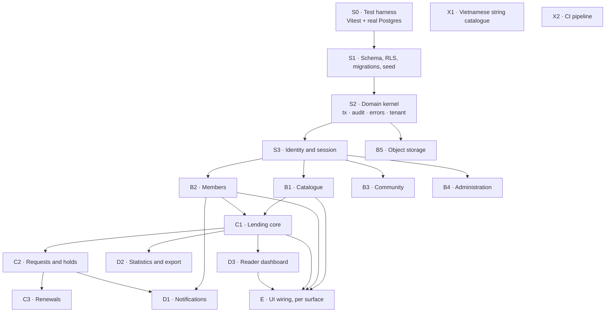

# OLibra Backend — Master Plan and Dependency Map

> **For agentic workers:** REQUIRED SUB-SKILL: Use superpowers:subagent-driven-development (recommended) or superpowers:executing-plans to implement the per-slice plans this document indexes. Steps use checkbox (`- [ ]`) syntax for tracking.

**Goal:** Turn the merged fixture-driven UI into a working system — 47 queries and 66 commands over PostgreSQL, enforcing fourteen named business rules — without changing a single screen's URL or visible behaviour.

**Architecture:** Four layers with inward-only dependencies (SDD §3.1). `src/domain/` holds every rule and imports no framework; `src/db/` owns transactions, Row Level Security and migrations; `src/app/` is Next.js and may call the domain but never SQL. Every command is one transaction containing both its state change and its audit record.

**Tech Stack:** Next.js 16 (App Router) · PostgreSQL 16 · S3-compatible object storage · Docker Compose · Bun runtime, Node build · Vitest · `postgres` (porsager) as the driver.

---

## Global Constraints

Every task in every slice inherits these. They are copied verbatim from the source documents; where a number appears, it is the number.

| # | Constraint | Source |
|---|---|---|
| G1 | **The domain layer imports no framework.** No `next/*`, no `react`, no HTTP types in `src/domain/`. Enforced by an ESLint boundary rule, not by discipline. | SDD §3.1, BR §21 |
| G2 | **Any operation must be callable from a test with no web server running.** If a test needs a server, the operation is in the wrong layer. | SDD §3.3 |
| G3 | **A command's state change and its audit record commit together or not at all.** One transaction. Auditing is never deferred to a job. | BR §14, OPS §1 |
| G4 | **Tenant scoping is structural.** Row Level Security on every shelf-scoped table, `olibra.bookshelf_id` set per transaction. A forgotten `where` returns zero rows, never another parish's data. | BR INV-10, DB §3 |
| G5 | **Derived state is computed on read.** Overdue, hold expiry and availability are never written by a job. Views `loans_current` and `copies_borrowable` are the access path. | BR §8, DB §6 |
| G6 | **Timezone is `Asia/Ho_Chi_Minh` everywhere.** `due_on` is a `date`, never a timestamp. | BR §4.1, §5.4 |
| G7 | **No user-facing string is hard-coded.** All copy resolves from a Vietnamese catalogue. | BR §18 |
| G8 | **Errors are named, not generic.** Every failure is a stable machine code (`copy_not_available`) paired with its exact Vietnamese sentence. Three distinguishable shapes: not-found, validation, business-rule. | OPS §2 |
| G9 | **Nothing in the domain may use `Bun.*` APIs.** The runtime is Bun; the build and the test runner are Node. | AGENTS.md |
| G10 | **Loans, audit records, condition assessments and feedback are never deleted.** `revoke delete` where the database can say it. | BR §11, INV-11, INV-12 |
| G11 | **The seed reproduces `src/lib/fixtures.ts` exactly** — Tủ sách Đồng Tháp, the same books and readers — so pointing the UI at a real database is a configuration change with no visible difference. | DB §9 |
| G12 | **Every one of the fourteen invariants gets its own named test**, including the seven the database enforces structurally. A constraint nobody exercised is a constraint nobody has checked is there. | BR §21, DB §7 |

Source shorthand: **BR** = `docs/BUSINESS-REQUIREMENTS.md`, **OPS** = `docs/OPERATIONS.md`, **DB** = `docs/DATABASE.md`, **SDD** = `docs/SDD.md`.

---

## 1. The short answer on sequencing

Four slices are a strict chain that nothing can go around. Everything else fans out.



**The critical path is S0 → S1 → S2 → S3 → B1/B2 → C1 → C2 → C3.** Everything else hangs off it and can be worked in parallel by whoever is free.

**Three slices depend on nothing and can start on day one, in parallel with S0:** X1 (the Vietnamese string catalogue), X2 (CI), and — as soon as S2 lands — B5 (object storage). If two people are working, the second person starts on X1 and X2 while the first builds the chain.

---

## Phase 1 — what actually ships first

BR §1.4 defines Phase 1 in one sentence and never mentions a single operation
name. This is that sentence turned into a list, because the dependency graph
above and the phase boundary are **different cuts** and confusing them costs
weeks.

> **Phase 1 — the core loop.** Books and copies, readers and registration
> approval, lending and returning with condition assessment, the audit log, the
> manager dashboard, the public catalogue and search. A single bookshelf, but
> stored as one tenant among many.

Plus BR §2: **CSV export of books, readers and loans ships in Phase 1**, because
volunteers plus modest infrastructure is a real data-loss risk.

### The headline: Phase 1 does not need C2 or C3

The critical path to a *shippable* product is shorter than the critical path
through this plan:

```
S0 → S1 → S2 → S3 → B1 + B2 → C1 → ship
```

Borrow requests, holds and the waiting queue (**C2**) are Phase 2. Renewals
(**C3**) follow them, because INV-6 blocks a renewal when a request is queued
and there is no queue to check against yet. Comments, announcements, feedback
and statistics (**B3**, **D2**'s statistics half) are Phase 2. The portal,
multiple bookshelves and super-admin tooling (**B4**) are Phase 3.

That removes four slices from the road to something a parish can use — and it
retires **Q1**, the least well-specified command in the catalogue, from the
critical path entirely. `SkipRequest` is a Phase 2 problem.

### What is in

| Area | Operations | Slice |
|---|---|---|
| Books and copies | `CreateBook`, `UpdateBook`, `DeleteBook`, `AddCopies`, `AssessCondition`, `ReportCopyLost`, `MarkCopyFound`, `RetireCopy` | B1 |
| Catalogue and search | `GetCatalogue`, `SearchCatalogue`, `GetBookDetail`, `GetBooksList`, `GetBookDetail` (manager) | B1 |
| Readers and registration | all 16 member commands — see the note below on why the profile-change flow cannot be deferred | B2 |
| Parish taxonomy | `GetParishUnits`, `CreateParishUnit`, `RenameParishUnit`, `ReorderParishUnits`, `DeleteParishUnit`, `UpdateParishTaxonomy` — see the note below on why this cannot wait either | B2 |
| Reader queries | `GetReadersList`, `GetReaderDetail`, `GetPendingRegistrations`, `GetPendingProfileChanges`, `GetMyDashboard`, `GetMyLoanHistory`, `GetMyProfile`, `GetMyProfileChangeRequest` | B2, D3 |
| Lending and returning | `LendCopy`, `ReceiveReturn`, `VoidLoan` | C1 |
| Lending queries | `SearchBooksForLending`, `SearchReadersForLending`, `SearchLoansForReturn`, `GetOverdueLoans` | C1 |
| Manager dashboard | `GetManagerDashboard`, `GetShelfHome` (without the announcements and comments rows) | C1, B1 |
| Audit log | the kernel's writer, plus `GetAuditLog` scoped to the one shelf | S2, B4 |
| Export | `ExportBooksCSV`, `ExportReadersCSV`, `ExportLoansCSV` | D2 |
| Shelf configuration | `GetShelfSettings`, `UpdateBookshelfSettings`; `CreateBookshelf` runs as seed rather than a screen | B4 |
| Public front door | `GetSiteContact`, `UpdateSiteContact` — the contact page is the only route into the project for a parish with no shelf | B4 |

**This revision's refinements split the same way the table above already
draws Phase 1 vs. Phase 2** (see `docs/superpowers/specs/2026-08-07-refinements-design.md`
§4): the wording changes, the book-detail contact line, the report-lost route
out of `ReceiveReturn`, the lost-copies view, and `Người tặng` on the catalogue
forms — together with the `acquired_from_membership_id` column itself — are
all Phase 1, landing on operations already in the table above with no new
command added. The reader-facing Tặng sách screen and its manager-side
donation queue (`OfferDonation`, `ReceiveDonation`, `DeclineDonation`,
`GetDonationQueue`, `GetMyDonations`) are Phase 2, alongside comments and
announcements, and were the only operations that revision added to the count
below.

**The parish-taxonomy design** (`docs/superpowers/specs/2026-08-08-parish-taxonomy-design.md`)
adds six more, and all six are Phase 1: `GetParishUnits` and the five
`*ParishUnit`/`UpdateParishTaxonomy` commands in the table above. §9 of that
design explains why it cannot land later — doing it after S1 means a
migration on `memberships`, a backfill out of free text that cannot be done
reliably, and every query that reads a reader's parish details rewritten;
doing it before S1 ships is two columns that never existed. Registration
(`RegisterMembership`, `ManagerRegisterReader`, `RegisterMemberOnBehalf`) and
`ApproveProfileChange` are Phase 1 already, and all four now take
`parishUnitL1Id`/`parishUnitL2Id` in place of the two free-text fields — so
the taxonomy that validates those ids has to exist wherever they land.

Roughly **34 of the 66 commands and 26 of the 47 queries** — just over half
the catalogue, and all four foundation slices in full.

### What is deferred, and what that costs

| Deferred | Phase | What a volunteer loses meanwhile |
|---|---|---|
| Borrow requests, holds, the queue | 2 | A reader cannot reserve a book that is out. They ask the manager, who remembers. This is exactly how the paper system already works. |
| Renewals | 2 | A reader who wants longer brings the book in and it is lent again. Slightly more walking, no lost data. |
| Comments, announcements | 2 | The shelf home is shorter. Nothing breaks. |
| Feedback inbox | 2 | The contact page's form is the fallback, and it already exists. |
| Tặng sách reader screen and donation queue | 2 | A donor still hands books to a volunteer in person, exactly as today. The feedback inbox's "Muốn tặng sách cũ" workaround keeps working until the dedicated flow ships — donor provenance on the copy itself (§5.4 of the requirements) is already recorded from Phase 1, so nothing catalogued in the meantime needs to be reconstructed later. |
| Statistics | 2 | Counting is manual. The audit log holds the data, so nothing is lost — only unaggregated. |
| Portal, multiple shelves, super-admin screens | 3 | Nothing: there is one shelf. |

**Multi-tenancy is not deferred.** BR §1.4 is explicit that it is present from
the first day of data, so RLS, the `bookshelf_id` on every row and the two
database roles are all Phase 1 infrastructure even though the second bookshelf
is Phase 3. Retrofitting tenancy into a live database is the rewrite that
phasing exists to avoid.

### Two things Phase 1 forces that §1.4 does not say

**The profile-change flow cannot be deferred**, even though §1.4 predates it.
It is the *only* path by which a person's details can change — there is no
manager-edit command anywhere in the catalogue. Without it, a family that moves
house has no way to correct their phone number, and BR §16.3 calls that number
"the actual mechanism by which books come back."

**Notifications are optional in Phase 1.** Everything in §15 that Phase 1 could
trigger — registration approved, registration rejected — happens between two
people who are standing next to each other. The bell can wait for Phase 2, when
borrow requests create things a reader genuinely learns about while away. If it
is cut, `GetMyNotifications` and the two `MarkNotification*` commands go with
it.

---

## 2. What blocks what, precisely

### 2.1 Hard blockers — no way around them

| Blocked | Blocked by | Why it is genuinely blocked |
|---|---|---|
| **Everything** | **S0** | G12 requires fourteen named tests and there is no test suite at all today. Writing domain code before the harness means writing it twice — once optimistically, once when the harness reveals the seams. This is the single largest risk in the project right now. |
| Every query and command | S1 | No tables. |
| Every **command** | S2 | G3's transaction-plus-audit pairing is one piece of machinery. Writing it per command guarantees drift, and drift here means an audit record that does not match its change. |
| Everything except `GetPortalDirectory` and `SearchBookshelves` | S3 | OPS §2: every operation whose caller is `reader` or higher requires a membership *of the shelf in the request*. Without session and role resolution there is no caller to check. |
| C1 (lending) | B1 **and** B2 | A loan needs a copy and a member. Both, not either. |
| C2 (requests/holds) | C1 | `HandoverRequest` produces a loan; the hold-to-loan path cannot be tested before loans exist. |
| C3 (renewals) | C2 | INV-6 blocks renewal when a request is queued for the title. The queue must exist to be tested against. |
| D1 (notifications) | B2 **and** C2 | Seven of the nine reader notifications are written by membership and request commands. |
| D2, D3 | C1 | Statistics count completed handovers; the reader dashboard shows held books. Both need loans. |

### 2.2 Soft blockers — orderings that are merely wise

| Ordering | Why, and what happens if ignored |
|---|---|
| X1 (strings) before any UI wiring | G7 forbids hard-coded copy. Wiring screens first means retrofitting every string, which is the kind of task that gets half-done. |
| B5 (storage) before the avatar field in B2 | Registration collects a photograph (BR §16.1). Without the adapter, B2 either stubs it or blocks. Stubbing is fine and expected — but only if B5 lands before B2 ships. |
| X2 (CI) before the first parallel slice | Two people merging domain code without CI is how the invariant tests quietly stop running. |
| D2 (export) after the audit decision in §5 | Whether pulling a CSV of children's names is itself an audited event changes the command's shape. Cheap now, awkward later. |

### 2.3 Not blocked by anything — start whenever

- **X1 · Vietnamese string catalogue.** Pure data extraction from the 47 built screens. No database, no domain.
- **X2 · CI pipeline.** `bun run check`, `docker build --target smoke`, and the invariant suite once S0 exists.
- **B5 · Object storage adapter.** Depends on S2 only for the error taxonomy. Genuinely independent of every domain rule.

---

## 3. Parallelism: who can work on what, at the same time

The honest constraint is that **the first four slices are one person's work**, because each one's output is the next one's foundation and splitting them creates more coordination than they save. Parallelism becomes real at S3.

### Wave 0 — the chain (1 person, plus 1 on the independent track)

| Track | Slices | Notes |
|---|---|---|
| A | S0 → S1 → S2 → S3 | Critical path. One person, start to finish, for coherence. |
| B | X1, X2 | Fully independent. A second person is not idle. |

### Wave 1 — four domain tracks in parallel (up to 4 people)

Once S3 merges, these four touch disjoint directories and disjoint tables:

| Track | Slice | Directory | Tables touched |
|---|---|---|---|
| A | **B1 · Catalogue** | `src/domain/catalogue/` | `books`, `book_copies`, `condition_assessments` |
| B | **B2 · Members** | `src/domain/members/` | `users`, `memberships`, `profile_change_requests`, `parish_units` |
| C | **B3 · Community** | `src/domain/community/` | `comments`, `announcements`, `feedback`, `book_donations` |
| D | **B4 · Administration** | `src/domain/admin/` | `bookshelves`, `audit_log` (read) |

**The one shared file is `src/db/migrations/`.** Four people adding migrations concurrently will collide on ordering. Mitigation: migrations are timestamped, and S1 lands the full schema, so Wave 1 should need *no* new migrations. If a slice needs one, it is a signal that S1 missed something — raise it rather than adding a migration quietly.

B5 (storage) runs alongside as a fifth track if a fifth person exists; otherwise fold it into B2, which is its only consumer.

### Wave 2 — circulation (1–2 people, mostly sequential)

C1 → C2 → C3 is a chain. C1 is the highest-consequence slice in the project — it is where INV-1 through INV-8 all land at once — and deserves the most careful reviewer, not the most parallelism.

D2 and D3 can run in parallel with C2/C3 once C1 merges.

### Wave 3 — surfaces (highly parallel, up to 6 people)

UI wiring is per-surface and each surface has one owner:

| Surface | Depends on |
|---|---|
| Public (landing, portal) | S3 only |
| Reader (shelf home, catalogue, book detail, search) | B1, D3 |
| Reader (my page, history, profile) | B2, D3 |
| Manager (dashboard, lend, return) | C1 |
| Manager (books, readers, queue, moderation) | B1, B2, B3, C2 |
| Admin (shelves, managers, audit, feedback) | B4 |

---

## 4. File structure

Decided here so no slice has to invent it. Each file has one responsibility; files that change together live together (by domain area, not by technical layer).

```
src/
  domain/                          ← G1: no framework imports, ever
    kernel/
      errors.ts                    DomainError + the three shapes (G8) — already
                                    exists, seeded with only the parish-taxonomy
                                    module's three codes; extend, don't recreate
      block.ts                     Block — the shared { blocked, reason? } shape
                                    (already exists; circulation imports it, C1)
      audit.ts                     AuditWriter — the only writer of audit_log
      tenant.ts                    TenantContext — carries bookshelfId + actor
      clock.ts                     Clock interface; timezone-aware today() (G6)
      unit-of-work.ts              runInTransaction — the G3 boundary
    catalogue/
      commands/                    create-book.ts, add-copies.ts, retire-copy.ts, …
      queries/                     get-catalogue.ts, get-book-detail.ts, …
      policy.ts                    copy-state transition table (BR §7.1)
    circulation/
      commands/                    lend-copy.ts, receive-return.ts, void-loan.ts, …
      queries/
      policy.ts                    INV-3..INV-7 predicates, pure and testable alone
    members/
      commands/                    register-membership.ts, set-credentials.ts, …
      queries/
      policy.ts                    membership state machine (BR §7.5)
      parish-taxonomy.ts           already exists: unitOptions, validateSelection,
                                    describeSelection (design §6.1) — pure, tested
    community/
    admin/
    notifications/
      write.ts                     called by commands, inside their transaction
  db/
    migrations/                    NNNN_verb_noun.sql, forward-only
    client.ts                      pool; one place that knows the connection string
    transaction.ts                 begin/commit + `set local olibra.bookshelf_id`
    rls.ts                         policy helpers used by migrations
  storage/
    s3.ts                          put/url/delete against any S3-compatible provider
  auth/
    session.ts                     who is calling
    guards.ts                      role resolution; requireManager(shelf) etc.
  i18n/
    vi.ts                          every user-facing string (G7)
  app/                             ← Next.js only; may call domain, never SQL
tests/
  invariants/                      the fourteen named tests (G12) — one file each
  domain/                          per-slice behaviour tests
  support/
    db.ts                          per-file schema, truncation, two-connection helper
    factories.ts                   makeShelf(), makeReader(), makeBookWithCopies()
```

---

## 5. Product decisions that block implementation

These are blocked on **you**, not on code. Each has a slice waiting on it. I have recorded the reading this plan assumes so work is not stalled — but if a reading is wrong, the fix is cheaper before the slice than after.

| # | Question | Slice | Assumed reading | Cost if wrong |
|---|---|---|---|---|
| Q1 | **What does `SkipRequest` actually do?** The queue screen shows *Bỏ qua* and *Từ chối* as separate buttons on the same pending row, but neither BR §7.2 nor the UI says what different end state skip produces. OPS calls this "the least well-specified command in the catalogue". | C2 | Skip is **not terminal**: a pending request stays pending but deprioritised; an approved/held one reverts to pending and releases its hold. | Medium. One command's state machine and its test. |
| Q2 | **Is a rejection reason required for `RejectBorrowRequest`?** `RejectMembership` and `RejectComment` both require one in the built UI copy; the borrow queue's *Từ chối* says nothing. | C2 | Optional, as the UI implies. | Low. A validation rule and a notification field. |
| Q3 | **Can an `available` copy be reported lost?** BR §7.1 draws only `on_loan → lost`, but the manager book-detail screen offers *Báo mất* on every copy row. A book going missing off the shelf is plainly real. | B1 | Strict reading: only `on_loan → lost`. | Low-medium. A transition and the UI affordance disagree today either way. |
| Q4 | **May a suspended reader renew?** INV-4 blocks *new* loans and protects existing ones. Renewal extends an existing loan — arguably not new. | C3 | Allowed. | Low. One predicate, one test. |
| Q5 | **Is running a CSV export an audited event?** It changes nothing, so it is a query — but it reads every child's name, DOB and phone in bulk. BR §14 does not cover it. | D2 | **Audit it.** An entry is cheap; the question "who pulled the children's data" is not one to be unable to answer. | Low. |
| Q6 | **Is `RegisterMembership` rate-limited?** `SubmitFeedback` is (3/phone/day). Public registration is an open unauthenticated form that writes a row, and nothing says. | B2 | Not domain-limited; handled at the edge. | Low. |
| Q7 | **Where does `DeleteBook` live in the UI?** Required by BR §13.2/§11; no screen among the 47 exposes it. (`AddCopies` was in this row and is now resolved — "Thêm bản" on the manager's book detail page.) | B1 | Implement the command; leave it unexposed until a delete-confirmation flow is designed. | Low. |

| Q8 | **Who proposes a profile change for a reader who cannot sign in?** `ProposeProfileChange`'s caller is `reader` (self only), and BR §2 makes credentials optional precisely because most readers are children who will never sign in. No manager-edit command exists either, so a family that moves house has no path to a corrected phone number — the number BR §16.3 calls "the actual mechanism by which books come back". | B2 | **Answered by the product owner, 2026-08-09: a manager edits a reader's details directly, with a full audit record and no approval step.** This is the *opposite* of the reading assumed here before it was asked — "a manager may propose on a member's behalf, producing a request another manager approves" — which is recorded because a plan written against the assumption would have built the wrong command. The decision is now written into BR §6's restated INV-13 and BR §2, with DATABASE.md §7/§4.11 and OPERATIONS.md §4.3 following; the command is `UpdateReaderProfile`, and B2b's plan §3 argues why the audit record, not the approval step, is what INV-13 was protecting. | **Medium, and it is Phase 1.** Unlike Q1–Q7 this is a hole in the flow rather than an ambiguity in it. |

**Q1 is the only one of Q1–Q7 I would want answered before its slice starts — and it is Phase 2, so it is not urgent.** The rest can be implemented on the assumed reading and changed cheaply. **Q8 was the one that mattered, and it has since been answered** (2026-08-09) — see the row above. It is worth noting that the answer went the *other way* from the assumption recorded here, which is the whole argument for asking rather than assuming: the assumed reading added a command, and the real one changed a numbered invariant.

---

## 6. Slice index

Foundation slices have their own fully-scripted plan documents. Wave 1–3 slices are specified here to task granularity — files, operations, interfaces, named tests, acceptance — and get their scripted plan written at the point they are picked up, because their step-by-step detail depends on the interfaces S2 and S3 actually land.

| Slice | Plan | Ops | Blocks | Blocked by |
|---|---|---|---|---|
| S0 · Test harness | [plan](2026-08-07-s0-test-harness.md) | — | everything | — |
| S1 · Schema & RLS | [plan](2026-08-07-s1-schema-rls.md) | — | everything | S0 |
| S2 · Domain kernel | [plan](2026-08-07-s2-domain-kernel.md) | — | all commands | S1 |
| S3 · Identity & session | [plan](2026-08-07-s3-identity-session.md) | 3 | all but 2 queries | S2 |
| C1 · Lending core | [plan](2026-08-07-c1-lending-core.md) | 3 cmd + 3 qry | C2 | B1, B2 |
| B1 · Catalogue | §7.1 below | 8 cmd + 6 qry | C1, E | S3 |
| B2 · Members | §7.2 below | 21 cmd + 9 qry | C1, D1, E | S3 |
| B3 · Community | §7.3 below | 17 cmd + 6 qry | E | S3 |
| B4 · Administration | §7.4 below | 8 cmd + 12 qry | E | S3 |
| B5 · Object storage | §7.5 below | — | avatars, covers | S2 |
| C2 · Requests & holds | §7.6 below | 6 cmd + 2 qry | C3, D1 | C1, **Q1** |
| C3 · Renewals | §7.7 below | 1 cmd | — | C2 |
| D1 · Notifications | §7.8 below | 2 cmd | E | B2, C2 |
| D2 · Statistics & export | §7.9 below | 4 qry | E | C1, **Q5** |
| D3 · Reader dashboard | §7.10 below | 5 qry | E | C1 |
| B6 · Avatar retention | §7.14 below | — | — | B2b |
| X1 · String catalogue | §7.11 below | — | E | — |
| X2 · CI | §7.12 below | — | — | — |
| E · UI wiring | §7.13 below | — | — | per surface |

---

## 7. Wave 1–3 slice specifications

### 7.1 B1 · Catalogue

**Files:** `src/domain/catalogue/commands/{create-book,update-book,delete-book,add-copies,assess-condition,report-copy-lost,mark-copy-found,retire-copy}.ts`, `src/domain/catalogue/queries/{get-catalogue,search-catalogue,get-book-detail,get-books-list,get-book-detail-manager,search-books-for-lending}.ts`, `src/domain/catalogue/policy.ts`, `tests/domain/catalogue/*.test.ts`.

**Produces (later slices consume these signatures):**
```ts
createBook(ctx: TenantContext, input: CreateBookInput): Promise<{ bookId: string; copyIds: string[] }>
retireCopy(ctx: TenantContext, input: { copyId: string; reason: string }): Promise<void>
copyStateTransition(from: CopyState, to: CopyState): { allowed: boolean; reason?: ErrorCode }
searchBooksForLending(ctx: TenantContext, q: string): Promise<LendableBookRow[]>
```

**Named tests required:** INV-7 (`tests/invariants/inv-07-lost-or-retired-not-lendable.test.ts`); the folding-parity test from DB §5 with all four suggested inputs — `Dế Mèn Phiêu Lưu Ký`, `Đất Rừng Phương Nam`, `Totto-chan Bên Cửa Sổ`, `Kính Vạn Hoa tập 4` — asserting `olibra_fold()` in SQL and `fold()` in `src/lib/search.ts` return byte-identical output.

**Acceptance:** `CreateBook` writes a book and its initial copies in one transaction with sequential codes (`DT-0215`–`DT-0217`); a copy on loan cannot be retired (`copy_on_loan`); the catalogue query returns availability derived from `copies_borrowable`, never a stored count. `CreateBook` and `AddCopies` both accept optional `donorMembershipId`, `donorName` and `acquiredOn` (OPS §4.1) and write them onto every copy the call creates — `donorMembershipId` populates `book_copies.acquired_from_membership_id`, `donorName` populates the existing `acquired_from` text column (DB §4.4) — and both may be absent, since most copies still arrive with no donor recorded at all.

**Blocked by:** S3. **Blocks:** C1, and the reader/manager catalogue surfaces. **Open:** Q3, Q7.

### 7.2 B2 · Members

**Files:** `src/domain/members/commands/{register-membership,manager-register-reader,register-member-on-behalf,approve-membership,reject-membership,suspend-membership,reactivate-membership,mark-membership-left,set-reader-credentials,update-own-profile,propose-profile-change,approve-profile-change,reject-profile-change,cancel-profile-change,change-own-password,propose-avatar-change,create-parish-unit,rename-parish-unit,reorder-parish-units,delete-parish-unit,update-parish-taxonomy}.ts`, `src/domain/members/queries/{...,get-parish-units}.ts`, `src/domain/members/policy.ts`.

**One file in that list already exists and is already tested.** `src/domain/members/parish-taxonomy.ts` — the pure shape behind `GetParishUnits` and every command above whose name starts `*ParishUnit*` or `UpdateParishTaxonomy` — was built ahead of this slice, because the picker on the registration form needed it before this slice existed (design `2026-08-08-parish-taxonomy-design.md` §6.1). `tests/domain/members/parish-taxonomy.test.ts` already covers it. What is *not* built yet is everything around it: the five CRUD commands, `GetParishUnits` itself, and the `runCommand`/`runQuery` wiring that would make any of `register-membership.ts` etc. real — those are this slice's actual work, same as before this design landed. Read the file before assuming it needs writing from scratch.

**Produces:**
```ts
registerMembership(input: RegistrationInput): Promise<{ userId: string; membershipId: string }>
setReaderCredentials(ctx: TenantContext, input: { membershipId: string; username: string; password: string }): Promise<void>
approveProfileChange(ctx: TenantContext, input: { requestId: string; parishUnitL1Id?: string; parishUnitL2Id?: string }): Promise<void>
membershipAllowsNewLoan(m: Membership): { allowed: boolean; reason?: ErrorCode }
```

`parish-taxonomy.ts` already produces (built, not to be redone):
```ts
defaultTaxonomy(): ParishTaxonomy
unitOptions(units: ParishUnit[], level: 1 | 2, parentId?: string | null): ParishUnit[]
validateSelection(taxonomy: ParishTaxonomy, units: ParishUnit[], selection: { l1: string | null; l2: string | null }): Block
describeSelection(taxonomy: ParishTaxonomy, units: ParishUnit[], selection: { l1: string | null; l2: string | null }): string
```

**Named tests required:** INV-4, INV-13, INV-14 — `tests/invariants/inv-04-*.test.ts`, `inv-13-*.test.ts`, `inv-14-*.test.ts`. The parish-taxonomy selection rule (OPS §4.3) is not one of the fourteen numbered invariants (DATABASE.md §7 explains why) but still needs its own named test once `register-membership.ts` exists — `validateSelection` is already covered in isolation; what is missing is a test that the command actually calls it inside the transaction rather than trusting the picker.

INV-14's test is worth stating precisely because it is easy to write a weak version: assert that inserting a user with a username and no password fails, that password-without-username fails, that both-null succeeds, and that both-set succeeds. A test that only checks the happy path proves nothing about a check constraint.

INV-13 has two halves and needs both: a partial unique index makes a second pending request for the same person fail; and a test that writing `users` outside `approveProfileChange` is not something any other command does.

**Acceptance:** identity is reused across shelves when the same person registers at a second parish (BR §5.3) — only the parish-unit references are re-entered; `SetReaderCredentials` writes audit action `credentials.set` with before/after both null, never the password or its hash (BR §2); a pending profile change leaves the existing phone number in force; a soft-deleted parish unit stops appearing in `GetParishUnits`/`unitOptions` while a membership that already references it keeps resolving its name through `describeSelection` (BR §5.6, design §7).

**Blocked by:** S3, and B5 for avatars. **Blocks:** C1, D1. **Open:** Q6.

### 7.3 B3 · Community

**Files:** `src/domain/community/commands/{create-comment,approve-comment,reject-comment,hide-comment,create-announcement,update-announcement,publish-announcement,pin-announcement,unpin-announcement,hide-announcement,submit-feedback,mark-feedback-read,resolve-feedback,archive-feedback,offer-donation,receive-donation,decline-donation}.ts`, `src/domain/community/queries/{...,get-donation-queue,get-my-donations}.ts`, plus the rest of the community queries.

**Named tests required:** INV-9 (`tests/invariants/inv-09-comment-visibility.test.ts`) — a pending comment is absent from the member-facing query and present in the moderation query, asserted through the partial index's access path rather than by filtering in the test. No invariant number attaches to `BookDonation` (DB §7) — its `pending → received | declined` lifecycle (BR §7.7) is exercised by ordinary behaviour tests, the same way comment and announcement moderation already are.

**Acceptance:** comments are stored as plain text and rendered escaped (BR §5.4) — the test asserts a body containing `<script>` round-trips as literal text; `SubmitFeedback` rate-limits to 3 per hashed phone per day (OPS §8), and the store holds the hash, never the number; an announcement past its expiry is excluded on read, not by a job (G5); `DeclineDonation` fails `reason_required` with no `decision_note` supplied, matching `RejectComment` and `RejectMembership`'s required-reason pattern; `ReceiveDonation` changes only the donation's own status — it writes no book or copy row itself, since cataloguing what was received is a separate, manager-typed `CreateBook`/`AddCopies` call with `donorMembershipId` pre-filled from the donor (§7.1 above).

**Blocked by:** S3.

### 7.4 B4 · Administration

**Files:** `src/domain/admin/commands/{create-bookshelf,update-bookshelf-settings,archive-bookshelf,assign-manager,revoke-manager,promote-super-admin,update-system-defaults}.ts`, queries including the audit browser and per-manager activity.

**Site contact.** `GetSiteContact` (public, global) and `UpdateSiteContact` (`super_admin`) back the public contact page — the only route a parish with no bookshelf yet has to reach anybody (BR §16.1). The three fields are name, phone and contact hours. They are configuration rather than page content specifically so that a change of administrator does not need a deploy; the test to write is that the public page renders whatever the command last wrote.

**Acceptance:** the slug is fixed after creation (BR §16.4) — an update attempting to change it fails rather than silently ignoring the field; `RevokeManager` changes a role and never deletes a person (BR §2); cross-shelf queries run as the `bypassrls` role explicitly and every other query does not (G4); the audit browser renders each entry as a Vietnamese sentence with raw before/after on expansion (BR §14).

**The super-admin bypass is the sharpest edge in this slice.** A single query that runs as the bypass role by accident defeats INV-10 across every shelf at once. The test to write is the negative one: a `manager`-role connection issuing a cross-shelf query returns zero rows.

**Blocked by:** S3.

### 7.5 B5 · Object storage

**Files:** `src/storage/s3.ts`, `tests/domain/storage/s3.test.ts`.

**Produces:**
```ts
interface ObjectStore {
  put(key: string, body: Uint8Array, contentType: string): Promise<void>
  url(key: string): string          // uses S3_PUBLIC_URL, not S3_ENDPOINT
  delete(key: string): Promise<void>
}
```

**Acceptance:** the module reads `S3_ENDPOINT`, `S3_REGION`, `S3_BUCKET`, `S3_ACCESS_KEY_ID`, `S3_SECRET_ACCESS_KEY`, `S3_FORCE_PATH_STYLE`, `S3_PUBLIC_URL` and nothing else; **no MinIO SDK is imported** (SDD §6.8) — assert this with a dependency test, not a comment; `url()` is built from `S3_PUBLIC_URL` so a browser can fetch what the server wrote.

**Blocked by:** S2 only. Genuinely parallel with everything.

### 7.6 C2 · Requests and holds

**Files:** `src/domain/circulation/commands/{create-borrow-request,approve-borrow-request,reject-borrow-request,skip-request,cancel-own-request,handover-request}.ts`.

**Named tests required:** INV-2 (`inv-02-not-held-and-on-loan.test.ts`), INV-3 (`inv-03-only-available-or-own-hold.test.ts`).

INV-3's test needs the case that distinguishes `HandoverRequest` from `LendCopy`: reader A holds a hold on copy X; handing X to reader B must fail even though B is an active member in good standing.

**Acceptance:** hold expiry is computed against `now()` at read time (G5) — the test advances an injected `Clock` rather than sleeping, and asserts a hold silently stops being handable-over without any job running; the queue is ordered by `requested_at` with no separate reservation concept (BR §7.2).

**Blocked by:** C1 and **Q1**.

### 7.7 C3 · Renewals

**Files:** `src/domain/circulation/commands/renew-loan.ts`.

**Named test required:** INV-6 (`inv-06-renewal-rules.test.ts`), which must cover both halves and the arithmetic: renewal fails when renewals are exhausted; renewal fails when any request is queued for the *title* (not the copy); and a successful renewal extends by `renewal_days` **from the current due date, not from today** — the case that catches the obvious wrong implementation is renewing a loan that is already overdue.

**Blocked by:** C2. **Open:** Q4.

### 7.8 D1 · Notifications

**Files:** `src/domain/notifications/write.ts`, `src/domain/notifications/commands/{mark-notification-read,mark-all-notifications-read}.ts`.

**Acceptance:** every reader notification in OPS §7 is written by its named command **inside that command's transaction** — the test rolls back a failed `ApproveMembership` and asserts no notification survives; **no manager-facing notification is ever written** (BR §15); due-soon and overdue notifications come from the one permitted scheduled sweep, and the test asserts that not running the sweep leaves every *badge* still correct (G5).

**Blocked by:** B2, C2.

### 7.9 D2 · Statistics and export

**Files:** `src/domain/admin/queries/{get-statistics,export-books-csv,export-readers-csv,export-loans-csv}.ts`.

**Acceptance:** "most borrowed" counts completed handovers at **title** level, not requests and not copies (BR §4.4) — the test gives one title three copies and asserts it does not rank three times higher; exports stream rather than buffering a whole table (SDD §10.7); every figure is computed for the period at query time, never a materialised counter (BR §16.3).

**Blocked by:** C1, **Q5**.

### 7.10 D3 · Reader dashboard

**Files:** `src/domain/members/queries/{get-my-dashboard,get-my-loan-history,get-my-profile,get-my-profile-change-request,get-my-notifications}.ts`.

**Acceptance:** days-remaining and overdue come from `loans_current` (G5); queue position is computed from `requested_at` ordering; the profile query returns current and proposed values side by side, or an empty pending slot (INV-13).

**Blocked by:** C1.

### 7.11 X1 · Vietnamese string catalogue

**Files:** `src/i18n/vi.ts`, `tests/i18n/no-hardcoded-strings.test.ts`.

**Acceptance:** every user-facing string in the 47 built screens resolves from the catalogue (G7); every named error code in OPS §4 has its exact Vietnamese sentence (G8) — the test asserts the two sets are in bijection, so an error code with no message and a message with no code both fail.

**Blocked by:** nothing. **Start immediately.**

### 7.12 X2 · CI

**Files:** `.github/workflows/ci.yml`.

**Acceptance:** runs `bun run check`, the invariant suite against a real Postgres service, and `docker build --target smoke .`. The smoke target is what catches a Next upgrade breaking the Bun runtime (Dockerfile), so it is not optional.

**Blocked by:** nothing for the first two steps; the invariant suite step lands with S0.

### 7.13 E · UI wiring

Per surface, per §3's Wave 3 table. **The acceptance criterion for the whole of E is that no screen's URL or visible behaviour changes** — G11 makes the seed reproduce the fixtures exactly so that swapping `src/lib/fixtures.ts` for real queries is invisible. `bun run check:links` must still report every internal link resolving, and the exported PDF must still match.

### 7.14 B6 · Avatar retention

**Files:** a migration adding `users.avatar_object`, `src/domain/members/registration.ts`, `src/domain/members/profile-fields.ts`, `src/lib/avatar.ts`.

**Why this is a slice and not a cleanup.** `src/storage/s3.ts` records the reason the photograph is handled the way it is: the readers here are children, BR §5.3 collects the photograph precisely so a manager can tell two children apart, and that makes name-plus-face the most identifying pair of facts in the system. The obligation that follows is that a family who replaces their child's photograph — or asks the parish to take it down — is actually obliged. Today one case cannot be:

- **A photograph set at registration is undeletable by any code path.** `RegistrationInput.avatarUrl` is a URL with no storage key beside it, `users.avatar_url` is a URL too, and every deletion this application performs is keyed. So the object goes on answering 200 from a public bucket indefinitely, and no screen, command or manual step in the shipped codebase can remove it.

This was found by review of B2b (2026-08-09) and deliberately not fixed there. The two cases B2b *could* close are closed: a rejected or cancelled proposal's image is deleted, and approving a replacement deletes the photograph it superseded, whose key is recoverable from the approved request that set it.

**What it needs.** A key column on `users` written wherever `avatar_url` is written — which is `applyProfileFields` and `register()` — so that "which object is this person's photograph" is answerable without a URL lookup, plus a backfill for rows that already carry a URL and no key. It is a migration, which is why it is not a comment in `src/lib/avatar.ts`.

**Acceptance:** setting a photograph at registration and then replacing it leaves exactly one object in the bucket, asserted with a real `fetch` of the old URL returning 404 — the shape B5's own suite uses; and a person's photograph can be cleared entirely, with the object gone, however it arrived.

**Blocked by:** B2b (merged). Blocks nothing, which is exactly why it needs a name — nothing else will force it.

---

---

## 8. What this plan does not do

Stated so the gaps are deliberate rather than discovered:

- **It does not choose a session store.** SDD §11 leaves it open; S3 picks one and records why. In-process is correct while exactly one container runs and wrong the moment a second does.
- **It does not cover the roadmap** (QR labels, CSV import, offline, Zalo). BR §19 is explicitly future work.
- **It does not script Wave 1–3 step-by-step.** Those slices are specified to files, interfaces, named tests and acceptance; their bite-sized TDD steps get written when the slice is picked up, because writing them now would invent signatures against a kernel that does not exist yet. Scripting a task against a guessed interface produces a plan that is wrong in a way that is expensive to notice.
- **It does not resolve Q1–Q7.** Those are yours. Q1 should be answered before C2 starts; the rest have workable assumed readings recorded in §5.
