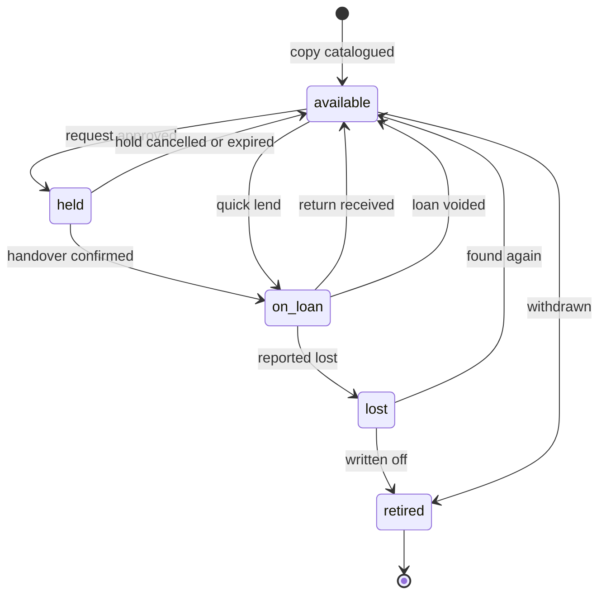
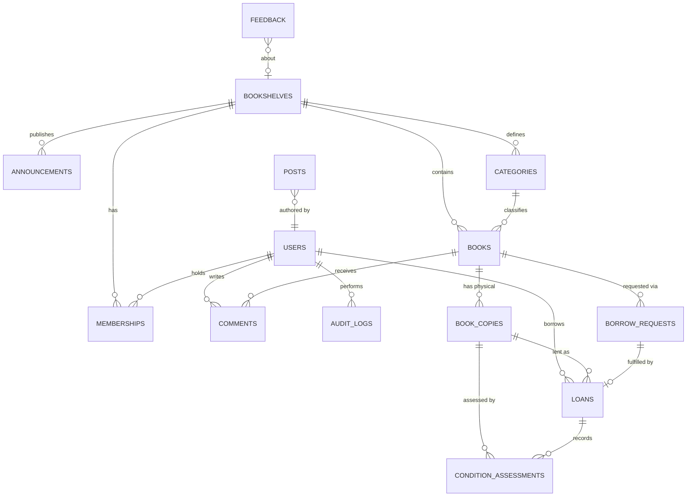

# OLibra — Master Design Specification

**Status:** Approved design, pre-implementation
**Date:** 2026-08-06
**Author:** Architecture brainstorming session
**Audience:** The engineer or AI agent implementing this system

---

## 0. What OLibra Is

OLibra is a management system for small community bookshelves — the kind kept in a church hall, run by a few volunteers, often children, holding on the order of one hundred to a few hundred books.

**It is explicitly not a public library system.** That distinction drives nearly every decision in this document. A library system optimises for catalogue scale, patron self-service, fines, and interoperability with other libraries. OLibra optimises for a volunteer standing next to a physical shelf with a phone in one hand and a book in the other. Where the two goals conflict, the volunteer wins.

The system serves three audiences:

- **Readers** (mostly children) who want to know what is on the shelf and what they can take home today.
- **Managers** (volunteers, often teenagers) who record lending and returning, approve new readers, and keep the shelf honest.
- **A super administrator** who oversees several bookshelves in different places, delegates them to local managers, and can see what every manager has done.

### 0.1 Product shape

OLibra is a single web application serving three distinct surfaces on one domain:

| Surface | Path | Purpose |
|---|---|---|
| Marketing site | `/` | Landing page, about, blog posts, contact. Public, SEO-relevant. |
| Portal | `/portal` | Directory of all bookshelves. The application's front door. |
| A bookshelf | `/portal/{slug}` | Everything functional: catalogue, borrowing, management. |
| Administration | `/quan-tri` | Super-admin oversight across all bookshelves. |

The example deployment is `tusach.js.vn`, with individual shelves at `/portal/dongthap`, `/portal/cantho`, and so on. The production domain is not yet decided; nothing in the design depends on it.

### 0.2 Delivery phases

The schema is multi-tenant from the first migration, so later phases add features rather than rewriting foundations. Build in this order:

**Phase 1 — the core loop.** Books and copies, readers and registration approval, lending and returning with condition assessment, the audit log, the manager dashboard, the public catalogue and search. A single bookshelf, but stored as one tenant among many.

**Phase 2 — community.** Borrow requests, holds, the waiting queue, comments and moderation, announcements, feedback, statistics.

**Phase 3 — the network.** The portal directory, multiple bookshelves, super-admin tooling, cross-shelf statistics, the marketing landing page and blog, per-manager audit views.

Phase 1 is a genuinely useful product on its own. If the project stalls after Phase 1, the volunteers still have something better than paper.

---

## 1. Product Analysis

### 1.1 The insight that should drive the interface

The dominant real-world interaction is a child standing at the shelf holding a book, with a volunteer holding a phone. Requests, queues, and statistics are all secondary to that moment.

Therefore the manager's primary screen is a **quick-lend flow that takes three taps**: find the book, pick the reader, confirm. Returns get the same treatment, with the condition selector defaulting to *Nguyên vẹn* so the overwhelmingly common case is a single tap.

If that flow is slow, volunteers stop using the system and revert to paper, and every other feature in this document becomes worthless. Any change that adds a step to quick-lend or quick-return needs an explicit justification.

### 1.2 Requirements the original brief did not state

These were identified during design and are all in scope.

**Retirement is distinct from deletion.** Books get too damaged to circulate, get given away, or are removed when the shelf shrinks. That is a real-world event and deserves a `retired` state. Soft deletion, by contrast, exists to undo *mistakes*. Conflating the two produces a system where you cannot tell "this book was destroyed" from "someone fat-fingered the delete button", and it corrupts historical statistics.

**Lost is a state, not a condition grade.** The original brief listed "báo mất" alongside "rách nhẹ" and "vẽ vào sách". But losing a book removes it from circulation, whereas a torn book keeps circulating. Loss belongs on the availability axis, and needs a path back for when a book turns up again.

**Readers have a lifecycle.** Children move away, grow up, or simply stop coming. Membership needs `suspended` and `left` states. A reader who has ever borrowed a book must never be hard-deleted, because that would destroy the audit history the brief explicitly requires.

**Managers can be offboarded.** The brief calls for revoking manager rights. Revocation changes a role; it never deletes a user, because their audit trail must survive them.

**Guest borrow requests are a spam vector.** An anonymous form collecting a name and phone number is an open door on the public internet. It needs rate limiting, a honeypot field, and a manager action to convert a legitimate request into a real account.

**Rejected registrations need a resolution.** They are retained with a reason for audit purposes, and the person may re-apply.

**Concurrency is a real risk.** Two managers can lend the same copy within the same second, at the same physical shelf, from two phones. This requires a database-level guarantee, not an application-level check.

**The shelf itself has properties.** Where it physically is, when it is accessible, and who holds the key — with a contact phone number, as the brief requests.

**Data export is insurance.** Volunteers plus shared hosting is a meaningful data-loss risk. CSV export of books, readers, and loans ships in Phase 1.

### 1.3 Edge cases the implementation must handle

- A hold expires because the reader never came to collect the book.
- Three readers are queued for one book and the first does not show up; the manager skips to the next.
- A renewal is requested while somebody is waiting in the queue. This is blocked.
- The same child registers twice. The manager sees a similar-name warning.
- A reader is suspended while still holding a book. The loan survives; the suspension only blocks *new* loans.
- A book is returned in worse condition than it left in.
- A book reported lost is found months later.
- A manager records a loan by mistake and needs to undo it.
- A copy is retired while other copies of the same title remain in circulation.
- Cron does not run for several hours.

### 1.4 Explicit assumptions

These were ambiguous in the brief and have been resolved as follows. Changing any of them is a design change, not an implementation detail.

1. **Timezone is `Asia/Ho_Chi_Minh`** everywhere. Dates are interpreted in that zone regardless of server configuration.
2. **There is no outbound email in v1.** The host may not provide SMTP. Manager-issued password reset is therefore the only account recovery path. The schema keeps a nullable `email` column so email-based reset can be enabled later without a migration.
3. **A manager approving a registration constitutes the consent needed to hold a minor's data.** The manager personally knows the family; that is the trust model the brief describes.
4. **"Most borrowed" counts completed handovers at the title level**, not requests and not copies. A title with three copies is not thereby three times more popular.
5. **Guest borrow requests create a lead, not an account.** A manager reviews and converts them.
6. **Public pages display readers' full names**, as the product owner decided. Date of birth, parents' names, phone number, tổ, and giáo họ remain visible only to managers and administrators. Name display is governed by a per-bookshelf setting so it can be tightened later without a code change.
7. **Vietnamese is the only shipped locale.** All user-facing strings live in language files from the first commit, and an English scaffold exists, so adding a locale is a translation task and not a refactor.
8. **A user has at most one role per bookshelf.** Roles are hierarchical: admin implies manager implies reader.

---

## 2. Domain Design

### 2.1 Entities

| Entity | Description |
|---|---|
| `Bookshelf` | The tenant. Owns everything below it except `User` and `Post`. |
| `User` | A global identity. One account works across every bookshelf. |
| `Membership` | A user's relationship to one bookshelf: role, status, parish details. **This is also the registration record.** |
| `Book` | Title-level metadata: title, author, description, cover, page count. |
| `BookCopy` | A physical object on a shelf. This is what gets lent. |
| `BorrowRequest` | A reader's or guest's expression of intent, and its lifecycle through hold to handover. |
| `Loan` | A copy in someone's hands, with a due date. |
| `ConditionAssessment` | A manager's judgement of a copy's physical state at a point in time. |
| `Comment` | A reader's comment on a book, subject to moderation. |
| `Announcement` | Shelf-scoped news, written by managers. |
| `Post` | Global blog article, written by the super admin. |
| `Feedback` | A message to the administrator, from anyone. |
| `AuditLog` | An append-only record of every state change. |

### 2.2 Aggregates

- **Book** owns its copies. A copy has no meaning without its title.
- **Loan** owns the condition assessments taken during it.
- **Membership** owns the registration data and its approval decision.
- **BorrowRequest** owns its own lifecycle, including the hold.
- **Bookshelf** is the tenancy root that scopes all of the above. It is not a transactional aggregate; you never lock a bookshelf.

### 2.3 Where profile fields live

This distinction matters and is easy to get wrong.

**On `User`** — facts about a person that are true everywhere: username, password, saint name (tên thánh), full name, date of birth, father's name, mother's name, phone, optional email, display name, locale.

**On `Membership`** — facts about that person's relationship to that specific parish: tổ (parish group), giáo họ (parish sub-community), role, status, who approved them and when.

If a family moves and registers at a different bookshelf, their identity is reused and only the parish details are re-entered.

### 2.4 Business rules (invariants)

Each of these gets a named, dedicated test. They are the specification of correctness.

| # | Rule |
|---|---|
| **INV-1** | A book copy has at most one active loan at any time. Enforced by a database unique index, not by application code. |
| **INV-2** | A copy cannot be simultaneously held and on loan. |
| **INV-3** | Only a copy in state `available` can be lent, or one in state `held` being collected by the reader who holds it. |
| **INV-4** | A reader whose membership status is not `active` cannot start a new loan. Existing loans are unaffected. |
| **INV-5** | A reader may hold at most `max_concurrent_loans` active loans per bookshelf. Default 3. |
| **INV-6** | A loan may be renewed only if renewals remain **and** no borrow request is queued for that book. A renewal extends `due_on` by `renewal_days` from the current due date, not from the day the renewal was requested. |
| **INV-7** | A copy in state `lost` or `retired` cannot be lent or held. |
| **INV-8** | Every state transition writes an audit row recording actor, timestamp, before, and after. |
| **INV-9** | A comment is publicly visible only when its status is `approved`. |
| **INV-10** | Every query is scoped to a single bookshelf, except explicit super-admin cross-shelf views. |
| **INV-11** | A loan is never deleted. Mistakes are recorded as `voided` with a reason. |
| **INV-12** | Audit log rows are never updated or deleted. |

### 2.5 State machines

**`BookCopy.state`**



Note that `voided` is a **loan** status, not a copy state. Voiding a loan recorded in error returns its copy to `available`.

Permitted transitions:

| From | To | Trigger |
|---|---|---|
| `available` | `held` | Borrow request approved |
| `available` | `on_loan` | Direct lend (quick-lend, no prior request) |
| `available` | `retired` | Manager withdraws the copy |
| `held` | `available` | Hold cancelled, or hold expired |
| `held` | `on_loan` | Handover confirmed |
| `on_loan` | `available` | Return received |
| `on_loan` | `lost` | Reported lost |
| `on_loan` | `available` | Loan voided (recorded in error) |
| `lost` | `available` | Book found again |
| `lost` | `retired` | Written off permanently |

A copy that is `on_loan` cannot be retired directly; it must first be returned or reported lost.

**`BorrowRequest.status`**

```
pending ──► approved ──► fulfilled
   │            │
   │            └──► expired        (hold lapsed, reader never collected)
   ├──► rejected                    (manager declined)
   └──► cancelled                   (reader withdrew)
```

Requests for a book whose copies are all out simply remain `pending`; the queue is the set of pending requests for that book ordered by `requested_at`. There is no separate reservation entity.

**`Loan.status`**

```
active ──► returned
   ├────► lost
   └────► voided
```

**`Membership.status`**

```
pending ──► active ⇄ suspended
   │           │
   │           └──► left
   └──► rejected
```

**`Comment.status`**: `pending` → `approved` | `rejected`; `approved` → `hidden`.

### 2.6 Derived state — a load-bearing decision

**Overdue status, hold expiry, and book availability are computed at query time from stored data and the current clock. They are never written by a scheduled job.**

The reason is the deployment target. The production host may only run cron every ten to thirty minutes. Any status that a job must *write* would be stale — and therefore wrong — for up to half an hour. A reader would see a book as available that was lent twenty minutes ago; a manager's overdue list would omit books that became overdue at midnight.

Computing these at query time makes the system correct even if cron is broken entirely. Scheduled jobs exist only to do work that is genuinely deferrable: image resizing, cache warming, backups, and cleaning up expired holds as a tidiness measure rather than a correctness one.

Concretely:

- A loan is overdue when `status = 'active' AND due_on < today()` in the application timezone.
- A hold is expired when `status = 'approved' AND hold_expires_at < now()`.
- A copy is borrowable when `state = 'available'` and no unexpired hold references it.

Query scopes encapsulate each of these so the logic exists in exactly one place.

### 2.7 Condition model

Condition is a single choice from a flat list, plus an optional free-text note and an optional photograph.

`perfect` · `slightly_worn` · `worn` · `torn` · `missing_pages` · `written_on`

Reality is often "torn *and* written on", and the rigorous model would be a condition grade plus multi-select damage flags. That was considered and rejected for v1: a single row of large buttons is dramatically easier for a child to use, and the optional photograph captures whatever the enum cannot. If the multi-select turns out to be necessary, it is an additive migration.

`lost` is deliberately absent from this list, because it is a copy *state* (see §2.5).

### 2.8 Book lifecycle

```
Acquired (donated or bought)
   → Catalogued          Book record created; one or more copies created
   → Circulating         Copies move between available / held / on_loan
   → Retired or Lost     Removed from circulation, history retained
```

A `Book` with all copies retired remains in the catalogue for historical statistics but is hidden from the public "all books" listing unless the reader explicitly asks to include withdrawn titles.

---

## 3. Database Design

### 3.1 Entity relationship diagram



### 3.2 Tables

Every tenant-scoped table carries `bookshelf_id` with a foreign key. Every table has `created_at` and `updated_at` unless noted.

---

#### `users`

Global identity. Not tenant-scoped.

| Column | Type | Notes |
|---|---|---|
| `id` | bigint PK | |
| `username` | varchar(50) | **UNIQUE**. Login identifier. |
| `password` | varchar(255) | bcrypt |
| `saint_name` | varchar(100) | Tên thánh. Required. |
| `full_name` | varchar(150) | Required. |
| `display_name` | varchar(100) | Shown publicly. Defaults to saint name + given name. |
| `date_of_birth` | date | Required. |
| `father_name` | varchar(150) | Required. |
| `mother_name` | varchar(150) | Required. |
| `phone` | varchar(20) NULL | Optional per brief. |
| `email` | varchar(150) NULL | **UNIQUE** where not null. Reserved for future email reset. |
| `avatar_path` | varchar(255) NULL | |
| `locale` | varchar(5) | Default `vi` |
| `is_super_admin` | boolean | Default false |
| `must_change_password` | boolean | Set by manager-issued reset |
| `last_login_at` | timestamp NULL | |
| `remember_token` | varchar(100) NULL | |
| `deleted_at` | timestamp NULL | Soft delete |

Indexes: `UNIQUE(username)`, `UNIQUE(email)`, `INDEX(full_name)`, `INDEX(is_super_admin)`.

---

#### `bookshelves`

| Column | Type | Notes |
|---|---|---|
| `id` | bigint PK | |
| `slug` | varchar(60) | **UNIQUE**. URL segment, e.g. `dongthap`. |
| `name` | varchar(150) | |
| `description` | text NULL | |
| `location_text` | varchar(255) NULL | Where the shelf physically stands |
| `address` | varchar(255) NULL | |
| `keeper_contact_name` | varchar(150) NULL | Displayed publicly per brief |
| `keeper_contact_phone` | varchar(20) NULL | Displayed publicly per brief |
| `opening_hours_text` | varchar(255) NULL | Free text, e.g. "Sau lễ Chúa nhật" |
| `cover_image_path` | varchar(255) NULL | |
| `timezone` | varchar(50) | Default `Asia/Ho_Chi_Minh` |
| `locale` | varchar(5) | Default `vi` |
| `status` | varchar(20) | `active` \| `archived` |
| `settings` | json | See §3.3 |
| `established_at` | date NULL | For "since the shelf began" statistics |
| `created_by_user_id` | bigint FK → users | |
| `deleted_at` | timestamp NULL | Soft delete |

Indexes: `UNIQUE(slug)`, `INDEX(status)`.

---

#### `memberships`

The registration record and the role assignment, unified.

| Column | Type | Notes |
|---|---|---|
| `id` | bigint PK | |
| `bookshelf_id` | bigint FK | |
| `user_id` | bigint FK | |
| `role` | varchar(20) | `reader` \| `manager` \| `admin` |
| `status` | varchar(20) | `pending` \| `active` \| `rejected` \| `suspended` \| `left` |
| `parish_group` | varchar(100) | Tổ. Required at registration. |
| `parish` | varchar(100) | Giáo họ. Required at registration. |
| `show_in_leaderboard` | boolean | Default true |
| `registered_at` | timestamp | |
| `approved_by_user_id` | bigint FK NULL | |
| `approved_at` | timestamp NULL | |
| `rejected_reason` | varchar(255) NULL | |
| `suspended_reason` | varchar(255) NULL | |
| `notes` | text NULL | Manager's private notes |
| `deleted_at` | timestamp NULL | Soft delete |

Indexes: `UNIQUE(bookshelf_id, user_id)`, `INDEX(bookshelf_id, status)`, `INDEX(bookshelf_id, role, status)`.

---

#### `categories`

| Column | Type | Notes |
|---|---|---|
| `id` | bigint PK | |
| `bookshelf_id` | bigint FK | |
| `name` | varchar(100) | |
| `slug` | varchar(100) | |
| `sort_order` | int | Default 0 |
| `deleted_at` | timestamp NULL | |

Indexes: `UNIQUE(bookshelf_id, slug)`.

---

#### `books`

| Column | Type | Notes |
|---|---|---|
| `id` | bigint PK | |
| `bookshelf_id` | bigint FK | |
| `category_id` | bigint FK NULL | |
| `title` | varchar(255) | |
| `slug` | varchar(255) | Unique within bookshelf |
| `title_normalized` | varchar(255) | Lowercased, diacritics stripped. See §3.4. |
| `author` | varchar(255) NULL | |
| `author_normalized` | varchar(255) NULL | |
| `publisher` | varchar(255) NULL | |
| `published_year` | smallint NULL | |
| `isbn` | varchar(20) NULL | |
| `page_count` | int NULL | |
| `description` | text NULL | |
| `cover_path` | varchar(255) NULL | |
| `language` | varchar(5) NULL | |
| `is_published` | boolean | Default true. Hides drafts from the public. |
| `created_by_user_id` | bigint FK | |
| `deleted_at` | timestamp NULL | Soft delete |

Indexes: `UNIQUE(bookshelf_id, slug)`, `INDEX(bookshelf_id, title_normalized)`, `INDEX(bookshelf_id, author_normalized)`, `INDEX(bookshelf_id, category_id)`, `INDEX(bookshelf_id, is_published)`.

---

#### `book_copies`

| Column | Type | Notes |
|---|---|---|
| `id` | bigint PK | |
| `bookshelf_id` | bigint FK | |
| `book_id` | bigint FK | Cascade on delete of book |
| `code` | varchar(30) | Human-readable label, e.g. `DT-0142`. Unique within bookshelf. Future QR payload. |
| `state` | varchar(20) | `available` \| `held` \| `on_loan` \| `lost` \| `retired` |
| `condition` | varchar(20) | See §2.7 |
| `condition_note` | varchar(500) NULL | |
| `acquired_at` | date NULL | |
| `acquired_from` | varchar(150) NULL | Donor name |
| `retired_at` | timestamp NULL | |
| `retired_reason` | varchar(255) NULL | |
| `lost_at` | timestamp NULL | |
| `deleted_at` | timestamp NULL | Soft delete |

Indexes: `UNIQUE(bookshelf_id, code)`, `INDEX(bookshelf_id, state)`, `INDEX(book_id, state)`.

---

#### `borrow_requests`

| Column | Type | Notes |
|---|---|---|
| `id` | bigint PK | |
| `bookshelf_id` | bigint FK | |
| `book_id` | bigint FK | Request is for a title, not a specific copy |
| `book_copy_id` | bigint FK NULL | Assigned on approval |
| `user_id` | bigint FK NULL | Null for guest requests |
| `guest_name` | varchar(150) NULL | |
| `guest_phone` | varchar(20) NULL | |
| `guest_note` | varchar(500) NULL | |
| `status` | varchar(20) | See §2.5 |
| `requested_at` | timestamp | Queue ordering key |
| `decided_by_user_id` | bigint FK NULL | |
| `decided_at` | timestamp NULL | |
| `decision_note` | varchar(255) NULL | |
| `hold_expires_at` | timestamp NULL | Set on approval |
| `fulfilled_loan_id` | bigint FK NULL | |
| `cancelled_at` | timestamp NULL | |
| `ip_hash` | char(64) NULL | Hashed, for guest rate limiting |
| `deleted_at` | timestamp NULL | |

Indexes: `INDEX(bookshelf_id, status)`, `INDEX(book_id, status, requested_at)`, `INDEX(user_id, status)`.

Constraint: a row must have either `user_id` or `guest_name` populated. Enforced in the Action and by a `CHECK` constraint.

---

#### `loans`

The most important table in the system.

| Column | Type | Notes |
|---|---|---|
| `id` | bigint PK | |
| `bookshelf_id` | bigint FK | |
| `book_copy_id` | bigint FK | Restrict on delete |
| `book_id` | bigint FK | **Denormalised** so statistics survive copy retirement |
| `user_id` | bigint FK | The borrower |
| `borrow_request_id` | bigint FK NULL | Null for direct quick-lends |
| `lent_by_user_id` | bigint FK | The manager who handed it over |
| `lent_at` | timestamp | |
| `due_on` | **date** | Not a timestamp. See below. |
| `status` | varchar(20) | `active` \| `returned` \| `lost` \| `voided` |
| `returned_at` | timestamp NULL | |
| `received_by_user_id` | bigint FK NULL | The manager who took it back |
| `return_condition` | varchar(20) NULL | |
| `return_condition_note` | varchar(500) NULL | |
| `return_photo_path` | varchar(255) NULL | |
| `renewals_used` | tinyint | Default 0 |
| `lost_reported_at` | timestamp NULL | |
| `lost_reported_by_user_id` | bigint FK NULL | |
| `voided_at` | timestamp NULL | |
| `voided_by_user_id` | bigint FK NULL | |
| `voided_reason` | varchar(255) NULL | |
| `notes` | text NULL | |
| `active_copy_key` | bigint **generated stored** NULL | See below |

**`due_on` is a DATE, not a timestamp.** A book is due at the end of a day, not at 14:23 on that day. Using a timestamp would produce a system where a book becomes overdue mid-afternoon, which is confusing for children and wrong for a shelf that is only accessible after Sunday mass.

**INV-1 is enforced physically** by a generated column:

```sql
active_copy_key BIGINT GENERATED ALWAYS AS (
  CASE WHEN status = 'active' THEN book_copy_id ELSE NULL END
) STORED,
UNIQUE KEY uniq_active_loan_per_copy (active_copy_key)
```

MySQL treats `NULL` values as distinct in unique indexes, so any number of returned loans coexist, but two simultaneous active loans on one copy are impossible. Two managers racing at the shelf get a clean constraint violation, which the Action catches and reports as "sách này vừa được cho mượn rồi" — rather than silently corrupting the record.

Indexes: `UNIQUE(active_copy_key)`, `INDEX(bookshelf_id, status, due_on)`, `INDEX(user_id, status)`, `INDEX(book_id, status)`, `INDEX(bookshelf_id, lent_at)`, `INDEX(lent_by_user_id, lent_at)`.

**No soft deletes on this table.** A loan recorded in error becomes `voided` with a reason. Voiding is a real event with an actor and a timestamp; deletion is not.

---

#### `condition_assessments`

Separate from `loans` because a manager may assess a copy at any time, not only at return — the brief calls for a standalone "đánh giá tình trạng sách" function.

| Column | Type | Notes |
|---|---|---|
| `id` | bigint PK | |
| `bookshelf_id` | bigint FK | |
| `book_copy_id` | bigint FK | |
| `loan_id` | bigint FK NULL | Set when assessed as part of a return |
| `assessed_by_user_id` | bigint FK | |
| `condition` | varchar(20) | |
| `note` | varchar(500) NULL | |
| `photo_path` | varchar(255) NULL | |
| `assessed_at` | timestamp | |

Indexes: `INDEX(book_copy_id, assessed_at)`, `INDEX(assessed_by_user_id, assessed_at)`.

---

#### `comments`

| Column | Type | Notes |
|---|---|---|
| `id` | bigint PK | |
| `bookshelf_id` | bigint FK | |
| `book_id` | bigint FK | |
| `user_id` | bigint FK | Readers only; no guest comments |
| `body` | varchar(2000) | Plain text, not HTML |
| `status` | varchar(20) | `pending` \| `approved` \| `rejected` \| `hidden` |
| `moderated_by_user_id` | bigint FK NULL | |
| `moderated_at` | timestamp NULL | |
| `moderation_note` | varchar(255) NULL | |
| `deleted_at` | timestamp NULL | |

Indexes: `INDEX(bookshelf_id, status, created_at)`, `INDEX(book_id, status, created_at)`.

Comments are plain text and rendered escaped. There is no rich text and no HTML, which removes the entire XSS surface from user-generated content.

---

#### `announcements`

| Column | Type | Notes |
|---|---|---|
| `id` | bigint PK | |
| `bookshelf_id` | bigint FK | |
| `title` | varchar(255) | |
| `slug` | varchar(255) | Unique within bookshelf |
| `body_html` | mediumtext | Sanitised on write |
| `body_text` | mediumtext | Derived, for excerpts and search |
| `is_pinned` | boolean | Default false |
| `published_at` | timestamp NULL | Null means draft |
| `expires_at` | timestamp NULL | |
| `author_user_id` | bigint FK | |
| `deleted_at` | timestamp NULL | |

Indexes: `UNIQUE(bookshelf_id, slug)`, `INDEX(bookshelf_id, published_at)`.

---

#### `posts`

Global blog articles. Not tenant-scoped.

| Column | Type | Notes |
|---|---|---|
| `id` | bigint PK | |
| `title` | varchar(255) | |
| `slug` | varchar(255) | **UNIQUE** |
| `excerpt` | varchar(500) NULL | |
| `body_html` | mediumtext | Sanitised on write |
| `body_text` | mediumtext | Derived |
| `cover_path` | varchar(255) NULL | |
| `published_at` | timestamp NULL | |
| `author_user_id` | bigint FK | |
| `deleted_at` | timestamp NULL | |

Indexes: `UNIQUE(slug)`, `INDEX(published_at)`.

---

#### `feedback`

| Column | Type | Notes |
|---|---|---|
| `id` | bigint PK | |
| `bookshelf_id` | bigint FK NULL | Null for site-wide feedback |
| `user_id` | bigint FK NULL | Null when submitted by a guest |
| `name` | varchar(150) NULL | |
| `contact` | varchar(150) NULL | |
| `subject` | varchar(255) NULL | |
| `body` | text | |
| `status` | varchar(20) | `new` \| `read` \| `resolved` |
| `handled_by_user_id` | bigint FK NULL | |
| `handled_at` | timestamp NULL | |
| `ip_hash` | char(64) NULL | Rate limiting |

Indexes: `INDEX(status, created_at)`, `INDEX(bookshelf_id, status)`.

---

#### `audit_logs`

Append-only. No `updated_at`, no soft delete, no model events that could rewrite it.

| Column | Type | Notes |
|---|---|---|
| `id` | bigint PK | |
| `bookshelf_id` | bigint FK NULL | Null for global actions |
| `actor_user_id` | bigint FK NULL | Null for system-originated actions |
| `action` | varchar(60) | e.g. `loan.returned`, `membership.approved` |
| `auditable_type` | varchar(100) | Polymorphic |
| `auditable_id` | bigint | |
| `before` | json NULL | |
| `after` | json NULL | |
| `context` | json NULL | IP, user agent, route name |
| `created_at` | timestamp | |

Indexes: `INDEX(bookshelf_id, created_at)`, `INDEX(auditable_type, auditable_id)`, `INDEX(actor_user_id, created_at)`, `INDEX(action, created_at)`.

The `(actor_user_id, created_at)` index is what makes the super admin's "what has manager A been doing" screen fast. That screen is a headline requirement, so the index is not optional.

---

#### Framework tables

`notifications` (Laravel database channel, in-app bell), `sessions` (database driver — no Redis on shared hosting), `jobs` and `failed_jobs` (database queue), `cache` and `cache_locks` (database cache), `password_reset_tokens` (retained for future email-based reset), `migrations`.

### 3.3 Bookshelf settings JSON

Stored as a JSON column and read through a typed `BookshelfSettings` value object with defaults, so adding a setting never requires a migration.

```json
{
  "loan_days": 14,
  "max_concurrent_loans": 3,
  "max_renewals": 1,
  "renewal_days": 7,
  "hold_days": 3,
  "due_soon_days": 3,
  "allow_guest_requests": true,
  "allow_comments": true,
  "comments_require_approval": true,
  "public_name_display": "full_name",
  "public_show_current_borrower": true,
  "leaderboard_enabled": true,
  "leaderboard_size": 10
}
```

`public_name_display` accepts `full_name`, `display_name`, or `hidden`. The product owner has chosen `full_name`; the setting exists so that decision can be revised without a code change.

### 3.4 Vietnamese search

MySQL full-text indexing handles Vietnamese diacritics poorly, and the corpus here is a few hundred books per shelf — far too small to justify an external search engine.

The approach is a pair of normalised columns. On every write, `title` and `author` are lowercased and stripped of diacritics into `title_normalized` and `author_normalized`. A search query is normalised the same way and matched with `LIKE '%term%'`.

This is fast at this scale and, importantly, means a child typing "tim kiem kho bau" on a phone without diacritics finds "Tìm Kiếm Kho Báu". Given the audience, that behaviour matters more than theoretical query efficiency.

Normalisation lives in a single `TextNormalizer` support class used by both the model observer and the search query, so the two can never drift.

### 3.5 Soft delete strategy

| Soft deletes | Never soft deleted |
|---|---|
| `users`, `memberships`, `books`, `book_copies`, `categories`, `comments`, `announcements`, `posts`, `borrow_requests`, `bookshelves` | `loans` (use `voided` status), `audit_logs` (append-only), `condition_assessments` (historical fact), `feedback` |

Soft deletion exists to undo mistakes. It is not a substitute for domain states like `retired`, `left`, or `voided`, which represent things that actually happened.

Foreign keys restrict deleting a copy that has loan history, and restrict deleting a user who has any audit trail. Only `books → book_copies` cascades.

---

## 4. Software Architecture

### 4.1 The recommendation

**Layered architecture, organised feature-first, with DDD-lite tactical patterns. Single-purpose Action classes. No repository pattern. No third-party permissions package.**

### 4.2 Why Actions rather than Services

A `LoanService` inevitably grows into a nine-hundred-line class with twenty loosely related methods, shared private helpers, and a constructor injecting eight dependencies. Every change touches the same file; every merge conflicts.

Single-purpose Action classes — `LendBookAction`, `ReceiveReturnAction`, `ApproveMembershipAction` — each expose one `execute()` method, have one reason to change, and inject only what they use.

**This is the highest-leverage decision for AI-assisted development**, which is an explicit goal of this project. An agent asked to change how lending works opens exactly one file and sees the entire operation: validation, state transition, audit write, event dispatch. There is no hunting through a god object, and no risk of breaking an unrelated operation that happened to share a private helper.

### 4.3 Why no repository pattern

Eloquent is already the data-access abstraction. A repository wrapping Eloquent adds a layer with no second implementation behind it — there is no plan to swap MySQL for something else, and if there were, Eloquent already abstracts that.

Worse, repositories actively harm this codebase: they obscure eager loading, which is the main tool against N+1 queries, and they push developers toward `findAll()`-style methods that fetch too much.

Tests run against a real database. Complex read paths live in dedicated **Query** classes (`OverdueLoansQuery`, `ShelfStatisticsQuery`), which give the readability benefit repositories are supposed to provide without the indirection.

### 4.4 Why no permissions package

`spatie/laravel-permission` is excellent for systems with dynamic, database-defined permissions. OLibra has three roles and one global flag, known at compile time.

A PHP enum permission map consulted by Laravel Policies is clearer, faster (no queries, no cache invalidation), fully type-checked, and has zero dependencies. The extensibility path, should per-user exceptions ever be needed, is a nullable `permissions` JSON column on `memberships` that the policy consults as an override — additive, and still no package.

### 4.5 Layers

```
┌─────────────────────────────────────────────────────┐
│ HTTP           Controllers, FormRequests,           │
│                Inertia responses, Resources/DTOs,   │
│                Middleware                           │
├─────────────────────────────────────────────────────┤
│ Application    Actions (write), Queries (read),     │
│                Policies, Events, Listeners,         │
│                Notifications                        │
├─────────────────────────────────────────────────────┤
│ Domain         Models, Enums, State transitions,    │
│                Domain exceptions, Value objects     │
├─────────────────────────────────────────────────────┤
│ Infrastructure Migrations, Jobs, Storage,           │
│                Console commands, External services  │
└─────────────────────────────────────────────────────┘
```

**Dependency rule:** each layer may depend only on layers below it. A Model never references a Controller; an Action never returns an Inertia response.

Controllers are thin: authorise, validate via a FormRequest, call one Action or Query, return a response. A controller method longer than fifteen lines is a design smell.

### 4.6 Tenancy — structural, not disciplinary

Tenant isolation is the highest-consequence security property in the system. It must not depend on developers remembering to add `where('bookshelf_id', ...)`.

Three mechanisms combine:

1. **Route model binding** on `{bookshelf:slug}` resolves the tenant from the URL.
2. **`ResolveBookshelf` middleware** binds a `CurrentBookshelf` singleton into the container and aborts with 404 for archived or missing shelves.
3. **`BelongsToBookshelf` trait** adds an Eloquent global scope filtering by the current bookshelf, *and* auto-fills `bookshelf_id` on create.

With all three in place, cross-tenant leakage requires deliberately calling `withoutGlobalScope`. Super-admin cross-shelf queries do exactly that, explicitly and in named Query classes only — never in a controller.

### 4.7 Auditing

Two complementary mechanisms write to `audit_logs`:

**An `Auditable` trait plus model observer** captures attribute-level changes on create, update, and delete. This gives the "previous value / new value" record the brief requires, automatically, for every tracked model. Sensitive attributes (`password`, `remember_token`) are excluded by an allowlist.

**Explicit `AuditLogger::log()` calls inside Actions** record domain events that are not simple attribute diffs — "manager approved this registration", "manager skipped this reader in the queue". These carry a meaningful `action` string that the audit browser can filter and label.

Both run inside the same database transaction as the change they describe, so an audit row and its subject can never diverge.

### 4.8 Events and queues

Events are dispatched for genuinely cross-cutting reactions: `BookLent`, `BookReturned`, `MembershipApproved`, `BorrowRequestApproved`, `CommentPosted`. Listeners send in-app notifications and invalidate statistics caches.

**Events are not used for auditing.** Auditing happens synchronously inside the Action's transaction, because an audit trail that can be lost to a failed queue job is not an audit trail.

The queue uses the database driver and carries only deferrable work: cover image resizing, CSV export generation, statistics cache warming, database backups. Nothing a user waits on goes through a queue, because the queue may not drain for thirty minutes.

### 4.9 Scheduled work

A single cron entry runs `schedule:run`. Every scheduled task is written to be correct when run at irregular intervals, and harmless when skipped entirely.

| Command | Frequency | Purpose |
|---|---|---|
| `queue:work --stop-when-empty --max-time=280` | Every run | Drain the queue |
| `olibra:expire-holds` | Hourly | Tidy up expired holds. Correctness already comes from query-time computation; this only keeps the data clean. |
| `olibra:refresh-statistics` | Hourly | Warm cached aggregate counts |
| `olibra:backup-database` | Daily | mysqldump to storage, retain 7 |
| `model:prune` | Daily | Prune old notifications and soft-deleted records past retention |
| `auth:clear-resets` | Daily | Expire stale reset tokens |

---

## 5. Backend Design

### 5.1 Folder structure

```
app/
├── Domain/
│   ├── Catalog/
│   │   ├── Models/            Book, BookCopy, Category
│   │   ├── Actions/           CreateBookAction, AddBookCopyAction, …
│   │   ├── Queries/           CatalogQuery, BookDetailQuery
│   │   ├── Enums/             CopyState, CopyCondition
│   │   ├── Policies/          BookPolicy, BookCopyPolicy
│   │   └── Events/            CopyRetired, CopyReportedLost
│   ├── Circulation/
│   │   ├── Models/            Loan, BorrowRequest, ConditionAssessment
│   │   ├── Actions/           LendBookDirectlyAction, ReceiveReturnAction, …
│   │   ├── Queries/           OverdueLoansQuery, RequestQueueQuery
│   │   ├── Enums/             LoanStatus, BorrowRequestStatus
│   │   ├── Policies/
│   │   ├── Events/            BookLent, BookReturned, BookReportedLost
│   │   └── Exceptions/        CopyNotAvailableException, LoanLimitReachedException
│   ├── Identity/
│   │   ├── Models/            User, Membership, Bookshelf
│   │   ├── Actions/           RegisterMembershipAction, ApproveMembershipAction, …
│   │   ├── Queries/
│   │   ├── Enums/             Role, MembershipStatus, Permission
│   │   ├── Policies/
│   │   └── ValueObjects/      BookshelfSettings
│   ├── Community/
│   │   ├── Models/            Comment, Announcement, Post, Feedback
│   │   ├── Actions/
│   │   ├── Queries/
│   │   ├── Enums/
│   │   └── Policies/
│   └── Audit/
│       ├── Models/            AuditLog
│       ├── AuditLogger.php
│       ├── Concerns/          Auditable trait
│       ├── Observers/         AuditObserver
│       ├── Queries/           ManagerActivityQuery, AuditTrailQuery
│       └── Enums/             AuditAction
├── Http/
│   ├── Controllers/
│   │   ├── Public/            LandingController, BlogController, PortalController,
│   │   │                      ShelfHomeController, CatalogController,
│   │   │                      BookDetailController, SearchController,
│   │   │                      RegistrationController, FeedbackController
│   │   ├── Auth/              LoginController, PasswordController
│   │   ├── Reader/            MyLoansController, MyRequestsController,
│   │   │                      ProfileController, CommentController
│   │   ├── Manager/           DashboardController, QuickLendController,
│   │   │                      ReceiveReturnController, BookController,
│   │   │                      BookCopyController, ReaderController,
│   │   │                      RegistrationApprovalController,
│   │   │                      RequestQueueController, OverdueController,
│   │   │                      CommentModerationController,
│   │   │                      AnnouncementController, StatisticsController,
│   │   │                      ExportController
│   │   └── Admin/             BookshelfController, ManagerAssignmentController,
│   │                          SuperAdminController, AuditLogController,
│   │                          CrossShelfStatisticsController, PostController,
│   │                          FeedbackInboxController
│   ├── Requests/              One FormRequest per write endpoint
│   ├── Resources/             Inertia DTO shapers
│   ├── Middleware/            ResolveBookshelf, EnsureMembershipActive,
│   │                          EnsureSuperAdmin, ShareInertiaData
│   └── Kernel-level config
├── Support/                   TextNormalizer, HtmlSanitizer, DateHelper
├── Jobs/                      ResizeCoverImage, GenerateCsvExport, …
├── Notifications/             RegistrationApproved, BorrowRequestApproved, …
├── Console/Commands/          ExpireHolds, RefreshStatistics, BackupDatabase
└── Providers/
```

### 5.2 Action inventory

**Catalog** — `CreateBookAction`, `UpdateBookAction`, `DeleteBookAction`, `AddBookCopyAction`, `UpdateBookCopyAction`, `RetireBookCopyAction`, `ReportCopyLostAction`, `MarkCopyFoundAction`, `AssessCopyConditionAction`, `UploadBookCoverAction`.

**Circulation** — `SubmitBorrowRequestAction`, `ApproveBorrowRequestAction` (creates the hold), `RejectBorrowRequestAction`, `CancelBorrowRequestAction`, `HandOverBookAction` (hold → loan), `LendBookDirectlyAction` (quick lend), `ReceiveReturnAction`, `RenewLoanAction`, `ReportLoanLostAction`, `VoidLoanAction`, `SkipQueueEntryAction`, `ExpireHoldAction`.

**Identity** — `RegisterMembershipAction`, `ApproveMembershipAction`, `RejectMembershipAction`, `SuspendMembershipAction`, `ReactivateMembershipAction`, `CreateReaderByManagerAction`, `IssuePasswordResetAction`, `ChangePasswordAction`, `UpdateProfileAction`, `CreateBookshelfAction`, `UpdateBookshelfAction`, `AssignManagerAction`, `RevokeManagerAction`, `PromoteSuperAdminAction`, `DemoteSuperAdminAction`.

**Community** — `PostCommentAction`, `ApproveCommentAction`, `RejectCommentAction`, `HideCommentAction`, `PublishAnnouncementAction`, `PublishPostAction`, `SubmitFeedbackAction`, `ResolveFeedbackAction`.

### 5.3 Action anatomy

Every Action follows the same shape, which makes them predictable for humans and agents alike:

1. Accept a typed data object or explicit scalar parameters — never a raw `Request`.
2. Open a database transaction.
3. Re-check invariants **inside** the transaction, with row locking where a race is possible.
4. Mutate models.
5. Write the audit entry through `AuditLogger`.
6. Commit.
7. Dispatch events after commit.
8. Return the created or modified model.

Invariant violations throw a domain exception (`CopyNotAvailableException`, `LoanLimitReachedException`), which a handler maps to a friendly Vietnamese message. Actions never return `false` or `null` to signal failure.

`LendBookDirectlyAction` additionally catches the unique-constraint violation on `active_copy_key` and rethrows it as `CopyNotAvailableException`, so the database race and the application check produce the same user-facing message.

### 5.4 Notifications

In-app only, via Laravel's `database` channel, surfaced as a bell icon with unread count. There is no mail channel configured in v1.

**To readers:** `RegistrationApproved`, `RegistrationRejected`, `BorrowRequestApproved` (with collection deadline), `BorrowRequestRejected`, `BookReadyForCollection`, `LoanDueSoon`, `LoanOverdue`, `CommentApproved`.

**To managers:** none pushed. Managers work from dashboard badge counts, per the product decision. This avoids notification fatigue for volunteers and removes any dependency on timely cron.

---

## 6. Frontend Design

### 6.1 Stack and rationale

**Inertia.js 2 + React 19 + TypeScript + Vite + TailwindCSS + shadcn/ui.**

Inertia was chosen over a standalone SPA with a REST API for reasons that are all specific to this project's constraints:

- **One deployable.** A single Laravel application on cPanel. No CORS configuration, no token storage, no separate frontend hosting, no API versioning burden.
- **Session authentication**, which is simpler and safer than tokens in a browser, and requires no client-side token refresh logic.
- **Assets are built in CI and uploaded as static files.** Zero Node processes in production, which was a hard requirement.
- **Server-rendered navigation** gives a public book catalogue better first-paint and SEO than a client-rendered SPA.
- **Everything valuable from the SPA option is retained**: React, TypeScript, Vite, Tailwind, shadcn/ui, React Hook Form. What is dropped is React Router and TanStack Query — both of which Inertia replaces, meaning strictly less code.

The cost is that there is no standalone REST API. Because all business logic lives in Action classes, adding a versioned `/api/v1` later means writing thin controllers over the same Actions — no refactor of anything that matters.

### 6.2 Routing

Laravel's router *is* the application router. Ziggy exposes named routes to TypeScript. There is no client-side route table to keep in sync.

URLs are in Vietnamese, which suits the audience and reads well in search results.

```
Public
  GET  /                                        Landing
  GET  /gioi-thieu                              About
  GET  /bai-viet                                Blog index
  GET  /bai-viet/{post:slug}                    Blog article
  GET  /lien-he                                 Contact
  POST /gop-y                                   Submit site-wide feedback

Portal and bookshelf
  GET  /portal                                  Bookshelf directory
  GET  /portal/{bookshelf:slug}                 Shelf home
  GET  /portal/{bookshelf:slug}/sach            Catalogue (?trang_thai=con-sach|tat-ca)
  GET  /portal/{bookshelf:slug}/sach/{book:slug} Book detail
  GET  /portal/{bookshelf:slug}/tim-kiem        Search results
  GET  /portal/{bookshelf:slug}/thong-bao       Announcements
  GET  /portal/{bookshelf:slug}/thong-bao/{a:slug}
  GET  /portal/{bookshelf:slug}/bang-xep-hang   Top books and readers
  GET  /portal/{bookshelf:slug}/dang-ky         Registration form
  POST /portal/{bookshelf:slug}/dang-ky
  POST /portal/{bookshelf:slug}/sach/{book}/yeu-cau-muon
  POST /portal/{bookshelf:slug}/gop-y

Authentication
  GET|POST /dang-nhap
  POST     /dang-xuat
  GET|PUT  /doi-mat-khau

Reader
  GET  /portal/{shelf}/toi                      My dashboard
  GET  /portal/{shelf}/toi/dang-muon            Current loans
  GET  /portal/{shelf}/toi/lich-su              Borrowing history
  GET  /portal/{shelf}/toi/yeu-cau              My requests
  POST /portal/{shelf}/toi/yeu-cau/{r}/huy      Cancel request
  POST /portal/{shelf}/toi/muon/{loan}/gia-han  Renew
  GET|PUT /portal/{shelf}/toi/ho-so             Profile
  POST /portal/{shelf}/sach/{book}/binh-luan    Post comment

Manager  (prefix /portal/{shelf}/quan-ly)
  GET  /                                        Dashboard
  GET|POST /cho-muon                            Quick lend
  GET|POST /nhan-tra                            Receive return
  resource /sach                                Books
  resource /sach/{book}/ban-sao                 Copies
  POST /ban-sao/{copy}/danh-gia                 Assess condition
  POST /ban-sao/{copy}/bao-mat                  Report lost
  POST /ban-sao/{copy}/tim-thay                 Mark found
  POST /ban-sao/{copy}/ngung-su-dung            Retire
  GET  /nguoi-doc                               Readers
  GET  /nguoi-doc/{membership}                  Reader detail
  POST /nguoi-doc/{membership}/duyet            Approve registration
  POST /nguoi-doc/{membership}/tu-choi          Reject
  POST /nguoi-doc/{membership}/tam-khoa         Suspend
  POST /nguoi-doc/{membership}/dat-lai-mat-khau Issue password reset
  POST /nguoi-doc/tao-moi                       Create reader on their behalf
  GET  /dang-ky-cho-duyet                       Pending registrations
  GET  /yeu-cau-muon                            Request queue
  POST /yeu-cau-muon/{r}/duyet                  Approve → hold
  POST /yeu-cau-muon/{r}/tu-choi                Reject
  POST /yeu-cau-muon/{r}/trao-sach              Handover → loan
  POST /yeu-cau-muon/{r}/bo-qua                 Skip to next in queue
  GET  /qua-han                                 Overdue
  GET  /binh-luan                               Comment moderation
  POST /binh-luan/{c}/duyet
  POST /binh-luan/{c}/tu-choi
  resource /thong-bao                           Announcements
  GET  /thong-ke                                Statistics
  GET  /xuat-du-lieu                            CSV export

Administration  (prefix /quan-tri, super admin only)
  GET  /                                        Admin dashboard
  resource /tu-sach                             Bookshelves
  GET  /quan-ly-vien                            Managers across all shelves
  POST /tu-sach/{shelf}/quan-ly-vien            Assign manager
  DELETE /tu-sach/{shelf}/quan-ly-vien/{m}      Revoke
  POST /nguoi-dung/{user}/cap-quyen-admin       Promote to super admin
  GET  /nhat-ky                                 Audit log browser
  GET  /nhat-ky/quan-ly-vien/{user}             Per-manager activity
  GET  /thong-ke                                Cross-shelf statistics
  resource /bai-viet                            Global blog posts
  GET  /gop-y                                   Feedback inbox
```

### 6.3 Page and component structure

```
resources/js/
├── app.tsx                       Inertia bootstrap
├── layouts/
│   ├── PublicLayout.tsx          Marketing + portal
│   ├── ShelfLayout.tsx           Public shelf pages
│   ├── ReaderLayout.tsx
│   ├── ManagerLayout.tsx         Sidebar desktop, bottom tabs mobile
│   ├── AdminLayout.tsx
│   └── AuthLayout.tsx
├── pages/
│   ├── public/                   Landing, Blog, Portal, ShelfHome, Catalog,
│   │                             BookDetail, Search, Register, Announcements
│   ├── auth/                     Login, ChangePassword
│   ├── reader/                   Dashboard, CurrentLoans, History, Requests, Profile
│   ├── manager/                  Dashboard, QuickLend, ReceiveReturn, Books/*,
│   │                             Copies/*, Readers/*, Registrations, RequestQueue,
│   │                             Overdue, Comments, Announcements/*, Statistics
│   └── admin/                    Dashboard, Bookshelves/*, Managers, AuditLog,
│                                 ManagerActivity, Statistics, Posts/*, Feedback
├── components/
│   ├── ui/                       shadcn/ui primitives
│   ├── book/                     BookCard, BookGrid, CoverImage, AvailabilityBadge,
│   │                             ConditionBadge, CopyList
│   ├── circulation/              LendForm, ReturnForm, ConditionPicker,
│   │                             DueDateBadge, LoanTimeline, QueueList
│   ├── reader/                   ReaderPicker, ReaderCard, RegistrationReviewCard
│   ├── data/                     DataTable, ResponsiveTable, EmptyState,
│   │                             Pagination, FilterBar, SearchInput
│   ├── feedback/                 Toast, ConfirmDialog, ErrorState, LoadingSkeleton
│   ├── editor/                   RichTextEditor (lazy-loaded Tiptap)
│   └── charts/                   BarChart, LineChart, StatTile
├── hooks/                        useInertiaForm, useConfirm, useDebounce,
│                                 usePermissions, useCurrentShelf
├── lib/                          ziggy, cn, formatters, validators (Zod schemas)
└── types/                        Generated TypeScript types mirroring PHP DTOs
```

### 6.4 State management

There is no client state library, and that is deliberate.

- **Server state** arrives as Inertia page props. There is no cache to invalidate, because a successful mutation triggers a partial reload and the server sends fresh data.
- **Shared state** — the authenticated user, current bookshelf, flash messages, unread notification count, pending-item badge counts — comes through Inertia shared props, typed once in `types/inertia.d.ts`.
- **Local UI state** uses `useState`. Dialogs, expanded rows, and filter drafts are local by definition.
- **Deferred props** (an Inertia 2 feature) load dashboard statistics after the initial render, so the manager dashboard paints immediately and fills in its charts a moment later.

### 6.5 Forms

**React Hook Form + Zod for every form**, submitted through Inertia's router.

Mixing Inertia's own `useForm` with React Hook Form would put two error-handling idioms in one codebase, so a single `useInertiaForm` hook wraps the combination: it takes a Zod schema, validates on the client for immediate feedback, submits via `router.post`, and maps Laravel's 422 validation errors back into React Hook Form's error state so both sources render identically.

Zod schemas live in `lib/validators` and mirror the PHP FormRequest rules. The two are kept aligned by convention and by feature tests that assert the server rejects what the client would reject.

### 6.6 Error and loading states

**Errors.** Laravel exception pages render through Inertia into a single `Error.tsx` page handling 403, 404, 419, 429, and 500 with plain-language Vietnamese explanations and a route back to safety. Field validation renders inline beneath inputs. Domain exceptions surface as toast messages with the Action's friendly message. A React error boundary wraps each layout so a component crash degrades one region rather than blanking the page.

**Loading.** Inertia's progress bar covers navigation. Skeleton components cover deferred props. Every button that triggers a mutation disables itself and shows a spinner while in flight, which also prevents the double-submit that would otherwise create duplicate loans.

### 6.7 Rich text editing

**Tiptap v3**, with a minimal MIT extension set: StarterKit, Link, Image, and Placeholder.

Tiptap was chosen over BlockNote because BlockNote is built on top of Tiptap, so choosing it means shipping ProseMirror plus Tiptap plus BlockNote's own block UI and styling layer. Tiptap alone is materially lighter, and the block-based editing model BlockNote adds is not needed for announcements and blog posts.

The editor is **lazy-loaded via dynamic import** so it never enters the public bundle and only downloads when a manager or admin opens an editing screen.

Content is stored as **HTML sanitised server-side** against a strict allowlist (headings, paragraphs, bold, italic, lists, links, images, blockquote, horizontal rule — nothing else, no inline styles, no scripts, no iframes). A derived plain-text column supports excerpts and search. Sanitisation happens on write in the Action, never on read, so stored data is always safe.

### 6.8 Internationalisation

All user-facing strings live in `resources/lang/vi/` from the first commit, with an `en/` scaffold. No string is ever hard-coded in a component.

The active locale comes from the user's preference, falling back to the bookshelf's locale, falling back to `vi`. Translations reach React through a shared Inertia prop and a `t()` helper.

Dates and numbers are formatted with `Intl` APIs using the active locale, never with hand-written format strings.

---

## 7. UX Design

### 7.1 Guest and public pages

**Landing (`/`).** What OLibra is, in one sentence, above the fold. A prominent path into the portal. Three or four recent blog posts. Deliberately light — this page exists to explain the project to someone who has heard about it, not to convert anyone.

**Portal (`/portal`).** A card per bookshelf: name, location, book count, active reader count, keeper contact. Search or filter by place if the number ever grows. This is the front door for anyone arriving without a direct link.

**Shelf home (`/portal/{slug}`).** The most important public page. In order down the page:
1. Shelf identity — name, where it is, when it is open, who holds the key with a tappable phone number.
2. Announcements — pinned first, most recent next.
3. Two large buttons: **"Sách đang có"** and **"Toàn bộ tủ sách"**. These are the primary actions and should be impossible to miss.
4. Most-borrowed books, as a horizontally scrollable cover row.
5. Most-active readers.
6. Latest approved comments.
7. A quiet link to send feedback to the administrator.

**Catalogue.** A cover-forward responsive grid — two columns on phones, up to six on desktop. Each card shows cover, title, author, and an availability badge. A filter bar offers availability, category, and sort. The available/all toggle is a segmented control, not a dropdown, because it is the single most-used control on the page.

**Book detail.** Cover and title at the top. Below it, a clear availability panel that changes with state:
- *Available*: green badge, copy count if more than one, and a large **"Xin mượn"** button.
- *On loan*: amber badge showing who has it and for how many days, plus how many people are already queued, and a **"Xin mượn"** button that joins the queue with an honest label — "Đăng ký chờ mượn".

Then metadata (author, page count, category, publisher), the description, and approved comments with a comment box for logged-in readers. Managers additionally see per-copy state, condition history, and the full loan history for the title.

Pressing "Xin mượn" branches: a logged-in reader submits immediately with a confirmation dialog; a guest gets a short form asking for name and phone, explaining that a manager will contact them.

**Search.** Live results as the reader types, matching title and author, diacritic-insensitive. Empty state suggests popular books rather than showing nothing.

**Registration.** A single page, not a wizard — the field count is manageable and volunteers guide children through it in person. Fields grouped as *Đăng nhập* (username, password), *Bản thân* (saint name, full name, date of birth), *Gia đình* (father, mother, phone), *Giáo xứ* (tổ, giáo họ). Every field states why it is needed. On submit, a clear confirmation that a manager must approve the account and roughly what happens next.

### 7.2 Reader pages

**My dashboard.** Books currently held, each with days remaining rendered as a coloured badge, and a renew button where permitted. Pending requests with their queue position. Recent history.

**Borrowing history.** A reverse-chronological list with the return condition shown, so a reader can see their own record.

**Profile.** View and edit personal details, change password, and toggle leaderboard visibility.

### 7.3 Manager pages

**Dashboard.** Four large tappable stat cards across the top, taken directly from the brief's requirements: *Quá hạn*, *Chờ duyệt tài khoản*, *Yêu cầu mượn*, *Bình luận chờ duyệt*. Each card navigates to its filtered list. Below them, two very large primary buttons — **"Cho mượn"** and **"Nhận trả"** — sized for a thumb. Then shelf totals, and recent activity.

**Quick lend.** The most important screen in the application.
1. Find the book — search box focused on load, results as cover-and-title rows.
2. Pick the reader — searchable list of active members, with a "register a new reader" escape hatch.
3. Confirm — shows book, reader, and the calculated due date; one button.

If the title has several copies, a copy selector appears between steps one and two. If it has one copy, that step does not exist.

Blocking conditions (reader at loan limit, copy already lent, membership not active) surface as a clear message *before* the confirm step, never as an error afterwards.

**Receive return.**
1. Find the loan — search the currently-borrowed list by book or reader.
2. Assess condition — a row of large buttons with icons, *Nguyên vẹn* preselected. An optional note and photo appear only if a worse condition is chosen.
3. Confirm.

The common case — an undamaged book — is two taps.

If anyone is queued for that title, the confirmation screen says so immediately and offers to approve the first person in the queue. Nothing happens automatically: the manager decides, because the next reader may not be standing there.

**Books.** A responsive list with search and filters; a table on desktop, stacked cards on mobile. The create and edit form is single-column with the cover uploader first, since a photograph is the strongest recognition cue.

**Copies.** Managed within a book's detail page. Each copy shows its code, state, condition, and actions: assess, report lost, mark found, retire.

**Readers.** Searchable list with status filters. Detail view shows the full profile — including the manager-only fields — current loans, complete history, and administrative actions.

**Pending registrations.** A review card per application, laying out exactly the fields the manager must verify in person, with prominent Approve and Reject buttons and a required reason on rejection. A similar-name warning appears when an existing member closely matches, to catch duplicate registrations.

**Request queue.** Grouped by book, ordered by request time. Each entry offers Approve (creating a hold with a visible expiry), Reject, and — once approved — Handover, plus Skip for when a reader does not come.

**Overdue.** Sorted by how overdue, showing borrower and contact phone so the manager can follow up in person. That phone number is the actual mechanism by which books come back, so it must be tappable.

**Comment moderation.** Pending comments with the book, the reader, and the text, with Approve and Reject.

**Statistics.** Period selector (week, month, year, since the shelf began), showing loans, distinct borrowers, books added, and books lost, with bar charts over time and ranked lists of top books and top readers.

### 7.4 Administration pages

**Admin dashboard.** One row per bookshelf: name, books, active readers, current loans, overdue count, and pending items. Anything needing attention is flagged.

**Bookshelves.** Create and edit shelves, including the slug that becomes the URL, the loan policy settings, and keeper contact details. The slug is immutable after creation, since it appears in shared links.

**Managers.** Every manager across every shelf, with the ability to assign, revoke, and promote to super admin. Revocation requires confirmation and states plainly that history is retained.

**Audit log browser.** Filterable by shelf, actor, action type, and date range, rendering each entry as a readable Vietnamese sentence — "Quản lý Maria Lan đã cho Giuse Minh mượn *Dế Mèn Phiêu Lưu Ký* lúc 14:32 ngày 03/08" — with the raw before/after JSON available on expansion. Readable-by-default is the requirement; the JSON is for when something is genuinely being investigated.

**Per-manager activity.** Everything one manager has done, grouped by type — books added, loans made, returns received, conditions assessed, registrations approved — which is precisely the oversight the brief asks for.

**Feedback inbox.** Messages from readers and guests, markable read and resolved.

---

## 8. UI Design

### 8.1 Design principles

The interface serves children who may be reading fluently for only a few years, and adult volunteers who may not use smartphones confidently. Both are served by the same things: large targets, plain words, high contrast, and obvious next actions.

Three rules govern every screen:

1. **One primary action per screen**, visually dominant. If two things look equally important, neither is.
2. **Status is never carried by colour alone.** Every state has an icon, a word, and a colour, so it survives colour blindness, glare, and cheap screens.
3. **Plain Vietnamese, no jargon.** "Cho mượn", never "Giao dịch lưu thông".

### 8.2 Colour

A warm, calm palette that reads as a community bookshelf rather than enterprise software. Defined as CSS custom properties following the shadcn/ui token structure, so dark mode is a variable swap.

| Token | Light | Purpose |
|---|---|---|
| `--background` | Warm off-white | Page |
| `--foreground` | Near-black warm grey | Body text |
| `--primary` | Deep amber / terracotta | Primary actions |
| `--secondary` | Warm stone | Secondary surfaces |
| `--muted` | Light warm grey | Meta text, borders |
| `--accent` | Soft teal | Highlights, links |
| `--destructive` | Clear red | Destructive actions |

Semantic status colours, each always paired with an icon and a label:

| State | Colour | Icon | Label |
|---|---|---|---|
| Available | Green | `BookOpen` | Còn sách |
| On loan | Amber | `BookMarked` | Đang mượn |
| Held | Blue | `Bookmark` | Đang giữ chỗ |
| Overdue | Red | `AlertTriangle` | Quá hạn |
| Lost | Dark red | `HelpCircle` | Đã mất |
| Retired | Grey | `Archive` | Ngừng dùng |

All text meets WCAG AA contrast; primary actions and status badges target AAA where achievable.

### 8.3 Typography and spacing

Base 16px on public pages, 17px in the manager interface where volunteers work fastest. Line height 1.6 for body copy. A single sans-serif family with good Vietnamese diacritic support — Be Vietnam Pro or Inter, self-hosted with `font-display: swap`, never loaded from a third-party CDN.

Spacing uses Tailwind's 4px scale, restricted to `2, 3, 4, 6, 8, 12, 16` so the rhythm stays consistent. Cards use 16px padding on mobile and 24px on desktop.

Touch targets are minimum 44×44px, with primary action buttons at 56px tall. Interactive elements never sit closer than 8px apart.

### 8.4 Components

**Cards** carry a subtle border rather than a heavy shadow. Book cards are cover-dominant with a 2:3 aspect ratio, title clamped to two lines, author to one, and an availability badge pinned to the cover's corner. Missing covers get a generated placeholder using the title's initial over a colour derived from the title, so the grid never looks broken.

**Tables** become stacked cards below 768px — not horizontally scrolling tables, which are unusable on a phone. Each card leads with the identifying field and shows the two or three most relevant others. Sorting is a select on mobile and column headers on desktop.

**Forms** are single-column always. Labels sit above inputs, never beside them. Required fields are marked with a word, not only an asterisk. Errors appear beneath the field in red with an icon, and the first error receives focus on submit. Inputs are 48px tall.

**The condition picker** is a row of large icon buttons rather than a dropdown, because it is used constantly and speed matters. Selection is shown by a filled background and a check, not by colour alone.

**Charts** use Recharts and are limited to bar and line — no pie charts, which are hard to read and worse when printed or screenshotted. Every chart has a text summary above it, so the information is available without interpreting the graphic.

**Icons** come from Lucide, at 20px inline and 24px standalone. Icons never appear without a text label in navigation or actions.

### 8.5 Navigation and mobile layout

Public navigation is a top bar: shelf name, catalogue, announcements, search, and login. It collapses to a hamburger below 768px.

The manager interface uses a sidebar on desktop and a **five-item bottom tab bar on mobile** — *Trang chính*, *Sách*, *Cho mượn*, *Người đọc*, *Thêm*. Five is the ceiling; anything else lives behind *Thêm*.

The manager's mobile layout is the primary manager experience, not a degraded fallback. Volunteers work standing at a shelf with a phone in one hand. Every manager screen is designed at 375px first and expanded from there, and the two most frequent actions — lend and return — are reachable in one tap from anywhere.

### 8.6 Dark mode

Implemented with CSS custom properties and Tailwind's `dark:` variant. It follows the system preference by default, can be overridden with a toggle, and persists to `localStorage` and to the user's profile when logged in. Both themes are checked for AA contrast; dark mode uses a warm near-black rather than pure black, which is easier to read at length.

---

## 9. API Design

### 9.1 Internal endpoints

The application's own endpoints are conventional Inertia routes as listed in §6.2, not a REST API. They return Inertia responses for GET and redirect-with-flash for writes.

Conventions:

- Route names are dot-namespaced by area: `manager.books.store`, `reader.loans.renew`, `admin.bookshelves.index`.
- Write endpoints validate through a dedicated FormRequest.
- Write endpoints redirect back with a flash message rather than returning JSON.
- Lists paginate at 24 items for grids and 50 for tables, using Laravel's paginator serialised into Inertia props.
- Filtering, sorting, and search live in query strings with Vietnamese parameter names matching the UI (`?trang_thai=`, `?sap_xep=`, `?tim=`), preserved across pagination.

### 9.2 The future public API

No REST API ships in v1, per the design decision in §6.1. When one is needed, it follows these rules, which are stated now so the door stays open:

- Base path `/api/v1`, versioned in the URL.
- Authentication via Laravel Sanctum tokens.
- Plural nouns, kebab-case: `/api/v1/bookshelves/{slug}/books`.
- JSON:API-flavoured envelopes with `data`, `meta`, and `links`.
- Authorisation through the same Policies used by the web interface.
- Controllers stay thin, delegating to the same Actions. **No business logic is duplicated between web and API.**

That last rule is the reason the Action pattern was chosen, and it is what makes deferring the API safe.

---

## 10. Permission Model

### 10.1 Roles

| Role | Scope | Description |
|---|---|---|
| `guest` | — | Not authenticated. Read-only public access. |
| `reader` | Per bookshelf | An approved member. |
| `manager` | Per bookshelf | Runs day-to-day operations for that shelf. |
| `admin` | Per bookshelf | A manager who can also administer that shelf. |
| `super_admin` | Global | A flag on the user. Can do anything, anywhere. |

Roles are hierarchical within a shelf: `admin` ⊃ `manager` ⊃ `reader`. A user holds at most one membership per bookshelf, and may hold memberships in several bookshelves with different roles in each.

### 10.2 Permissions

A `Permission` enum, mapped to roles in a single `RolePermissions` class. Grouped by area:

**Catalogue** — `book.view_any`, `book.view`, `book.create`, `book.update`, `book.delete`, `copy.create`, `copy.update`, `copy.retire`, `copy.report_lost`, `copy.assess_condition`

**Circulation** — `loan.view_any`, `loan.view_own`, `loan.create`, `loan.receive_return`, `loan.renew_own`, `loan.void`, `request.create`, `request.view_any`, `request.view_own`, `request.approve`, `request.reject`, `request.handover`, `request.cancel_own`

**Members** — `member.view_any`, `member.view`, `member.approve`, `member.reject`, `member.suspend`, `member.create`, `member.reset_password`

**Community** — `comment.create`, `comment.moderate`, `announcement.manage`, `feedback.view`, `feedback.resolve`

**Oversight** — `statistics.view`, `statistics.view_all_shelves`, `audit.view`, `audit.view_all_shelves`, `export.run`

**Administration** — `bookshelf.create`, `bookshelf.update`, `bookshelf.archive`, `manager.assign`, `manager.revoke`, `superadmin.promote`, `post.manage`

### 10.3 Enforcement

Authorisation is enforced by Laravel Policies, one per model, each consulting the acting user's membership in the current bookshelf, or short-circuiting to allow when `is_super_admin` is true.

Every controller action calls `authorize()`. Every Inertia page receives a `can` object of the permissions relevant to it, so the interface hides what the user cannot do — but **the interface hiding an action is never the security control**; the policy is.

### 10.4 Extensibility

If per-user exceptions are ever needed — granting one trusted reader the ability to moderate comments, say — the path is a nullable `permissions` JSON column on `memberships` holding grants and revocations, which the policy consults as an override on top of the role map. That is additive, requires no package, and does not change any existing call site.

---

## 11. Repository Structure

### 11.1 Recommendation: a single repository, not a monorepo

The brief proposed an `/apps/backend` plus `/apps/frontend` monorepo. **That structure would be actively wrong for this application.**

With Inertia, the React code is part of the Laravel application — it lives in `resources/js` and is compiled by Vite through Laravel's own build pipeline. Splitting it out would mean two package managers, two dependency trees, a build seam between them, and two deployment targets, all to produce one deployable artifact. It would add ceremony and remove nothing.

A single Laravel repository with a `docs/` directory at the root is simpler, matches the framework's conventions, and means a single `git clone` gives a working system.

```
olibra/
├── .artifacts/              All temporary files. Gitignored. See below.
├── app/                     Domain, Http, Support, Jobs, Notifications, Console
├── bootstrap/
├── config/
├── database/
│   ├── migrations/
│   ├── factories/
│   └── seeders/
├── docs/
│   ├── ARCHITECTURE.md
│   ├── DEPLOYMENT.md
│   ├── DOMAIN.md
│   └── superpowers/specs/
├── public/
├── resources/
│   ├── css/
│   ├── js/                  React + TypeScript
│   ├── lang/{vi,en}/
│   └── views/app.blade.php
├── routes/
│   ├── web.php
│   ├── public.php
│   ├── manager.php
│   ├── admin.php
│   └── console.php
├── storage/
├── tests/
│   ├── Feature/{Catalog,Circulation,Identity,Community,Audit}/
│   └── Unit/
├── .github/workflows/
├── AGENTS.md
├── RULES.md
├── README.md
├── composer.json
├── package.json
├── vite.config.ts
├── tsconfig.json
├── pint.json
├── phpstan.neon
└── tailwind.config.ts
```

Routes are split into several files by audience, registered from `bootstrap/app.php`. A single `web.php` covering every route in §6.2 would be unreadable.

### 11.2 Temporary files

Every generated, captured, or scratch file lives under `.artifacts/`, which is gitignored except for the README documenting its layout: `scratch/`, `logs/`, `coverage/`, `exports/`, `screenshots/`, `db/`, and `reports/`.

The governing property is that **`rm -rf .artifacts/*/` must always be safe**, at any moment, without anyone inspecting the contents first. That forces two consequences: nothing may read from `.artifacts/`, so no build step, test, or deploy can take an input from it; and nothing committed may live there, so a file worth keeping was never a temporary file.

One rule is about privacy rather than tidiness: **no real user data goes in `.artifacts/`** — no production dumps, no exports containing real readers' names, dates of birth, parents' names, or phone numbers. An untracked directory is easy to forget, archive, or share by accident, and most of the people in that data are children.

---

## 12. Development Workflow

### 12.1 Git strategy

**Trunk-based development with short-lived feature branches.** `main` is always deployable. GitFlow's release and develop branches solve coordination problems that a one- or two-person project does not have.

Branch names: `feat/quick-lend-flow`, `fix/overdue-timezone`, `chore/upgrade-tailwind`, `docs/deployment-guide`.

**Nothing is committed directly to `main`.** Every change arrives through a pull request, including solo work and one-line fixes; the initial repository setup commit was the only exception. This is what guarantees CI runs on every change and that each one leaves a written rationale.

Git worktrees are created **inside** the project under `.worktrees/`, which is gitignored — never beside the repository. A worktree outside the project scatters it across the filesystem and falls outside the editor's workspace; keeping it inside means the project and all work in progress stay one movable, archivable, deletable unit.

**Conventional Commits**, with the domain area as scope:

```
feat(circulation): add renewal blocking when queue is non-empty
fix(catalog): normalise diacritics on book title update
test(identity): cover membership suspension invariant
```

### 12.2 Pull requests

Even solo, work goes through a PR so CI runs and the change has a written rationale. A PR description states what changed, why, how it was verified, and which invariants it touches. PRs stay small — a single Action plus its tests plus its screen is a good size.

### 12.3 Continuous integration

GitHub Actions on every push and PR:

1. PHP 8.4 setup, `composer install`
2. `pint --test` (code style)
3. `phpstan analyse` — Larastan level 6
4. `pest --coverage` — minimum 80% on `app/Domain`
5. `npm ci`, `tsc --noEmit`, `eslint`
6. `npm run build` — the build must succeed, since production ships compiled assets

### 12.4 Testing strategy

**Pest**, feature-test-first. The Laravel testing pyramid is deliberately top-heavy: feature tests exercising real HTTP requests against a real database catch the bugs that matter, and refactoring does not break them.

- **Feature tests** for every Action and every endpoint. This is the bulk of the suite.
- **Unit tests** for pure logic only: the permission map, due-date calculation, text normalisation, settings defaults.
- **Invariant tests** — one named test per rule in §2.4, in `tests/Feature/Invariants/`, so a regression names the rule it broke.
- **Concurrency test** for INV-1, asserting the database constraint rejects a second active loan.
- **Tenancy tests** asserting a manager of one shelf receives 404 for another shelf's resources.

No browser tests in v1. If the quick-lend flow becomes complex enough to warrant one, Laravel Dusk is added then.

Tests run against MySQL, not SQLite, because the design depends on MySQL-specific behaviour — the generated column and NULL handling in unique indexes.

### 12.5 Environments

| Environment | Purpose |
|---|---|
| Local | Laravel Herd or Sail, MySQL, `npm run dev` with hot reload |
| Staging | A cPanel subdomain mirroring production, with seeded data |
| Production | cPanel shared hosting |

`.env.example` is committed and documents every variable. Secrets never enter the repository.

### 12.6 Deployment

Assets are built in CI, never on the server, because the production host has no Node runtime. The pipeline produces an artifact containing the application plus `public/build`, which is transferred over SSH or FTP.

The server-side deploy sequence:

```
php artisan down --render="errors::503"
composer install --no-dev --optimize-autoloader
php artisan migrate --force
php artisan config:cache
php artisan route:cache
php artisan view:cache
php artisan storage:link
php artisan up
```

cPanel specifics that the deployment guide must cover:

- The domain's document root points at `/home/{user}/olibra/public`, keeping the application code outside `public_html`.
- Cron: `cd /home/{user}/olibra && /usr/local/bin/ea-php84/root/usr/bin/php artisan schedule:run >> /dev/null 2>&1`
- If symlinks are disallowed, `FILESYSTEM_DISK` points at a disk rooted inside the public directory instead of using `storage:link`.
- Shared hosts sometimes disable `proc_open` and `symlink`. The guide lists which artisan commands this affects and the workarounds.
- PHP 8.4 with GD or Imagick is required for cover image processing.

---

## 13. Future Roadmap

Ordered by value to this specific project rather than by novelty.

**Near term**

- **QR labels per copy.** Print a label per copy carrying its `code`; a manager scans with the phone camera to lend or return. This is the single largest UX improvement available, and the copies model already supports it — it needs a scanner component and two shortcut routes, nothing structural.
- **CSV and Excel import.** Cataloguing a hundred existing books by hand is the biggest barrier to adoption. Export ships in Phase 1; import should follow close behind.
- **Printable borrow slips and shelf labels.** Paper still matters where phones do not reach.

**Medium term**

- **Progressive web app with offline reading.** Church halls have poor connectivity. Installable to the home screen, with the catalogue readable offline and lending actions queued for sync. Meaningful work, but it addresses a real and recurring frustration.
- **Zalo notifications.** The right channel for Vietnam — far more likely to reach a family than email or SMS, and cheaper than both.
- **Reading achievements for children.** Badges for books finished, streaks, and genre variety. Well-suited to the audience and a genuine motivator, but it must never become a public ranking that shames slower readers.
- **Reservation calendar.** Letting readers see when a book is expected back.

**Longer term**

- Book recommendations based on borrowing history within a shelf.
- Transfers between bookshelves in the network.
- A reading-log feature where children record what they thought of a book, beyond a public comment.
- Multi-locale content, if a shelf ever serves a non-Vietnamese-speaking community.

**Deliberately not planned:** fines and payments, barcode scanning of commercial ISBNs (unreliable for donated and second-hand Vietnamese books, where QR labels are strictly better), integration with any external library system, and public reader profiles beyond the leaderboard.

---

## 14. Open Questions

None blocking implementation. Two worth revisiting after the first bookshelf has run for a month:

1. Whether the single-choice condition model (§2.7) proves too coarse in practice. The migration to grade-plus-flags is additive if so.
2. Whether the public display of full reader names (§1.4, assumption 6) still feels right once real children's names are on a public leaderboard. The `public_name_display` setting makes this a configuration change.

---

## 15. Definition of Done for This Specification

This document is the authority on *what* to build and *why*. It does not contain code, and implementation may deviate where reality demands, provided:

- The twelve invariants in §2.4 hold, each covered by a named test.
- Tenant scoping remains structural (§4.6), not a matter of developer discipline.
- Derived state stays derived (§2.6).
- Business logic stays in Actions, so an API can be added later without duplication.

Any deviation from those four properties is a design change and belongs in a revision of this document, not in a commit message.
